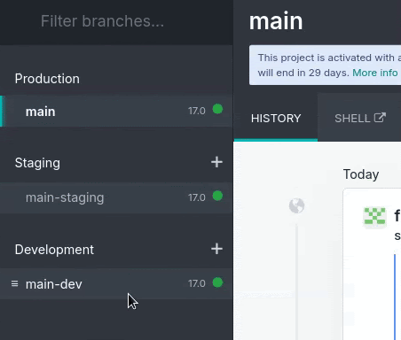
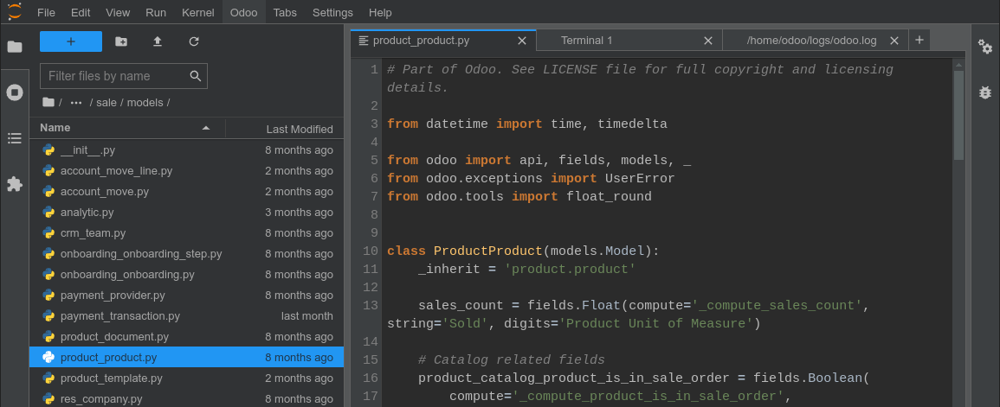
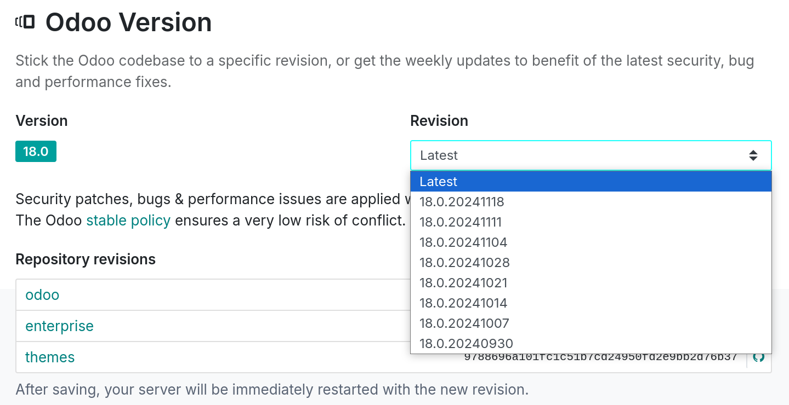

========
Branches
========

The branches view provides an overview of the different branches in your repository.

.. _odoo-sh/branches/stages:

Stages
======

Odoo.sh offers three different branch stages:

- :ref:`Production <odoo-sh/branches/stages/production>`
- :ref:`Staging <odoo-sh/branches/stages/staging>`
- :ref:`Development <odoo-sh/branches/stages/development>`

You can change the stage of a branch by dragging and dropping it under the desired stage.

.. note::
   - Development branches can be moved under :guilabel:`Staging`. If you try to move a development
     branch under :guilabel:`Production`, a warning message will be displayed explaining that you
     can only have one production branch per project.
   - Staging branches can be moved under :guilabel:`Development`, but it is not possible to move
     them under :guilabel:`Production`.
   - The production branch can only be moved under :guilabel:`Development`. If you try to move it
     under :guilabel:`Staging`, you can only perform a merge. Refer to the
     :ref:`merging <odoo-sh/branches/stages/merging>` section for a detailed explanation of this
     process.

.. _odoo-sh/branches/stages/production:

Production
----------

The production branch contains the code used to run the production database. There can be only one
production branch.

When you push a new commit to this branch, the production server is updated with the revised code
and restarted.

If the changes require a module update, such as changing a form view, and you want the update to
be performed automatically, you can increase the module's version number in its manifest file
(:file:`__manifest__.py`). The platform then performs the update, during which the instance will be
held temporarily unavailable for maintenance reasons.

This method is equivalent to upgrading the module using the :guilabel:`Apps` menu or the `-u` switch
on :doc:`the command line <../../../developer/reference/cli>`.

.. note::
   - If the changes prevent the server from restarting or if the module update fails, the server is
     automatically reverted to the previous successful code revision, and the database is rolled
     back to its previous state. Access to the failed update's log to troubleshoot it.
   - The demo data is not loaded, as it is not intended for use on a production database. The `unit
     tests <https://en.wikipedia.org/wiki/Unit_testing>`_ are not performed, as it would increase
     the unavailability time of the production database during the update.

Odoo.sh automatically backs up the production database. It keeps seven daily, four weekly, and three
monthly backups. Each backup includes the database dump, the filestore (attachments and binary
fields), logs, and sessions.

.. warning::
   When using **trial projects**, the production branch and all staging branches are automatically
   set back to the development stage after **30 days**.

.. _odoo-sh/branches/stages/staging:

Staging
-------

Staging branches are meant to test new features using production data without compromising the
actual production database with test records. They create neutralized duplicates of the production
database.

The neutralization disables:

- Scheduled actions

  .. note::
     To test them, trigger them manually or re-enable them. Be aware that the platform will trigger
     them less often if no one is using the database in order to save resources.

- Outgoing emails

  .. note::
     They are instead intercepted using a mail catcher. An :ref:`interface to view the emails
     <odoo-sh/branches/tabs/mails>` sent by the database is provided in your Odoo.sh project.
     That way, no emails are sent to your contacts.

- IAP services

- Payment providers and shipping connectors

  .. note::
     They are put into test mode.

If you configure or view changes in a staging database, make sure to record them (noting them step
by step, reproducing in production, etc.) or write them directly in the branch's modules, using XML
data files to override the default configuration or views. Check the :ref:`first module
documentation <odoo-sh/module/add>` to view examples.

.. note::
   Unit tests are not performed. They rely on demo data, which is not loaded into the production and
   staging databases. If Odoo starts supporting running the units without demo data, Odoo.sh will
   then consider running the tests on staging databases.

Staging databases are not automatically backed up. Nevertheless, you can restore a backup of the
production database in a staging branch for testing purposes or to manually recover data that has
been accidently deleted from the production database. It is possible to create manual backups of
staging databases.

.. _odoo-sh/branches/stages/development:

Development
-----------

Development branches create new databases using demo data to run the unit tests. The installed
modules are those included in the branch. You can change this list of modules to install in the
:doc:`project settings <settings>`.

When pushing a commit to a development branch, a new server is started, with a database created from
scratch, and the branch is updated. The demo data is loaded, and the unit tests are performed by
default to verify that the changes do not break any of the features being tested. You can disable
the tests or allow specific tests to be run with custom tags by going to the :ref:`branch's settings
<odoo-sh/branches/tabs/settings>`.

Similarly to staging branches, emails are not sent but are intercepted by a mail catcher, and
scheduled actions are not triggered as long as the database is not in use.

Development databases are not automatically backed up, and manual backups are not possible.

.. warning::
   Databases created for development branches are intended to last approximately three days. After
   that, they can be automatically garbage-collected to make room for new databases without prior
   notice.

.. _odoo-sh/branches/stages/merging:

Merging branches
----------------

You can merge your branches by dragging and dropping them into each other.

To test the changes of development branches with the production data, you can either:

- Merge the development branch into a staging branch by dragging and dropping it onto the desired
  branch; or

  .. image:: branches/merging-into-staging.gif
     :alt: Merging a development branch into a staging branch

- Drag and drop the development branch under the :guilabel:`Staging` section to make it a staging
  branch.

  .. image:: branches/moving-to-staging.gif
     :alt: Moving a development branch under staging

When the changes are ready for production, drag and drop the staging branch into the production
branch to merge and deploy them.

.. note::
   - You can merge development branches into the production branch directly. However, changes will
     not be validated against the production data through a staging branch, so there is a higher
     risk of encountering issues in the production database.
   - You can merge development branches into each other, and staging branches into each other.
   - You can also use `git merge` directly on your workstation to merge your branches. Odoo.sh is
     notified when new revisions are pushed to your branches.

Merging a staging branch into the production branch only merges the source code. Any changes made to
the staging database are not passed to the production database. However, if you modify the code in
the repository, it will be passed to the production branch when merging.

If you test configuration changes in staging branches, and want them to be applied to the production
branch, you have to, either:

- Write the configuration changes in XML data files to overide the default configuration or views in
  the branch, and then increase the version of the module in its manifest (:file:`__manifest__.py`)
  to trigger the module update when merging the staging branch in the production branch.

  .. note::
     This method is recommended for better scalability of your developments, as you will use the Git
     versioning features for all configuration changes, thereby ensuring traceability of your
     changes.

- Pass them manually from the staging database to the production one by copying and pasting them.

.. _odoo-sh/branches/tabs:

Tabs
====

.. _odoo-sh/branches/tabs/history:

History
-------

The :guilabel:`History` tab gives an overview of the branch history:

- The commit messages and their authors
- The various events linked to the platform, such as stage changes, database imports, and backup
  restores

A status in the top right corner of each event indicates the current operation on the database
(e.g., installation, update, backup import) or its outcome (e.g., test feedback, successful backup
import). If an operation is successful, a :guilabel:`Connect` button appears, allowing you to access
the database.

.. _odoo-sh/branches/tabs/mails:

Mails
-----

The :guilabel:`Mails` tab contains the mail catcher, which provides an overview of emails sent by
the database.

.. note::
   The mail catcher is available for development and staging branches. Emails from the production
   database are actually sent and are not intercepted by the mail catcher.

.. _odoo-sh/branches/tabs/shell:

Shell
-----

The :guilabel:`Shell` tab provides shell access to the container.

Clicking :guilabel:`Shell` opens a new browser tab where you can run basic Linux commands (`ls`,
`top`). You can open a shell on the database by running `psql`.

.. image:: branches/shell-tab.png
   :alt: The branches' shell tab

.. tip::
   You can open multiple shell tabs at once and arrange their layout by dragging and dropping them.

.. note::
   - Production instance shells are highlighted in red to emphasize the danger of manipulating
     production instances directly, while staging/development instance shells are highlighted in
     yellow.
   - Long-running shell instances/idle shell sessions can be terminated at any time to free up
     resources.

.. _odoo-sh/branches/tabs/shell/commands:

Commands
~~~~~~~~

Here is an overview of useful commands that you can run an Odoo.sh database terminal:

- `odoo-bin shell`: to open an Odoo shell
- `odoo-update`: to update modules in the database
- `odoosh-restart`: to restart Odoo.sh services (http or cron)
- `odoosh-storage`: to check the storage usage of your instance's container filesystem
- `psql`: to open a database shell
- `mutt`: to check how emails appear on text clients (staging and development instances)
- `lnav ~/logs/odoo.log`: to navigate in your instance's :file:`odoo.log` file
- `ncdu`: to launch the disk usage analyzer with an interactive interface
- `grep`: to filter and find information in log or configuration files

.. _odoo-sh/branches/tabs/editor:

Editor
------

Clicking :guilabel:`Editor` opens a new browser tab to access an online integrated development
environment (IDE) to edit the source code. You can also open terminals, Python consoles, and Odoo
shell consoles.

You can open multiple tabs and drag and drop them to arrange the layout as you wish.

.. seealso::
   :doc:`Online editor documentation <online-editor>`.

.. _odoo-sh/branches/tabs/monitor:

Monitor
-------

The :guilabel:`Monitor` tab displays various performance monitoring metrics of the current build.

Zoom in with your cursor to adjust the time range or select it manually from the time range
selector. It is also possible to change the time zone.

.. note::
   - Technical logs always use the :abbr:`UTC (Coordinated Universal Time)`. To analyze these logs
     together with your monitoring metrics, ensure :abbr:`UTC (Coordinated Universal Time)` is
     selected in the monitoring tool.
   - Similarly, when sending a support ticket, ensure the information you share is based on
     :abbr:`UTC (Coordinated Universal Time)`, as Odoo uses this time zone to investigate
     performance issues.

The information is aggregated periodically. When this is the case, a blue dotted line is displayed,
along with the tag :guilabel:`Aggregate Date`. This means that the data before this date will appear
flattened when compared to the data after this date. Therefore, when using the monitoring tool, it
is recommended to focus on recent events to get the most detailed information possible.

.. note::
   Dotted Lines of other colors help you relate to other changes on the build (database import,
   git push, etc.).

.. tip::
   On each graph, an 𝕚 (:guilabel:`information`) icon is displayed in the top-left corner. Hover
   your mouse over it to get more details about what the graph represents.

.. _odoo-sh/branches/tabs/monitor/metrics:

Metrics
~~~~~~~

.. _odoo-sh/branches/tabs/monitor/metrics/system:

System
******

The :guilabel:`Memory` graph displays information about memory consumption:

- :guilabel:`Memory container` represents Odoo workers and container processes.
- :guilabel:`Memory postgresql` represents the database.

The :guilabel:`CPU` graph displays information about CPU consumption:

- :guilabel:`CPU http` represents Odoo workers.
- :guilabel:`CPU cron/mail` represents scheduled actions and incoming emails.
- :guilabel:`CPU postgresql` (database processes)
- :guilabel:`CPU other` represents webshells, the editor, etc.

The :guilabel:`Storage` graph displays information about the storage used:

- :guilabel:`Container` represents the filestore, log files, and user files.
- :guilabel:`Postgresql` represents the database and indexes.

.. _odoo-sh/branches/tabs/monitor/metrics/http:

HTTP
****

The :guilabel:`Requests` graph displays information about the number of HTTP requests per second:

- :guilabel:`HTTP successes` represents successful requests.
- :guilabel:`HTTP errors` represents failed requests (check :file:`odoo.log`).
- :guilabel:`HTTP rate limited` represents declined requests, possibly due to lack of workers.

The :guilabel:`Concurrent requests (max)` graph displays the maximum number of concurrent HTTP
requests per second.

.. note::
   Database workers determine the number of concurrent requests that can be managed simultaneously.
   It is essential to have enough workers to handle all incoming requests as they arrive. However,
   having additional workers beyond this does not improve the speed at which requests are processed.

The :guilabel:`Average Response time` displays the average response time to HTTP requests (in
milliseconds).

.. image:: branches/monitor-response-graph.png
   :alt: The average response time graph in the monitor tab

.. _odoo-sh/branches/tabs/monitor/metrics/mails:

Mails
*****

The :guilabel:`Incoming` graph displays data about the daily number of incoming emails:

- :guilabel:`Received Emails` represents emails successfuly received.
- :guilabel:`Received Emails bounced` represents emails unsuccessfully received.

The :guilabel:`Outgoing` graph displays data about the daily number of outgoing emails:

- :guilabel:`Sent Emails` represents emails successfully sent.
- :guilabel:`Sent Emails bounced` represents emails unsuccessfully sent.

.. _odoo-sh/branches/tabs/logs:

Logs
----

The :guilabel:`Logs` tab offers a real-time view of your server's logs.

Different logs are available:

- `pip.log`: the Python dependencies installation
- `install.log`: the database installation (for development branches, tests are included)
- `odoosh-import-database.log`: the last imported dump process
- `odoo.log`: the running server
- `update.log`: the database updates
- `pg_slow_queries.log`: psql queries that take an unusual amount of time
- `sh_webshell.log`:  the actions taken in the webshell
- `sh_editor.log`: the actions taken in the editor
- `neutralize.log`: the neutralization of the database (only staging)

When new lines are added to the logs, they are displayed automatically. If you scroll to the bottom,
the browser scrolls automatically each time a new line is added.

You can pause the logs fetching process by clicking the :icon:`fa-pause` (:guilabel:`pause`) button
in the upper right corner. Otherwise, the process stops after five minutes. You can restart it by
clicking the :icon:`fa-play` (:guilabel:`play`) button.

.. _odoo-sh/branches/tabs/backups:

Backups
-------

The :guilabel:`Backups` tab lists the available backups to download and restore, lets you perform a
manual backup and import a database.

The production database is automatically backed up daily. Seven daily, four weekly, and three
monthly backups are kept. Each backup includes the database dump, the filestore (attachments and
binary fields), logs, and sessions.

.. note::
   You can refer to `the estimated scheduling of automatic backups <https://docs.google.com/spreadsheets/d/e/2PACX-1vSJpyyyQ7kr5WSutkrDE3ybgpYySogseN7x2Og6fIbpPYABHe0q8xq0y0xh7P-QSHkX3RTTVqKMIExy/pubhtml?gid=0&single=true>`_
   to gain a better understanding of how the system works. This file is updated daily, taking the
   current day as the departure point.

Staging and development databases are not automatically backed up. However, you can restore a backup
of the production database in your staging branches, for testing purposes, or manually recover data
that has been accidentally deleted from the production database.

The list contains the backups kept on the server of your production database. This server only keeps
one month of backups: seven daily and four weekly backups.

Dedicated backup servers keep the same backups, as well as three additional monthly backups. To
restore or download one of these monthly backups, contact `Odoo Support
<https://www.odoo.com/help>`_.

When merging a commit updating the version of one or several modules (in :file:`__manifest__.py`),
or their linked Python dependencies (in :file:`requirements.txt`), then Odoo.sh performs an
automatic backup (flagged with type `Update` in the list), as either the container will be changed
by the installation of new pip packages, either the database itself will be changed with the module
update triggered afterwards. In these two cases, a backup is triggered as it may break something.

If the merged commit does not update the version of a module or linked dependencies, then no backup
is triggered by Odoo.sh, as neither the container nor the database is modified; therefore, the
platform considers this safe enough. As an extra precaution, you can make a manual backup before
modifiyng production sources.

The purpose of manual backups is to create a specific snapshot of production or staging databases
(not available for development). These remain available for seven days. However, there is a limit of
five daily manual backups.

.. list-table::
   :header-rows: 1
   :stub-columns: 1

   * - Stage
     - Automatic backup
     - Manual backup
   * - Production
     - Yes (up to 3 months)
     - Yes (3 days)
   * - Staging
     - No
     - Yes (3 days)
   * - Development
     - No
     - No

The :guilabel:`Import Database` feature accepts database archives from:

- the standard Odoo database manager (available for on-premise Odoo servers under
  `/web/database/manager`)
- the Odoo Online databases manager
- the Odoo.sh :guilabel:`Backups` tab (using the :icon:`fa-download` (:guilabel:`Download Options`)
  button)
- the Odoo.sh :doc:`Builds <builds>` view (by clicking :guilabel:`Download DB dump`)

.. _odoo-sh/branches/tabs/upgrade:

Upgrade
-------

The :guilabel:`Upgrade` tab can be used to upgrade production and staging branches of valid
projects. For more information about the upgrade process, refer to the :doc:`Upgrade documentation
<../../upgrade>`.

.. _odoo-sh/branches/tabs/tools:

Tools
-----

The :guilabel:`Tools` tab contains the code profiler. It is used to start a profiling session,
recording the activities of Odoo workers running in the instance for a maximum of five minutes. You
can choose to terminate the session earlier, as running the tool for a shorter duration reduces the
amount of noise in the report.

After each session, an interactive flame graph is created to help you visualize how the Odoo workers
allocate their time.

.. warning::
   Running the profiler consumes a lot of server resources, so avoid letting it run for too long.
   The goal is to record a specific action in your database.

.. _odoo-sh/branches/tabs/settings:

Settings
--------

The :guilabel:`Settings` tab lists the configuration options available for the currently selected
branch. The options vary for each stage.

.. _odoo-sh/branches/tabs/settings/commits:

Behavior upon new commits
~~~~~~~~~~~~~~~~~~~~~~~~~

You can change the branch's behavior upon receiving a new commit for **development** and **staging**
branches.

By default, a **development** branch creates a new build and a staging branch updates the previous
build. This is useful if the feature you are working on requires a specific configuration, as you
would not need to manually configure it again after every commit.

If you select :guilabel:`New build` for a **staging** branch, a fresh copy of the production build
is created every time a commit is pushed.

A branch that is moved from **staging** to **development** is set automatically to :guilabel:`Do
nothing`.

.. _odoo-sh/branches/tabs/settings/installation:

Module installation
~~~~~~~~~~~~~~~~~~~

You can choose which modules should be installed automatically for **development** branches.

To change the default behavior, untick the :guilabel:`Use Default` option under
:guilabel:`Development build behavior` and select one of the following options under
:guilabel:`Module Installation`:

- :guilabel:`Install only my modules (does not include submodules)`: only installs the branch's
  modules, excluding :doc:`submodules <../advanced/submodules>`. This is the default option.
- :guilabel:`Full installation (no test suite)`: installs the branch's modules, submodules, and all
  standard Odoo modules. When running the full installation, the test suite is disabled.
- :guilabel:`Install a list of modules`: installs the specified modules. To do so, enter their
  technical name, and separate them using commas (e.g., `sale_management,website,accountant`).

.. note::
   If the test suite is enabled, installing all standard Odoo modules can take up to one hour.

.. _odoo-sh/branches/tabs/settings/test:

Test suite
~~~~~~~~~~

By default, the test suite for **development** branches is enabled. You can restrict which tests are
run by entering :ref:`test tags <developer/reference/testing/selection>` and separating them using
commas (e.g., `custom_tags,at_install,post_install`).

To disable the test suite entirely, untick :guilabel:`Validate the test suite on new builds`.

.. _odoo-sh/branches/tabs/settings/version:

Odoo version
~~~~~~~~~~~~

You can change the version of Odoo for **development** branches, for example, to test upgraded code
or develop features while your production database is in the process of being upgraded to a newer
version, by selecting another :guilabel:`Version`.

By default, :guilabel:`Latest` is selected as the :guilabel:`Revision`, and the sources of your Odoo
server are updated weekly automatically to benefit from the latest bug, security, and performance
fixes.

To choose a specific revision instead, select it using the :guilabel:`Revision` field.

.. warning::
   Revisions expire after three months. You will be notified by email when the revision's expiration
   date approaches. If you have not taken any action when it expires, the :guilabel:`Revision` field
   is automatically set back to :guilabel:`Latest`.

.. _odoo-sh/branches/tabs/settings/domain:

Custom domains
~~~~~~~~~~~~~~

You can configure additional `<name>.odoo.com` domains or your own custom domains for all branch
types.

To use your own custom domain, it is necessary to:

- Own or purchase the domain name.
- Enter the domain name under :guilabel:`Custom domains` (e.g., `www.mycompany.com`), then click
  :guilabel:`Add domain`.
- Configure the domain name (e.g., `www.mycompany.com`) using your registrar's domain name manager
  with a **CNAME** record value set to your production database domain name (e.g.,
  `mycompany.odoo.com`).

.. important::
   Bare domains (e.g., `mycompany.com`) are not accepted. They can only be configured using **A**
   records, which only accept IP addresses as their value. Therefore, a bare domain could suddenly
   cease to function, as the IP address of a database can change (e.g., following an upgrade, a
   hardware failure, a change of database hosting location).

To have both your bare domain (e.g., `mycompany.com`) and *www* domain (e.g., `www.mycompany.com`)
working, it is necessary to redirect the bare domain to the *www* domain. .com. Most domain managers
provide a way to configure this redirection, commonly referred to as a web redirection.

.. _odoo-sh/branches/tabs/settings/domain/https:

HTTPS/SSL
*********

If the redirection is correctly set up, an SSL certificate is automatically generated using `Let's
Encrypt <https://letsencrypt.org/about>`_ within the hour, meaning your domain will be accessible
through HTTPS.

.. _odoo-sh/branches/tabs/settings/domain/spf-dkim:

SPF and DKIM compliance
***********************

If the domain of your email addresses uses the :abbr:`SPF (Sender Policy Framework)` or :abbr:`DKIM
(DomainKeys Identified Mail)` authentication protocol, it is necessary to authorize Odoo as a
sending host in the domain name settings to increase the deliverability of outgoing emails. For more
information, refer to the :doc:`Configure DNS records to send emails in Odoo documentation
<../../../applications/general/email_communication/email_domain>`.

.. important::
   If Odoo is not authorized as a sending host, your outgoing emails may be flagged as spam.

.. _odoo-sh/branches/shell-commands:

Shell commands
==============

In the top right corner of the view, several shell commands are displayed. The commands can be
copied using the clipboard button and then used in a terminal. In addition, some of them can be used
directly from Odoo.sh's interface.

.. _odoo-sh/branches/shell-commands/clone:

Clone
-----

The clone command is used to create a local copy of your Git repository.

.. example::
   :command:`git clone --recurse-submodules --branch development git@github.com:my-organization/my-repository.git`

   - `--recurse-submodules` to download the submodules of your repository
   - `--branch main` to check out to a specific branch of the repository (e.g., `development`)

.. note::
   The run button is not available as the command is used to create a local copy on your machine.

.. _odoo-sh/branches/shell-commands/fork:

Fork
----

The fork command is used to create a new branch based on the current one.

.. example::
   :command:`git checkout -b main-1 development && git push -u origin development-1`

   - :command:`git checkout -b main-1 main` a command to create a new branch (e.g., `development-1`)
     based on the current branch (e.g., `development`)
   - :command:`git push -u origin development-1` a command to upload the new branch (e.g.,
     `development-1`) to the remote repository

.. _odoo-sh/branches/shell-commands/merge:

Merge
-----

The merge command is used to combine changes on one branch into another branch.

.. example::
   :command:`git merge staging-1 && git push -u origin staging`

   - :command:`git merge staging-1` a command to merge the changes of the current branch into
     another branch (e.g., `staging-1`)
   - :command:`git push -u origin staging` a command to upload the merged changes to the remote
     repository branch (e.g., `staging`)

.. _odoo-sh/branches/shell-commands/ssh:

SSH
---

The SSH command is used to connect to a build using SSH.

To use the SSH command, it is necessary to set up an SSH key first. To do so:

- `Generate a new SSH key <https://docs.github.com/en/authentication/connecting-to-github-with-ssh/generating-a-new-ssh-key-and-adding-it-to-the-ssh-agent#generating-a-new-ssh-key>`_.
- `Copy the SSH key to your clipboard <https://docs.github.com/en/authentication/connecting-to-github-with-ssh/adding-a-new-ssh-key-to-your-github-account#adding-a-new-ssh-key-to-your-account>`_.
- On Odoo.sh, click your GitHub user in the top-right corner and select :guilabel:`Profile`.

  .. image:: branches/ssh-profile.png
     :alt: Accessing a user's profile

- Paste the SSH key under the :guilabel:`Add a key manually` field and click :guilabel:`Add`.

  .. image:: branches/ssh-add-key.gif
     :alt: Adding an SSH key manually

.. example::
   :command:`ssh 25004381@my-user-my-repository-staging-25004381.dev.odoo.com`

   - `25004381` the build ID
   - `my-user-my-repository-staging-25004381.dev.odoo.com` the domain used to connect to the build

Provided you have the necessary :ref:`access rights <odoosh-gettingstarted-settings-collaborators>`
on the project, you will be granted SSH access to the build.

.. note::
   Long-running SSH connections are not guaranteed. Idle connections can be disconnected to free up
   resources.

.. _odoo-sh/branches/shell-commands/submodule:

Submodule
---------

The submodule command is used to add a branch from another repository to your current branch as a
submodule.

.. seealso::
   :doc:`Submodules documentation <../advanced/submodules>`

.. example::
   :command:`git submodule add -b master <URL> <PATH> && git commit -a && git push -u origin staging`

   - :command:`git submodule add -b master <URL> <PATH>` a command to add a specific branch (e.g.,
     `master`) of a repository (`<URL>`) as a submodule under the specified path (`<PATH>`) in
     your current branch.
   - :command:`git commit -a` a command to commit all current changes
   - :command:`git push -u origin staging` a command to upload the changes of the current branch
     (e.g., `staging`) to the remote repository.

.. _odoo-sh/branches/shell-commands/delete:

Delete
------

The delete command is used to delete a branch from your repository.

.. note::
   Once you delete a branch, there is no way to retrieve it unless a backup exists. Staging branches
   are not automatically backed up, but can be manually. Development branches cannot be backed up.

.. example::
   :command:`git push origin :staging && git branch -D staging`

   - :command:`git push origin :staging` a command to delete a specific branch (e.g., `staging`) on
     the remote repository
   - :command:`git branch -D staging` a command to delete the specific branch on your local copy of
     the repository

.. warning::
   Before deleting a branch, refer to the :ref:`Backups section <odoo-sh/branches/tabs/backups>` to
   better understand how they work and when you should create a manual backup.
