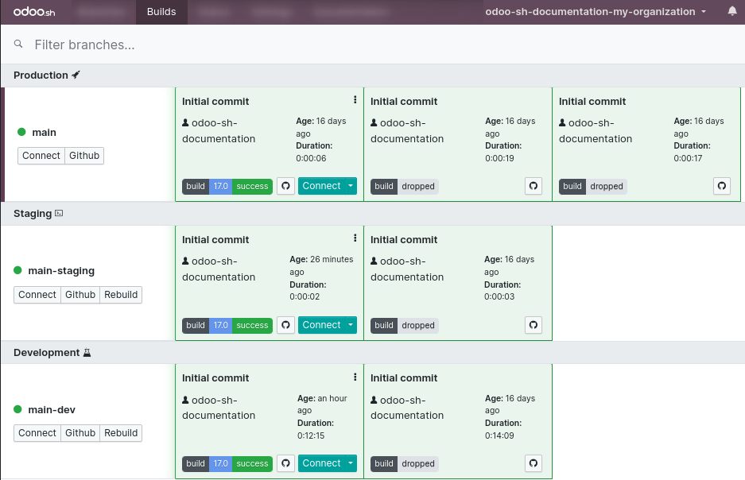
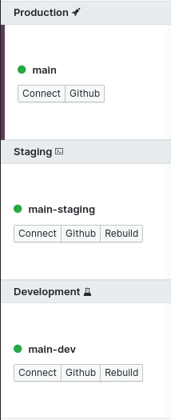
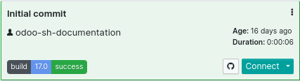

======
Builds
======

In Odoo.sh, a build is a database loaded by an Odoo server (`odoo/odoo
<https://github.com/odoo/odoo>`_ and `odoo/enterprise <https://github.com/odoo/enterprise>`_)
running on a specific revision of your project repository in a containerized environment. Its
purpose is to test the proper behavior of the server, the database, and the features associated with
that revision.

.. _odoo-sh/builds/overview:

Overview
========

In the :guilabel:`Builds` overview, a row represents a branch, and a cell within that row represents
a build of that branch.

Most builds are created after pushes to your GitHub repository branches. They can also be created
through other operations, such as importing a database on Odoo.sh or requesting a rebuild for a
branch in your project.

Builds can have three possible statuses:

- A build is considered **successful** if no errors or warnings occur during its creation.
  Successful builds are highlighted in **green**.
- A build is considered **almost successful** if warnings occur, but there are no errors. Almost
  successful builds are highlighted in **yellow**.
- A build is considered **failed** if errors occur during its creation. Failed builds are
  highlighted in **red**.

.. note::
   Builds do not always create a database from scratch. For instance, when pushing a change on the
   production branch, the created build starts the server with your new revision and tries to load
   the current production database on it.

.. _odoo-sh/builds/stages:

Stages
======

.. _odoo-sh/builds/stages/production:

Production
----------

The first build of a production branch creates a database from scratch. If this build is successful,
this database will become the production database of your project.

From then on, pushes to the production branch will create new builds that attempt to load the
database using a server running the new revision.

If the build is successful or almost successful, the production database will run with this build
and its associated revision.

If the build fails to load or update the database, the previous successful build is reused to load
the database. In that case, the database continues to run using the previous successful revision.

.. note::
   The build used to run the production database is always the first in the builds list. If a build
   fails, it is placed after the build currently running the production database.

.. _odoo-sh/builds/stages/staging:

Staging
-------

Staging builds duplicate the production database and attempt to load this copy using the revisions
of the staging branches.

Each time you push a new revision to a staging branch, the resulting build uses a fresh copy of the
production database. Databases are not reused between builds of the same branch. This ensures that:

- Staging builds use databases that closely match the current production state, so your tests are
  not performed on outdated data.
- You can freely experiment within a staging database. When you want to start over with a new copy
  of the production database, you can request a rebuild.

However, this also means that if you make configuration changes in a staging database and do not
apply them in production, those changes will not be present in the next build of the same staging
branch.

.. _odoo-sh/builds/stages/development:

Development
-----------

Development builds create new databases, load the demo data, and run the unit tests.

A build will be considered failed if tests fail during installation, as they are designed to raise
errors when something is wrong.

If all tests pass and no errors occur, the build is considered successful.

.. note::
   Depending on the list of modules to install and test, a development build can take up to one hour
   to be ready. This is due to the large number of tests included in the default Odoo module suite.

.. _odoo-sh/builds/stages/features:

Features
========

The production branch always appears first. Other branches are ordered by the time of their last
created build. The stage highlighted in purple corresponds to the stage selected in the
:guilabel:`Branches` menu.

.. tip::
   You can filter branches using the search bar.

For each branch, you can:

- Access the latest build's database by clicking :guilabel:`Connect`.
- Jump to the branch's code by clicking :guilabel:`Github`.
- Create a new build by clicking :guilabel:`Rebuild`. It uses the latest revision of the branch (it
  is not available if a build is already in progress for that branch).

For each build, you can:

- View the revision changes by clicking the :icon:`fa-github` (:guilabel:`GitHub`) icon.
- Access the build's database as the administrator by clicking :guilabel:`Connect` or as another
  user by clicking the :icon:`fa-caret-down` (:guilabel:`More Actions`) button next to
  :guilabel:`Connect` and selecting :guilabel:`Connect as`.
- Access the same tools as in the branches view by clicking the :icon:`fa-caret-down`
  (:guilabel:`More Actions`) button next to :guilabel:`Connect` and selecting :guilabel:`Logs`,
  :guilabel:`Web Shell`, :guilabel:`Editor`, :guilabel:`Outgoing e-mails` (for the staging and
  development stages), :guilabel:`Monitoring`, and :guilabel:`Download DB dump` (for the production
  and staging stages).

