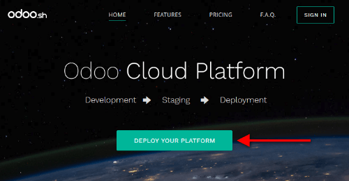
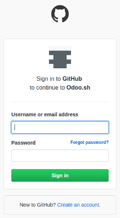
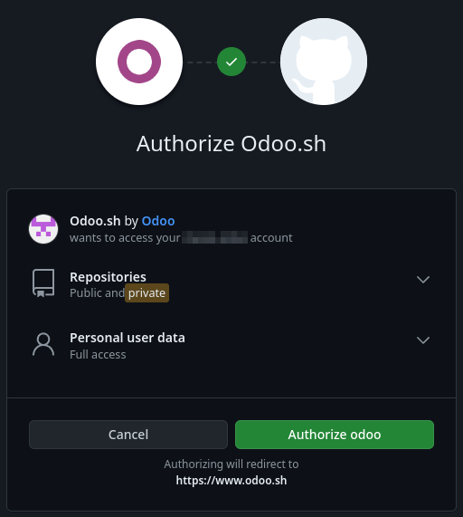
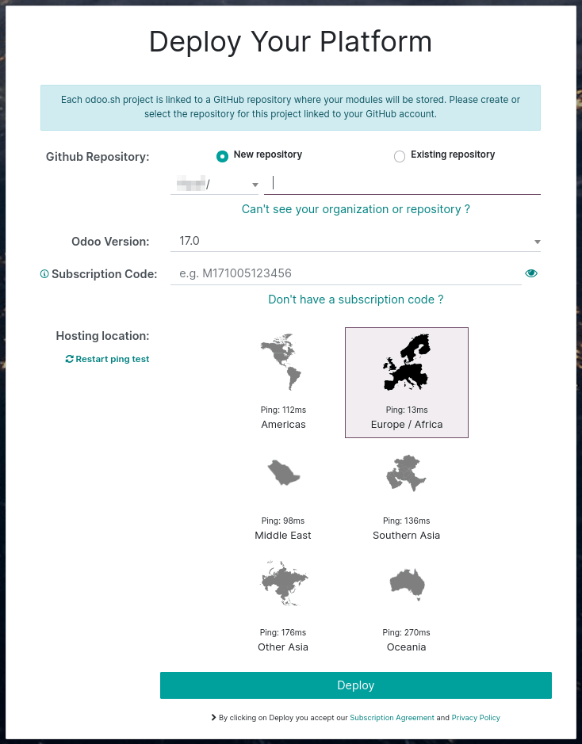
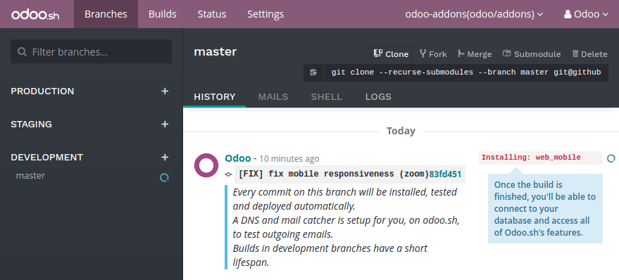

.. _odoosh-gettingstarted-create:

===================
Create your project
===================

Deploy your platform
====================

Go to `Odoo.sh <https://www.odoo.sh/>`_ and hit the *Deploy your platform* button.

Sign in with Github
===================

Sign in with your Github account. If you do not have an account yet, hit the *Create an account*
link.

Authorize Odoo.sh
=================

Grant Odoo.sh the required accesses to your account by clicking the *Authorize* button.

Odoo.sh basically needs:

* to know your Github login and email,
* to create a new repository in case you decide to start from scratch,
* to read your existing repositories, including the ones of your organizations, in case you want to
  start from an existing repository,
* to create a webhook to be notified each time you push changes,
* to commit changes to make your deployment easier, merging branches or adding new `submodules
  <https://git-scm.com/book/en/v2/Git-Tools-Submodules>`_ for example.

Submit your project
===================

Choose if you want to start from scratch by creating a new repository, or if you want to use an
existing repository.

Then, choose a name or select the repository you want to use.

Choose the Odoo version you want to use. If you plan to import an existing database or an existing
set of applications, you might need to choose the according version. If you start from scratch, use
the latest version.

Enter your *subscription code*. This is also called *subscription referral*, *contract number* or
*activation code*.

It should be the code of your Enterprise subscription that includes Odoo.sh.

Partners can use their partnership codes to start a trial. Should their clients start a project,
they ought to get an Enterprise subscription including Odoo.sh and use its subscription code. The
partner will get 50% of the amount back as commission. Contact your sales representative or account
manager in order to get it.

When submitting the form, if you are notified your subscription is not valid, it either means:

* it is not an existing subscription,
* it is not a partnership subscription,
* it is an enterprise subscription, but which does not include Odoo.sh,
* it is neither a partnership subscription or an enterprise subscription (e.g. an online
  subscription).

In case of doubt with your subscription, please contact the `Odoo support
<https://www.odoo.com/help>`_.

You're done !
=============

You can start using Odoo.sh. Your first build is about to be created. You will soon be able to
connect to your first database.

.. _odoo_sh_import_your_database:

Import your database
====================

You can import your database in your Odoo.sh project as long as it is in a :doc:`supported version
</administration/maintain/supported_versions>` of Odoo.

Push your modules in production
-------------------------------

If you use community or custom modules, add them in a branch in your Github repository.
Databases hosted on the Odoo.com online platform do not have any custom modules.
Users of these databases can therefore skip this step.

You can structure your modules as you wish, Odoo.sh will automatically detect the folders containing
Odoo addons. For instance, you can put all your modules folder in the root directory of your
repository, or group the modules in folders by categories that you define (accounting, project,
...).

For community modules available in public Git repositories,
you can also consider to add them using :ref:`Submodules <odoosh-advanced-submodules>`.

Then, either :ref:`make this branch the production branch <odoosh-gettingstarted-branches-stages>`,
or :ref:`merge it into your production branch <odoosh-gettingstarted-branches-mergingbranches>`.

Download a backup
-----------------

On-premise databases
~~~~~~~~~~~~~~~~~~~~

Access the URL :file:`/web/database/manager` of your on-premise database and download a backup.

.. Warning::

  If you cannot access the database manager, it may have been disabled by your system administrator.
  See the :ref:`database manager security documentation <db_manager_security>`.

You will need the master password of your database server. If you do not have it, contact your
system administrator.

.. image:: create/create-import-onpremise-backup.png
   :align: center

Choose a zip including the filestore as the backup format.

.. image:: create/create-import-onpremise-backup-dialog.png
  :align: center

Odoo Online databases
~~~~~~~~~~~~~~~~~~~~~

`Access your databases manager <https://accounts.odoo.com/my/databases/manage>`_ and download a
backup of your database.

.. image:: create/create-import-online-backup.png
   :align: center

.. Warning::

  Online versions (e.g. *saas-**) are not supported on Odoo.sh.

Upload the backup
-----------------

Then, in your Odoo.sh project, in the backups tab of your production branch, import the backup you
just downloaded.

.. image:: create/create-import-production.png
   :align: center

Once the backup imported, you can access the database using the *Connect* button in the history of
the branch.

.. image:: create/create-import-production-done.png
   :align: center

Check your outgoing email servers
---------------------------------

There is a default mail server provided with Odoo.sh.
To use it, there must be no enabled outgoing mail server configured in your database in
:menuselection:`Settings --> Technical --> Outgoing Mail Servers` (:ref:`Developer mode
<developer-mode>` must be activated).

After the import of your database, all outgoing email servers are disabled so you use the Odoo.sh
email server provided by default.

.. warning::
   Port 25 is (and will stay) closed. If you want to connect to an external SMTP server, you should
   use ports 465 and 587.

Check your scheduled actions
----------------------------

All scheduled actions are disabled after the import.

This is to prevent your newly imported database to perform actions that could impact your running
production, such as sending the mails remaining in the queue, processing mass mailings, or
third-party services synchronization (Calendars, files hosting, ...).

If you plan to make the imported database your production, enable the scheduled actions you need.
You can check what is enabled in the database of origin and enable the same actions in the imported
database. Scheduled actions are located under :menuselection:`Settings --> Technical --> Automation
--> Scheduled Actions`.

Register your subscription
--------------------------

Your subscription is unlinked after the import.

The imported database is considered a duplicate by default and the enterprise subscription is
therefore removed, as you can only have one database linked per subscription.

If you plan to make it your production, unlink your former database from the subscription, and
register the newly imported database. Read the :doc:`database registration documentation
<../../maintain/on_premise>` for instructions.
