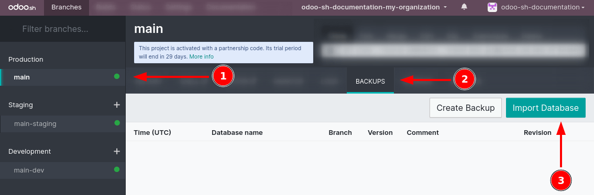

================
Create a project
================

Deploy a platform
=================

#. Visit `Odoo.sh <https://www.odoo.sh>`_ and click :guilabel:`Deploy your platform`.

   .. image:: create/deploy-button.png
      :alt: The Deploy your platform button on Odoo.sh

#. Sign in with a `GitHub <https://github.com>`_ account.

   .. image:: create/github-sign-in.png
      :alt: Signing in to GitHub

#. Authorize Odoo.sh by clicking :guilabel:`Authorize odoo` twice.

   .. image:: create/github-authorize.png
      :alt: Granting Odoo.sh permissions to perform actions and access data on GitHub

   .. image:: create/github-authorize.png
      :alt: Granting Odoo.sh additional permissions to perform actions and access data on GitHub

   .. note::
      Odoo.sh requests GitHub to:

      - Access your GitHub login and email.
      - Create a new repository, in case you start from scratch.
      - Access existing repositories, including organization ones, in case you start from an
        existing repository.
      - Create a webhook to notify you each time changes are pushed.
      - Commit changes for easier deployment.

#. Fill in the :guilabel:`Deploy your platform` form and click :guilabel:`Deploy`:

   - :guilabel:`Github repository`: to create a new repository, choose :guilabel:`New repository`
     and enter a name; to use an existing one, choose :guilabel:`Existing repository` and select it.
   - :guilabel:`Odoo Version`: select the major version of Odoo you want to use.

     .. tip::
        - Use the latest major version of Odoo version when creating a new repository. If you are
          planning to import an existing database or applications, it might be required that their
          versions match.
        - If you are starting on Odoo Online and plan to migrate to Odoo.sh later, create your
          database using `odoo.com/start-lts <https://www.odoo.com/start-lts>`_ to ensure
          compatibility, as minor versions are not supported by Odoo.sh.

   - :guilabel:`Subscription Code`: enter your Odoo Enterprise subscription code that includes
     Odoo.sh. It is also sometimes called the *subscription referral*, *contract number*, or
     *activation code*.

      .. tip::
         Partners can use their partnership codes to initiate a trial (trial builds are limited to 1
         GB storage and two staging). If a client proceeds to start a project, they must subscribe
         to an Odoo Enterprise plan that includes Odoo.sh hosting, and use their subscription code.

   - :guilabel:`Hosting location`: select the region where your platform will be hosted.

   .. image:: create/deploy-form.png
      :alt: The Deploy your platform form

.. _odoo-sh/create/import:

Import a database
=================

Once your platform is deployed, you can import a database into your Odoo.sh project, provided it
uses a :doc:`supported version <../../supported_versions>` of Odoo.

.. note::
   Due to `Odoo's backup policy <https://www.odoo.com/cloud-sla>`_, the import process requires
   **four times** the size of your database dump in available storage. For example, a 10 GB dump
   file will require at least 40 GB of available space. We recommend allocating **more than four
   times×** the dump size temporarily, then reducing storage after the import is complete.

   If your project is a trial created with a partnership code, you can only import database dumps up
   to **1 GB** in size.

Push modules in production
--------------------------

If you are using community or custom modules, add them to a branch in your GitHub repository.

.. note::
   Databases hosted on Odoo Online do not support custom modules.

Odoo.sh automatically detects folders containing Odoo modules. You can organize them however you
prefer. For example, you can place them directly in the root directory of your repository or group
them by category (e.g., `accounting`, `project`, etc.).

For publicly available community modules, you may also consider using :doc:`submodules
<../advanced/submodules>`.

Download a backup
-----------------

.. tabs::

   .. group-tab:: On-premise

      Go to `/web/database/manager` on your on-premise Odoo instance and click :icon:`fa-floppy-o`
      :guilabel:`Backup`.

      .. image:: create/on-premise-manager.png
         :alt: The on-premise web manager interface

      Select :guilabel:`zip (includes filestore)` as the :guilabel:`Backup Format`.

      .. image:: create/on-premise-backup.png
         :alt: Downloading an on-premise database backup

      .. note::
         - You will need the :guilabel:`Master Password` of your Odoo server. If you do not have it,
           contact your system administrator.
         - If you cannot access the database manager, it may have been disabled by your system
           administrator. Refer to the :ref:`database manager security documentation
           <db_manager_security>`

   .. group-tab:: Odoo Online

      Log in to your portal account and navigate to the `My Databases page
      <https://www.odoo.com/my/databases>`_, and download a backup by clicking the :icon:`fa-gear`
      (:guilabel:`gear`) icon, then :icon:`fa-cloud-download` :guilabel:`Download`.

      .. image:: create/odoo-online-backup.png
         :alt: Downloading an Odoo Online database backup

      .. warning::
         Only major versions of Odoo are compatible with Odoo.sh.

Upload the backup
-----------------

In your Odoo.sh project, navigate to the :guilabel:`Backups` tab of your :guilabel:`Production`
branch, and click :guilabel:`Import Database` to upload the backup you previously downloaded.

Once the import is complete, you can access the database using the :guilabel:`Connect` button in the
branch's :guilabel:`History` tab.

.. important::
   Importing a backup **overwrites all data** currently in the branch. Consider downloading a manual
   backup beforehand if you want to preserve the existing data.

Check outgoing email servers
----------------------------

Odoo.sh provides a default email server. To use it, ensure that **no outgoing mail server is
enabled** in your database by enabling :ref:`developer mode <developer-mode>` and navigating to
:menuselection:`Settings --> Technical --> Outgoing Mail Servers`

After importing your database, all configured outgoing mail servers are **disabled**, and the
default Odoo.sh server is used.

.. warning::
   Port **25** is and will remain closed. If connecting to an external SMTP server, use port
   **465** or **587**.

Check scheduled actions
-----------------------

Scheduled actions are **disabled by default** after importing your database. This prevents your
newly imported database from performing potentially disruptive operations such as:

- sending queued emails,
- triggering mass mailings, or
- syncing with third-party services (e.g., calendars, cloud storage).

If you intend to use this imported database in production, **re-enable** only the scheduled actions
you need  by enabling :ref:`developer mode <developer-mode>` and going to :menuselection:`Settings
--> Technical --> Automation --> Scheduled Actions`.

Register the subscription
-------------------------

After import, the database is considered a **duplicate** and will be unlinked from your enterprise
subscription.

.. note::
   You are allowed only one active database per subscription.

If you intend to make the imported database your production environment:

#. Unlink your previous database from the subscription.
#. Register the new one.

Refer to the :doc:`database registration documentation <../../on_premise>` for step-by-step
instructions.
