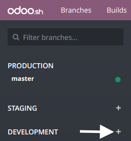
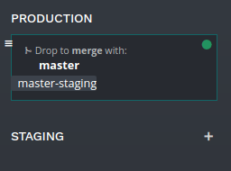

=================
Your first module
=================

Overview
========

This chapter helps you to create your first Odoo module and deploy it in your Odoo.sh project.

This tutorial requires :ref:`you created a project on Odoo.sh <odoosh-gettingstarted-create>`, and
you know your Github repository's URL.

Basic use of Git and Github is explained.

The below assumptions are made:

* *~/src* is the directory where are located the Git repositories related to your Odoo projects,
* *odoo* is the Github user,
* *odoo-addons* is the Github repository,
* *feature-1* is the name of a development branch,
* *master* is the name of the production branch,
* *my_module* is the name of the module.

Replace these by the values of your choice.

Create the development branch
=============================

From Odoo.sh
------------

In the branches view:

* hit the :code:`+` button next to the development stage,
* choose the branch *master* in the *Fork* selection,
* type *feature-1* in the *To* input.

  |pic1|  |pic2|

.. |pic2| image:: first_module/firstmodule-development-fork.png
   :width: 45%

Once the build created, you can access the editor and browse to the folder *~/src/user* to access
to the code of your development branch.

.. image:: first_module/firstmodule-development-editor.png
   :align: center

.. image:: first_module/firstmodule-development-editor-interface.png
   :align: center

From your computer
------------------

Clone your Github repository on your computer:

.. code-block:: bash

  $ mkdir ~/src
  $ cd ~/src
  $ git clone https://github.com/odoo/odoo-addons.git
  $ cd ~/src/odoo-addons

Create a new branch:

.. code-block:: bash

  $ git checkout -b feature-1 master

Create the module structure
===========================

Scaffolding the module
----------------------

While not necessary, scaffolding avoids the tedium of setting the basic Odoo module structure.
You can scaffold a new module using the executable *odoo-bin*.

From the Odoo.sh editor, in a terminal:

.. code-block:: bash

  $ odoo-bin scaffold my_module ~/src/user/

Or, from your computer, if you have an :doc:`installation of Odoo <../../install/source>`:

.. code-block:: bash

  $ ./odoo-bin scaffold my_module ~/src/odoo-addons/

If you do not want to bother installing Odoo on your computer,
you can also :download:`download this module structure template <first_module/my_module.zip>` in
which you replace every occurrences of *my_module* to the name of your choice.

The below structure will be generated:

::

  my_module
  ├── __init__.py
  ├── __manifest__.py
  ├── controllers
  │   ├── __init__.py
  │   └── controllers.py
  ├── demo
  │   └── demo.xml
  ├── models
  │   ├── __init__.py
  │   └── models.py
  ├── security
  │   └── ir.model.access.csv
  └── views
      ├── templates.xml
      └── views.xml

.. warning::

   Do not use special characters other than the underscore ( _ ) for your module name, not even an
   hyphen ( - ). This name is used for the Python classes of your module, and having classes name
   with special characters other than the underscore is not valid in Python.

Uncomment the content of the files:

* *models/models.py*,
  an example of model with its fields,
* *views/views.xml*,
  a tree and a form view, with the menus opening them,
* *demo/demo.xml*,
  demo records for the above example model,
* *controllers/controllers.py*,
  an example of controller implementing some routes,
* *views/templates.xml*,
  two example qweb views used by the above controller routes,
* *__manifest__.py*,
  the manifest of your module, including for instance its title, description and data files to load.
  You just need to uncomment the access control list data file:

  .. code-block:: python

    # 'security/ir.model.access.csv',

Manually
--------

If you want to create your module structure manually,
you can follow the :doc:`/developer/tutorials/getting_started` tutorial to understand
the structure of a module and the content of each file.

Push the development branch
===========================

Stage the changes to be committed

.. code-block:: bash

  $ git add my_module

Commit your changes

.. code-block:: bash

  $ git commit -m "My first module"

Push your changes to your remote repository

From an Odoo.sh editor terminal:

.. code-block:: bash

  $ git push https HEAD:feature-1

The above command is explained in the section
:ref:`Commit & Push your changes
<odoosh-gettingstarted-online-editor-push>` of the
:ref:`Online Editor <odoosh-gettingstarted-online-editor>`
chapter.
It includes the explanation regarding the fact you will be prompted to type your username and
password, and what to do if you use the two-factor authentication.

Or, from your computer terminal:

.. code-block:: bash

  $ git push -u origin feature-1

You need to specify *-u origin feature-1* for the first push only.
From that point, to push your future changes from your computer, you can simply use

.. code-block:: bash

  $ git push

Test your module
================

Your branch should appear in your development branches in your project.

.. image:: first_module/firstmodule-test-branch.png
  :align: center

In the branches view of your project,
you can click on your branch name in the left navigation panel to access its history.

.. image:: first_module/firstmodule-test-branch-history.png
  :align: center

You can see here the changes you just pushed, including the comment you set.
Once the database ready, you can access it by clicking the *Connect* button.

.. image:: first_module/firstmodule-test-database.png
  :align: center

If your Odoo.sh project is configured to install your module automatically,
you will directly see it amongst the database apps. Otherwise, it will be available in the apps to
install.

You can then play around with your module, create new records and test your features and buttons.

Test with the production data
=============================

You need to have a production database for this step. You can create it if you do not have it yet.

Once you tested your module in a development build with the demo data and believe it is ready,
you can test it with the production data using a staging branch.

You can either:

* Make your development branch a staging branch, by drag and dropping it onto the *staging* section
  title.

  .. image:: first_module/firstmodule-test-devtostaging.png
     :align: center

* Merge it in an existing staging branch, by drag and dropping it onto the given staging branch.

  .. image:: first_module/firstmodule-test-devinstaging.png
     :align: center

You can also use the :code:`git merge` command to merge your branches.

This will create a new staging build, which will duplicate the production database and make it run
using a server updated with your latest changes of your branch.

.. image:: first_module/firstmodule-test-mergedinstaging.png
   :align: center

Once the database ready, you can access it using the *Connect* button.

.. _odoosh-gettingstarted-firstmodule-productiondata-install:

Install your module
-------------------

Your module will not be installed automatically, you have to install it from the apps menu. Indeed,
the purpose of the staging build is to test the behavior of your changes as it would be on your
production, and on your production you would not like your module to be installed automatically, but
on demand.

Your module may not appear directly in your apps to install either, you need to update your apps
list first:

* Activate the :ref:`developer mode <developer-mode>`
* in the apps menu, click the *Update Apps List* button,
* in the dialog that appears, click the *Update* button.

  .. image:: first_module/firstmodule-test-updateappslist.png
    :align: center

Your module will then appear in the list of available apps.

.. image:: first_module/firstmodule-test-mymoduleinapps.png
  :align: center

Deploy in production
====================

Once you tested your module in a staging branch with your production data,
and believe it is ready for production, you can merge your branch in the production branch.

Drag and drop your staging branch on the production branch.

You can also use the :code:`git merge` command to merge your branches.

This will merge the latest changes of your staging branch in the production branch,
and update your production server with these latest changes.

.. image:: first_module/firstmodule-test-mergedinproduction.png
  :align: center

Once the database ready, you can access it using the *Connect* button.

Install your module
-------------------

Your module will not be installed automatically,
you have to install it manually as explained in the
:ref:`above section about installing your module in staging databases
<odoosh-gettingstarted-firstmodule-productiondata-install>`.

Add a change
============

This section explains how to add a change in your module by adding a new field in a model and deploy
it.

From the Odoo.sh editor,
 * browse to your module folder *~/src/user/my_module*,
 * then, open the file *models/models.py*.

Or, from your computer,
 * use the file browser of your choice to browse to your module folder
   *~/src/odoo-addons/my_module*,
 * then, open the file *models/models.py* using the editor of your choice,
   such as *Atom*, *Sublime Text*, *PyCharm*, *vim*, ...

Then, after the description field

.. code-block:: python

  description = fields.Text()

Add a datetime field

.. code-block:: python

  start_datetime = fields.Datetime('Start time', default=lambda self: fields.Datetime.now())

Then, open the file *views/views.xml*.

After

.. code-block:: xml

    <field name="value2"/>

Add

.. code-block:: xml

    <field name="start_datetime"/>

These changes alter the database structure by adding a column in a table,
and modify a view stored in database.

In order to be applied in existing databases, such as your production database,
these changes requires the module to be updated.

If you would like the update to be performed automatically by the Odoo.sh platform when you push
your changes, increase your module version in its manifest.

Open the module manifest *__manifest__.py*.

Replace

.. code-block:: python

  'version': '0.1',

with

.. code-block:: python

  'version': '0.2',

The platform will detect the change of version and trigger the update of the module upon the new
revision deployment.

Browse to your Git folder.

Then, from an Odoo.sh terminal:

.. code-block:: bash

  $ cd ~/src/user/

Or, from your computer terminal:

.. code-block:: bash

  $ cd ~/src/odoo-addons/

Then, stage your changes to be committed

.. code-block:: bash

  $ git add my_module

Commit your changes

.. code-block:: bash

  $ git commit -m "[ADD] my_module: add the start_datetime field to the model my_module.my_module"

Push your changes:

From an Odoo.sh terminal:

.. code-block:: bash

  $ git push https HEAD:feature-1

Or, from your computer terminal:

.. code-block:: bash

  $ git push

The platform will then create a new build for the branch *feature-1*.

.. image:: first_module/firstmodule-test-addachange-build.png
   :align: center

Once you tested your changes, you can merge your changes in the production branch, for instance by
drag-and-dropping the branch on the production branch in the Odoo.sh interface. As you increased the
module version in the manifest, the platform will update the module automatically and your new field
will be directly available. Otherwise you can manually update the module within the apps list.

Use an external Python library
==============================

If you would like to use an external Python library which is not installed by default,
you can define a *requirements.txt* file listing the external libraries your modules depends on.

.. note::
   - It is not possible to install or upgrade system packages on an Odoo.sh database (e.g., apt
     packages). However, under specific conditions, packages can be considered for installation.
     This also applies to **Python modules** requiring system packages for their compilation, and
     **third-party Odoo modules**.
   - **PostgreSQL extensions** are not supported on Odoo.sh.
   - For more information, consult our `FAQ <https://www.odoo.sh/faq#install_dependencies>`_.

The platform will use this file to automatically install the Python libraries your project needs.

The feature is explained in this section by using the `Unidecode library
<https://pypi.python.org/pypi/Unidecode>`_ in your module.

Create a file *requirements.txt* in the root folder of your repository

From the Odoo.sh editor, create and open the file ~/src/user/requirements.txt.

Or, from your computer, create and open the file ~/src/odoo-addons/requirements.txt.

Add

.. code-block:: text

  unidecode

Then use the library in your module, for instance to remove accents from characters in the name
field of your model.

Open the file *models/models.py*.

Before

.. code-block:: python

  from odoo import models, fields, api

Add

.. code-block:: python

  from unidecode import unidecode

After

.. code-block:: python

  start_datetime = fields.Datetime('Start time', default=lambda self: fields.Datetime.now())

Add

.. code-block:: python

  @api.model
  def create(self, values):
      if 'name' in values:
          values['name'] = unidecode(values['name'])
      return super(my_module, self).create(values)

  def write(self, values):
      if 'name' in values:
          values['name'] = unidecode(values['name'])
      return super(my_module, self).write(values)

Adding a Python dependency requires a module version increase for the platform to install it.

Edit the module manifest *__manifest__.py*

Replace

.. code-block:: python

  'version': '0.2',

with

.. code-block:: python

  'version': '0.3',

Stage and commit your changes:

.. code-block:: bash

  $ git add requirements.txt
  $ git add my_module
  $ git commit -m "[IMP] my_module: automatically remove special chars in my_module.my_module name field"

Then, push your changes:

In an Odoo.sh terminal:

.. code-block:: bash

  $ git push https HEAD:feature-1

In your computer terminal:

.. code-block:: bash

  $ git push
