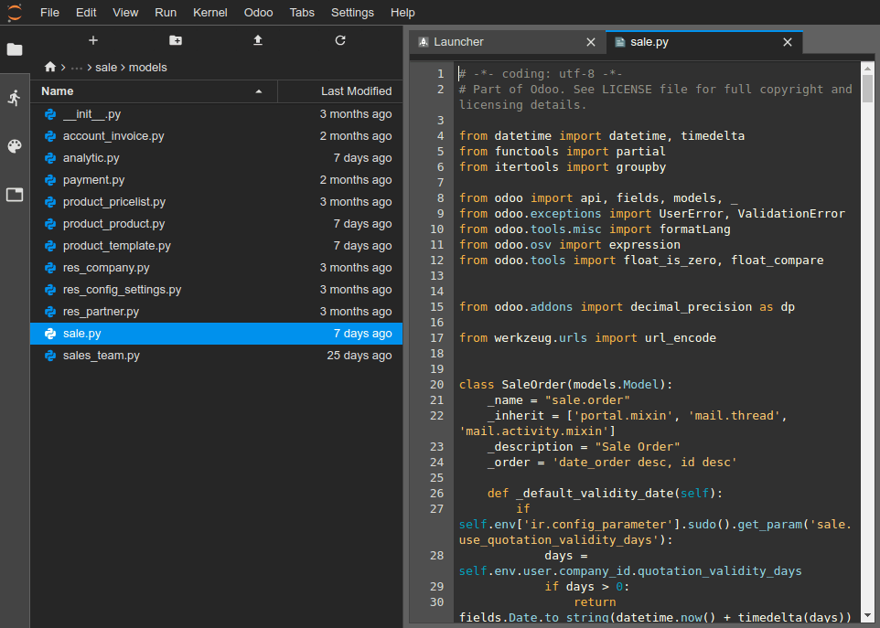
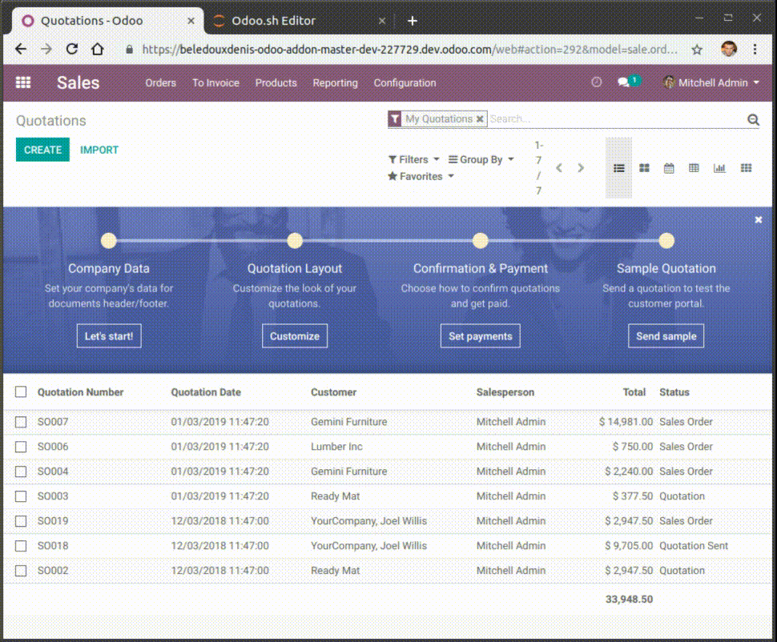

.. _odoosh-gettingstarted-online-editor:

=============
Online Editor
=============

Overview
========

The online editor allows you to edit the source code of your builds from a web browser.
It also gives you the possibility to open terminals, Python consoles, Odoo Shell consoles and
`Notebooks <https://jupyterlab.readthedocs.io/en/stable/user/notebook.html>`_.

.. image:: online-editor/interface-editor.png
   :align: center

You can access the editor of a build through
:ref:`the branches tabs <odoosh-gettingstarted-branches-tabs>`,
:ref:`the builds dropdown menu <odoosh-gettingstarted-builds-dropdown-menu>`
or by adding */odoo-sh/editor* to your build domain name
(e.g. *https://odoo-addons-master-1.dev.odoo.com/odoo-sh/editor*).

Edit the source code
====================

The working directory is composed of the following folders:

::

  .
  ├── home
  │    └── odoo
  │         ├── src
  │         │    ├── odoo                Odoo Community source code
  │         │    │    └── odoo-bin       Odoo server executable
  │         │    ├── enterprise          Odoo Enterprise source code
  │         │    ├── themes              Odoo Themes source code
  │         │    └── user                Your repository branch source code
  │         ├── data
  │         │    ├── filestore           database attachments, as well as the files of binary fields
  │         │    └── sessions            visitors and users sessions
  │         └── logs
  │              ├── install.log         Database installation logs
  │              ├── odoo.log            Running server logs
  │              ├── update.log          Database updates logs
  │              └── pip.log             Python packages installation logs

You can edit the source code (files under */src*) in development and staging builds.

.. note::
  Your changes won't be propagated to a new build, you must commit them in your
  source code if you want to make them persist.

For production builds, the source code is read-only, because applying local changes on a production
server is not a good practice.

* The source code of your Github repository is located under */src/user*,
* The source code of Odoo is located under

  * */src/odoo* (`odoo/odoo <https://github.com/odoo/odoo>`_),
  * */src/enterprise* (`odoo/enterprise <https://github.com/odoo/enterprise>`_),
  * */src/themes* (`odoo/design-themes <https://github.com/odoo/design-themes>`_).

To open a file in the editor, just double-click on it in the file browser panel on the left.

You can then begin to make your changes. You can save your changes with the menu
:menuselection:`File --> Save .. File` or by hitting the :kbd:`Ctrl+S` shortcut.

.. image:: online-editor/interface-editor-save-file.png
   :align: center

If you save a Python file which is under your Odoo server addons path,
Odoo will detect it and reload automatically so your changes are reflected immediately,
without having to restart the server manually.

However, if the change is a data stored in database, such as the label of a field, or a view,
you have to update the according module to apply the change.
You can update the module of the currently opened file by using the menu
:menuselection:`Odoo --> Update current module`. Note that the file considered as currently opened
is the file focused in the text editor, not the file highlighted in the file browser.

.. image:: online-editor/interface-editor-update-current-module.png
   :align: center

You can also open a terminal and execute the command:

.. code-block:: bash

  $ odoo-bin -u <comma-separated module names> --stop-after-init

.. _odoosh-gettingstarted-online-editor-push:

Commit & Push your changes
==========================

You have the possibility to commit and push your changes to your Github repository.

* Open a terminal (:menuselection:`File --> New --> Terminal`),
* Change the directory to *~/src/user* using :code:`cd ~/src/user`,
* Stage your changes using :code:`git add`,
* Commit your changes using :code:`git commit`,
* Push your changes using :code:`git push https HEAD:<branch>`.

In this last command,

* *https* is the name of your *HTTPS* Github remote repository
  (e.g. https://github.com/username/repository.git),
* HEAD is the reference to the latest revision you committed,
* <branch> must be replaced by the name of the branch to which you want to push the changes,
  most-likely the current branch if you work in a development build.

.. image:: online-editor/interface-editor-commit-push.png
   :align: center

.. note::
   The SSH Github remote is not used because your SSH private key
   is not hosted in your build containers (for obvious security concerns)
   nor forwarded through an SSH Agent (as you access this editor through a web browser)
   and you therefore cannot authenticate yourself to Github using SSH.
   You have to use the HTTPS remote of your Github repository to push your changes,
   which is added automatically named as *https* in your Git remotes.
   You will be prompted to enter your Github username and password.
   If you activated the two-factor authentication on Github,
   you can create a `personal access token
   <https://help.github.com/articles/creating-a-personal-access-token-for-the-command-line/>`_
   and use it as password. Granting the ``repo`` permission suffices.

.. note::
   The Git source folder *~/src/user* is not checked out on a branch but rather on a detached revision:
   This is because builds work on specific revisions rather than branches.
   In other words, this means you can have multiple builds on the same branch, but on different revisions.

Once your changes are pushed,
according to your :ref:`branch push behavior <odoosh-gettingstarted-branches-tabs-settings>`,
a new build may be created. You can continue to work in the editor you pushed from,
as it will have the same revision as the new build that was created, but always make sure to be
in an editor of a build using the latest revision of your branch.

Consoles
========

You can open Python consoles, which are
`IPython interactive shells <https://ipython.readthedocs.io/en/stable/interactive/tutorial.html>`_.
One of the most interesting addition to use a Python console
rather than a IPython shell within a terminal is the
`rich display <https://ipython.readthedocs.io/en/stable/config/integrating.html#rich-display>`_
capabilities.
Thanks to this, you will be able to display objects in HTML.

You can for instance display cells of a CSV file using
`pandas <https://pandas.pydata.org/pandas-docs/stable/tutorials.html>`_.

.. image:: online-editor/interface-editor-console-python-read-csv.png
   :align: center

You can also open an Odoo Shell console to play around
with the Odoo registry and model methods of your database. You can also directly read or write
on your records.

.. warning::
   In an Odoo Console, transactions are automatically committed.
   This means, for instance, that changes in records are applied effectively in the database.
   If you change the name of a user, the name of the user is changed in your database as well.
   You therefore should use Odoo consoles carefully on production databases.

You can use *env* to invoke models of your database registry, e.g. :code:`env['res.users']`.

.. code-block:: python

  env['res.users'].search_read([], ['name', 'email', 'login'])
  [{'id': 2,
  'login': 'admin',
  'name': 'Administrator',
  'email': 'admin@example.com'}]

The class :code:`Pretty` gives you the possibility
to easily display lists and dicts in a pretty way, using the
`rich display <https://ipython.readthedocs.io/en/stable/config/integrating.html#rich-display>`_
mentioned above.

.. image:: online-editor/interface-editor-console-odoo-pretty.png
   :align: center

You can also use
`pandas <https://pandas.pydata.org/pandas-docs/stable/tutorials.html>`_
to display graphs.

.. image:: online-editor/interface-editor-console-odoo-graph.png
   :align: center
