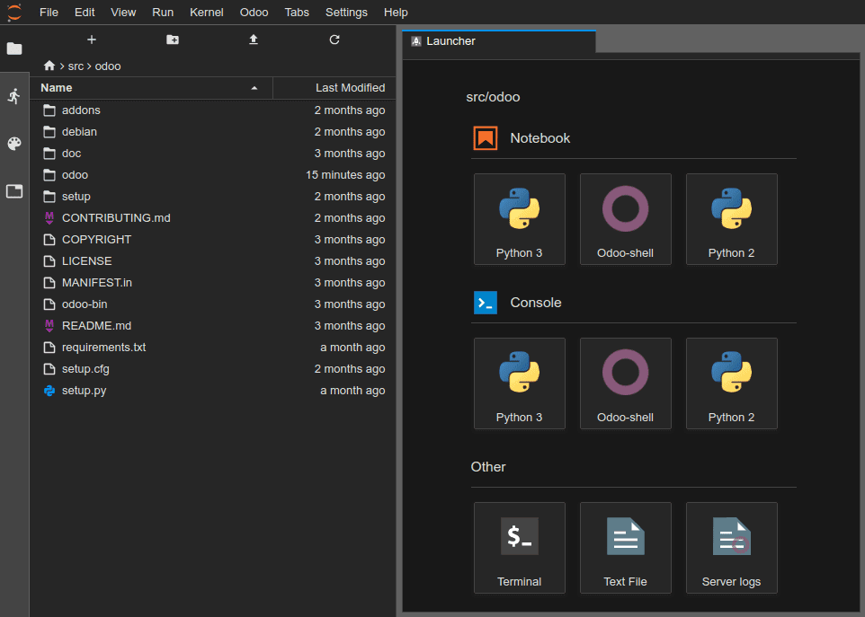
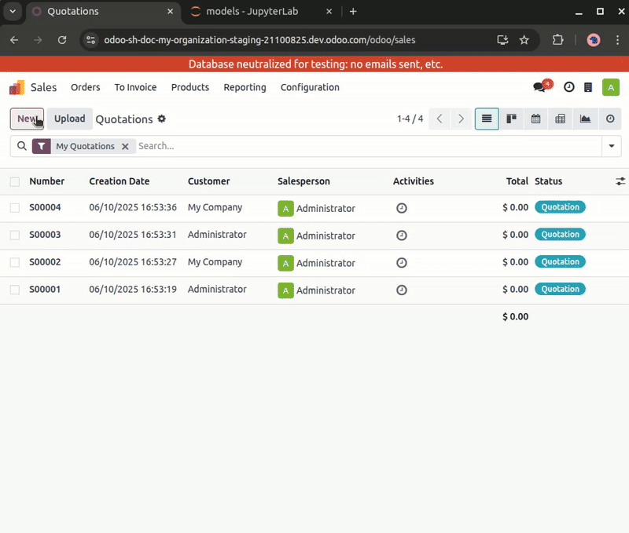
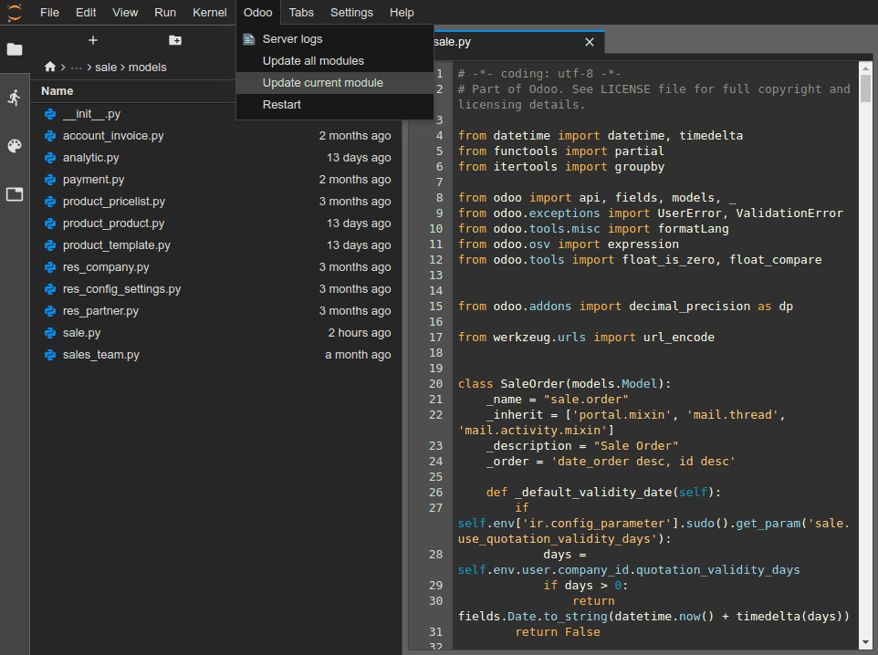

=============
Online editor
=============

The :guilabel:`Online Editor` view allows editing the source code of your builds from a web browser.
It also gives you the possibility to open terminals, Python consoles, Odoo shell consoles, and
`Jupyter Notebooks <https://jupyterlab.readthedocs.io/en/stable/user/notebook.html>`_.

You can access the editor of a build through :ref:`the branches tab <odoo-sh/branches/tabs>`,
:ref:`the builds dropdown menu <odoo-sh/builds/stages/features>`, or by adding `/odoo-sh/editor` to
the build's URL (e.g., `https://odoo-addons-master-1.dev.odoo.com/odoo-sh/editor`).

.. _odoo-sh/editor/source:

Editing the source code
=======================

The working directory is composed of the following:

::

  .
  ├── home
  │    └── odoo
  │         ├── src
  │         │    ├── odoo                Odoo Community source code
  │         │    │    └── odoo-bin       Odoo server executable
  │         │    ├── enterprise          Odoo Enterprise source code
  │         │    ├── themes              Odoo Themes source code
  │         │    └── user                Your repository branch source code
  │         ├── data
  │         │    ├── filestore           Database attachments, as well as the files of binary fields
  │         │    └── sessions            Visitors and users sessions
  │         └── logs
  │              ├── install.log         Database installation logs
  │              ├── odoo.log            Running server logs
  │              ├── update.log          Database updates logs
  │              └── pip.log             Python packages installation logs

You can edit the source code (files under `/src`) of development and staging builds. For production
builds, the source code is read-only, because applying local changes on a production server is not a
good practice.

.. note::
   - Your changes won't be propagated to new builds. It is necessary to :ref:`commit them to the
     source code <odoo-sh/editor/commit>` if you want them to persist.
   - The source code of your GitHub repository is located under `/src/user`.
   - The source code of Odoo is located under:

     - `/src/odoo` (`<https://github.com/odoo/odoo>`_)
     - `/src/enterprise` (`<https://github.com/odoo/enterprise>`_)
     - `/src/themes` (`<https://github.com/odoo/design-themes>`_)

To open a file in the editor, double-click it in the file browser panel. You can then edit the file.
To save your changes, go to :menuselection:`File --> Save` or use the :kbd:`Ctrl+S` keyboard
shortcut.

If you save a Python file in your Odoo server's addons path, Odoo will detect it and reload
automatically, meaning your changes are immediately visible.

However, if your changes are stored in the database, such as a field's label or a view, it is
necessary to update the related module to apply the changes. To update the module of the currently1
open file, go to :menuselection:`Odoo --> Update current module`.

.. tip::
   You can also execute the following command in a terminal to update a module:

   .. code-block:: bash

      odoo-bin -u <comma-separated module names> --stop-after-init

.. _odoo-sh/editor/commit:

Committing and pushing changes
==============================

To commit and push changes to your GitHub repository:

- Open a terminal by going to :menuselection:`File --> New --> Terminal`.
- Change the directory to `~/src/user`.

  .. code-block:: bash

     cd ~/src/user

- State your identity.

  .. code-block:: bash

     git config --global user.email "you@example.com" && git config --global user.name "Your Name"

- Stage your changes.

  .. code-block:: bash

     git add

- Commit your changes.

  .. code-block:: bash

     git commit

- Push your changes.

  .. code-block:: bash

     git push https HEAD:<branch>

  In this command:

  - `https` is the name of your *HTTPS* GitHub remote repository (e.g.,
    `https://github.com/username/repository.git`).
  - `HEAD` is the reference to the latest revision you committed.
  - `<branch>` must be replaced by the name of the branch to which you want to push the changes,
    most likely the current branch if you work on a development build.

You will be prompted to input your GitHub username and password. After inputting your credentials,
press enter.

.. image:: online_editor/commit-push.png
   :alt: The commands to commit and push changes

.. tip::
   If you activate two-factor authentication for your GitHub account, you can create a `personal
   access token <https://docs.github.com/en/authentication/keeping-your-account-and-data-secure/managing-your-personal-access-tokens#creating-a-fine-grained-personal-access-token>`_
   and use it as a password. `Granting the repo permission <https://docs.github.com/en/repositories/managing-your-repositorys-settings-and-features/repository-access-and-collaboration/inviting-collaborators-to-a-personal-repository>`_
   suffices.

.. note::
   - It is not possible to authenticate yourself using SSH, as your private SSH key is not hosted in
     your build containers for security reasons, nor forwarded through an SSH agent, as you access
     the editor through a web browser.
   - The source folder `~/src/user` is not checked out on a branch but rather on a detached
     revision. This is because builds work on specific revisions rather than branches, meaning you
     can have multiple builds on the same branch, but on different revisions.

Once your changes are pushed, according to your :ref:`branch push behavior
<odoo-sh/branches/tabs/settings>`, a new build may be created. You can continue to work in the editor
you pushed from, as it will have the same revision as the new build that was created. However,
always make sure to be in the editor of a build using the latest revision of your branch.

.. _odoo-sh/editor/consoles:

Consoles
========

You can open Python consoles, which are `IPython interactive shells
<https://ipython.readthedocs.io/en/stable/interactive/tutorial.html>`_. Using these Python consoles
(rather than IPython shells within a terminal) allows you to utilize their `rich display
capabilities <https://ipython.readthedocs.io/en/stable/config/integrating.html#rich-display>`_ to
display objects in HTML.

.. example::
   The :code:`Pretty` class displays lists in a legible way.

   .. image:: online_editor/pretty-class.png
      :alt: Pretty class example

.. tip::
   Using `pandas <https://pandas.pydata.org/pandas-docs/stable/getting_started/tutorials.html>`_ you
   can display:

   - Cells of a CSV file

     .. image:: online_editor/pandas-csv.png
        :alt: pandas CSV example

   - Graphs

     .. image:: online_editor/pandas-graph.png
        :alt: pandas graph example

You can open Odoo shell consoles to experiment with the Odoo registry and model methods of your
database. You can also read or write directly on your records.

.. warning::
   In an Odoo shell console, transactions are automatically committed. This means that changes made
   to records are applied to the database. For example, if you change a user's name, it will be
   updated in your database as well. Therefore, use Odoo shell consoles carefully on production
   databases.

You can use `env` to invoke models of your database registry, e.g., :code:`env['res.users']`.

.. code-block:: python

   env['res.users'].search_read([], ['name', 'email', 'login'])
   [{'id': 2,
   'login': 'admin',
   'name': 'Administrator',
   'email': 'admin@example.com'}]
