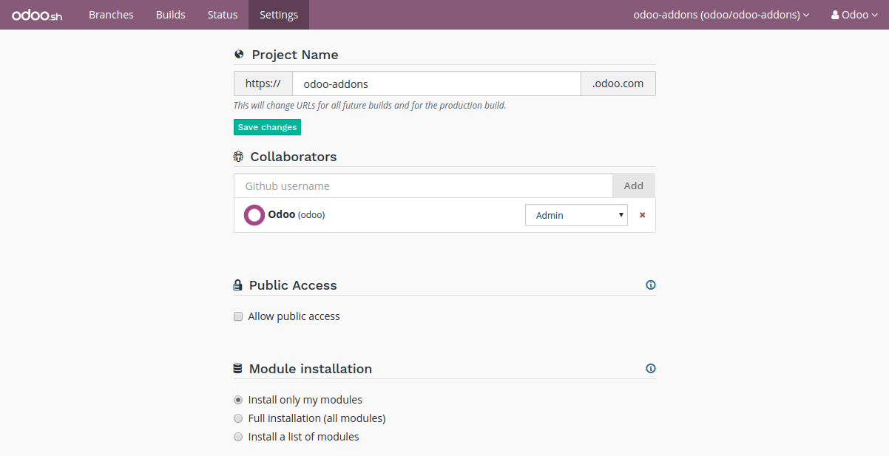
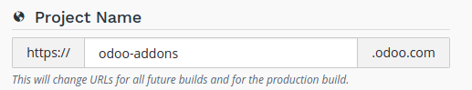
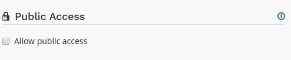
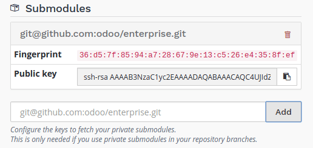
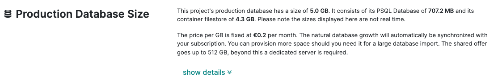
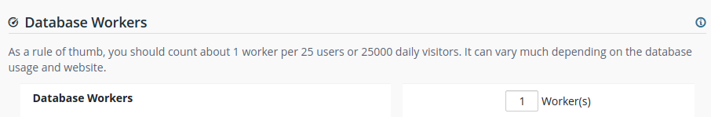
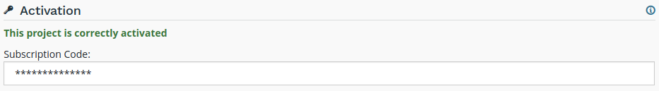

========
Settings
========

Overview
========

The settings allow you to manage the configuration of your project.

Project name
============

The name of your project.

This defines the address that will be used to access your production database.

Addresses of your staging and development builds are derived from this name and assigned
automatically. However, when you change your project name, only future builds will use the new name.

.. _odoosh-gettingstarted-settings-collaborators:

Collaborators
=============

Manage the Github users who can access your project.

.. image:: settings/interface-settings-collaborators.png
   :align: center

There are three levels of users:

- :guilabel:`Admin`: has access to all features of an Odoo.sh project.

- :guilabel:`Tester`: has access to the *Staging* and *Development* databases and their tooling.
  This role is for users conducting User Acceptance Tests. Testers can work with copies of
  production data but cannot access the production database through the Odoo.sh tooling.

- :guilabel:`Developer`: has access only to the *Development* databases and their tooling. This
  role is for developers who propose code modifications but are not allowed to access production
  and staging databases through the Odoo.sh tooling.

.. list-table::
   :header-rows: 1
   :widths: auto

   * -
     -
     - Developer
     - Tester
     - Admin
   * - Development
     - History
     - |green|
     - |green|
     - |green|
   * -
     - 1-click connect
     - |green|
     - |green|
     - |green|
   * -
     - Logs
     - |green|
     - |green|
     - |green|
   * -
     - Shell/SSH
     - |green|
     - |green|
     - |green|
   * -
     - Mails
     - |green|
     - |green|
     - |green|
   * -
     - Settings
     - |green|
     - |green|
     - |green|
   * - Staging
     - History
     - |green|
     - |green|
     - |green|
   * -
     - 1-click connect
     -
     - |green|
     - |green|
   * -
     - Logs
     -
     - |green|
     - |green|
   * -
     - Shell/SSH
     -
     - |green|
     - |green|
   * -
     - Mails
     -
     - |green|
     - |green|
   * -
     - Monitoring
     -
     - |green|
     - |green|
   * -
     - Backups
     -
     -
     - |green|
   * -
     - Upgrade
     -
     - |green|
     - |green|
   * -
     - Settings
     -
     - |green|
     - |green|
   * - Production
     - History
     - |green|
     - |green|
     - |green|
   * -
     - 1-click connect
     -
     -
     - |green|
   * -
     - Logs
     -
     -
     - |green|
   * -
     - Shell/SSH
     -
     -
     - |green|
   * -
     - Mails
     -
     -
     - |green|
   * -
     - Monitoring
     -
     -
     - |green|
   * -
     - Backups
     -
     -
     - |green|
   * -
     - Upgrade
     -
     -
     - |green|
   * -
     - Settings
     -
     -
     - |green|
   * - Status
     -
     - |green|
     - |green|
     - |green|
   * - Settings
     -
     -
     -
     - |green|

.. warning::
   Those roles only apply to the usage of Odoo.sh. It is important to reflect the user roles
   attribution within the repository on GitHub.  Please refer to the GitHub documentation section on
   `Managing a branch protection rule <https://docs.github.com/en/repositories/configuring-branches-and-merges-in-your-repository/managing-protected-branches/managing-a-branch-protection-rule>`_
   for detailed guidance.

.. |green| raw:: html

   ●

.. |orange| raw:: html

   ●

.. |red| raw:: html

   ●

Public Access
=============

Allow public access to your development builds.

If activated, this option exposes the Builds page publicly, allowing visitors to view logs of development builds.

Production and staging builds are excluded, visitors can only see their status.

.. _odoosh-gettingstarted-settings-modules-installation:

Custom domains
==============

To configure additional domains please refer to the corresponding branch's :ref:`settings tab
<odoosh-gettingstarted-branches-tabs-settings>`.

.. _odoosh-gettingstarted-settings-submodules:

Submodules
==========

Configure the deploy keys for the private repositories you use
as submodules in your branches to allow Odoo.sh to download them.

.. warning::
   These settings are required for **private repositories** only. If you are looking on how to set
   up your submodules, instructions are available in the chapter :ref:`Submodules
   <odoosh-advanced-submodules>` of this documentation.

When a repository is private, it is not possible to publicly download its branches and revisions.
For that reason, you need to configure a deploy key for Odoo.sh,
so the remote Git server allows our platform to download the revisions
of this private repository.

To configure the deploy key for a private repository, proceed as follows:

* in the input, paste the SSH URL of your private sub-repository and click on *Add*,

  * e.g. *git@github.com:USERNAME/REPOSITORY.git*
  * it can be another Git server than Github, such as Bitbucket, Gitlab or even your own self-hosted
    server

* copy the public key,

  * it should look like *ssh-rsa some...random...characters...here...==*

* in the settings of the private sub-repository, add the public key amongst the deploy keys.

  * Github.com: :menuselection:`Settings --> Deploy keys --> Add deploy key`
  * Bitbucket.com: :menuselection:`Settings --> Access keys --> Add key`
  * Gitlab.com: :menuselection:`Settings --> Repository --> Deploy Keys`
  * Self-hosted: append the key to the git user’s authorized_keys file in its .ssh directory

Storage Size
============

This section shows the storage size used by your project.

Storage size is computed as follows:

* the size of the PostgreSQL database

* the size of the disk files available in your container: database filestore, sessions storage directory...

.. warning::
   In case you want to analyze disk usage, you can run the tool `ncdu
   <https://dev.yorhel.nl/ncdu/man>`_ in your Web Shell.

Should your production database size grow to exceed what's provisioned in your subscription, it
will automatically be synchronized with it.

Database Workers
================

Additional database workers can be configured here. More workers help increase the load your
production database is able to handle. If you add more, it will automatically be synchronized
with your subscription.

.. Warning::
  Adding more workers will not magically solve all performance issues. It only allows the server
  to handle more connections at the same time. If some operations are unusually slow, it's most
  likely a problem with the code, if it's not due to your own customizations you can open a ticket
  `here <https://www.odoo.com/help>`_.

Staging Branches
================

Additional staging branches allow you to develop and test more features at the same time. If you
add more, it will automatically be synchronized with your subscription.

.. image:: settings/interface-settings-staging-branches.png
   :align: center

Activation
==========

Shows the status of the project's activation. You can change the project's activation code if
needed.

