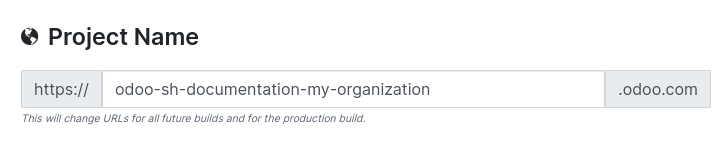
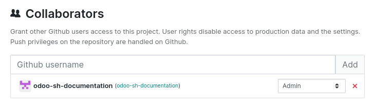
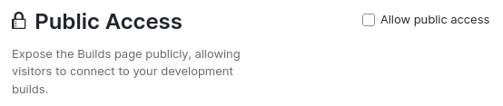
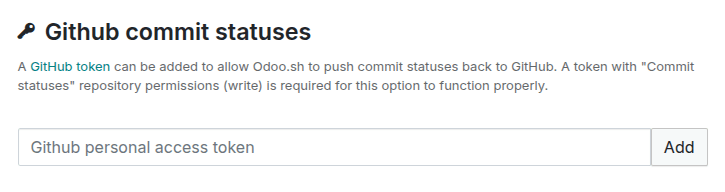
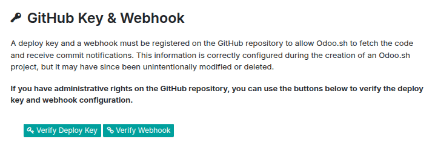
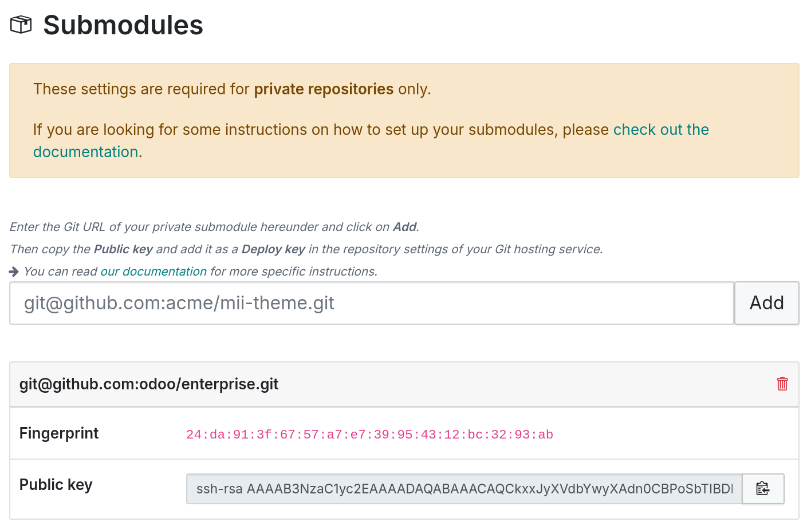
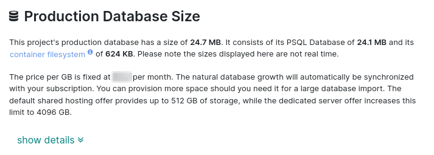
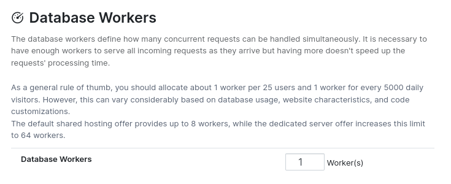
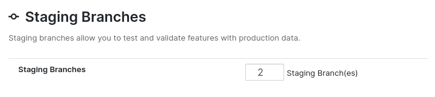
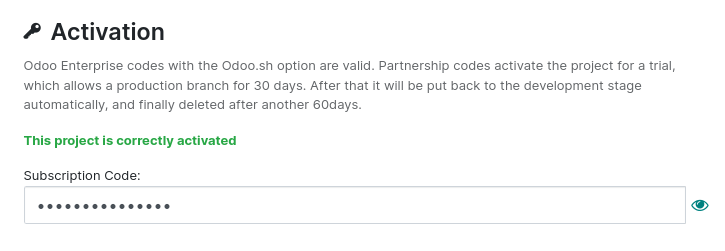

========
Settings
========

The :guilabel:`Settings` view allow you to manage the configuration of your project.

.. _odoo-sh/settings/name:

Project name
============

The name of your project defines the address used to access your production database. The addresses
of your staging and development builds are automatically derived from this name. If you change the
project name, only future builds will use the new name.

.. _odoo-sh/settings/collaborators:

Collaborators
=============

To grant access to a GitHub user, enter their username and click :guilabel:`Add`. By default, the
user is is granted the :guilabel:`Developer` role. Click the dropdown menu to select another one:

- :guilabel:`Admin`: full access to all Odoo.sh features and tools. This role is dedicated to
  project management and has exclusive access to the project's settings.
- :guilabel:`Tester`: access to staging and development databases and their tools. This role is
  intended for users performing user acceptance testing (UAT). Testers can work with copies of
  production data, but they cannot access the production database through Odoo.sh's tools.
- :guilabel:`Developer`: no access to the production and staging databases. This role is intended
  for users who modify the code but should not access production data. Developers cannot connect to
  the production or staging databases and do not have access to the web shell or server logs.

.. _odoo-sh/settings/collaborators/table:

Feature access by stage and role
--------------------------------

.. list-table::
   :header-rows: 1
   :stub-columns: 1
   :widths: auto

   * - Stage
     - Feature
     - Developer
     - Tester
     - Admin
   * - Development
     - Connect + / Connect as
     - |green|
     - |green|
     - |green|
   * -
     - :ref:`History <odoo-sh/branches/tabs/history>`
     - |green|
     - |green|
     - |green|
   * -
     - :ref:`Mails <odoo-sh/branches/tabs/mails>`
     - |green|
     - |green|
     - |green|
   * -
     - :ref:`Editor <odoo-sh/branches/tabs/editor>`
     - |green|
     - |green|
     - |green|
   * -
     - :ref:`Monitor <odoo-sh/branches/tabs/monitor>`
     - |green|
     - |green|
     - |green|
   * -
     - :ref:`Logs <odoo-sh/branches/tabs/logs>`
     - |green|
     - |green|
     - |green|
   * -
     - :ref:`Upgrade <odoo-sh/branches/tabs/upgrade>`
     - |green|
     - |green|
     - |green|
   * -
     - :ref:`Settings <odoo-sh/branches/tabs/settings>`
     - |green|
     - |green|
     - |green|
   * -
     - Status
     - |green|
     - |green|
     - |green|
   * - Staging
     - Connect + / Connect as
     - |green|
     - |green|
     - |green|
   * -
     - :ref:`History <odoo-sh/branches/tabs/history>`
     - |green|
     - |green|
     - |green|
   * -
     - :ref:`Mails <odoo-sh/branches/tabs/mails>`
     - |red|
     - |green|
     - |green|
   * -
     - :ref:`Shell <odoo-sh/branches/tabs/shell>`
     - |red|
     - |green|
     - |green|
   * -
     - :ref:`Editor <odoo-sh/branches/tabs/editor>`
     - |red|
     - |green|
     - |green|
   * -
     - :ref:`Monitor <odoo-sh/branches/tabs/monitor>`
     - |red|
     - |green|
     - |green|
   * -
     - :ref:`Logs <odoo-sh/branches/tabs/logs>`
     - |red|
     - |green|
     - |green|
   * -
     - :ref:`Upgrade <odoo-sh/branches/tabs/upgrade>`
     - |red|
     - |green|
     - |green|
   * -
     - :ref:`Settings <odoo-sh/branches/tabs/settings>`
     - |red|
     - |green|
     - |green|
   * -
     - Status
     - |green|
     - |green|
     - |green|
   * - Production
     - Connect + / Connect as
     - |green|
     - |green|
     - |green|
   * -
     - :ref:`History <odoo-sh/branches/tabs/history>`
     - |green|
     - |green|
     - |green|
   * -
     - :ref:`Shell <odoo-sh/branches/tabs/shell>`
     - |red|
     - |red|
     - |green|
   * -
     - :ref:`Editor <odoo-sh/branches/tabs/editor>`
     - |red|
     - |red|
     - |green|
   * -
     - :ref:`Monitor <odoo-sh/branches/tabs/monitor>`
     - |red|
     - |red|
     - |green|
   * -
     - :ref:`Logs <odoo-sh/branches/tabs/logs>`
     - |red|
     - |red|
     - |green|
   * -
     - :ref:`Backups <odoo-sh/branches/tabs/backups>`
     - |red|
     - |red|
     - |green|
   * -
     - :ref:`Upgrade <odoo-sh/branches/tabs/upgrade>`
     - |red|
     - |red|
     - |green|
   * -
     - :ref:`Settings <odoo-sh/branches/tabs/settings>`
     - |red|
     - |red|
     - |green|
   * -
     - Status
     - |green|
     - |green|
     - |green|

.. admonition:: Legend

   |green| : Available

   |red| : Not available

.. |green| raw:: html

   ●

.. |red| raw:: html

   ●

.. note::
   - Only admins can access the audit logs and the project settings.
   - All roles can access the :doc:`builds page <builds>`, but the features available are specific
     to each role.

.. _odoo-sh/settings/public:

Public access
=============

When enabling :guilabel:`Allow public access`, the :doc:`builds page <builds>` becomes publicly
accessible, allowing visitors to connect to development builds. Visitors can also access :ref:`logs
<odoo-sh/branches/tabs/logs>`, the :ref:`shell <odoo-sh/branches/tabs/shell>`, and :ref:`mails
<odoo-sh/branches/tabs/mails>` for development builds. Production and staging builds remain private;
visitors can only view their status.

.. _odoo-sh/settings/commit:

GitHub commit statuses
======================

You can add a GitHub token to allow Odoo.sh to push commit statuses back to GitHub. The token must
have the *commit statuses (write)* repository permission.

.. seealso::
   For more information, refer to `GitHub’s documentation on managing access tokens <https://docs.github.com/en/authentication/keeping-your-account-and-data-secure/managing-your-personal-access-tokens>`_.

.. _odoo-sh/settings/key-webhook:

GitHub key and webhook
======================

A deploy key and a webhook are automatically created on your GitHub repository to allow Odoo.sh to
fetch code and receive commit notifications. As they can be unintentionally modified or deleted,
you can use the :guilabel:`Verify Deploy Key` and :guilabel:`Verify Webhook` buttons below to verify
their configuration.

.. note::
   Administrative rights on the GitHub repository are necessary.

.. _odoo-sh/settings/submodules:

Submodules
==========

The `git submodule` command allows you to `integrate other Git projects
<https://git-scm.com/book/en/v2/Git-Tools-Submodules>`_ into your codebase without copying the code
directly.

.. note::
   A Git repository containing Odoo modules, for example from the `Odoo Apps Store
   <https://apps.odoo.com/apps>`_ or `community modules <https://github.com/OCA>`_, is necessary.

.. admonition:: Private repositories

   Before adding `private GitHub repository
   <https://help.github.com/articles/making-a-public-repository-private/>`_ as a submodule, it is
   necessary to add a deploy key:

   #. Paste the SSH URL of the sub-repository (e.g., `git@github.com:USERNAME/REPOSITORY.git`) and
      click :guilabel:`Add`.
   #. Copy the generated :guilabel:`Public Key`.
   #. On the sub-repository's GitHub, go to :menuselection:`Settings --> Deploy keys`.
   #. Click :menuselection:`Add deploy key`, enter a :guilabel:`Title`, paste the public key into
      the :guilabel:`Key` field, and click :guilabel:`Add key`.

To add a public repository or private repository with a deploy key as a submodule:

#. Add the submodule to your project.

   .. code-block:: shell

      git submodule add -b BRANCH git@github.com:USERNAME/REPOSITORY.git PATH

#. Commit and push the change.

   .. code-block:: shell

      git commit -a && git push -u origin master

#. Wait for Odoo.sh to rebuild the project.

.. _odoo-sh/settings/storage:

Production database size
========================

This section displays the total storage used by the project. It includes the PostgreSQL database
size and disk files in your container (database filestore, session storage, etc.). If the production
database exceeds the storage included in your subscription, the plan will be automatically adjusted.

.. tip::
   To analyze disk usage, run the `Ncdu tool <https://dev.yorhel.nl/ncdu/man>`_ in the :ref:`web
   shell <odoo-sh/branches/tabs/shell>`.

.. _odoo-sh/settings/workers:

Database workers
================

Additional database workers can be configured to allow your production database to handle higher
concurrent loads.

To add more workers, contact your account manager. After payment, the new worker(s) will be added to
your project.

.. note::
   Adding more workers does not automatically fix performance issues. It only increases the number
   of concurrent connections the server can handle. If some operations remain slow, the issue is
   likely code-related. If it is not due to your customizations, contact `Odoo Support
   <https://www.odoo.com/help>`_.

.. _odoo-sh/settings/staging:

Staging branches
================

Additional staging branches allow you to develop and test multiple features simultaneously. To add
more staging branches, request a product increase directly from your Odoo.sh project. A widget will
guide you to the subscription portal to complete the purchase. After payment, synchronization with
Odoo.sh will occur automatically, and the number of available staging branches will be updated.

.. _odoo-sh/settings/activation:

Activation
==========

This section shows the activation status of the project. You can change the activation code if
necessary, provided the new code is not already assigned to another project.

.. warning::
   You cannot change the activation code to:

   - A code already used in another project
   - A trial code (downgrading from paid to trial is not allowed)
   - An invalid code (not linked to an Odoo.sh custom plan)

   For any other issue, contact `Odoo Support <https://www.odoo.com/help>`_.
