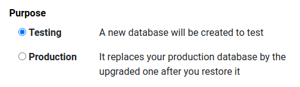

:show-content:

.. |assistance-contact| replace::
   If you need Odoo assistance on this matter, please get in touch with your Odoo Account Manager or
   our `Sales department`_.
.. _Sales department: mailto:sales@odoo.com

=======
Upgrade
=======

.. toctree::
   :titlesonly:

   upgrade/odoo_online
   upgrade/odoo_sh
   upgrade/on_premise
   upgrade/faq

An upgrade is switching to a newer version of Odoo (e.g., Odoo 14.0 to Odoo 15.0).

An upgrade does not cover:

* Changing :ref:`editions <upgrade-faq/editions-change>` (i.e., Community to Enterprise edition)
* Switching :ref:`hosting type <upgrade-faq/hosting-types-switch>` (i.e., On-Premise to Odoo Online
  or Odoo.sh)
* Migration from another ERP to Odoo

.. note:: |assistance-contact|

.. seealso::
   - :ref:`upgrade/sla`

.. _upgrade/process-workflow:

Process workflow
================

The upgrade process in a nutshell:

#. You create a test upgrade request.
#. Odoo processes the request automatically by running the database through an upgrade script, which
   takes between 20 and 120 minutes.
#. Odoo delivers a test database.
#. You test your database for possible discrepancies (see :ref:`upgrade/test-guidance`).
#. If there are any discrepancies, you report them to the Upgrade support team via the help portal
   (see :ref:`upgrade/test-assistance`).
#. We fix the issues and send you a new test database.
#. Once you have completed the testing and are happy with the result, you decide on a date and time
   when you stop users from accessing Odoo, freeze all data entries, and create an upgrade request
   for the production upgrade.
#. Odoo delivers the production database through the automated process.
#. You restore it in your Production environment a few short hours later and continue working on the
   newly upgraded database (this is done automatically on Odoo Online).

.. seealso::
   - :doc:`Upgrade process for Odoo Online <upgrade/odoo_online>`
   - :doc:`Upgrade process for Odoo.sh <upgrade/odoo_sh>`
   - :doc:`Upgrade process for On-Premise <upgrade/on_premise>`

.. _upgrade/testing-phase:

Testing
=======

This phase allows you to review an upgraded version of your database without affecting your
production database in any way. We suggest that you run the test upgrade process at least once, but
you can do it as many times as you need (one at a time).

Once you receive your upgraded test database, check that all data, processes, and functionality are
still correct and working as expected.

If you do find discrepancies, :ref:`report your issues <upgrade/test-assistance>` and :ref:`request
a new test database <upgrade/test-db-request>` when the reported issues are fixed in the upgrade
script.

If you do not find any discrepancies, you can move on to the upgrade of your production database.

.. important::
   A test database is only intended for testing and remains completely unrelated to your present or
   future production database. Any data you add, or changes you make, will not be reflected in your
   upgraded production database.

.. note::
   Test databases are neutered and features are disabled to prevent them from having an impact on
   the production database:

   #. The serial number of the database is modified (to prevent it from sending information as if it
      was the production database).
   #. The :ref:`base URL of the database <domain-name/web-base-url>` is reset to
      ``http://localhost:8069`` and the email domain to ``localhost``.
   #. Scheduled actions are disabled (the calendar synchronization, the bank statement
      synchronization, the planned automated actions, the fetching of incoming mail servers, etc.).
   #. Outgoing mail servers are disabled by archiving the existing ones and adding a
      fake/non-working one.
   #. Payment providers and delivery carriers are reset to test environment.
   #. Accounting localization Electronic Data Interchange (EDI) services are disabled.
   #. A system parameter is set to tell the database has been neutered.

.. _upgrade/test-db-request:

Request a test database
=======================

Follow the instructions available per hosting type on the `website form
<https://upgrade.odoo.com>`_ and select *Testing* purpose.

.. _upgrade/test-guidance:

Test guidance
=============

Every business and organization has its own operational needs and has to test its specific Odoo
database individually. We recommend you look at `the test scenario
<https://docs.google.com/document/d/1ypNs7JKPOsjNbKpdiKFH7Al6g6whZ9jr7f7duAQ5E1w/>`_ for further
information.

.. todo:: change link "test scenario" once the related doc is published

.. _upgrade/test-assistance:

Assistance
----------

If you encounter an issue in the **test database**, please get in touch with Odoo Upgrade Support
via the `Odoo Support page <https://www.odoo.com/help>`_.

Under the *Ticket Description* section, select *An issue related to my upgrade* ticket type.

   .. image:: upgrade/test-assistance.png
      :align: center
      :alt: Selection of "An issue related to my upgrade" as Ticket Type in the support form on Odoo

   .. warning::
      If you choose another *Ticket Description* type, the request will be redirected to another
      team. This will slow down the processing and response time.

Please provide as much detail as you can (i.e., videos and screenshots to illustrate your issue).
This will avoid clarifying questions and speed up the resolution process significantly.

.. note::
   * The purpose of the test phase is not to correct existing data or configurations in your
     database.
   * |assistance-contact|

.. _upgrade/steps-production:

The production launch
=====================

The production upgrade request is when you decide to upgrade your current database with all your
production data (invoices, VAT returns, inventories, current orders) to a new version of your
choice.

After your :ref:`tests <upgrade/testing-phase>` are completed to your satisfaction, submit the
request to upgrade your production database via our `website form <https://upgrade.odoo.com>`_.
Select *Production* purpose.

.. important::
   Going into production without first testing may lead to:

   - business interruptions (e.g., no longer having the possibility to validate an action)
   - poor customer experiences (e.g., an eCommerce website that does not work correctly)

.. _upgrade/production-assistance:

Assistance
----------

If you encounter issues or problems in the **production database**, please get in touch with **Odoo
Support**:

#. Connect to our `Odoo Support page <https://www.odoo.com/help>`_.
#. Under the *Ticket Description* section, select the appropriate type related to your issue but
   **do not select** the option *An issue related to my upgrade*.

   .. note::
      After upgrading to production, the support will be provided by the Support team instead of the
      Upgrade team.

#. Please provide as much detail as you can (i.e., videos and screenshots to illustrate your issue).
   This will avoid clarifying questions and speed up the resolution process significantly.

   .. warning::
      If you choose *An issue related to my upgrade* as ticket type, the request will be redirected
      to another team than the support one and will slow down the processing and response time.

.. _upgrade/assistance:

Help
====

.. _upgrade/contact:

Contact our Upgrade service support
-----------------------------------

Should you have any more questions about the upgrade, do not hesitate to send a message to `Odoo
Upgrade Team <mailto:upgrade@odoo.com>`_. We will be happy to answer it as soon as possible.

.. _upgrade/supported-versions:

Supported versions
------------------

Please note that Odoo provides support and bug fixing only for the three last major versions of
Odoo.

This is a factor to take into consideration before upgrading. If you are on an older version, we
suggest you to prefer the most recent version to benefit from longer support (before having to
upgrade again).

.. seealso::
   :doc:`maintain/supported_versions`

.. _upgrade/sla:

Service Level Agreement
=======================

What is covered by the Enterprise Licence?
------------------------------------------

Databases hosted on Odoo’s Cloud platforms (Odoo Online and Odoo.sh) or On-Premise (Self-Hosting)
enjoy the following services at all times.

The upgrade of:

* standard applications
* Studio customization (as long as the :guilabel:`Studio` app is still active)
* customizations done by our consulting and developer services *if* they are covered by a
  ‘Maintenance of Customisations’ subscription

The Upgrade Service is limited to your database's technical conversion and adaptation (standard
modules and data) to make it compatible with the targeted version.

What upgrading does NOT cover
-----------------------------

* The cleaning of pre-existing data & configuration while upgrading
* Any new developments and/or upgrades of your own :ref:`custom modules
  <upgrade-faq/custom-modules>`
* `Training <https://www.odoo.com/learn>`_ on the latest version

You can get more information about your Enterprise Licence on our :ref:`Odoo Enterprise Subscription
Agreement <upgrade>` page.

.. note:: |assistance-contact|

.. seealso::
   - :doc:`upgrade/faq`
   - :doc:`odoo_sh`
   - :doc:`maintain/supported_versions`
