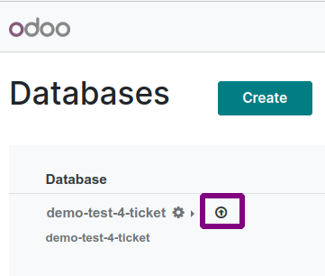
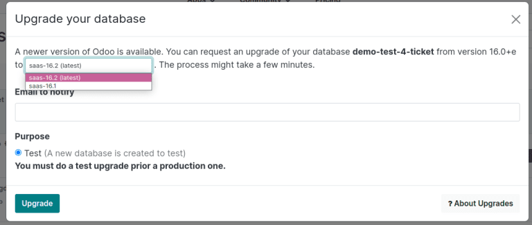
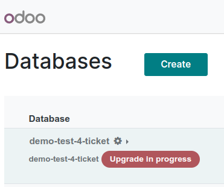
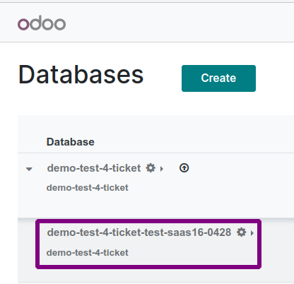

===========
Odoo Online
===========

Odoo databases can be manually upgraded directly from the main Odoo website. To upgrade an Odoo
database, navigate to the `database manager <https://www.odoo.com/my/databases>`_ page and sign in.

The database manager page displays all of the Odoo databases associated with the user's account. Any
databases that are not already on the most recent version of Odoo display an **arrow in a circle**
icon next to the database name, indicating that the database can be upgraded.

Test database
=============

Click on the **arrow in a circle** icon to start the upgrade process. On the :guilabel:`Upgrade your
database` pop-up, select the version of Odoo that the platform will be upgraded to. In the
:guilabel:`Email to notify` field, enter an email address that will receive email notifications
about the database upgrade.

There is also a :guilabel:`Purpose` section on the pop-up that is used to specify the reason for the
upgrade. However, at this stage of the process, the only selectable option is :guilabel:`Test`, as
Odoo requires users to create a test copy of the upgraded database before converting the actual
database.

After filling out the form, click the :guilabel:`Upgrade` button. The pop-up disappears and the
database being upgraded shows a red :guilabel:`Upgrade in progress` tag next to its name. An email
confirming that the upgrade is in progress is also sent to the email address specified on the
pop-up.

Once the upgrade is complete, a new test database appears on the `database manager
<https://www.odoo.com/my/databases>`_ page. To access the test database, click the drop-down arrow
(:guilabel:`⯆`) to the left of the main database's name. Doing so makes the test version appear
below it. Finally, click the green :guilabel:`Connect` button on the right side of the test
version's row to go to the database.

Except for being on the newer version of Odoo, the test database is an exact copy of the one being
upgraded. It is important to do extensive testing in this database to ensure that the upgrade has
not altered or corrupted any data, and that all workflows still proceed as expected.

Production database
===================

After confirming the integrity of the new version, return to the `database manager
<https://www.odoo.com/my/databases>`_ page. Once again, click on the **arrow in a circle** icon next
to the database being upgraded. The :guilabel:`Upgrade your database` pop-up appears as before,
except that there is now a :guilabel:`Production` option under the :guilabel:`Purpose` section.

Select the :guilabel:`Production` option and then click :guilabel:`Upgrade` to begin the upgrade
process. As before, a notification email is sent to the email address provided and a red
:guilabel:`Upgrade in progress` tag appears next to the name of the database.

After the upgrade is finished, the :guilabel:`Upgrade in progress` tag disappears and the database
is upgraded to the version specified.
