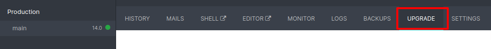
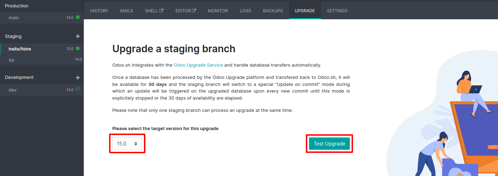
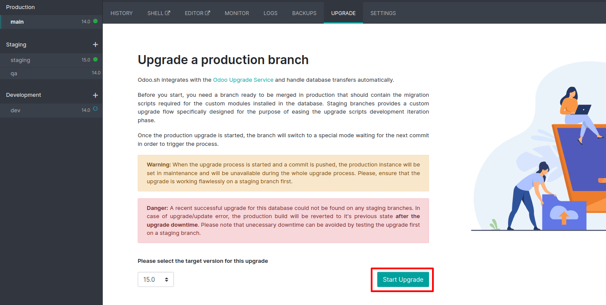
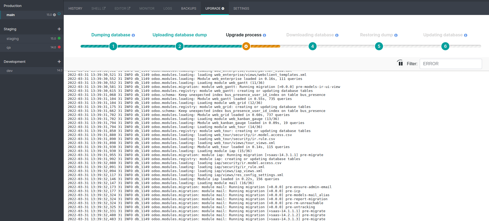

=======
Odoo.sh
=======

.. _upgrade/odoo_sh/overview:

Overview
========

Odoo.sh is integrated with the upgrade platform to make the upgrade process easier.

.. note::
   The :guilabel:`Upgrade` tab is available in the branches view. It is only available for valid
   projects with a valid production build.

The suggested upgrade steps on Odoo.sh are:

#. On a :guilabel:`Development` branch, upgrade your custom modules to keep them compatible with the
   new version and thoroughly **test them**.
#. Switch that branch to the :guilabel:`Staging` branch, **upgrade** the last daily production
   backup and **test it**. Write upgrade scripts if necessary.
#. Trigger the production upgrade from your :guilabel:`Production` branch and sit tight.

.. seealso::
   - :doc:`../../administration/upgrade`
   - :doc:`Upgrade FAQ <../upgrade/faq>`
   - :doc:`Introduction to Odoo.sh <../odoo_sh/overview/introduction>`

.. _upgrade/odoo_sh/custom-modules:

Upgrade your custom modules
===========================

The first step is to upgrade your custom modules to keep them compatible with the new version. Fork
your :guilabel:`Production` branch in the :guilabel:`Development` stage, then go to the settings of
your :guilabel:`Development` branch and select the Odoo version you target. If needed, modify your
code to be compatible with the new version. Make sure to **test** your features are still working
correctly.

.. note::
   Depending on your contract, the upgrade of your custom modules can be done by yourself, by your
   Partner or by Odoo (if you hold a subscription including maintenance of customizations).

.. _upgrade/odoo_sh/testing-phase:

Upgrade your database on a staging branch
=========================================

Take the upgraded development branch and drag & drop it to :guilabel:`Staging`.

Go to the :guilabel:`Upgrade` tab and select the :guilabel:`target version`. Then, click on
:guilabel:`Test Upgrade`.

The **latest production daily automatic backup** is sent to the
`upgrade platform <https://www.upgrade.odoo.com>`_ to start the upgrade test process.

.. note::
   You can follow the upgrade process by going to the :guilabel:`Upgrade` menu of your
   :guilabel:`Production` branch.

When the upgraded backup is ready on the `upgrade platform <https://www.upgrade.odoo.com>`_, it is
automatically downloaded back to your project.

The branch is now in a **special mode**: each time a **commit is pushed** on the branch, a
**restore operation** of the upgraded backup occurs, and an **update of all the custom modules**
happens. This allows you to quickly iterate on your custom modules upgrade scripts. The log file of
the upgrade process can be found at :file:`~/logs/upgrade.log` in your newly upgraded staging build.

.. note::
   - The **special upgrade mode** is automatically closed after 30 days.
   - It may happen that custom modules are no longer needed after an upgrade. Custom modules in the
     upgraded database are set to be updated. If the modules are missing in the code, the update
     fails, thus failing the whole process. An empty module with a manifest and possibly some custom
     upgrade script are necessary to clean up the database. The complete removal of the module has
     to be handled afterwards.

Functionally test your upgraded database
========================================

Now that the test upgraded database is available on your staging branch, **thoroughly test it** and
make sure everything runs as it's supposed to. Once you are satisfied with the result, you are ready
to upgrade your production database.

Production upgrade
==================

Once you are happy with your testing, you can start the process on the :guilabel:`Production`
branch.

On your :guilabel:`Production` branch, go to the :guilabel:`Upgrade` tab, select the
:guilabel:`targeted version` and click on the :guilabel:`start Upgrade` button.

The actual process is **triggered as soon as you push a new commit** in your branch. Make sure you
are pushing code that is compatible with the new version. For example by merging the code from your
upgraded staging branch.

.. note::
   You can see the progress of the upgrade by going to the :guilabel:`Upgrade` tab of the main
   branch.

.. important::
   Your database is unavailable throughout the process.

.. note::
   If anything goes wrong, the platform automatically reverts the upgrade, the same as it would be
   for a regular update. In case of success, a backup is always made.

The update of your custom modules must be successful to complete the entire upgrade process. Make
sure the status of your staging upgrade is :guilabel:`successful` before trying it in production.

.. note::
   It may happen that custom modules are no longer needed after an upgrade. Custom modules in the
   upgraded database are set to be updated. If the modules are missing in the code, the update
   fails, thus failing the whole process. An empty module with a manifest and possibly some custom
   upgrade script are necessary to clean up the database. The complete removal of the module has to
   be handled afterwards.
