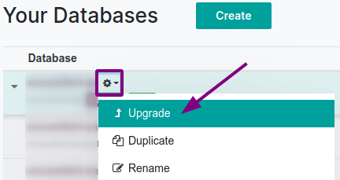

.. |assistance-contact| replace::
   If you need Odoo assistance on this matter, please get in touch with your Odoo Account Manager or
   our `Sales department`_.
.. _Sales department: mailto:sales@odoo.com

===============
Upgrade process
===============

.. _upgrade/overview:

Overview
========

An upgrade is switching to a newer version of Odoo (e.g., Odoo 14.0 to Odoo 15.0).

An upgrade does not cover:

* Changing :ref:`editions <upgrade-faq/editions-change>` (i.e., Community to Enterprise edition)
* Switching :ref:`hosting type <upgrade-faq/hosting-types-switch>` (i.e., On-Premise to Online or
  Odoo.sh)
* Migration from another ERP to Odoo

.. note:: |assistance-contact|

.. _upgrade/process-workflow:

Process workflow
----------------

The upgrade process in a nutshell:

#. You create a test upgrade request.
#. | Odoo processes the request:
   | This happens via an automated process that runs the database through an upgrade script and
     takes between 20 and 120 minutes. Only if an issue(s) arises will we have to intervene
     manually and adjust the script specifically to your database until the upgrade succeeds.
#. Odoo delivers a test database.
#. You test your database for possible discrepancies (see :ref:`upgrade/test-guidance`)
#. If there are any discrepancies, you report them to the Upgrade support team via the help portal
   (see :ref:`upgrade/test-assistance`).
#. We will fix the issues and send you a new test database.
#. Once you have completed the testing and are happy with the result, you decide on a date and time
   when you stop users from accessing Odoo, freeze all data entries, and create an upgrade request
   for the production upgrade.
#. Odoo delivers the production database through the automated process.
#. You restore it in your Production environment a few short hours later and continue working on the
   newly upgraded database (this is done automatically on SaaS).

.. _upgrade/get-started:

Get started
===========

The upgrade process varies depending on where your database is hosted.

.. _upgrade/online:

Online Hosting (SaaS)
---------------------

The upgrade request is made via your `database manager <https://www.odoo.com/my/databases>`_.

.. image:: process/online-access-databases.png
   :align: center
   :alt: Click on the profile button then on "My Databases"

.. _upgrade/odoo-sh:

Cloud Platform (Odoo.sh)
------------------------

:doc:`odoo_sh`

.. _upgrade/on-premise:

Self-Hosting (On-Premise)
-------------------------

There are two possibilities:

#. Via `Odoo Upgrade service <https://upgrade.odoo.com>`_
#. | For technically advanced users and partners, via the following command line on the machine
     where your database is hosted:
   | ``python <(curl -s https://upgrade.odoo.com/upgrade) test -d <your db name> -t <target
     version>``

The above command will dump your database to a file, send it to the upgrade platform for an upgrade,
display you the live logs, and restore the upgraded database back on your server as a duplicate test
database.

.. _upgrade/testing-phase:

Testing Phase (pre-production phase)
====================================

This phase allows you to review an upgraded version of your database without affecting your
production database in any way.

We suggest that you run the test upgrade process at least once, but you can do it as many times as
you need (one at a time).

Once you receive your upgraded test database, check that all data, processes, and functionality are
still correct and working as expected.

If you do find discrepancies, report your issues (see :ref:`upgrade/test-assistance`) and request
a new test database (see :ref:`upgrade/test-db-request`) when the reported issues are fixed in
the upgrade script.

If you do not find any discrepancies, you'll be able to move on to the upgrade of your
:ref:`production database <upgrade/production-live>`.

.. _upgrade/test-db-request:

Request a test database
-----------------------

When filling the `website form <https://upgrade.odoo.com>`_, select *Testing* purpose.

.. image:: process/test-purpose.png
   :align: center
   :alt: Selection of the "Testing" purpose in the upgrade form on Odoo

.. _upgrade/test-guidance:

Test guidance
-------------

Every business and organization has its own operational needs and has to test its specific Odoo
instance respectively. We recommend you look at `the test scenario
<https://docs.google.com/document/d/1ypNs7JKPOsjNbKpdiKFH7Al6g6whZ9jr7f7duAQ5E1w/>` for further
information.

.. todo:: change link "test scenario" once the related doc is published

.. _upgrade/test-assistance:

Assistance
----------

If you encounter an issue in the **test database**, please get in touch with Odoo Upgrade Support
via the `Odoo Support page <https://www.odoo.com/help>`_.

Under the *Ticket Description* section, select *An issue related to my upgrade* ticket type.

   .. image:: process/test-assistance.png
      :align: center
      :alt: Selection of "An issue related to my upgrade" as Ticket Type in the support form on Odoo

   .. warning::
      If you choose another *Ticket Description* type, the request will be redirected to another
      team. This will slow down the processing and response time.

Please provide as much detail as you can (i.e., videos and screenshots to illustrate your issue).
This will avoid clarifying questions and speed up the resolution process significantly.

   .. image:: process/test-assistance-details.png
      :align: center
      :alt: "Detailed Description" field in the support form on Odoo

.. note::
   * The purpose of the test phase is not to correct existing data or configurations in your
     database.
   * |assistance-contact|

.. _upgrade/steps-production:

The production launch
---------------------

.. _upgrade/production-live:

Production goes live
~~~~~~~~~~~~~~~~~~~~

The production upgrade request is when you decide to upgrade your current database with all your
production data (invoices, VAT returns, inventories, current orders) to a new version of your
choice.

After your :ref:`tests <upgrade/testing-phase>` are completed to your satisfaction, submit the
request to upgrade your production database via our `website form <https://upgrade.odoo.com>`_.
Select *Production* purpose.

.. image:: process/production-purpose.png
   :align: center
   :alt: Selection of the "Production" purpose in the upgrade form on Odoo

.. danger::
   Going into production without first testing may lead to:

   - business interruptions (e.g., no longer having the possibility to validate an action)
   - poor customer experiences (e.g., an eCommerce website that does not work correctly)

.. _upgrade/production-assistance:

Assistance
~~~~~~~~~~

If you encounter issues or problems in the **production database**, please get in touch with **Odoo
Support**:

#. Connect to our `Odoo Support page <https://www.odoo.com/help>`_.
#. Under the *Ticket Description* section, select the appropriate type related to your issue but
   **do not select** the option *An issue related to my upgrade*.

   .. note::
      After upgrading to production, the support will be provided by the Support team instead of the
      Upgrade team.

#. Please provide as much detail as you can (i.e., videos and screenshots to illustrate your issue).
   This will avoid clarifying questions and speed up the resolution process significantly.

   .. image:: process/production-assistance-details.png
      :align: center
      :alt: "Detailed Description" field in the support form on Odoo

   .. warning::
      If you choose *An issue related to my upgrade* as ticket type, the request will be redirected
      to another team than the support one and will slow down the processing and response time.

.. _upgrade/assistance:

Assistance
==========

.. _upgrade/contact:

Contact our Upgrade service support
-----------------------------------

Should you have any more questions about the upgrade, do not hesitate to send a message to `Odoo
Upgrade Team <mailto:upgrade@odoo.com>`_. We will be happy to answer it as soon as possible.

.. _upgrade/supported-versions:

Supported versions
------------------

Please note that Odoo provides support and bug fixing only for the three last major versions of
Odoo.

This is a factor to take into consideration before upgrading. If you are on an older version, we
suggest you to prefer the most recent version to benefit from longer support (before having to
upgrade again).

You can get more information about our :doc:`supported versions <../maintain/supported_versions>`.

.. seealso::
   - :doc:`faq`
   - :doc:`odoo_sh`
   - :doc:`service_level`
   - :doc:`../maintain/supported_versions`