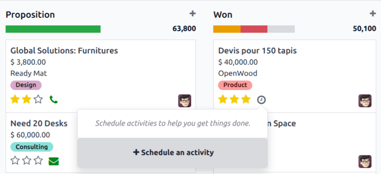
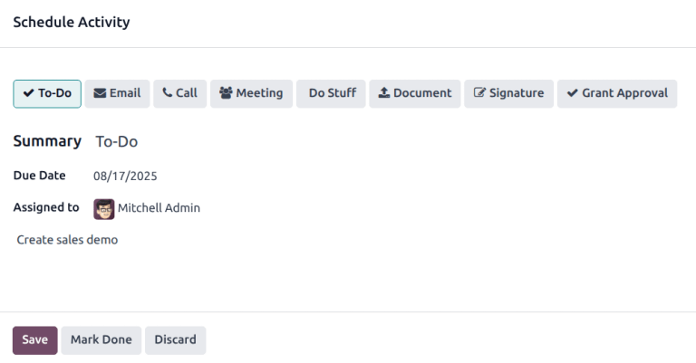
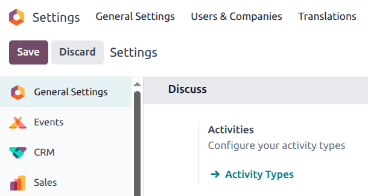

==========
Activities
==========

.. |clock| replace:: :icon:`fa-clock-o` :guilabel:`(clock)` icon

*Activities* are follow-up tasks tied to a record in an Odoo database.

.. _activities/important:

The icon used to display activities varies, depending on the :ref:`activity type
<activities/types>`:

- :icon:`fa-clock-o` :guilabel:`(clock)` icon: the default activities icon.
- :icon:`fa-phone` :guilabel:`(phone)` icon: a phone call is scheduled.
- :icon:`fa-envelope` :guilabel:`(envelope)` icon: an email is scheduled.
- :icon:`fa-check` :guilabel:`(check)` icon: a "to-do" is scheduled.
- :icon:`fa-users` :guilabel:`(people)` icon: a meeting is scheduled.
- :icon:`fa-upload` :guilabel:`(upload)` icon: a document is scheduled to be uploaded.
- :icon:`fa-pencil-square-o` :guilabel:`(request signature)` icon: a signature request is scheduled.

Schedule activities
===================

Activities can be scheduled on any page of the database that contains a :ref:`chatter
<activities/chatter>` thread, :ref:`Kanban view <activities/kanban>`, :ref:`list view
<activities/list>`, or :ref:`activities view <activities/activity>` of an application.

.. _activities/chatter:

Chatter
-------

Activities can be created from the chatter on any record.

To schedule a new activity, click the :guilabel:`Activities` button, located at the top of the
chatter. In the :guilabel:`Schedule Activity` pop-up window that appears, :ref:`fill out the
Schedule Activity form <activities/form>`.

.. _activities/kanban:

Kanban view
-----------

Activities can also be created from the :icon:`oi-view-kanban` :guilabel:`(Kanban)` view.

To do so, click on the |clock| located at the bottom of an individual record.

Click :guilabel:`+ Schedule An Activity`, then proceed to :ref:`fill out the Schedule Activity form
<activities/form>`.

.. note::
   If a record already has a scheduled activity, the |clock| is replaced by the icon that represents
   the existing scheduled activity. Click on the activity type's icon to schedule another activity.

.. _activities/list:

List view
---------

Activities can also be created from a :icon:`oi-view-list` :guilabel:`(list)` view.

If the :guilabel:`Activities` column is hidden, reveal it using the :icon:`oi-settings-adjust`
:guilabel:`(settings adjust)` icon in the far-right of the top row.

Then, click on the |clock| for the record the activity is being added to, and click :guilabel:`+
Schedule an activity`. Proceed to :ref:`fill out the Schedule Activity form <activities/form>` that
appears.

.. note::
   If a record already has a scheduled activity, the |clock| is replaced by the icon that represents
   the existing scheduled activity. Click on the activity type's icon to schedule another activity.

.. _activities/activity:

Activity view
-------------

Most applications in Odoo have an *Activity* view available. If available, a |clock| is visible in
the top-right corner of the main menu bar, amongst the other view option icons.

To open the activity view, click the |clock|.

In this view, all the available activities are listed in the columns, while the horizontal entries
represent all the individual records.

Activities that appear green have a due date in the future, activities that appear orange are due
today, while activities appearing red are overdue.

Color bars in each column represent records for specific activity types, and display a number
indicating how many activities are scheduled for that type.

If multiple activity types are scheduled for a record, a number appears in the box, indicating the
total number of scheduled activities.

.. note::
   Activity colors, and their relation to an activity's due date, are consistent throughout Odoo,
   regardless of the activity type, or the view.

To schedule an activity for a record, hover over the corresponding field. Click the :icon:`fa-plus`
:guilabel:`(plus)` icon that appears, and then :ref:`fill out the Schedule Activity form
<activities/form>`.

.. _activities/form:

Schedule Activity form
----------------------

Activities can be scheduled from many different places, such as from the :ref:`chatter
<activities/chatter>` of a record, or from one of multiple views in an application, when available:
the :ref:`Kanban view <activities/kanban>`, :ref:`list view <activities/list>`, or :ref:`activity
view <activities/activity>`.

Enter the following information on the form:

- :guilabel:`Activity Type`: select the type of activity from the drop-down menu. The default
  options are: :guilabel:`Email`, :guilabel:`Call`, :guilabel:`Meeting`, or :guilabel:`To-Do`.
  Depending on what other applications are installed, additional options may be available.
- :guilabel:`Summary`: enter a short title for the activity, such as `Discuss Proposal`.
- :guilabel:`Due Date`: using the calendar popover, select the activity's deadline.
- :guilabel:`Assigned to`: by default, the current user populates this field. To assign a different
  user to the activity, select them from the drop-down menu.
- :guilabel:`Notes`: add any additional information for the activity in this field.

When the :guilabel:`Schedule Activity` pop-up window is completed, click one of the following
buttons:

- :guilabel:`Open Calendar`: opens the user's calendar to add and schedule the activity.

  Click on the desired date and time for the activity, and a :guilabel:`New Event` pop-up window
  appears. The summary from the *Schedule Activity* pop-up window populates the :guilabel:`Title`
  field.

  Enter the information in the :guilabel:`New Event` pop-up window, then click :guilabel:`Save &
  Close` to schedule it. Once scheduled, the activity is added to the chatter under the
  :guilabel:`Planned Activities` section.

  .. important::
    The :guilabel:`Open Calendar` button **only** appears if the :guilabel:`Activity Type` is set
    to either :guilabel:`Call` or :guilabel:`Meeting`.

- :guilabel:`Schedule`: schedules the activity, and adds the activity to the chatter under
  :guilabel:`Planned Activities`.
- :guilabel:`Schedule & Mark as Done`: adds the details of the activity to the chatter under
  :guilabel:`Today`. The activity is not scheduled, and is automatically marked as done.
- :guilabel:`Done & Schedule Next`: adds the details of the activity to the chatter under
  :guilabel:`Today`. The activity is not scheduled, is automatically marked as done, and a new
  :guilabel:`Schedule Activity` pop-up window appears.
- :guilabel:`Cancel`: discards any changes made on the :guilabel:`Schedule Activity` pop-up window.

.. _activities/all:

All scheduled activities
========================

To view a consolidated list of activities, organized by application, click the |clock| in the header
menu, located in the top-right corner.

If any activities are scheduled, the number of activities appear in a red bubble on the
|clock|.

All activities for each application are further divided into subsections, indicating where in the
application the activity is to be completed. Each sub-section lists the number of scheduled
activities that are :guilabel:`Late`, due :guilabel:`Today`, and scheduled in the
:guilabel:`Future`.

.. example::
   In the *Time Off* application, one activity is scheduled to be done in the *All Time Off*
   requests dashboard, and six activities are scheduled to be done in the *Allocations* dashboard.

   These requests appear in two separate lists in the all activities drop-down menu: one labeled
   `Time Off` and one labeled `Time Off Allocation`.

   .. image:: activities/activities-menu.png
      :align: center
      :alt: The list of activities that is accessed from the main menu bar. Two entries for the Time
            Off application are highlighted.

Request a document
------------------

The option to :guilabel:`Request a Document` is available at the bottom of the list of :ref:`all
scheduled activities <activities/all>`, the option to :guilabel:`Request a Document` appears. Click
:guilabel:`Request a Document`, and a :guilabel:`Request a file` pop-up window appears.

Enter the following information on the form:

- :guilabel:`Document Name`: enter a name for the document being requested.
- :guilabel:`Request To`: select the user the document is being requested from using the drop-down
  menu.
- :guilabel:`Due Date In`: enter a numerical value indicating when the document is due. Next to
  this field, a :guilabel:`Days` field is visible. Click :guilabel:`Days`, the default option, to
  reveal a drop-down menu. Select the desired time-frame option from the list. The options are
  :guilabel:`Days`, :guilabel:`Weeks`, or :guilabel:`Months`.
- :guilabel:`Workspace`: using the drop-down menu, select the specific :ref:`Workspace
  <documents/workspaces>` the document is being uploaded to.
- :guilabel:`Tags`: select any desired tags from the drop-down menu. The available tags displayed
  are based on the tags configured for the selected :guilabel:`Workspace`.
- :guilabel:`Message`: enter a message to clarify the document request in this field.

When all the fields are completed, click :guilabel:`Request` to send the document request.

.. image:: activities/request-doc.png
   :align: center
   :alt: The Request a file form, with all fields filled out to request a contract.

.. _activities/types:

Activity types
==============

To view the currently configured types of activities in the database, navigate to
:menuselection:`Settings app --> Discuss section --> Activities setting --> Activity Types`.

Doing so reveals the :guilabel:`Activity Types` page, where the existing activity types are found.

.. tip::
   Individual applications have a list of *Activity Types* dedicated to that application. For
   example, to view and edit the activities available for the *CRM* application, go to
   :menuselection:`CRM app --> Configuration --> Activity Types`.

.. image:: activities/activity-list.png
   :align: center
   :alt: The list of activity types already configured and available.

Edit activity types
-------------------

To edit an existing :ref:`activity type <activities/types>`, click on the activity type, and the
activity type form loads.

Make any desired changes to the activity type form. The form automatically saves, but it can be
saved manually at any time by clicking the :guilabel:`Save Manually` option, represented by a
:icon:`fa-cloud-upload` :guilabel:`(cloud upload)` icon, located in the top-left corner of the page.

Create new activity types
-------------------------

To create a new :ref:`activity type <activities/types>`, click :guilabel:`New` from the
:guilabel:`Activity Types` page, and a blank activity type form loads.

Enter a :guilabel:`Name` for the activity type at the top of the form, then enter the following
information on the form.

Activity Settings section
~~~~~~~~~~~~~~~~~~~~~~~~~

- :guilabel:`Action`: using the drop-down menu, select an action associated with this new activity
  type. Some actions trigger specific behaviors after an activity is scheduled, such as:

  - :guilabel:`Upload Document`: if selected, a link to upload a document is automatically added to
    the planned activity in the chatter.
  - :guilabel:`Call` or :guilabel:`Meeting`: if selected, users have the option to open their
    calendar to select a date and time for the activity.
  - :guilabel:`Request Signature`: if selected, a link to open a signature request pop-up window is
    automatically added to the planned activity in the chatter. This requires the Odoo *Sign*
    application to be installed.

  .. note::
     Available activity types vary based on the installed applications in the database.

- :guilabel:`Folder`: select a specific :ref:`workspace <documents/workspaces>` folder to save a
  document to. This field **only** appears if :guilabel:`Upload Document` is selected for the
  :guilabel:`Action`.

  Using the drop-down menu, select the :guilabel:`Folder` the document is saved to.

- :guilabel:`Default User`: select a user from the drop-down menu to automatically assign this
  activity to the selected user when this activity type is scheduled. If this field is left blank,
  the activity is assigned to the user who creates the activity.
- :guilabel:`Default Summary`: enter a note to include whenever this activity type is created.

  .. note::
     The information in the :guilabel:`Default User` and :guilabel:`Default Summary` fields are
     included when an activity is created. However, they can be altered before the activity is
     scheduled or saved.

- :guilabel:`Keep Done`: tick this checkbox to keep activities that have been marked as `Done`
  visible in the :ref:`activity view <activities/activity>`.
- :guilabel:`Default Note`: enter any notes to appear with the activity.

Next Activity section
~~~~~~~~~~~~~~~~~~~~~

It is possible to have another activity either suggested or triggered. To do so, configure the
:guilabel:`Next Activity` section.

- :guilabel:`Chaining Type`: select either :guilabel:`Suggest Next Activity` or :guilabel:`Trigger
  Next Activity` from the drop-down menu. Depending on the selected option, either the
  :guilabel:`Suggest` or :guilabel:`Trigger` field is displayed.

  .. note::
     The :guilabel:`Chaining Type` field does **not** appear if :guilabel:`Upload Document` is
     selected for the :guilabel:`Action`.

- :guilabel:`Suggest/Trigger`: depending on what is selected for the :guilabel:`Chaining Type`, this
  field either displays :guilabel:`Suggest` or :guilabel:`Trigger`. Using the drop-down menu, select
  the activity to recommend or schedule as a follow-up task to the activity type.
- :guilabel:`Schedule`: configure when the next activity is suggested or triggered.

  First, enter a numerical value indicating when the activity is suggested or triggered.

  Next to this field, a :guilabel:`Days` field is visible. Click :guilabel:`Days`, the default
  option, to reveal a drop-down menu. Select the desired time-frame option from the list. The
  options are :guilabel:`Days`, :guilabel:`Weeks`, or :guilabel:`Months`.

  Lastly, using the drop-down menu, select whether the activity is scheduled or triggered either
  :guilabel:`after previous activity deadline` or :guilabel:`after completion date`.

.. image:: activities/new-activity.png
   :align: center
   :alt: A new Activity form with all the fields filled out.

.. seealso::
   - :doc:`../productivity/discuss`
   - :doc:`../productivity/discuss/team_communication`
   - :doc:`../sales/crm/optimize/utilize_activities`
