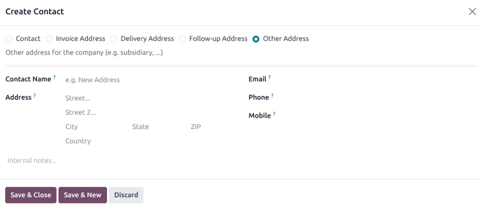
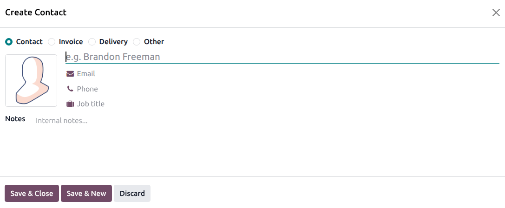

:show-content:

========
Contacts
========

Contacts are created in the **Contacts** application for customers the company does business with
through Odoo. A contact record is a repository of vital business information, facilitating
communication and business transactions.

Contact form
============

To create a new contact, navigate to the :menuselection:`Contacts app`, and click :guilabel:`New`. A
new form appears where various contact information can be added.

Contact type
------------

Odoo supports both :guilabel:`Person` and :guilabel:`Company` contacts. Select the appropriate type
for the new contact. Fill in the name of the :guilabel:`Person` or :guilabel:`Company`. This is how
the name appears throughout the database. This field is **mandatory**.

.. tip::
   :guilabel:`Person` contacts can be linked to a :guilabel:`Company` contact. After selecting
   :guilabel:`Person`, the :guilabel:`Company` field becomes visible.

In the :icon:`fa-envelope` :guilabel:`(envelope)` field, enter the email address with the domain. In
the :icon:`fa-phone` :guilabel:`(phone)`  field enter the phone number with the appropriate country
code. Next, enter the :guilabel:`Address` of the :guilabel:`Company` or :guilabel:`Person`.

Additional fields
-----------------

Additional details are included on the initial form. The following fields are available:

- :guilabel:`Job Position`: list the job position of the :guilabel:`Person` (only available on
  :guilabel:`Person`).
- :guilabel:`Tax ID`: the identification number used for tax and accounting purposes.
- :guilabel:`Partner Level`: select the designated :ref:`partner <contacts/partner-assignment>`
  level for this contact from the drop-down menu.
- :guilabel:`Website`: enter the full website address, starting with `http` or `https`.
- :guilabel:`Language`: enter the language used by the contact. All of the emails and documents sent
  to this contact are then translated to the selected language.
- :guilabel:`Tags`: enter preconfigured tags by typing them in the field, or clicking the drop-down
  menu, and selecting one. To create a new one, type the new tag in the field, and click
  :guilabel:`Create` from the resulting drop-down menu.

Contacts tab
------------

On the :guilabel:`Contacts` tab, contacts can be added that are associated with a
:guilabel:`Company` and related addresses. For example, a specific contact person for the company
can be listed here.

Multiple addresses can be added on both :guilabel:`Person` and :guilabel:`Company` contacts. To do
so, click :guilabel:`Add Contact` in the :guilabel:`Contacts` tab. Doing so reveals a
:guilabel:`Create Contact` pop-up form, in which additional addresses can be configured.

On the :guilabel:`Create Contact` pop-up form,  select one of the following options:

- :guilabel:`Contact`: adds another contact to the existing contact form.
- :guilabel:`Invoice`: adds a specific invoice address to the existing contact form.
- :guilabel:`Delivery`: adds a specific delivery address to the existing contact form.
- :guilabel:`Other`: adds an alternate address to the existing contact form.

Once an option is selected, enter the corresponding contact information that should be used for the
specified address type.

Add the :guilabel:`Contact Name`, :guilabel:`Address`, :guilabel:`Email`, along with the
:guilabel:`Phone` and/or :guilabel:`Mobile` numbers below.

Set the :guilabel:`Job Position`, which appears if the :guilabel:`Contact` address type has been
selected. This is similar to the :guilabel:`Person` contact.

To add a note, click on the text field next to :guilabel:`Notes`, and write anything that is
applicable to the customer or contact.

Then, click :guilabel:`Save & Close` to save the address, and close the :guilabel:`Create Contact`
window. Or, click :guilabel:`Save & New` to save the address, and immediately input another one.

Sales & Purchase tab
--------------------

Next, is the :guilabel:`Sales & Purchases` tab, which only appears when the *Sales*, *Purchase*,
**or** *Point of Sale* applications are installed.

The :guilabel:`Fiscal Position` can be set on the :guilabel:`Sales & Purchases` tab. Select a
:guilabel:`Fiscal Position` from the drop-down menu.

.. _essentials/contacts/sales-section:

Sales section
~~~~~~~~~~~~~

Under the :guilabel:`Sales` heading, a specific :guilabel:`Salesperson` can be assigned to a
contact. To do that, click the :guilabel:`Salesperson` drop-down field, and select one. Create a new
:guilabel:`Salesperson` by typing the user's name, and making the appropriate selection.

Certain :guilabel:`Payment Terms`, or a certain :guilabel:`Pricelist`, can also be set, if needed.
Click the drop-down menu next to :guilabel:`Payment Terms`, and change it to one of the preselected
:guilabel:`Payment Terms`, or :guilabel:`Create` a new one. Select the :guilabel:`Pricelist`
drop-down menu to choose the appropriate :guilabel:`Pricelist`.

Click into the :guilabel:`Delivery Method` field to select an option from the drop-down menu.

Point Of Sale section
~~~~~~~~~~~~~~~~~~~~~

Under the :guilabel:`Point Of Sale` heading, enter a :guilabel:`Barcode` that can be used to
identify the contact.

Purchase section
~~~~~~~~~~~~~~~~

Under the :guilabel:`Purchase` heading, select how :abbr:`RFQs (requests for quotation)` for this
contact should be grouped together:

- :guilabel:`On Order`: replenishment needs are grouped together except for :abbr:`MTO (made to
  order)`
- :guilabel:`Daily`: replenishment needs are grouped if the expected arrival is the same day.
- :guilabel:`Weekly`: replenishment needs are grouped if the expected arrival is the same week or
  week day.
- :guilabel:`Always`: replenishment needs are always grouped.

Select a default :guilabel:`Buyer` if the :abbr:`RFQs (requests for quotation)` should always be
assigned to the same user.

Specify :guilabel:`Payment Terms`, :guilabel:`1099 Box` information, and a preferred
:guilabel:`Payment Method` here. A :guilabel:`Receipt Reminder` can be set here, as well. Select a
:guilabel:`Supplier Currency` to be used for purchases from the contact.

Fiscal information
~~~~~~~~~~~~~~~~~~

To assign a :guilabel:`Fiscal Position` to this contact, select it from the drop-down menu.

Misc section
~~~~~~~~~~~~

Under the :guilabel:`Misc.` heading, enter a :guilabel:`Citizen Identification` number for *Person*
contacts, or :guilabel:`Company ID` for *Company* contacts. Use :guilabel:`Reference` field to add
any additional information for this contact.

If this contact should only be accessible for one company in a multi-company database, select it
from the :guilabel:`Company` field drop-down list. Use the :guilabel:`Website` drop-down menu to
restrict the publishing of this contact to one website (if working on a database with multiple
websites).

Select one or more :guilabel:`Website Tags` to assist in filtering published customers on the
`/customers` website page. Select an :guilabel:`Industry` for this contact from the drop-down menu.
Use the :guilabel:`SLA Policies` field to assign a *Helpdesk* SLA policy to this contact.

Inventory section
~~~~~~~~~~~~~~~~~

Under the :guilabel:`Inventory` heading, use the :guilabel:`Customer Location` drop-down to select
the stock location to be used as a destination when sending goods to this contact. Next, use the
:guilabel:`Vendor Location` drop-down to selection the stock location used as a source when
recieving goods from this contact. Finally, use the :guilabel:`Subcontractor Location` drop-down to
idenfy a location used as both a source and destination when sending goods to this contact during a
subcontracting process.

Accounting tab
--------------

The :guilabel:`Accounting` tab appears when the *Accounting* application is installed. Here, a user
can add any related :guilabel:`Bank Accounts`, or set default :guilabel:`Accounting entries`.

Under the :ref:`Invoice Follow-Ups <accounting/follow_up/follow-ups-for-one-customer>` heading, the
:guilabel:`Follow-up Status` indicates if the contact currently has any overdue payments. To
configure :guilabel:`Reminders` for this contact, use the radio buttons to select either
:guilabel:`Automatic` or :guilabel:`Manual` reminders, as well as schedule the :guilabel:`Next
Reminder`.

.. _contacts/partner-assignment:

Partner Assignment tab
----------------------

Next is the :guilabel:`Partner Assignment` tab, which by default, includes a :guilabel:`Geolocation`
section, and other partner options, including :guilabel:`Partner Activation` and :guilabel:`Partner
Review` configurations. These are **only** present when the *Resellers* module is installed.

.. seealso::
   Follow the :doc:`Resellers documentation <../sales/crm/track_leads/resellers>` for more
   information on publishing partners on the website.

Internal Notes tab
------------------

Following the :guilabel:`Accounting` tab is the :guilabel:`Internal Notes` tab, where notes can be
left on this contact form, just like on the contact form noted above.

UBO tab
-------

The UBO (Ultimate Beneficial Owner) tab contains a snapshot of the *Holdings* information from the
:guilabel:`Equity` app, as well as information for the individual contact, including their
:guilabel:`Birth Date` and :guilabel:`Birth Place`.

The :guilabel:`UBO` tab is **only** present when the *Equity* app is installed.

To request the information required for the :abbr:`UBO (Ultimate Beneficial Owner)` tab, click the
:icon:`fa-cog` :guilabel:`Action` icon, then select :guilabel:`Request UBO Form` to send an email to
the contact.

Smart buttons
=============

At the top of the contact form, there are some additional options available, known as *smart
buttons*.

Here, Odoo displays a variety of records, related to this contact, that were created on other apps.
Odoo integrates information from every single app, so there are many smart buttons.

.. example::
   For example, there is an :guilabel:`Opportunities` smart button, where all the opportunities
   related to this customer from the *CRM* app are accessible.

.. tip::
   If the corresponding applications are installed, their related smart buttons appear automatically
   on a contact form.

A user can see any :guilabel:`Meetings`, :guilabel:`Sales`, :guilabel:`POS Orders`,
:guilabel:`Subscriptions`, project :guilabel:`Tasks`, and the :guilabel:`More` smart button reveals
additional options, via a drop-down menu. A user can even quickly access :guilabel:`Purchases`,
:guilabel:`Helpdesk` tasks, :guilabel:`On-time Rate` for deliveries, :guilabel:`Invoiced`
information, :guilabel:`Vendor Bills`, and the :guilabel:`Partner Ledger` connected to this contact.

Deliveries, documents, loyalty cards, and direct debits are *also* linked to smart buttons, like
this, should there be any outstanding/on-file for this contact.

If the contact is a partner, the user can visit their partner page on the Odoo-built website by
clicking the :guilabel:`Go to Website` smart button.

Archive contacts
----------------

If a user decides they no longer want to have this contact active, the record can be archived. To do
that, go to the :icon:`fa-cog` :guilabel:`Action` menu at the top of the contact form, and click
:guilabel:`Archive`.

Then, click :guilabel:`Archive` from the resulting :guilabel:`Confirmation` pop-up window.

With this contact successfully archived, as indicated by a banner at the top, they do not show up in
the main contacts page, but they can still be searched for with the :guilabel:`Archived` filter.

.. tip::
   A contact can be *unarchived*, if the user decides to work with them again. To do that, just
   click the :icon:`fa-cog` :guilabel:`Action` menu again at the top of the archived contact form,
   and click :guilabel:`Unarchive`. Upon doing so, the :guilabel:`Archived` banner is removed, and
   the contact is restored.

.. seealso::
   - :doc:`Add different addresses in CRM <../sales/sales/sales_quotations/different_addresses>`
   - `Odoo's eLearning Contacts tutorial
     <https://www.odoo.com/slides/slide/contacts-2527?fullscreen=1>`_

.. toctree::
   :titlesonly:

   contacts/merge
