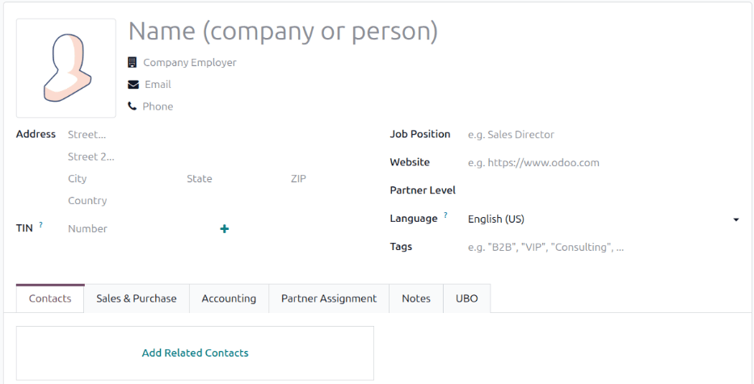
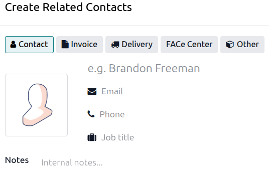

:show-content:

========
Contacts
========

Contacts are created in the **Contacts** application for all entities that are part of a company's
business, whether as a customer, a vendor, or in some other capacity. A contact record is a
repository of vital information for both individuals and companies, facilitating communication and
business transactions.

.. _contacts/contact-form:

Contact form and basic fields
=============================

To create a new contact, navigate to the :menuselection:`Contacts app`, and click the
:guilabel:`New` button. A new form appears where various contact information can be added.

Enter the name of the contact in the :guilabel:`Name (company or person)` field. This field is
**mandatory**.

.. tip::
   Contacts for individuals can be linked to contacts for companies by selecting the associated
   company contact in the :icon:`fa-building` :guilabel:`Company Employer` field.

In the :icon:`fa-envelope` :guilabel:`Email` field, enter the email address with the domain. In the
:icon:`fa-phone` :guilabel:`Phone` field, enter the contact's phone number. Enter the
:guilabel:`Address` of the contact. Finally, enter the :guilabel:`Tax Identification Number (TIN)`
the contact uses for tax and accounting purposes. If the contact is not subject to taxation, a `/`
may be entered in this field. If it's necessary to add the DUNS number to the contact, this can be
added by clicking the :icon:`fa-plus` (:guilabel:`plus`) button.

Additional fields
-----------------

The following fields are also available on the contact form to help create a more complete entry for
this individual or company in the database:

- :guilabel:`Job Position`: This field captures the position or title of the contact, if relevant.
- :guilabel:`Website`: This field captures a relevant website address for the contact, starting with
  `http` or `https`.
- :guilabel:`Partner Level`: This field is a drop-down menu where the designated :ref:`partner
  <contacts/partner-assignment>` level for this contact can be selected.
- :guilabel:`Language`: This field captures the language used by the contact. All of the emails and
  documents generated by the database that are sent to this contact are translated into the selected
  language.
- :guilabel:`Tags`: This field allows preconfigured and custom tags to be entered to make it easier
  to search for and identify the contact within the database. Type the tags into the field or click
  the drop-down menu and select one. To create a new one, type the new tag in the field, and click
  :guilabel:`Create` or :guilabel:`Create and edit` from the resulting drop-down menu.

Contacts tab
------------

On the :guilabel:`Contacts` tab, additional contacts can be added that are associated with the
current contact form and any related addresses. For example, if the current Contact form is meant to
cover a vendor company, contacts added through the :guilabel:`Contacts` tab can be easily identified
as employees of that company.

This can also be used to associate multiple addresses with the current contact form. To do so, click
:guilabel:`Add Related Contacts` in the :guilabel:`Contacts` tab. Doing so brings up the *Create
Related Contacts* form, in which additional addresses can be configured as regular contacts,
addressess for invoices and deliveries, and other needs.

On the *Create Related Contacts* pop-up form, select one of the following options:

- :guilabel:`Contact`: This option adds another contact to the existing contact form.
- :guilabel:`Invoice`: This option adds a specific invoice address to the existing contact form.
- :guilabel:`Delivery`: This option adds a specific delivery address to the existing contact form.
- :guilabel:`FACe Center`: This option adds a specific delivery address for a FACe Center to the
  existing contact form.
- :guilabel:`Other`: This option adds an alternate address to the existing contact form.

Once an option is selected, enter the corresponding contact information that should be used for the
specified address type. Odoo references invoice and delivery addresses during relevant parts of the
sales process.

Sales & Purchase tab
--------------------

The :guilabel:`Sales & Purchase` tab only appears when the **Sales**, **Purchase**, or **Point of
Sale** applications are installed. Each of these apps adds another section to this tab when
installed.

.. _essentials/contacts/sales-section:

Sales section
~~~~~~~~~~~~~

Under the :guilabel:`Sales` heading, a specific :guilabel:`Salesperson` can be assigned to a work
with the contact. To do that, click the :guilabel:`Salesperson` drop-down field, and select one.
Create a new :guilabel:`Salesperson` by typing the user's name and inviting them.

A :guilabel:`Pricelist` or :guilabel:`Payment Terms` can also be set, if needed. Select the
:guilabel:`Pricelist` drop-down menu to choose the appropriate :guilabel:`Pricelist`. Click the
drop-down menu next to :guilabel:`Payment Terms` and change it to one of the preselected
:guilabel:`Payment Terms` or :guilabel:`Search more` to find others or create a new one.

Click into the :guilabel:`Payment Method` field to select an option from the drop-down menu.

Click into the :guilabel:`Delivery Method` field to select an option from the drop-down menu.

Other options may appear in this section as well, depending on what apps are installed in the
database and what configurations have been enabled.

Point of Sale section
~~~~~~~~~~~~~~~~~~~~~

Under the :guilabel:`Point Of Sale` heading, enter a :guilabel:`Barcode` that can be used to
identify this contact.

Purchase section
~~~~~~~~~~~~~~~~

Under the :guilabel:`Purchase` heading, select how :abbr:`Group RFQs` (requests for quotations) for
this contact should be grouped together:

- :guilabel:`On Order`: This option groups replenishment needs together except for Made to Order
  (MTO) replenishments.
- :guilabel:`Daily`: This option groups replenishment needs together if their expected arrival is on
  the same day.
- :guilabel:`Weekly`: This option groups replenishment needs together if the expected arrival is the
  same week or week day.
- :guilabel:`Always`: This option always groups replenishment needs together.

Select a default :guilabel:`Buyer` if the RFQs should always be assigned to the same user.

Specify :guilabel:`Payment Terms`, a preferred :guilabel:`Payment Method`, and :guilabel:`1099 Box`
information here. A :guilabel:`Receipt Reminder` can be set here, as well. Select a
:guilabel:`Supplier Currency` to be used for purchases from the contact.

Fiscal information
~~~~~~~~~~~~~~~~~~

To assign a :guilabel:`Fiscal Position` to this contact, select it from the drop-down menu.

Miscellaneous section
~~~~~~~~~~~~~~~~~~~~~

Under the :guilabel:`Misc` heading, enter a :guilabel:`Company ID` if applicable. Use the
:guilabel:`Reference` field to add any additional information or notes for this contact.

If this contact should only be accessible for one company in a multi-company database, select it
from the :guilabel:`Company` field drop-down list. Use the :guilabel:`Website` drop-down menu to
restrict the publishing of this contact to one website if working on a database with multiple
websites.

Select one or more :guilabel:`Website Tags` to assist in filtering published customers on the
`/customers` website page. Select an :guilabel:`Industry` for this contact from the drop-down menu.
Use the :guilabel:`SLA Policies` field to assign a *Helpdesk* SLA policy to this contact.

.. _contacts/accounting-tab:

Accounting tab
--------------

The :guilabel:`Accounting` tab appears when the *Accounting* application is installed. Here, a user
can add any related :guilabel:`Bank accounts` or set default accounting journals. Trusted business
partners may have :guilabel:`Auto-post bills` enabled, allowing for bills to post automatically,
never, or after 3 validations without edits.

Under the :guilabel:`Customer Invoices` heading, the :guilabel:`Peppol ID` field is used for
relevant tax identification information.

.. _contacts/partner-assignment:

Partner Assignment tab
----------------------

Next is the :guilabel:`Partner Assignment` tab, which by default includes a :guilabel:`Geolocation`
section and other partner options, including :guilabel:`Partner Activation` and :guilabel:`Partner
Review` configurations. These are **only** present when the :doc:`Resellers
<../sales/crm/track_leads/resellers>` module is installed.

Notes tab
---------

The :guilabel:`Notes` tab is a field where notes for other users can be left on the contact form.
There are no settings that can be configured within this tab.

UBO tab
-------

The UBO (Ultimate Beneficial Owner) tab contains a snapshot of the :guilabel:`Holdings` information
from the **Equity** app, as well as information for the individual contact. The fields visible here
may change depending on the other apps installed in the Odoo database, as well. The :guilabel:`UBO`
tab is **only** present when the **Equity** app is installed.

To request the information required for the :abbr:`UBO (Ultimate Beneficial Owner)` tab, click the
:icon:`fa-cog` :guilabel:`Action` icon, then select :guilabel:`Request UBO Form` to send an email to
the contact.

Smart buttons
=============

At the top of the contact form, some additional *smart buttons* may be available.

Here, Odoo displays a variety of records related to this contact that were created within other
apps. Odoo integrates information from every single one of its apps, so there may be multiple smart
buttons that appear automatically in this section. For example, when the **Sales** app is
installled, there is a :guilabel:`Sales` smart button, where all the sales orders and quotations
related to this customer from the **Sales** app are accessible.

Deliveries, documents, loyalty cards, and direct debits are *also* linked to smart buttons, should
there be any outstanding/on-file for this contact.

If the contact is a partner, the user can visit their partner page on the Odoo-built website by
clicking the :guilabel:`Go to Website` smart button.

Views
=====

The **Contacts** app's dashboard offers five different views to help manage contacts at a glance.
These views are:

- :icon:`oi-view-list` :guilabel:`List`: Displays contacts in a detailed list, allowing for easy
  viewing of detailed individual records, including graphical representations of the smart buttons
  that appear on each contact's form. This is the default view upon opening the app.
- :icon:`oi-view-kanban` :guilabel:`Kanban`: Displays contacts as tiles resembling business cards.
  This view presents the same information as the list view, but in a more visual format. It also
  shows any tags associated with a contact, which are not visible in :guilabel:`List` view.
- :icon:`fa-map-marker` :guilabel:`Map`: Displays a map with pins for contacts with address
  information on their form. All contacts, including those without address information, are
  displayed in a sidebar. Pins on the map may be moused over to highlight the corresponding contact
  in the sidebar. The forms of contacts may be opened by clicking them in the sidebar. Addresses
  associated with more than one contact have a number on them to denote how many contacts have that
  location on their forms.
- :icon:`fa-share-alt fa-rotate-90` :guilabel:`Hierarchy`: Displays contacts as tiles resembling
  business cards, similar to the Kanban view. This view adds a :guilabel:`# Contacts` button to
  contacts that have other records associated with them. When clicked, this button rearranges the
  page to showcase the contact information for those associated records, making it easy to view at a
  glance which contacts are employees or otherwise affiliated with each other.
- :icon:`fa-clock-o` :guilabel:`Activities`: Displays a grid of all contacts with associated
  upcoming activities. Activities can also be scheduled and managed from within this view and are
  tracked on the contact's chatter. Please note, this view does not directly interface with apps
  such as the **CRM** app, because those apps may be referencing **Contact** app data, but tracking
  something separate, such as *Opportunities*.

Archive contacts
================

If a user decides they no longer want to have this contact active, the record can be archived. To do
that, click into an individual contact in any of the views, or select multiple contacts at once in
:guilabel:`List` view. Click the :icon:`fa-cog` :guilabel:`Actions` menu and click :icon:`fa-inbox`
:guilabel:`Archive`. Then, click the :guilabel:`Archive` button in the resulting
:guilabel:`Confirmation` pop-up window.

Archived contacts can be searched for with the :guilabel:`Archived` filter in the search bar.
Archived contacts have an :guilabel:`Archived` banner denoting their status.

.. tip::
   To unarchive contacts, just click into the contact or select it and use the :icon:`fa-cog`
   :guilabel:`Actions` menu again and click :guilabel:`Unarchive`. Upon doing so, the
   :guilabel:`Archived` banner is removed and the contact is restored.

.. seealso::
   - :doc:`Add different addresses in CRM <../sales/sales/sales_quotations/different_addresses>`
   - `Odoo's eLearning Contacts tutorial
     <https://www.odoo.com/slides/slide/contacts-2527?fullscreen=1>`_

.. toctree::
   :titlesonly:

   contacts/merge
