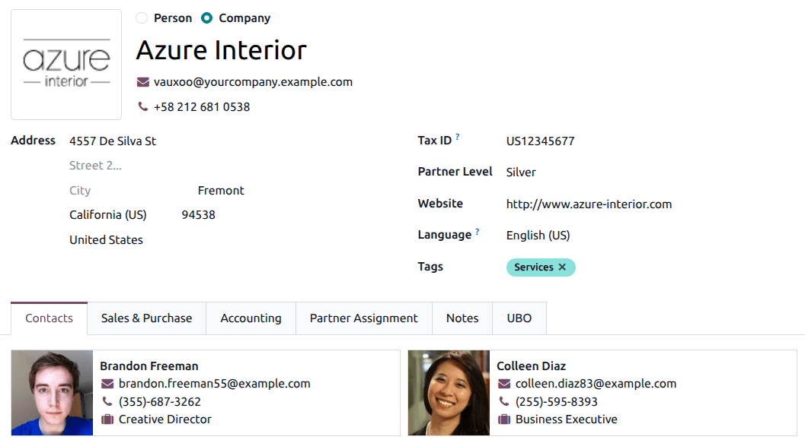

:show-content:

========
Contacts
========

Contacts are created in the **Contacts** application for customers the company does business with
through Odoo. A contact is a repository of vital business information, facilitating communication
and business transactions.

Contact form
============

To create a new contact, navigate to the :menuselection:`Contacts app`, and click :guilabel:`New`. A
new form appears where various contact information can be added.

.. note::
   Some fields may be slightly different depending on the :ref:`fiscal localization
   <fiscal_localizations/packages>` that is installed on the databse.

Contact type
------------

Odoo allows for both *Individual* and *Company* contacts. Select either :guilabel:`Individual` or
:guilabel:`Company`, depending on the type of contact that is being added.

Name
----

First, fill in the name of the contact. This is how the name appears throughout the database. This
field is **mandatory**.

.. tip::
   :guilabel:`Individual` contacts can have a :guilabel:`Company` contact linked to it. After
   selecting :guilabel:`Individual`, a new :guilabel:`Company Name...` field appears below the first
   name field.

Address
-------

Next, enter the :guilabel:`Address` of the contact. If the :guilabel:`Individual` option is chosen,
then the *type of address* can be chosen from a drop-down menu. Options for this drop-down menu
include: :guilabel:`Contact`, :guilabel:`Invoice Address`, :guilabel:`Delivery Address`,
:guilabel:`Follow-up Address`, and :guilabel:`Other Address`.

.. image:: contacts/address-type.png
   :alt: The contact type drop-down on a new contact creation form.

Additional fields
-----------------

Additional details are included on the initial form. The following fields are available:

- :guilabel:`Job Position`: list the contact's job position (only available on
  :guilabel:`Individual`).
- :guilabel:`Tax ID`: the identification number used for tax and accounting purposes. This may
  appear as :guilabel:`Identification Number` or :guilabel:`Citizen ID` depending on the country.
- :guilabel:`Partner Level`: select the designated :ref:`partner <contacts/partner-assignment>`
  level for this contact from the drop-down menu.
- :guilabel:`Website`: enter the full website address, starting with `http` or `https`.
- :guilabel:`Language`: enter the language used by the contact. All of the emails and documents sent
  to this contact are then translated to the selected language.
- :guilabel:`Tags`: enter preconfigured tags by typing them in the field, or clicking the drop-down
  menu, and selecting one. To create a new one, type the new tag in the field, and click
  :guilabel:`Create` from the resulting drop-down menu.

Contacts & Addresses tab
------------------------

At the bottom of the contact form are several tabs. On the :guilabel:`Contacts & Addresses` tab,
contacts can be added that are associated with a :guilabel:`Company` and related addresses. For
example, a specific contact person for the company can be listed here.

Multiple addresses can be added to contacts. To do so, click :guilabel:`Add` in the
:guilabel:`Contacts & Addresses` tab. Doing so reveals a :guilabel:`Create Contact` pop-up form, in
which additional addresses can be configured.

On the :guilabel:`Create Contact` pop-up form, select one of the following options for the address
type:

- :guilabel:`Contact`: adds another contact to the existing contact form.
- :guilabel:`Invoice Address`: adds a specific invoice address to the existing contact form.
- :guilabel:`Delivery Address`: adds a specific delivery address to the existing contact form.
- :guilabel:`Follow-up Address`: adds a preferred address for follow-up reports and reminders about
  overdue invoices.
- :guilabel:`Other Address`: adds an alternate address for the company, such as a subsidiary.

Once an option is selected, enter the corresponding contact information that should be used for the
specified address type.

Add the :guilabel:`Contact Name`, :guilabel:`Address`, :guilabel:`Email`, along with the
:guilabel:`Phone` and :guilabel:`Mobile` numbers below.

Set the :guilabel:`Job Position`, which appears if the :guilabel:`Contact` address type has been
selected. This is similar to the :guilabel:`Individual` contact.

To add a note, click on the text field next to :guilabel:`Notes`, and write anything that is
applicable to the customer or contact.

Then, click :guilabel:`Save & Close` to save the address, and close the :guilabel:`Create Contact`
window. Or, click :guilabel:`Save & New` to save the address, and immediately input another one.

Sales & Purchase tab
--------------------

Next, is the :guilabel:`Sales & Purchases` tab, which only appears when the **Sales**, **Purchase**,
or **Point of Sale** applications are installed.

The :guilabel:`Fiscal Position` can be set on the :guilabel:`Sales & Purchases` tab. Select a
:guilabel:`Fiscal Position` from the drop-down menu.

.. _essentials/contacts/sales-section:

Sales section
~~~~~~~~~~~~~

Under the :guilabel:`Sales` heading, a specific :guilabel:`Salesperson` can be assigned to a
contact. To do that, click the :guilabel:`Salesperson` drop-down field, and select one. Create a new
:guilabel:`Salesperson` by typing the user's name, and making the appropriate selection.

Certain :guilabel:`Payment Terms`,  a :guilabel:`Payment Method`, or a specific
:guilabel:`Pricelist`, can also be set, if needed. Click the drop-down menu next to
:guilabel:`Payment Terms`, and change it to one of the preselected :guilabel:`Payment Terms`, or
:guilabel:`Create` a new one. Select the :guilabel:`Pricelist` drop-down menu to choose the
appropriate :guilabel:`Pricelist`.

Click into the :guilabel:`Delivery Method` field to select an option from the drop-down menu.

Point Of Sale section
~~~~~~~~~~~~~~~~~~~~~

Under the :guilabel:`Point Of Sale` heading, enter a :guilabel:`Barcode` that can be used to
identify the contact.

Purchase section
~~~~~~~~~~~~~~~~

Specify :guilabel:`Payment Terms`, :guilabel:`1099 Box` information, and a preferred
:guilabel:`Payment Method` here. A :guilabel:`Receipt Reminder` can be set here, as well.

Misc section
~~~~~~~~~~~~

Under the :guilabel:`Misc.` heading, enter a :guilabel:`Citizen Identification` number, if necessary
for tax purposes. Use the :guilabel:`Reference` field to add any additional information for this
contact.

If this contact should **only** be accessible for one company in a multi-company database, select it
from the :guilabel:`Company` field drop-down list. Use the :guilabel:`Website` drop-down menu to
restrict the publishing of this contact to one website (if working on a database with multiple
websites). Select one or more :guilabel:`Website Tags` to assist in filtering published customers on
the `/customers` website page.

Select an :guilabel:`Industry` for this contact from the drop-down menu. Use the :guilabel:`SLA
Policies` field to assign a **Helpdesk** SLA policy to this contact.

Accounting tab
--------------

The :guilabel:`Accounting` tab appears when the **Accounting** application is installed. Here, a
user can add any related :guilabel:`Bank Accounts`, or set default :guilabel:`Accounting entries`.

Under the :guilabel:`Miscellaneous` heading, use the :guilabel:`LEI` field to enter a Legal Entity
Identifier, if necessary.

Internal Notes tab
------------------

Following the :guilabel:`Accounting` tab is the :guilabel:`Internal Notes` tab, where notes can be
left on this contact form, just like on the contact form noted above.

.. _contacts/partner-assignment:

Partner Assignment tab
----------------------

Next is the :guilabel:`Partner Assignment` tab, which by default includes a :guilabel:`Geolocation`
section, and other partner options, including :guilabel:`Partner Activation` and :guilabel:`Partner
Review` configurations. These are **only** present when the **Resellers** module is installed.

.. seealso::
   Follow the :doc:`Resellers documentation <../sales/crm/track_leads/resellers>` for more
   information on publishing partners on the website.

Membership tab
--------------

Finally, there is the :guilabel:`Membership` tab on contact forms, which can help users manage any
memberships that are being offered to this specific contact. It should be noted that this tab
**only** appears when the *Members* application is installed.

Activate membership
~~~~~~~~~~~~~~~~~~~

To activate a contact's membership, click :guilabel:`Buy Membership` in the :guilabel:`Membership`
tab of a contact form. On the pop-up window that appears, select a :guilabel:`Membership` from the
drop-down menu. Then, configure a :guilabel:`Member Price`. Click :guilabel:`Invoice Membership`
when both fields are filled in.

Alternatively, to offer a free membership, tick the :guilabel:`Free Member` checkbox, in the
:guilabel:`Membership` tab of a contact form.

.. seealso::
   Follow the :doc:`Members documentation <../sales/members>` for more information on publishing
   members on the website.

Smart buttons
=============

At the top of the contact form, there are some additional options available, known as *smart
buttons*.

Here, Odoo displays a variety of records, related to this contact, that were created on other apps.
Odoo integrates information from every single app, so there are many smart buttons.

.. example::
   For example, there is an :guilabel:`Opportunities` smart button, where all the opportunities
   related to this customer from the **CRM** app are accessible.

.. tip::
   If the corresponding applications are installed, their related smart buttons appear automatically
   on a contact form.

A user can see any :guilabel:`Meetings`, :guilabel:`Sales`, :guilabel:`POS Orders`,
:guilabel:`Subscriptions`, project :guilabel:`Tasks`, and the :guilabel:`More` smart button reveals
additional options, via a drop-down menu. A user can even quickly access :guilabel:`Purchases`,
:guilabel:`Helpdesk` tasks, :guilabel:`On-time Rate` for deliveries, :guilabel:`Invoiced`
information, :guilabel:`Vendor Bills`, and the :guilabel:`Partner Ledger` connected to this contact.

Deliveries, documents, loyalty cards, and direct debits are also linked to smart buttons, like this,
should there be any related to this contact.

If the contact is a partner, the user can visit their partner page on the Odoo-built website by
clicking the :guilabel:`Go to Website` smart button.

Archive contacts
----------------

If a user decides they no longer want to have this contact active, the record can be archived. To do
that, go to the :icon:`fa-cog` :guilabel:`Action` menu at the top of the contact form, and click
:guilabel:`Archive`.

Then, click :guilabel:`Archive` from the resulting :guilabel:`Confirmation` pop-up window.

With this contact successfully archived, as indicated by a banner at the top, they do not show up in
the main contacts page, but they can still be searched for with the :guilabel:`Archived` filter.

.. tip::
   A contact can be *unarchived*, if the user decides to work with them again. To do that, just
   click the :icon:`fa-cog` :guilabel:`Action` menu again at the top of the archived contact form,
   and click :guilabel:`Unarchive`. Upon doing so, the :guilabel:`Archived` banner is removed, and
   the contact is restored.

.. seealso::
   - :doc:`Add different addresses in CRM <../sales/sales/sales_quotations/different_addresses>`
   - `Odoo's eLearning Contacts tutorial
     <https://www.odoo.com/slides/slide/contacts-2527?fullscreen=1>`_

.. toctree::
   :titlesonly:

   contacts/merge
