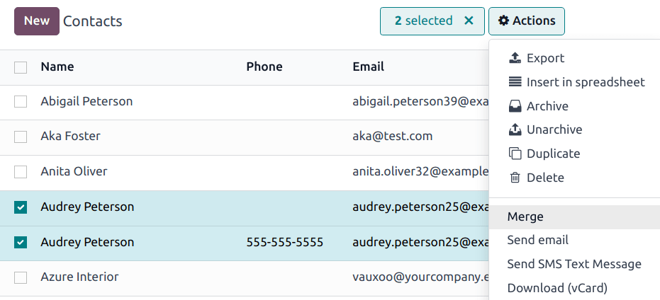
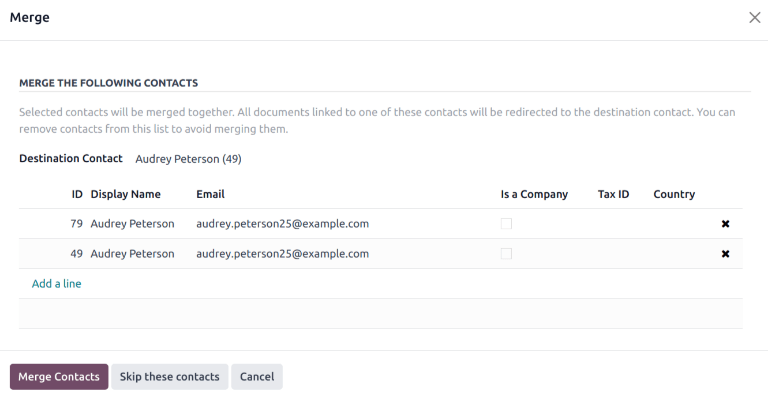

==============
Merge contacts
==============

Odoo's *Contacts* application allows user's to merge duplicate contacts, without losing any
information in the process. This keeps the database organized, and prevents contacts from being
contacted by more than one salesperson.

.. _contacts/merge-duplicate:

Merge duplicate contacts
========================

.. danger::
   Merging is an irreversible action. Do **not** merge contacts unless absolutely certain they
   should be combined.

Navigate to the :menuselection:`Contacts app`, and select the :icon:`oi-view-list`
:guilabel:`(list)` icon. Select two or more duplicate contacts from the list, and tick the checkbox
(on the far-left) for the contacts that should be merged. Then, click the :icon:`fa-cog`
:guilabel:`Actions` icon, and select :guilabel:`Merge` from the resulting drop-down menu.

This opens the :guilabel:`Merge` pop-up window. From here, review the details of the contacts before
confirming they should be merged. If any contacts in the list should **not** be merged, click the
:icon:`fa-times` :guilabel:`(delete)` icon at the far right of the contact.

.. tip::
   Click the individual contact to open the record for that contact, and view additional
   information.

Click the :guilabel:`Destination Contact` field, and select an option from the drop-down list. This
field defaults to the contact record that was created first in the system.

After confirming the information on the pop-up window, click :guilabel:`Merge Contacts`.

Deduplicate contacts
====================

After the merge is finished, a pop-up window appears confirming it is complete. This pop-up window
also contains a :guilabel:`Deduplicate the other Contacts` button. This feature searches for
duplicated records, based on selected criteria, and merges them automatically, or after manual
approval.

Click the :guilabel:`Deduplicate the other Contacts` button to open the :guilabel:`Deduplicate
Contacts` pop-up window.

Select one or more fields to be used in the search for duplicated records. Duplicated contacts can
be searched, based on the following criteria:

- :guilabel:`Email`
- :guilabel:`Name`
- :guilabel:`Is Company`
- :guilabel:`VAT`
- :guilabel:`Parent Company`

.. note::
   If more than one field is selected, only records that have **all** fields in common are suggested
   as duplicates.

If necessary, select criteria to be used to exclude potential duplicates from the search. Potential
duplicates can be excluded from the search, based on the following criteria:

- :guilabel:`A user associated to the contact`
- :guilabel:`Journal Items associated to the contact`

After confirming the search criteria, click either :guilabel:`Merge with Manual Check`,
:guilabel:`Merge Automatically`, or :guilabel:`Merge Automatically all process`.

If :guilabel:`Merge with Manual Check` is selected, complete the merge by following the :ref:`steps
above <contacts/merge-duplicate>`.
