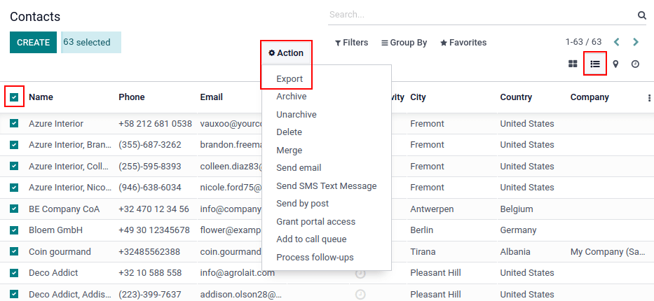
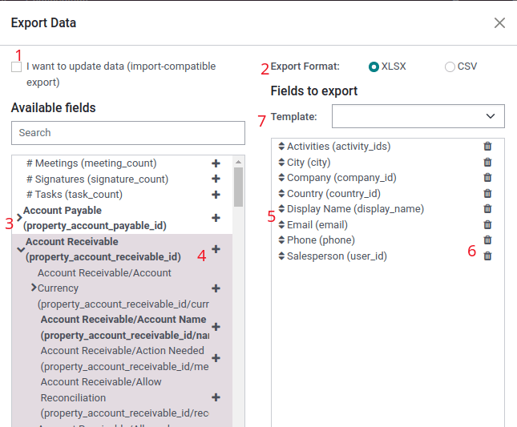
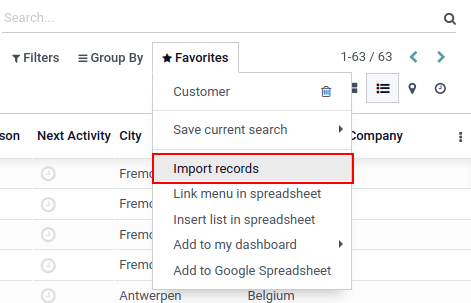

======================
Export and import data
======================

.. |list| replace:: :icon:`oi-view-list` :guilabel:`(list)` icon
.. |actions| replace:: :icon:`fa-cog` :guilabel:`Actions`

In Odoo, it is sometimes necessary to export or import data for running reports, or for data
modification. This document covers the export and import of data into and out of Odoo.

.. important::
   Sometimes, users run into a 'time out' error, or a record does not process, due to its size. This
   can occur with large exports, or in cases where the import file is too large. To circumvent this
   limitation surrounding the size of the records, process exports or imports in smaller batches.

.. _export-data:

Export data from Odoo
=====================

When working with a database, it is sometimes necessary to export data in a distinct file. Doing so
can aid in reporting on activities, although, Odoo provides a precise and easy reporting tool with
each available application.

With Odoo, the values can be exported from any field in any record. To do so, activate the list view
(|list|), on the items that need to be exported, then select the records that should be exported. To
select a record, tick the checkbox next to the corresponding record. Finally, click on |actions|,
then :guilabel:`Export`.

When clicking on :guilabel:`Export`, an :guilabel:`Export Data` pop-over window appears, with
several options for the data to export:

#. With the :guilabel:`I want to update data (import-compatable export)` option ticked, the system
   only shows the fields that can be imported. This is helpful in the case where the :ref:`existing
   records need to be updated <essentials/update-data>`. This works like a filter. Leaving the box
   unticked, gives many more field options because it shows all the fields, not just the ones that
   can be imported.
#. When exporting, there is the option to export in two formats: `.csv` and `.xls`. With `.csv`,
   items are separated by a comma, while `.xls` holds information about all the worksheets in a
   file, including both content and formatting.
#. These are the items that can be exported. Use the :guilabel:`> (right arrow)` icon to display
   more sub-field options. Use the :guilabel:`Search` bar to find specific fields. To use the
   :guilabel:`Search` option more efficiently, click on all the :guilabel:`> (right arrows)` to
   display all fields.
#. The :guilabel:`+ (plus sign)` icon button is present to add fields to the :guilabel:`Fields to
   export` list.
#. The :guilabel:`↕️ (up-down arrow)` to the left of the selected fields can be used to move the
   fields up and down, to change the order in which they are displayed in the exported file.
   Drag-and-drop using the :guilabel:`↕️ (up-down arrow)` icon.
#. The :guilabel:`🗑️ (trash can)` icon is used to remove fields. Click on the :guilabel:`🗑️ (trash
   can)` icon to remove the field.
#. For recurring reports, it is helpful to save export presets. Select all the needed fields, and
   click on the template drop-down menu. Once there, click on :guilabel:`New template`, and give a
   unique name to the export just created. Click the :guilabel:`💾 (floppy drive)` icon to save the
   configuration. The next time the same list needs to be exported, select the related template that
   was previously saved from the drop-down menu.

.. tip::
   It is helpful to know the field's external identifier. For example, :guilabel:`Related Company`
   in the export user interface is equal to *parent_id* (external identifier). This is helpful
   because then, the only data exported is what should be modified and re-imported.

.. _import-data:

Import data into Odoo
=====================

Importing data into Odoo is extremely helpful during implementation, or in times where data needs to
be :ref:`updated in bulk <essentials/update-data>`. The following documentation covers how to import
data into an Odoo database.

.. warning::
   Imports are permanent and **cannot** be undone. However, it is possible to use filters (`created
   on` or `last modified`) to identify records changed or created by the import.

.. tip::
   Activating :ref:`developer mode <developer-mode>` changes the visible import settings in the left
   menu. Doing so reveals an :menuselection:`Advanced` menu. Included in this advanced menu are two
   options: :guilabel:`Track history during import` and :guilabel:`Allow matching with subfields`.

   .. image:: export_import_data/advanced-import.png
      :align: center
      :alt: Advanced import options when developer mode is activated.

   If the model uses openchatter, the :guilabel:`Track history during import` option sets up
   subscriptions and sends notifications during the import, but leads to a slower import.

   Should the :guilabel:`Allow matching with subfields` option be selected, then all subfields
   within a field are used to match under the :guilabel:`Odoo Field` while importing.

Get started
-----------

Data can be imported on any Odoo business object using either Excel (`.xlsx`) or :abbr:`CSV
(Comma-separated Values)` (`.csv`) formats. This includes: contacts, products, bank statements,
journal entries, and orders.

Open the view of the object to which the data should be imported/populated, and click on
:menuselection:`⚙️ (Action) --> Import records`.

After clicking :guilabel:`Import records`, Odoo reveals a separate page with templates that can be
downloaded and populated with the company's own data. Such templates can be imported in one click,
since the data mapping is already done. To download a template click :guilabel:`Import Template for
Customers` at the center of the page.

.. important::
   When importing a :abbr:`CSV (Comma-separated Values)` file, Odoo provides :guilabel:`Formatting`
   options. These options do **not** appear when importing the proprietary Excel file type (`.xls`,
   `.xlsx`).

   .. image:: export_import_data/formatting.png
      :align: center
      :alt: Formatting options presented when a CVS file is imported in Odoo.

Make necessary adjustments to the *Formatting* options, and ensure all columns in the
:guilabel:`Odoo field` and :guilabel:`File Column` are free of errors. Finally, click
:guilabel:`Import` to import the data.

Adapt a template
----------------

Import templates are provided in the import tool of the most common data to import (contacts,
products, bank statements, etc.). Open them with any spreadsheet software (*Microsoft Office*,
*OpenOffice*, *Google Drive*, etc.).

Once the template is downloaded, proceed to follow these steps:

- Add, remove, and sort columns to best fit the data structure.
- It is strongly advised to **not** remove the :guilabel:`External ID` (ID) column (see why in the
  next section).
- Set a unique ID to every record by dragging down the ID sequencing in the :guilabel:`External ID`
  (ID) column.

.. image:: export_import_data/dragdown.gif
   :align: center
   :alt: An animation of the mouse dragging down the ID column, so each record has a unique ID.

.. note::
   When a new column is added, Odoo may not be able to map it automatically, if its label does not
   fit any field within Odoo. However, new columns can be mapped manually when the import is tested.
   Search the drop-down menu for the corresponding field.

   .. image:: export_import_data/field_list.png
      :align: center
      :alt: Drop-down menu expanded in the initial import screen on Odoo.

   Then, use this field's label in the import file to ensure future imports are successful.

.. tip::
   Another useful way to find out the proper column names to import is to export a sample file
   using the fields that should be imported. This way, if there is not a sample import template,
   the names are accurate.

.. _essentials/external-id:

Import from another application
-------------------------------

The :guilabel:`External ID` (ID) is a unique identifier for the line item. Feel free to use one
from previous software to facilitate the transition to Odoo.

Setting an ID is not mandatory when importing, but it helps in many cases:

- :ref:`Update imports <essentials/update-data>`: import the same file several times without
  creating duplicates.
- :ref:`Import relation fields <export_import_data/relation-fields>`.

To recreate relationships between different records, the unique identifier from the original
application should be used to map it to the :guilabel:`External ID` (ID) column in Odoo.

When another record is imported that links to the first one, use **XXX/ID** (XXX/External ID) for
the original unique identifier. This record can also be found using its name.

.. warning::
   It should be noted that conflicts occur if two (or more) records have the same *External ID*.

Field missing to map column
---------------------------

Odoo heuristically tries to find the type of field for each column inside the imported file, based
on the first ten lines of the files.

For example, if there is a column only containing numbers, only the fields with the *integer* type
are presented as options.

While this behavior might be beneficial in most cases, it is also possible that it could fail, or
the column may be mapped to a field that is not proposed by default.

If this happens, check the :guilabel:`Show fields of relation fields (advanced) option`, then a
complete list of fields becomes available for each column.

.. image:: export_import_data/field_list.png
   :align: center
   :alt: Searching for the field to match the tax column.

Change data import format
-------------------------

.. note::
   Odoo can automatically detect if a column is a date, and tries to guess the date format from a
   set of most commonly used date formats. While this process can work for many date formats, some
   date formats are not recognizable. This can cause confusion, due to day-month inversions; it is
   difficult to guess which part of a date format is the day, and which part is the month, in a
   date, such as `01-03-2016`.

When importing a :abbr:`CSV (Comma-separated Values)` file, Odoo provides :guilabel:`Formatting`
options.

To view which date format Odoo has found from the file, check the :guilabel:`Date Format` that is
shown when clicking on options under the file selector. If this format is incorrect, change it to
the preferred format using *ISO 8601* to define the format.

.. important::
   *ISO 8601* is an international standard, covering the worldwide exchange, along with the
   communication of date and time-related data. For example, the date format should be `YYYY-MM-DD`.
   So, in the case of July 24th 1981, it should be written as `1981-07-24`.

.. tip::
   When importing Excel files (`.xls`, `.xlsx`), consider using *date cells* to store dates. This
   maintains locale date formats for display, regardless of how the date is formatted in Odoo. When
   importing a :abbr:`CSV (Comma-separated Values)` file, use Odoo's :guilabel:`Formatting` section
   to select the date format columns to import.

Import numbers with currency signs
----------------------------------

Odoo fully supports numbers with parenthesis to represent negative signs, as well as numbers with
currency signs attached to them. Odoo also automatically detects which thousand/decimal separator is
used. If a currency symbol unknown to Odoo is used, it might not be recognized as a number, and the
import crashes.

.. note::
   When importing a :abbr:`CSV (Comma-separated Values)` file, the :guilabel:`Formatting` menu
   appears on the left-hand column. Under these options, the :guilabel:`Thousands Separator` can be
   changed.

Examples of supported numbers (using 'thirty-two thousand' as the figure):

- 32.000,00
- 32000,00
- 32,000.00
- -32000.00
- (32000.00)
- $ 32.000,00
- (32000.00 €)

Example that will not work:

- ABC 32.000,00
- $ (32.000,00)

.. important::
   A :guilabel:`() (parenthesis)` around the number indicates that the number is a negative value.
   The currency symbol **must** be placed within the parenthesis for Odoo to recognize it as a
   negative currency value.

Import preview table not displayed correctly
--------------------------------------------

By default, the import preview is set on commas as field separators, and quotation marks as text
delimiters. If the :abbr:`CSV (Comma-separated Values)` file does not have these settings, modify
the :guilabel:`Formatting` options (displayed under the :guilabel:`Import` :abbr:`CSV
(Comma-separated Values)` file bar after selecting the :abbr:`CSV (Comma-separated Values)` file).

.. important::
   If the :abbr:`CSV (Comma-separated Values)` file has a tabulation as a separator, Odoo does
   **not** detect the separations. The file format options need to be modified in the spreadsheet
   application. See the following :ref:`Change CSV file format <export_import_data/change-csv>`
   section.

.. _export_import_data/change-csv:

Change CSV file format in spreadsheet application
-------------------------------------------------

When editing and saving :abbr:`CSV (Comma-separated Values)` files in spreadsheet applications, the
computer's regional settings are applied for the separator and delimiter. Odoo suggests using
*OpenOffice* or *LibreOffice*, as both applications allow modifications of all three options (from
*LibreOffice* application, go to :menuselection:`'Save As' dialog box --> Check the box 'Edit filter
settings' --> Save`).

Microsoft Excel can modify the encoding when saving (:menuselection:`'Save As' dialog box -->
'Tools' drop-down menu --> Encoding tab`).

Difference between Database ID and External ID
----------------------------------------------

Some fields define a relationship with another object. For example, the country of a contact is a
link to a record of the 'Country' object. When such fields are imported, Odoo has to recreate links
between the different records. To help import such fields, Odoo provides three mechanisms.

.. important::
   **Only one** mechanism should be used per field that is imported.

For example, to reference the country of a contact, Odoo proposes three different fields to import:

- :guilabel:`Country`: the name or code of the country
- :guilabel:`Country/Database ID`: the unique Odoo ID for a record, defined by the ID PostgreSQL
  column
- :guilabel:`Country/External ID`: the ID of this record referenced in another application (or the
  `.XML` file that imported it)

For the country of Belgium, for example, use one of these three ways to import:

- :guilabel:`Country`: `Belgium`
- :guilabel:`Country/Database ID`: `21`
- :guilabel:`Country/External ID`: `base.be`

According to the company's need, use one of these three ways to reference records in relations. Here
is an example when one or the other should be used, according to the need:

- Use :guilabel:`Country`: this is the easiest way when data comes from :abbr:`CSV (Comma-separated
  Values)` files that have been created manually.
- Use :guilabel:`Country/Database ID`: this should rarely be used. It is mostly used by developers
  as the main advantage is to never have conflicts (there may be several records with the same name,
  but they always have a unique Database ID)
- Use :guilabel:`Country/External ID`: use *External ID* when importing data from a third-party
  application.

When *External IDs* are used, import :abbr:`CSV (Comma-separated Values)` files with the
:guilabel:`External ID` (ID) column defining the *External ID* of each record that is imported.
Then, a reference can be made to that record with columns, like `Field/External ID`. The following
two :abbr:`CSV (Comma-separated Values)` files provide an example for products and their categories.

- :download:`CSV file for categories
  <export_import_data/External_id_3rd_party_application_product_categories.csv>`
- :download:`CSV file for Products
  <export_import_data/External_id_3rd_party_application_products.csv>`

.. _export_import_data/relation-fields:

Import relation fields
----------------------

An Odoo object is always related to many other objects (e.g. a product is linked to product
categories, attributes, vendors, etc.). To import those relations, the records of the related object
need to be imported first, from their own list menu.

This can be achieved by using either the name of the related record, or its ID, depending on the
circumstances. The ID is expected when two records have the same name. In such a case add `/ ID`
at the end of the column title (e.g. for product attributes: `Product Attributes / Attribute / ID`).

Options for multiple matches on fields
~~~~~~~~~~~~~~~~~~~~~~~~~~~~~~~~~~~~~~

If, for example, there are two product categories with the child name `Sellable` (e.g. `Misc.
Products/Sellable` & `Other Products/Sellable`), the validation is halted, but the data may still be
imported. However, Odoo recommends that the data is not imported because it will all be linked to
the first `Sellable` category found in the *Product Category* list (`Misc. Products/Sellable`).
Odoo, instead, recommends modifying one of the duplicate's values, or the product category
hierarchy.

However, if the company does not wish to change the configuration of product categories, Odoo
recommends making use of the *External ID* for this field, 'Category'.

Import many2many relationship fields
~~~~~~~~~~~~~~~~~~~~~~~~~~~~~~~~~~~~

The tags should be separated by a comma, without any spacing. For example, if a customer needs to be
linked to both tags: `Manufacturer` and `Retailer` then 'Manufacturer,Retailer' needs to be encoded
in the same column of the :abbr:`CSV (Comma-separated Values)` file.

- :download:`CSV file for Manufacturer, Retailer <export_import_data/m2m_customers_tags.csv>`

Import one2many relationships
~~~~~~~~~~~~~~~~~~~~~~~~~~~~~

If a company wants to import a sales order with several order lines, a specific row **must** be
reserved in the :abbr:`CSV (Comma-separated Values)` file for each order line. The first order line
is imported on the same row as the information relative to order. Any additional lines need an
additional row that does not have any information in the fields relative to the order.

As an example, here is a :abbr:`CSV (Comma-separated Values)` file of some quotations that can be
imported, based on demo data:

- :download:`File for some Quotations
  <export_import_data/purchase.order_functional_error_line_cant_adpat.csv>`

The following :abbr:`CSV (Comma-separated Values)` file shows how to import purchase orders with
their respective purchase order lines:

- :download:`Purchase orders with their respective purchase order lines
  <export_import_data/o2m_purchase_order_lines.csv>`

The following :abbr:`CSV (Comma-separated Values)` file shows how to import customers and their
respective contacts:

- :download:`Customers and their respective contacts
  <export_import_data/o2m_customers_contacts.csv>`

Import records several times
----------------------------

If an imported file contains one of the columns: :guilabel:`External ID` or :guilabel:`Database ID`,
records that have already been imported are modified, instead of being created. This is extremely
useful as it allows users to import the same :abbr:`CSV (Comma-separated Values)` file several
times, while having made some changes in between two imports.

Odoo takes care of creating or modifying each record, depending if it is new or not.

This feature allows a company to use the *Import/Export tool* in Odoo to modify a batch of records
in a spreadsheet application.

Value not provided for a specific field
---------------------------------------

If all fields are not set in the CSV file, Odoo assigns the default value for every non-defined
field. But, if fields are set with empty values in the :abbr:`CSV (Comma-separated Values)` file,
Odoo sets the empty value in the field, instead of assigning the default value.

Export/import different tables from an SQL application to Odoo
--------------------------------------------------------------

If data needs to be imported from different tables, relations need to be recreated between records
belonging to different tables. For instance, if companies and people are imported, the link between
each person and the company they work for needs to be recreated.

To manage relations between tables, use the `External ID` facilities of Odoo. The `External ID` of a
record is the unique identifier of this record in another application. The `External ID` must be
unique across all records of all objects. It is a good practice to prefix this `External ID` with
the name of the application or table. (like, 'company_1', 'person_1' - instead of '1')

As an example, suppose there is an SQL database with two tables that are to be imported: companies
and people. Each person belongs to one company, so the link between a person and the company they
work for must be recreated.

Test this example, with a :download:`sample of a PostgreSQL database
<export_import_data/database_import_test.sql>`.

First, export all companies and their *External ID*. In PSQL, write the following command:

.. code-block:: sh

   > copy (select 'company_'||id as "External ID",company_name as "Name",'True' as "Is a Company" from companies) TO '/tmp/company.csv' with CSV HEADER;

This SQL command creates the following :abbr:`CSV (Comma-separated Values)` file:

.. code-block:: text

   External ID,Name,Is a Company
   company_1,Bigees,True
   company_2,Organi,True
   company_3,Boum,True

To create the :abbr:`CSV (Comma-separated Values)` file for people linked to companies, use the
following SQL command in PSQL:

.. code-block:: sh

    > copy (select 'person_'||id as "External ID",person_name as "Name",'False' as "Is a Company",'company_'||company_id as "Related Company/External ID" from persons) TO '/tmp/person.csv' with CSV

It produces the following :abbr:`CSV (Comma-separated Values)` file:

.. code-block:: text

   External ID,Name,Is a Company,Related Company/External ID
   person_1,Fabien,False,company_1
   person_2,Laurence,False,company_1
   person_3,Eric,False,company_2
   person_4,Ramsy,False,company_3

In this file, Fabien and Laurence are working for the Bigees company (`company_1`), and Eric is
working for the Organi company. The relation between people and companies is done using the
*External ID* of the companies. The *External ID* is prefixed by the name of the table to avoid a
conflict of ID between people and companies (`person_1` and `company_1`, who shared the same ID 1 in
the original database).

The two files produced are ready to be imported in Odoo without any modifications. After having
imported these two :abbr:`CSV (Comma-separated Values)` files, there are four contacts and three
companies (the first two contacts are linked to the first company). Keep in mind to first import
the companies, and then the people.

.. _essentials/update-data:

Update data in Odoo
===================

Existing data can be updated in bulk through a data import, as long as the :ref:`External ID
<essentials/external-id>` remains consistent.

Prepare data export
-------------------

To update data through an import, first navigate to the data to be updated, and select the |list| to
activate list view. On the far-left side of the list, tick the checkbox for any record to be
updated. Then, click |actions|, and select :icon:`fa-upload` :guilabel:`Export` from the drop-down
menu.

On the resulting :guilabel:`Export Data` pop-up window, tick the checkbox labeled, :guilabel:`I want
to update data (import-compatible export)`. This automatically includes the *External ID* in the
export. Additionally, it limits the :guilabel:`Fields to export` list to **only** include fields
that are able to be imported.

.. note::
   The :guilabel:`External ID` field does **not** appear in the :guilabel:`Fields to export` list
   unless it is manually added, but it is still included in the export. However, if the :guilabel:`I
   want to update data (import-compatible export)` checkbox is ticked, it is included in the export.

Select the required fields to be included in the export using the :ref:`options <export-data>` on
the pop-up window, then click :guilabel:`Export`.

Import updated data
-------------------

After exporting, make any necessary changes to the data file. When the file is ready, it can be
:ref:`imported <import-data>` by following the same process as a normal data import.

.. danger::
   When updating data, it is extremely important that the *External ID* remain consistent, as
   this is how the system identifies a record. If an ID is altered, or removed, the system may add a
   duplicate record, instead of updating the existing one.
