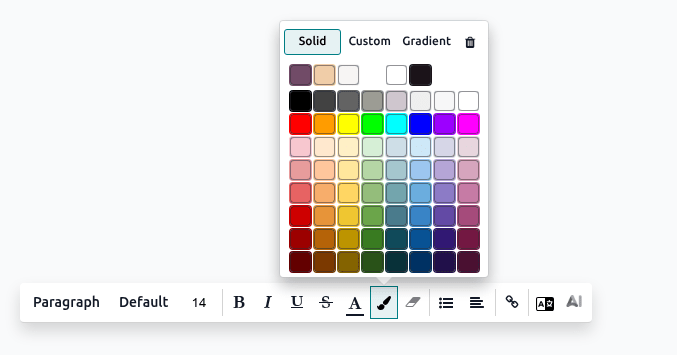

.. _text-editor:

=====================
Odoo rich-text editor
=====================

The Odoo rich-text editor allows creating and editing rich-text content in HTML fields, such as the
:guilabel:`Internal Notes` and :guilabel:`Description` fields, as well as in :doc:`Knowledge
articles </applications/productivity/knowledge/articles_editing>` and the :ref:`Studio report
editor <studio/pdf-reports/report-editor>`, among others. Start typing or use the
:ref:`toolbar <essentials/html_editor/toolbar>` or :ref:`powerbox
<essentials/html_editor/commands>` for formatting and structuring text.

.. tip::
   Hover over any element in the text (header, table, clipboard, etc.) to reveal the
   :icon:`fa-sort` :guilabel:`(drag)` icon. Click and hold the icon to drag and drop the element
   elsewhere in the text.

.. _essentials/html_editor/toolbar:

Text editor toolbar
===================

To edit a word, sentence, or paragraph, select or double-click it to display the text editor
toolbar and apply any of the following formatting options:

- **Font style**: Change the style using various options, such as :guilabel:`Header 1 to 6,
  Normal, Paragraph, Code`, and :guilabel:`Quote`.
- :guilabel:`B`: Put the text in bold.
- :guilabel:`I`: Put the text in italics.
- :guilabel:`U`: Underline the text.
- :guilabel:`S`: Strike through the text.
- :guilabel:`A` and :icon:`fa-paint-brush` :guilabel:`(paintbrush)` to customize the font and
  background colors, respectively:

  - :guilabel:`Solid`: Select the preferred color from the predefined palette.
  - :guilabel:`Custom`: Customize the color palette using the wheel or by configuring the
    :guilabel:`hex` code and :guilabel:`RGBA` values.
  - :guilabel:`Gradient`: Select a predefined gradient or customize it by choosing
    between :guilabel:`Linear` or :guilabel:`Radial` and adjusting the wheel.

- **Font size**: Adjust the size of the text.
- :icon:`fa-list-ul` (:guilabel:`bulleted list`): Turn the text into a bulleted list.
- :icon:`fa-list-ol` (:guilabel:`numbered list`): Turn the text into a numbered list.
- :icon:`fa-check-square-o` (:guilabel:`checklist`): Turn the text into a checklist.
- :icon:`fa-link` (:guilabel:`link`): Insert or edit a URL link to a selected text, and optionally
  upload an image using its file URL.
- :guilabel:`Translate`: Translate the content in the :doc:`installed languages
  </applications/general/users/language>`.
- :icon:`fa-magic` :guilabel:`AI` (:guilabel:`ChatGPT`): Get AI-generated suggestions and adjust
  the tone by clicking buttons such as :guilabel:`Correct, Shorten, Lengthen, Friendly,
  Professional`, and :guilabel:`Persuasive`.

.. tip::
   Use the following keyboard shortcuts to apply formatting:
      - **Emphasis**: Press `CTRL`/`CMD` + `B`, `CTRL`/`CMD` + `I`, or `CTRL`/`CMD` + `U` to apply
        the bold, italics, or underlined effect.
      - **Numbered list**: Type `1.`, `1)`, `A.`, or `A)` to start a numbered list.
      - **Bulleted list**: Type `*` or `-` to start a bulleted list.

.. _essentials/html_editor/commands:

Powerbox commands
=================

To use a command, type `/` to open the powerbox, then enter the command's name or select from
multiple features to insert tables, images, banners, etc.

.. tip::
   Starting a new paragraph displays a tooltip with command shortcut icons. Click an icon to add
   the command, or click the :icon:`fa-ellipsis-v` (:guilabel:`ellipsis`) icon to open the
   powerbox for all commands.

.. note::
   Commands specific to particular apps are excluded from this description.

.. tabs::
   .. tab:: Structure

      .. list-table::
         :widths: 20 80
         :header-rows: 1
         :stub-columns: 1

         * - Command
           - Use
         * - :guilabel:`Separator`
           - Insert a horizontal rule separator.
         * - :guilabel:`2 columns`
           - Convert into 2 columns.
         * - :guilabel:`3 columns`
           - Convert into 3 columns.
         * - :guilabel:`4 columns`
           - Convert into 4 columns.
         * - :guilabel:`Table`
           - Insert a table.
         * - :guilabel:`Bulleted list`
           - Create a bulleted list.
         * - :guilabel:`Numbered list`
           - Create a numbered list.
         * - :guilabel:`Checklist`
           - Create a checklist.
         * - :guilabel:`Quote`
           - Add a blockquote section.
         * - :guilabel:`Code`
           - Add a code section.

      .. note::
         To organize a table, hover over a column or row to reveal the table menu. Click the
         :icon:`fa-ellipsis-h` :guilabel:`(ellipsis)` icon to move, insert, or delete a column or
         row.

   .. tab:: Banner

      .. list-table::
         :widths: 20 80
         :header-rows: 1
         :stub-columns: 1

         * - Command
           - Use
         * - :guilabel:`Banner Info`
           - Insert an info banner.
         * - :guilabel:`Banner Success`
           - Insert a success banner.
         * - :guilabel:`Banner Warning`
           - Insert a warning banner.
         * - :guilabel:`Banner Danger`
           - Insert a danger banner.

   .. tab:: Format

      .. list-table::
         :widths: 20 80
         :header-rows: 1
         :stub-columns: 1

         * - Command
           - Use
         * - :guilabel:`Heading 1`
           - Big section heading.
         * - :guilabel:`Heading 2`
           - Medium section heading.
         * - :guilabel:`Heading 3`
           - Small section heading.
         * - :guilabel:`Text`
           - Paragraph block: Insert a paragraph.
         * - :guilabel:`Switch direction`
           - Switch the text's direction.

   .. tab:: Media

      .. list-table::
         :widths: 20 80
         :header-rows: 1
         :stub-columns: 1

         * - Command
           - Use
         * - :guilabel:`Media`
           - :ref:`Insert an image <insert-media>` or icon: :doc:`Search the Unsplash database
             </applications/general/integrations/unsplash>` or upload images, documents, or icons.
         * - :guilabel:`Clipboard`
           - Add a clipboard section to store content and reuse it in other apps.
         * - :guilabel:`Upload a file`
           - Add a download box: share images, recordings, or documents that internal users can
             download.

   .. tab:: Navigation

      .. list-table::
         :widths: 20 80
         :header-rows: 1
         :stub-columns: 1

         * - Command
           - Use
         * - :guilabel:`Link`
           - Add a link: Type the label and enter a URL or upload a file, then click
             :guilabel:`Apply`.
         * - :guilabel:`Button`
           - Add a button: Type the label, enter a URL or upload a file, select the button style,
             type, and size, then click :guilabel:`Apply`.
         * - :guilabel:`Article`
           - Insert a shortcut to a :doc:`Knowledge article </applications/productivity/knowledge>`.
         * - :guilabel:`Appointment`
           - Add a specific appointment: Select one or several appointment type(s) to assign to
             relevant users, then click :guilabel:`Insert a link`.
         * - :guilabel:`Table Of Content`
           - Highlight the structure (headings): Create a table of content based on the headings.
         * - :guilabel:`Video Link`
           - Insert a video: Copy-paste the video URL (Youtube, Vimeo, Dailymotion, and Youku only).

   .. tab:: Widget

      .. list-table::
         :widths: 20 80
         :header-rows: 1
         :stub-columns: 1

         * - Command
           - Use
         * - :guilabel:`Emoji`
           - Add an emoji: search for the desired emoji.
         * - :guilabel:`3 Stars`
           - Insert a rating of up to 3 stars.
         * - :guilabel:`5 Stars`
           - Insert a rating of up to 5 stars.

   .. tab:: AI Tools

     .. list-table::
       :widths: 20 80
       :header-rows: 1
       :stub-columns: 1

       * - Command
         - Use
       * - :guilabel:`ChatGPT`
         - Generate content with AI.

   .. tab:: Basic Block

      .. list-table::
         :widths: 20 80
         :header-rows: 1
         :stub-columns: 1

         * - Command
           - Use
         * - :guilabel:`Signature`
           - Insert your signature.

.. _insert-media:

Insert media
------------

To insert media, type `/Media` or click the :icon:`fa-file-image-o` :guilabel:`(image)` icon in the
tooltip, then choose from the following tabs:

- :guilabel:`Images`

   - Search the :doc:`Unsplash </applications/general/integrations/unsplash>` database to find a
     suitable image.
   - :guilabel:`Add URL`: Copy-paste the **image address**.
   - :guilabel:`Upload an image`: Upload an image into the library.

- :guilabel:`Documents`

   - Search for a document in the database.
   - :guilabel:`Add URL`: Copy-paste a valid URL.
   - :guilabel:`Upload a document`: Upload a document from a local drive.

- :guilabel:`Icons`: Search an icon from the selection in the database.

Media editor toolbar
~~~~~~~~~~~~~~~~~~~~

After :ref:`inserting an image <insert-media>`, click it to display the media editor toolbar, and
apply any of the following formatting options:

- :icon:`fa-search-plus` (:guilabel:`preview`): Preview the image, zoom in or out, print it or
  download it. Exit the preview by clicking the :icon:`fa-times` :guilabel:`(close)` icon in the
  top right corner.
- :guilabel:`Description`: Edit the image description and tooltip, then click :guilabel:`Save`.
- :icon:`fa-square` (:guilabel:`rounded`): Apply a rounded shape to the corners of the image.
- :icon:`fa-circle-o` (:guilabel:`circle`): Apply a circular shape to the image.
- :icon:`fa-sun-o` (:guilabel:`shadow`): Apply a shadow effect to the image.
- :icon:`fa-picture-o` (:guilabel:`image`): Apply a border to the image.
- :icon:`fa-plus-square-o` (:guilabel:`padding`): Add an image padding and choose from small,
  medium, large, or extra large sizes.
- :guilabel:`Default`: Restore the image to its default size.
- :guilabel:`100%`: Set the image to full size.
- :guilabel:`50%`: Set the image to half its size.
- :guilabel:`25%`: Set the image to a quarter of its size.
- :icon:`fa-object-ungroup` (:guilabel:`object`): Resize and rotate the image. Click the
  :icon:`fa-object-ungroup` :guilabel:`(object)` icon a second time to reset the transformation.
- :icon:`fa-crop` (:guilabel:`crop`): Crop the image manually or apply the following options:

   - Choose from the `Flexible`, `16:9`, `4:3`, `1:1`, or `2:3` aspect ratios.
   - Zoom in or out.
   - Rotate left or right.
   - Flip horizontally or vertically.
   - Reset the image.

- :guilabel:`Replace`: Replace the image by searching in the :doc:`Unsplash
  </applications/general/integrations/unsplash>` database, adding a URL, or uploading a different
  one.
- :icon:`fa-link` (:guilabel:`link`): Insert a link to the image, type the URL, then click
  :guilabel:`Apply`. To remove the link, click the :icon:`fa-chain-broken` :guilabel:`(unlink)` icon.
- :icon:`fa-trash` (:guilabel:`trash`): Remove the image.
