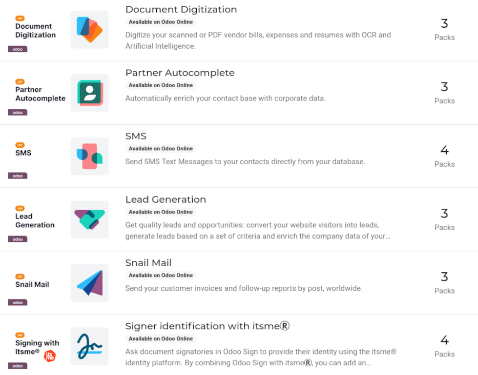

=====================
In-app purchase (IAP)
=====================

.. |IAP| replace:: :abbr:`IAP (In-app purchases)`

In-app purchases (IAP) are optional services that enhance Odoo databases. Each service provides its
own specific features and functionality. A full list of services is available on the `Odoo IAP
Catalog <https://iap.odoo.com/iap/all-in-app-services>`_.

.. example::
   The :guilabel:`SMS` service sends text messages to contacts directly from the database, and the
   :guilabel:`Documents Digitization` service digitizes scanned or PDF vendor bills, expenses, and
   resumes with optical character recognition (OCR) and artificial intelligence (AI).

|IAP| services do **not** need to be configured or set up before use. Odoo users can simply click on
the service in the app to activate it. However, each service requires its own prepaid credits, and
when they run out, users **must** :ref:`buy more <iap/buying_credits>` in order to keep using it.

.. note::
   Users with an Enterprise version of Odoo Online get free credits to test IAP features.

.. _in_app_purchase/portal:

IAP services
============

|IAP| services are provided by Odoo, as well as third-parties, and have a wide range of uses.

The following |IAP| services are provided by Odoo:

- :guilabel:`Documents Digitization`: digitizes scanned or PDF vendor bills, expenses, and resumes
  with OCR and AI.
- :guilabel:`Partner Autocomplete`: automatically populates contact records with corporate data.
- :guilabel:`SMS`: sends SMS text messages to contacts directly from the database.
- :guilabel:`Lead Generation`: generates leads based on a set of criteria, and converts web visitors
  into quality leads and opportunities.
- :guilabel:`Snailmail`: sends customer invoices and follow-up reports by post, worldwide.

For more information on every service currently available, visit the `Odoo IAP Catalog
<https://iap.odoo.com/iap/all-in-app-services>`_.

Use IAP services
----------------

|IAP| services are automatically integrated with Odoo, and do **not** require users to configure any
settings. To use a service, simply interact with it wherever it appears in the database.

.. example::
   The following flow focuses on the *SMS* |IAP| service being used from a contact's record.

   This can be done by clicking the :guilabel:`📱 (phone) SMS` icon within the database.

   .. image:: in_app_purchase/sms-icon.png
      :align: center
      :alt: The SMS icon on a typical contact information form located within an Odoo database.

   One way to utilize the *SMS* |IAP| service with Odoo is showcased in the following steps:

   #. Navigate to the :menuselection:`Contacts application`, and click on a contact with a mobile
      phone number entered in either the :guilabel:`Phone` or :guilabel:`Mobile` field of the
      contact form.
   #. Hover the mouse over the :guilabel:`Phone` or :guilabel:`Mobile` field, and a :guilabel:`📱
      (phone) SMS` icon appears to the right.
   #. Click the :guilabel:`📱 (phone) SMS` icon, and a :guilabel:`Send SMS Text Message` pop-up
      window appears.
   #. Type a message in the :guilabel:`Message` field of the :guilabel:`Send SMS Text Message`
      pop-up window. Then, click the :guilabel:`Send SMS` button. Odoo then sends the message, via
      SMS, to the contact, and logs what was sent in the *chatter* of the contact's form.

   Upon sending the SMS message, the prepaid credits for the *SMS* |IAP| service are automatically
   deducted from the existing credits. If there are not enough credits to send the message, Odoo
   prompts the user to purchase more.

.. seealso::
   For more information on how to use various |IAP| services, and for more in-depth instructions
   related to SMS functionality in Odoo, review the documentation below:

   - :doc:`Lead mining </applications/sales/crm/acquire_leads/lead_mining>`
   - :doc:`Enrich your contacts base with Partner Autocomplete
     </applications/sales/crm/optimize/partner_autocomplete>`
   - :doc:`SMS essentials </applications/marketing/sms_marketing/essentials/sms_essentials>`

.. _in_app_purchase/credits:

IAP credits
===========

Every time an |IAP| service is used, the prepaid credits for that service are spent. Odoo prompts
the purchase of more credits when there are not enough credits left to continue using a service.
Email alerts can also be set up for when :ref:`credits are low <in_app_purchase/low-credits>`.

Credits are purchased in *Packs* from the `Odoo IAP Catalog
<https://iap.odoo.com/iap/all-in-app-services>`_, and pricing is specific to each service.

.. example::
   The `SMS service <https://iap.odoo.com/iap/in-app-services/1>`_ has four packs available, in
   denominations of:

   - :guilabel:`Starter Pack`: 10 credits
   - :guilabel:`Standard Pack`: 100 credits
   - :guilabel:`Advanced Pack`: 500 credits
   - :guilabel:`Expert Pack`: 1,000 credits

   .. image:: in_app_purchase/packs.png
      :align: center
      :alt: Four different packs of credits for the SMS IAP service.

   The number of credits consumed depends on the length of the SMS and the country of destination.

   For more information, refer to the :doc:`SMS Pricing and FAQ
   </applications/marketing/sms_marketing/pricing/pricing_and_faq>` documentation.

.. _iap/buying_credits:

Buy credits
-----------

If there are not enough credits to perform a task, the database automatically prompts the purchase
of more credits.

Users can check the current balance of credits for each service, and manually purchase more credits,
by navigating to the :menuselection:`Settings app --> Search IAP --> View My Services`.

Doing so reveals an :guilabel:`IAP Account` page, listing the various |IAP| services in the
database. From here, click an |IAP| service to open its :guilabel:`Account Information` page, where
additional credits can be purchased.

Manually buy credits
~~~~~~~~~~~~~~~~~~~~

To manually buy credits in Odoo, follow these steps:

#. Go to the :menuselection:`Settings application`.
#. Type `IAP` in the search bar.
#. Click :guilabel:`View My Services`.

   .. image:: in_app_purchase/view-services.png
      :align: center
      :alt: The Settings app showing the Odoo IAP heading and View My Services button.

#. Doing so reveals an :guilabel:`IAP Account` page, listing the various |IAP| services in the
   database. From here, click an |IAP| service to open its :guilabel:`Account Information` page,
   where additional credits can be purchased.
#. On the :guilabel:`Account Information` page, click the :guilabel:`Buy Credit` button.

   .. image:: in_app_purchase/account-info.png
      :align: center
      :alt: The Account Information page for an IAP service showing the Buy Credit button.

#. Doing so loads a :guilabel:`Buy Credits for (IAP Account)` page in a new tab. From here, click
   :guilabel:`Buy` on the desired pack of credits. Then, follow the prompts to enter payment
   details, and confirm the order.

   .. image:: in_app_purchase/buy-pack.png
      :align: center
      :alt: The SMS service page on IAP.Odoo.com with four packs of credits available for purchase.

#. Once the transaction is complete, the credits are available for use in the database.

.. _in_app_purchase/low-credits:

Low-credit notification
~~~~~~~~~~~~~~~~~~~~~~~

It is possible to be notified when credits are low, in order to avoid running out of credits, while
using an |IAP| service. To do that, follow this process:

#. Go to the :menuselection:`Settings application`.
#. Type `IAP` in the search bar.
#. Click :guilabel:`View My Services`.
#. The available |IAP| accounts appear in a list view on the :guilabel:`IAP Account` page. From
   here, click on the desired |IAP| account to view that service's :guilabel:`Account Information`
   page.
#. On the :guilabel:`Account Information` page, tick the :guilabel:`Warn Me` box. Doing so reveals
   two fields on the form: :guilabel:`Threshold` and :guilabel:`Warning Email`.

   .. image:: in_app_purchase/low-credits.png
      :align: center
      :alt: Odoo will send an email alert when credits for this service fall below the threshold.

#. In the :guilabel:`Threshold` field, enter an amount of credits Odoo should use as the minimum
   threshold for this service.
#. In the :guilabel:`Warning Email` field, enter the email address that should receive the
   notification.

Odoo sends a low-credit alert to the :guilabel:`Warning Email` when the balance of credits falls
below the amount listed as the :guilabel:`Threshold`.
