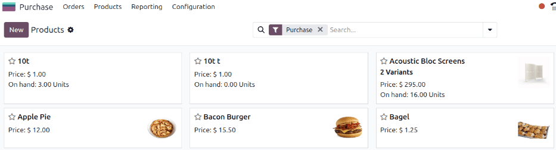
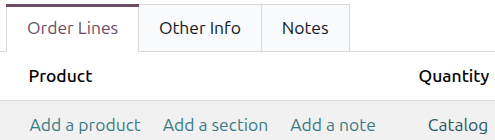
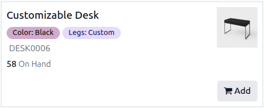
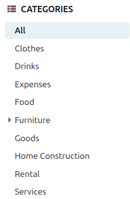
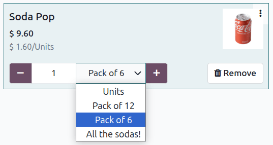

===============
Product catalog
===============

.. |SO| replace:: :abbr:`SO (sales order)`
.. |SOs| replace:: :abbr:`SOs (sales orders)`
.. |BoM| replace:: :abbr:`BoM (bill of materials)`
.. |RfQ| replace:: :abbr:`RfQ (request for quotation)`
.. |MO| replace:: :abbr:`MO (manufacturing order)`

The Odoo *product catalog* allows users to add products or components to a record in the
**Inventory**, **Manufacturing**, **Sales**, **Purchase**, and **Repairs** apps, among others.

The product catalog simplifies the creation of new record forms, such as:

- :doc:`Sales quotations and orders (SOs) <../sales/sales/sales_quotations/create_quotations>`
- Purchase orders (POs)
- :doc:`Manufacturing orders (MOs)
  <../inventory_and_mrp/manufacturing/basic_setup/manufacturing_work_orders>`
- :doc:`Bills of materials (BoMs)
  <../inventory_and_mrp/manufacturing/basic_setup/bill_configuration>`
- :doc:`Requests for quotation (RFQs) <../inventory_and_mrp/purchase/manage_deals/rfq>`
- And more.

The product catalog provides a visual interface through which products and components can be quickly
selected when filling out a record form. It can be accessed from the first tab of the record form,
and opens in a new page when selected. Products and components in the catalog are displayed in a
user-friendly, point of sale-style format. They can be selected from the catalog and added to forms.

Access and use the product catalog
==================================

Access the catalog directly
---------------------------

The product catalog can be accessed directly by opening a supported app (such as **Sales**,
**Purchase**, **Manufacturing**, etc.) Inside a supported app, go to :menuselection:`Products -->
Products` to view the product catalog with a filter active for that app.

Access the catalog through a database record
--------------------------------------------

To view the product catalog through a database record in a supported app (such as **Sales**,
**Purchase**, **Manufacturing**, etc.), create or open a sales quotation or |SO|, |RfQ|, |MO|, or
|BoM|. On the record form, click the :guilabel:`Catalog` link under the :guilabel:`Product` column.
The required fields that must be filled out to view the product catalog become highlighted. Fill out
the required fields, then click the :guilabel:`Catalog` link to open the catalog in a new page.

The product catalog displays a card for each product added to Odoo. Each card displays a few key
details about the corresponding product:

- Product photo
- Product title
- Price or cost of the product, depending on whether it is bought, sold, or used as a component
- Reference code (e.g. *DESK0005*)
- On-hand quantity
- Variant attributes (e.g., colors, materials, customizations, etc.)
- :icon:`fa-shopping-cart` :guilabel:`Add` button (if relevant to the current app)

Use search filters
------------------

The product catalog can be filtered using the search bar at the top of the page or the sidebar on
the side of the page.

To filter by product type, click the :icon:`fa-caret-down` :guilabel:`(Toggle Search Panel)` button
in the search bar to open the search menu. In the :icon:`fa-filter` :guilabel:`Filters` section,
select the :guilabel:`Services` filter to only show service products or the :guilabel:`Goods` filter
to only show physical products.

When creating or configuring a quotation, an :guilabel:`In the Order` filter appears in the
:icon:`fa-filter` :guilabel:`Filters` section of the search bar. Select this filter to only show
products that have already been added to the form.

In the sidebar on the side of the page, select an option in the :icon:`fa-th-list`
:guilabel:`Categories` section to filter by product category.

Add or remove a product from a record form
------------------------------------------

.. note:: This example uses a sales quotation. The UI may differ from what is pictured depending on
   the apps and modules active on the Odoo database.

To add a product to a form, click on the product's card or the :icon:`fa-shopping-cart`
:guilabel:`Add` button in the bottom corner of the card. Doing so adds one unit of the product,
which is displayed in a field in the bottom corner of the card.

To adjust the quantity of the product added, click the :icon:`fa-minus` :guilabel:`(minus)` and
:icon:`fa-plus` :guilabel:`(plus)` buttons to adjust the quantity by one. Alternatively, a specific
quantity can be entered by typing it in manually. Clicking the product card additional times also
increases the product count with each click.

To remove a product from the order, either click the :icon:`fa-trash` :guilabel:`Remove` button in
the bottom corner of the product card or click the :icon:`fa-minus` :guilabel:`(minus)` button until
the quantity is zero.

Once the desired quantity of each product has been reached, return to the form by clicking the
:guilabel:`Back to [X]` button at the top of the screen. This button differs depending on the type
of form being configured (quotation, |BoM|, etc.).

.. important::
   Products appear in the product catalog and can be added to orders even if there are zero units of
   the product on hand. As a result, it is important to confirm the quantity of a product being
   added to an order is actually available.

Products with packaging options
~~~~~~~~~~~~~~~~~~~~~~~~~~~~~~~

For products with multiple packaging options, a drop-down menu appears when that product is
selected. Choosing a packaging option other than the default displays both the cost for that package
and the per-unit cost for the items within it.

.. seealso::
   - :doc:`search`
   - :doc:`/../applications/inventory_and_mrp/inventory/product_management/configure/packaging`
