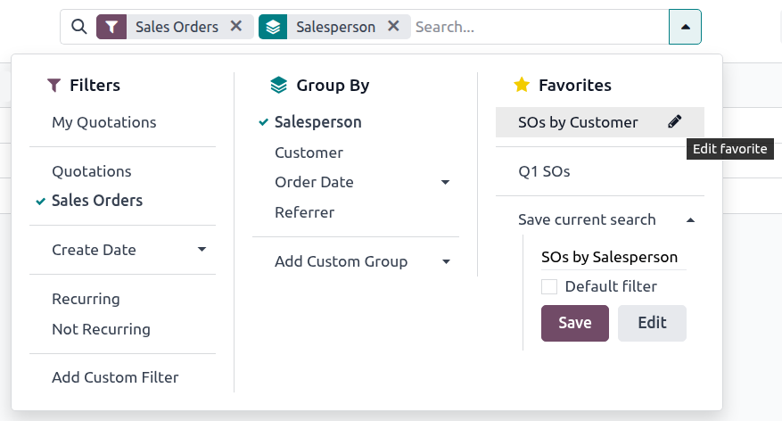

=================================
Search, filter, and group records
=================================

Odoo allows for the searching, filtering, and grouping of records in a view to display only the most
relevant records. The search bar is located at the top of the view, start typing to :ref:`search for
values <search/values>`, or click the :guilabel:`🔽 (down arrow)` icon to access the :ref:`Filter
<search/filters>`, :ref:`Group By <search/group>`, and :ref:`Favorites <search/favorites>` drop-down
menus.

.. _search/values:

Search for values
=================

Use the search field to quickly look for specific values, and add them as a filter. Type the value
to search for, and select the desired option from the drop-down menu to apply the search filter.

.. example::
   Instead of adding a :ref:`custom filter <search/custom-filters>` to select records where
   *Mitchell Admin* is the salesperson on the *Sales Analysis* report (:menuselection:`Sales app -->
   Reporting --> Sales`), search for `Mitch`, and click the :guilabel:`⏵ (right arrow)` next to
   :guilabel:`Search Salesperson for: Mitch`, and select :guilabel:`Mitchell Admin`.

   .. image:: search/search-values.png
      :align: center
      :alt: Searching for a specific value on the Sales Analysis report

.. note::
   Using the search field is equivalent to using the *contains* operator when adding a :ref:`custom
   filter <search/custom-filters>`. If a partial value is entered, and the desired field is directly
   selected (without selecting the :guilabel:`⏵ (right arrow)`), *all* records containing the typed
   characters for the selected field are included.

.. _search/filters:

Filters
=======

Filters are used to select records that meet specific criteria. The default selection of records is
specific to each view, but can be modified by selecting one (or several) :ref:`preconfigured filters
<search/preconfigured-filters>`, or by adding a :ref:`custom filter <search/custom-filters>`.

.. _search/preconfigured-filters:

Preconfigured filters
---------------------

Modify the default selection of records by clicking the :guilabel:`🔽 (down arrow)` icon from the
search bar, and selecting one (or several) *preconfigured filters* from the :guilabel:`Filters`
drop-down menu.

.. example::
   On the *Sales Analysis* report (:menuselection:`Sales app --> Reporting --> Sales`), only records
   that are at the *sales order* stage, with an *order date* within the last 365 days, are selected
   by default.

   To also include records at the *quotation* stage, select :guilabel:`Quotations` from the
   :guilabel:`Filters`.

   Furthermore, to *only* include sales order and quotation records from a specific year, like
   2024, for example, first remove the existing `Order Date: Last 365 Days` filter, by clicking the
   :guilabel:`❌ (remove)` icon, then select :menuselection:`Order Date --> 2024`.

   .. image:: search/preconfigured-filters.png
      :align: center
      :alt: Using preconfigured filters on the Sales Analysis report

.. note::
   The preconfigured :guilabel:`Filters` are grouped, and each group is separated by a horizontal
   line. Selecting preconfigured filters from the same group allows records to match *any* of the
   applied conditions. However, selecting filters from different groups requires records to match
   *all* of the applied conditions.

.. _search/custom-filters:

Custom filters
--------------

If the :ref:`preconfigured filters <search/preconfigured-filters>` are not specific enough, add a
custom filter. To do so, click the :guilabel:`🔽 (down arrow)` icon in the search bar, then select
:menuselection:`Filters --> Add Custom Filter`.

The :guilabel:`Add Custom Filter` pop-up window displays the matching option, filter rule, and a
toggle to :guilabel:`Include archived` records.

.. image:: search/custom-filter.png
   :align: center
   :alt: The Add Custom Filter pop-up window.

The default matching configuration is to :guilabel:`Match any of the following rules`, indicating
that each filter rule is applied independently. To change the matching configuration to
:guilabel:`Match all of the following rules`, at least two filter rules must be added to the custom
filter.

- :guilabel:`Match all 🔽 of the following rules`: **all** of the filter rules must be met.
  Logically, this is an *AND* (`&`) operation.
- :guilabel:`Match any 🔽 of the following rules`: **any** of the filter rules can be met.
  Logically, this is an *OR* (`|`) operation.

By default, a single filter rule is added to the custom filter. The following describes the
structure of a filter rule:

#. The first inline field is the *field name* to filter by. Some fields have refined parameters that
   are nested within another field. These fields have an :guilabel:`> (arrow)` icon beside them,
   which can be selected to reveal the nested fields.
#. The second inline field is the conditional *operator* used to compare the field name to the
   value. The :ref:`available conditional operators <reference/orm/domains>` are specific to the
   field's data type.
#. The third inline field is the variable *value* of the field name. The value input may appear as a
   drop-down menu, a text input, a number input, a date/time input, a boolean selector, or it may be
   blank, depending on the operator used and the field's data type.

Three inline buttons are also available to the right of the rule's filter criteria:

#. :guilabel:`➕ (plus sign)`: adds a new rule below the existing rule.
#. :guilabel:`(Add branch)`: adds a new group of rules below the existing rule, with the
   :guilabel:`any` and :guilabel:`all` matching options available to define how each rule within
   this branch is applied to the filter. If the matching option is set to the same as the parent
   group, the fields are moved to join the parent group.

   .. example::
      If the matching option is set to :guilabel:`Match all 🔽 of the following rules`, and a new
      branch is added with its matching option changed from :guilabel:`any 🔽 of` to :guilabel:`all
      🔽 of`, the newly-added branch disappears, and its group of rules are moved to the parent
      group.

#. :guilabel:`🗑️ (garbage can)`: deletes the node. If a branch node is deleted, all children of
   that node are deleted, as well.

A new filter rule can be added to the custom filter by clicking the :guilabel:`New Rule` button.

Once the filter criteria are defined, click :guilabel:`Add` to add the custom filter to the view.

.. example::
   To target all leads and opportunities from the :menuselection:`CRM` app that are in the *Won*
   stage, and have an expected revenue greater than $1,000, the following should be entered:

   :guilabel:`Match all 🔽 (down arrow) of the following rules:`

   #. :guilabel:`Stage` :guilabel:`is in` :guilabel:`Won`
   #. :guilabel:`Expected Revenue` :guilabel:`>` `1,000`
   #. :guilabel:`any 🔽 (down arrow)` :guilabel:`of:`

      - :guilabel:`Type` :guilabel:`=` :guilabel:`Lead`
      - :guilabel:`Type` :guilabel:`=` :guilabel:`Opportunity`

   .. image:: search/custom-filter-example.png
      :align: center
      :alt: Adding a custom filter to filter specific records in CRM.

.. tip::
   Activate :ref:`developer-mode` to reveal each field's technical name and data type, as well as
   the :guilabel:`# Code editor` text area below the filter rules, to view and edit the domain
   manually.

.. _search/group:

Group records
=============

The display of records in a view can be clustered together, according to one of the *preconfigured
groups*. To do so, click the :guilabel:`🔽 (down arrow)` icon in the search bar, then select one of
the :guilabel:`Group By` options from the drop-down menu.

.. example::
   To group the records by salesperson on the *Sales Analysis* report (:menuselection:`Sales app -->
   Reporting --> Sales`), click the :guilabel:`Salesperson` option from the :guilabel:`Group By`
   drop-down menu. The view changes to group the records by salesperson, without filtering out any
   records.

   .. image:: search/group.png
      :align: center
      :alt: Grouping records on the Sales Analysis report

It is possible to *customize groups* by using a field present on the model. To do so, click
:menuselection:`Add Custom Group`, and select a field from the drop-down menu.

.. note::
   Several groups can be used at the same time. The first group that is selected is the main
   cluster, the next one that is added further divides the main group's categories, and so on.
   Furthermore, filters and groups can be used together to refine the view even more.

.. _search/favorites:

Favorites
=========

Favorites are a way to save a specific search for future use, or as the new default filter for the
view.

To save the current view as a favorite, click the :guilabel:`🔽 (down arrow)` icon in the search
bar, then select the :guilabel:`Save current search` drop-down menu to display the following
options:

- Filter name: name of the favorited search.
- :guilabel:`Default filter`: sets the favorited search as the default filter for the view.
- :guilabel:`Shared`: makes the favorited search available to all users. By default, the favorited
  search is only available to the user who created it.

Once the options are set, click :guilabel:`Save` to save the favorited search.

Saved favorites can be accessed by clicking the :guilabel:`🔽 (down arrow)` icon in the search bar,
then selecting the saved filter in the :guilabel:`Favorites` drop-down menu. To remove a saved
favorite, click the :guilabel:`🗑️ (garbage can)` icon next to the favorited search.

.. tip::
   To view *all* favorited searches, first activate :ref:`developer-mode`, and navigate to
   :menuselection:`Settings app --> Technical --> User Interface: User-defined Filters`. From here,
   all favorited searches can be viewed, edited, archived, or deleted.
