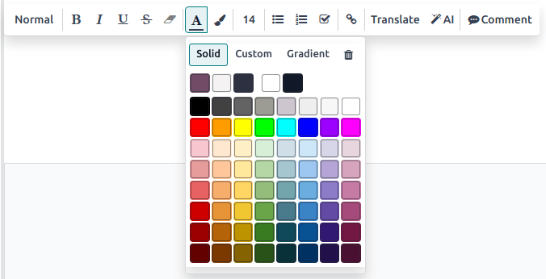

.. _text-editor:

========================
Text editor and commands
========================

Odoo allows you to write content in various areas across different apps. Whether it is in the
:guilabel:`Internal Notes` field in :guilabel:`Sales` or in the :guilabel:`Description` field in
:guilabel:`Project`, adding a text requires using the text editor and the commands.

Text editor
===========

To edit a word, a sentence, or a paragraph, select it or double-click on it to display the text
editor, and apply any of the following editing options:

- :guilabel:`Normal`: Change the style with multiple options, including :guilabel:`Normal, Code,
  Header 1 to 6`, and :guilabel:`Quote`.
- :guilabel:`B`: Put the text in bold.
- :guilabel:`I`: Put the text in italics.
- :guilabel:`U`: Underline the text.
- :guilabel:`S`: Apply a strikethrough effect to the text.
- :guilabel:`A` for the font or the :icon:`fa-paint-brush` :guilabel:`(paintbrush)` icon for the
  background to customize colors:

  - :guilabel:`Solid`: Select your preferred color from the predefined palette.
  - :guilabel:`Custom`: Customize your color palette using the wheel or by configuring the
    :guilabel:`hex` code and :guilabel:`RGBA` values.
  - :guilabel:`Gradient`: Choose a predefined gradient or personalize it by selecting
    between a :guilabel:`Linear` or :guilabel:`Radial` type, and adjusting the wheel.

- **Size number**: Adjust the size of the text.
- :icon:`fa-list-ul`: Turn the text into a bulleted list.
- :icon:`fa-list-ol`: Turn the text into a numbered list.
- :icon:`fa-check-square-o`: Turn the text into a checklist.
- :icon:`fa-link`: Insert or edit a URL link.
- :guilabel:`Translate`: Translate the content in your
  :doc:`installed languages </applications/general/users/language>`.
- :icon:`fa-magic` :guilabel:`AI`: Get AI-generated suggestions and adjust the tone.
- :icon:`fa-commenting` :guilabel:`Comment`: Add a comment to the selected text.

Commands
========

To use a command, type `/` and open the **powerbox**. Type the command's name or select from
multiple features to insert tables, images, banners, etc.

List of commands
----------------

Commands are divided into multiple categories depending on their use. The :guilabel:`Knowledge`
category and its commands are only available in the app of the same name.

.. tabs::
   .. tab:: Structure

      .. list-table::
         :widths: 20 80
         :header-rows: 1
         :stub-columns: 1

         * - Command
           - Use
         * - :guilabel:`Separator`
           - Insert a horizontal rule separator.
         * - :guilabel:`2 columns`
           - Convert into 2 columns.
         * - :guilabel:`3 columns`
           - Convert into 3 columns.
         * - :guilabel:`4 columns`
           - Convert into 4 columns.
         * - :guilabel:`Table`
           - Insert a table.
         * - :guilabel:`Bulleted list`
           - Create a bulleted list.
         * - :guilabel:`Numbered list`
           - Create a list with numbering.
         * - :guilabel:`Checklist`
           - Track tasks with a checklist.
         * - :guilabel:`Quote`
           - Add a blockquote section.
         * - :guilabel:`Code`
           - Add a code section.

   .. tab:: Banner

      .. list-table::
         :widths: 20 80
         :header-rows: 1
         :stub-columns: 1

         * - Command
           - Use
         * - :guilabel:`Banner Info`
           - Insert an info banner.
         * - :guilabel:`Banner Success`
           - Insert a success banner.
         * - :guilabel:`Banner Warning`
           - Insert a warning banner.
         * - :guilabel:`Banner Danger`
           - Insert a danger banner.

   .. tab:: Knowledge

      .. list-table::
         :widths: 20 80
         :header-rows: 1
         :stub-columns: 1

         * - Command
           - Use
         * - :guilabel:`Index`
           - Show nested articles.
         * - :guilabel:`Item Kanban`
           - Insert a Kanban view of article items.
         * - :guilabel:`Item Cards`
           - Insert a Card view of article items.
         * - :guilabel:`Item List`
           - Insert a List view of article items.
         * - :guilabel:`Item Calendar`
           - Insert a Calendar view of article items.

   .. tab:: Format

      .. list-table::
         :widths: 20 80
         :header-rows: 1
         :stub-columns: 1

         * - Command
           - Use
         * - :guilabel:`Heading 1`
           - Big section heading.
         * - :guilabel:`Heading 2`
           - Medium section heading.
         * - :guilabel:`Heading 3`
           - Small section heading.
         * - :guilabel:`Text`
           - Paragraph block.
         * - :guilabel:`Switch direction`
           - Switch the text's direction.

   .. tab:: Media

      .. list-table::
         :widths: 20 80
         :header-rows: 1
         :stub-columns: 1

         * - Command
           - Use
         * - :guilabel:`Media`
           - Insert image or icon.
         * - :guilabel:`Clipboard`
           - Add a clipboard section.
         * - :guilabel:`Upload a file`
           - Add a download box..

   .. tab:: Navigation

      .. list-table::
         :widths: 20 80
         :header-rows: 1
         :stub-columns: 1

         * - Command
           - Use
         * - :guilabel:`Link`
           - Add a link.
         * - :guilabel:`Button`
           - Add a button.
         * - :guilabel:`Article`
           - Insert an Article shortcut.
         * - :guilabel:`Appointment`
           - Add a specific appointment.
         * - :guilabel:`Drawing Board`
           - Insert an Excalidraw Board.
         * - :guilabel:`Table Of Content`
           - Highlight the structure (headings).
         * - :guilabel:`Viedo Link`
           - Insert a Video.

   .. tab:: Widget

      .. list-table::
         :widths: 20 80
         :header-rows: 1
         :stub-columns: 1

         * - Command
           - Use
         * - :guilabel:`Emoji`
           - Add an emoji.
         * - :guilabel:`3 Stars`
           - Insert a rating over 3 stars.
         * - :guilabel:`5 Stars`
           - Insert a rating over 5 stars.

   .. tab:: AI Tools

     .. list-table::
       :widths: 20 80
       :header-rows: 1
       :stub-columns: 1

       * - Command
         - Use
       * - :guilabel:`ChatGPT`
         - Generate or transform content with AI.

   .. tab:: Basic Bloc

      .. list-table::
         :widths: 20 80
         :header-rows: 1
         :stub-columns: 1

         * - Command
           - Use
         * - :guilabel:`Signature`
           - Insert your signature.
