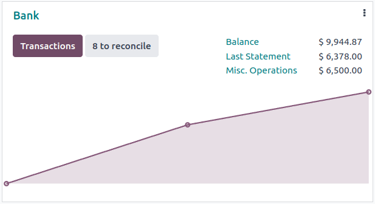
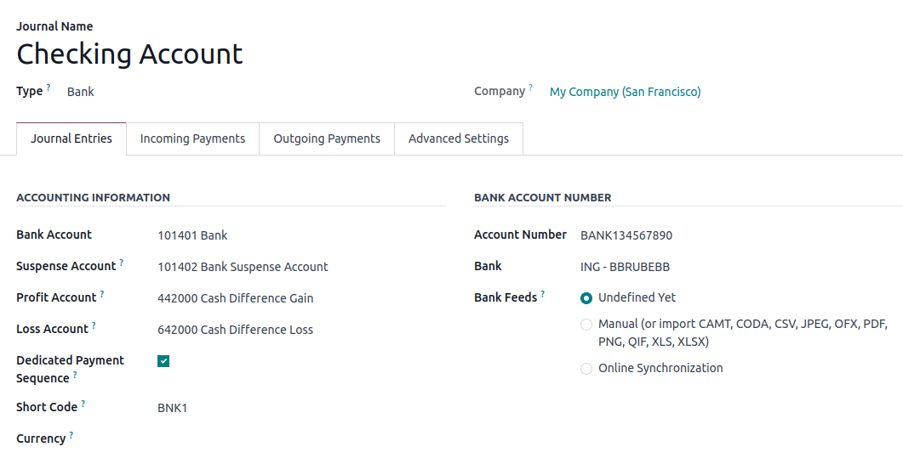
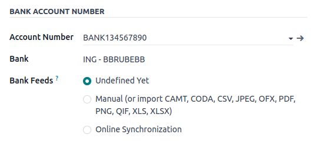
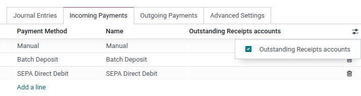

:show-content:

======================
Bank and cash accounts
======================

You can manage as many bank or cash accounts as needed on your database. Configuring them well
allows you to have all your banking data up-to-date and ready for :doc:`reconciliation
<bank/reconciliation>` with your journal entries.

In Odoo Accounting, each bank account has a dedicated journal set to post all entries in a dedicated
account. Both the journal and the account are automatically created and configured whenever you add
a bank account.

.. note::
   Cash journals and accounts must be configured manually.

Bank journals are displayed by default on the :guilabel:`Accounting Dashboard` in the form of cards
which include action buttons.

.. _bank_accounts/manage:

Manage your bank and cash accounts
==================================

Connect your bank for automatic synchronization
-----------------------------------------------

To connect your bank account to your database, go to :menuselection:`Accounting --> Configuration
--> Banks: Add a Bank Account`, select your bank in the list, click on :guilabel:`Connect`, and
follow the instructions.

.. seealso::
   :doc:`bank/bank_synchronization`

Create a bank account
---------------------

If your banking institution is not available in Odoo, or if you don't want to connect your bank
account to your database, you can configure your bank account manually.

To manually add a bank account, go to :menuselection:`Accounting --> Configuration --> Banks:
Add a Bank Account`, click on :guilabel:`Create it` (at the bottom right), and fill out the form.

.. note::
   - Odoo automatically detects the bank account type (e.g., IBAN) and enables some features
     accordingly.
   - A default bank journal is available and can be used to configure your bank account by going to
     :menuselection:`Accounting --> Configuration --> Accounting: Journals --> Bank`. Open it and
     edit the different fields to match your bank account information.

Create a cash journal
---------------------

To create a new cash journal, go to :menuselection:`Accounting --> Configuration --> Accounting:
Journals`, click on :guilabel:`Create` and select :guilabel:`Cash` in the :guilabel:`Type` field.

For more information on the accounting information fields, read the
:ref:`bank_accounts/configuration` section of this page.

.. note::
   A default cash journal is available and can be used straight away. You can review it by going to
   :menuselection:`Accounting --> Configuration --> Accounting: Journals --> Cash`.

Edit an existing bank or cash journal
-------------------------------------

To edit an existing bank journal, go to :menuselection:`Accounting --> Configuration --> Accounting:
Journals` and select the journal you want to modify.

.. _bank_accounts/configuration:

Configuration
=============

You can edit the accounting information and bank account number according to your needs.

.. seealso::
   - :doc:`get_started/multi_currency`
   - :doc:`bank/transactions`

.. _bank_accounts/suspense:

Suspense account
----------------

Bank statement transactions are posted on the :guilabel:`Suspense Account` until the final
reconciliation allows finding the right account.

Profit and loss accounts
------------------------

The :guilabel:`Profit Account` is used to register a profit when the ending balance of a cash
register differs from what the system computes, while the :guilabel:`Loss Account` is used to
register a loss when the ending balance of a cash register differs from what the system computes.

Currency
--------

You can edit the currency used to enter the statements.

.. seealso::
   :doc:`get_started/multi_currency`

Account number
--------------

If you need to **edit your bank account details**, click on the external link arrow next to your
:guilabel:`Account Number`. On the new page, click on the external link arrow next to your
:guilabel:`Bank` and update your bank information accordingly. These details are used when
registering payments.

Bank feeds
----------

:guilabel:`Bank Feeds` defines how the bank statements are registered. Three options are available:

- :guilabel:`Undefined yet`, which should be selected when you don’t know yet if you will
  synchronize your bank account with your database or not.
- :guilabel:`Import (CAMT, CODA, CSV, OFX, QIF)`, which should be selected if you want to import
  your bank statement using a different format.
- :guilabel:`Automated Bank Synchronization`, which should be selected if your bank is synchronized
  with your database.

.. seealso::
   - :doc:`bank/bank_synchronization`
   - :doc:`bank/transactions`

.. _bank/outstanding-accounts:

Outstanding accounts
====================

By default, payments are registered through transitory accounts named **outstanding accounts**,
before being recorded in your bank account.

- An **outstanding payments account** is where outgoing payments are posted until they are linked
  with a withdrawal from your bank statement.
- An **outstanding receipts account** is where incoming payments are posted until they are linked
  with a deposit from your bank statement.

These accounts should be of :ref:`type <chart-of-account/type>` :guilabel:`Current Assets`.

.. note::
   The movement from an outstanding account to a bank account is done automatically when you
   reconcile the bank account with a bank statement.

Default accounts configuration
------------------------------

The outstanding accounts are defined by default. If necessary, you can update them by going to
:menuselection:`Accounting --> Configuration --> Settings --> Default Accounts` and update your
:guilabel:`Outstanding Receipts Account` and :guilabel:`Outstanding Payments Account`.

Bank and cash journals configuration
------------------------------------

You can also set specific outstanding accounts for any journal with the :ref:`type
<chart-of-account/type>` :guilabel:`Bank` or :guilabel:`Cash`.

From your :guilabel:`Accounting Dashboard`, click on the menu selection ⋮ of the journal you want to
configure, and click on :guilabel:`Configuration`, then open the :guilabel:`Incoming/Outgoing
Payments` tab. To display the outstanding accounts column, click on the toggle button and check the
:guilabel:`Outstanding Receipts/Payments accounts`, then update the account.

.. note::
   - If you do not specify an outstanding payments account or an outstanding receipts account for a
     specific journal, Odoo uses the default outstanding accounts.
   - If your main bank account is added as an outstanding receipts account or outstanding payments
     account, when a payment is registered, the invoice or bill's status is directly set to
     :guilabel:`Paid`.

.. toctree::
   :titlesonly:

   bank/bank_synchronization
   bank/transactions
   bank/reconciliation
   bank/reconciliation_models
   bank/foreign_currency
   bank/cash_register
