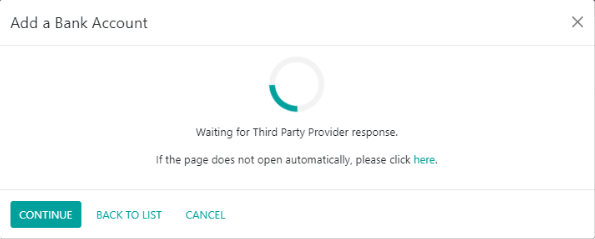

==============
Enable Banking
==============

**Enable Banking** is a third-party provider aggregating banking information from bank accounts all
in one place. It offers non-intrusive connectivity to ASPSPs' official APIs across Europe without
storing data.

**Odoo** synchronizes directly with banks to get access to all bank transactions and automatically
import them into your database.

.. seealso::
   - :doc:`../bank_synchronization`
   - `Enable Banking website <https://enablebanking.com/>`_

Configuration
=============

Link bank accounts with Odoo
----------------------------

#. Start synchronization by clicking on :menuselection:`Accounting --> Configuration -->
   Add a Bank Account`;
#. Select your bank;
#. Make sure you give your consent to share your account information with Odoo by clicking
   :guilabel:`Continue authentication`;

   .. image:: enablebanking/enablebankingauth.png
      :align: center
      :alt: Enable Banking authentication page

#. Finally, you are redirected to your bank's login page.

Known connectivity issues
=============
This is how the authentication process should look:

.. image:: enablebanking/authentication-demo.gif
   :align: center
   :alt:   Authentication demo

If instead you get stuck at "Add a Bank Account", try pressing "here" 10 - 20 times. If this doesn't work, please report the problem to Odoo and try a different browser or computer.

