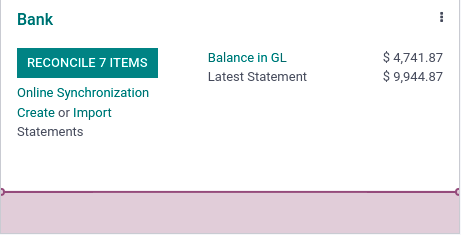

===============
Bank statements
===============

Importing your bank statements allows you to keep track of your bank account transactions and
reconcile them with the ones recorded in Odoo.

We recommend using :doc:`the bank synchronization feature <bank_synchronization>` for more
efficiency. However, if you do not want to use it or if your bank is not yet supported, other
options exist:

- Import the bank statement files delivered by your bank;
- Register the bank statements manually.

Import bank statements files
============================

Odoo supports multiple file formats to import bank statements:

- SEPA recommended Cash Management format (CAMT.053);
- Comma-separated values (.CSV);
- Open Financial Exchange (.OFX);
- Quicken Interchange Format (.QIF);
- Belgium: Coded Statement of Account (.CODA).

To import a file, go to the Accounting dashboard and click on :guilabel:`Import (Statements)` under
the :guilabel:`Bank` window, or click on the drop-down menu (:guilabel:`⋮`) button and then on
:guilabel:`Import Statement`.

Next, select the file you want to import and click on :guilabel:`Upload`.

Once the file uploaded, the **import widget** helps you set formatting options and **map** the
different columns you want to import. You also can :guilabel:`test` the bank statement file before
importing it to your database.

.. image:: bank_statements/import-bank-statement.png
   :align: center
   :alt: Register bank statements manually in Odoo Accounting

Register bank statements manually
=================================

If needed, you can also record your bank statements manually. To do so, go to the
:guilabel:`Accounting dashboard` and click on the :guilabel:`Create Statements` under the
:guilabel:`Bank` window. Alternatively, you can click the drop-down menu (:guilabel:`⋮`) button, and
then :guilabel:`New Statement`.

To ease the reconciliation process, make sure to fill out the :guilabel:`Partner` field. You can
also type in the payments’ references in the :guilabel:`Label` field. Add a new line for each
transaction written on the original bank statement.

.. image:: bank_statements/bank-statements-03.png
   :align: center
   :alt: Register bank statements manually in Odoo Accounting

.. note::
   The **Ending Balance** and the **Computed Balance** should have the same amount. If this is not
   the case, make sure there are no mistakes in the transactions’ amounts.
