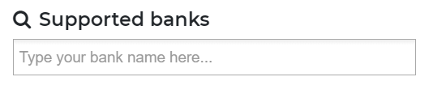
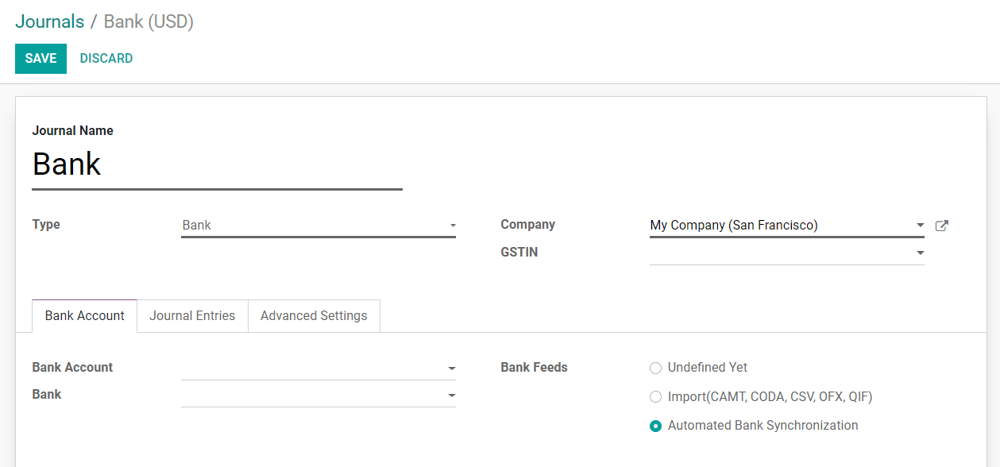
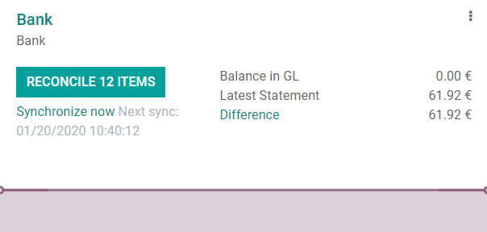

======================================
Bank Synchronization: Automatic Import
======================================

Odoo can synchronize directly with your bank to get all bank statements imported automatically into
your database.

To check if your bank is compatible with Odoo, go to `Odoo Accounting Features
<https://www.odoo.com/page/accounting-features>`_, and search for your bank in the *Supported Banks*
section.

The countries which are fully supported include the United States, Canada, New Zealand, Austria, and
Belgium.

More than 30 countries are partially supported, including Colombia, India, France, and Spain.

To connect to the banks, Odoo uses multiple web-services:

- **Plaid**: Mainly for the U.S
- **Yodlee**: Worldwide
- **Ponto**: For a growing number of European Banks. (:doc:`Click here for more information <ponto>`)

Configuration
=============

Odoo Online Users
-----------------

Make sure the **Automatic Import** feature is activated by going to :menuselection:`Accounting
--> Configuration --> Settings` in the *Bank & Cash* section.

Odoo Enterprise Users
---------------------

If you plan to use a bank interface with your Odoo Enterprise subscription, you don’t have to do
anything special. Just make sure that your database is registered with your Odoo Enterprise contract.

.. note::
   you might want to check that you don't have a firewall/proxy blocking the following address:

   - https://onlinesync.odoo.com/

Sync your bank feeds
====================

First, make sure that the **Automated Bank Synchronization** is activated in your journal.

To do so, go to :menuselection:`Accounting --> Configuration --> Journals`, then open your *Bank
Journal*, click on *Edit*, and select **Automated Bank Synchronization** in the *Bank Feed* field.

You can then connect Odoo to your bank.

To do so, go to :menuselection:`Accounting --> Configuration --> Add a Bank Account`, and follow the
steps.

Once done, go back to your *Accounting dashboard*. You should now see a **Synchronize Now** button
on your *Bank* card. Click on this button and enter your bank credentials.

After this, your bank feeds will be regularly synchronized.

FAQ 
===

The synchronization is not working in real-time, is that normal?
----------------------------------------------------------------

The process is not intended to work in real-time as third party providers synchronize your accounts
at different intervals. To force the synchronization and fetch the statements, go to your
*Accounting dashboard*, and click on the *Synchronize Now* button.

A transaction can be visible in your bank account, but not be fetched if it has the status
*Pending*. Only transactions with the *Posted* status will be retrieved. If it is not *Posted* yet,
you will have to wait until the status changes.

Is the Automatic Import feature included in my contract?
--------------------------------------------------------

- **Enterprise Version**: Yes, if you have a valid enterprise contract linked to your database.
- **Community Version**: No, this feature is not included in the Community Version.
- **Online Version**: Yes, even if you benefit from the One App Free contract.

Some banks have a status "Beta," what does this mean?
-----------------------------------------------------

This means that banking institutions are not yet fully supported by our Third Party Provider. Bugs
or other problems may arise. Odoo does not support technical problems that occur with banks in the
Beta phase, but the user may still choose to connect. Connecting with these banks can aid in the
development process since the Provider will have real data & feedback from the connection.

Why do my transactions only synchronize when I refresh manually?
----------------------------------------------------------------

Some banks have additional security measures and require extra steps, such as an SMS/email
authentication code or another type of MFA. Because of this, the integrator cannot pull transactions
until the security code is provided.

Not all of my past transactions are in Odoo, why?
-------------------------------------------------

Transactions can only be fetched up to 3 months in the past.

Why don’t I see any transactions?
---------------------------------
When you first connect with your bank, you will be prompted to add each account to its own journal.
If you skip this step, you will not be able to see your transactions in Odoo.

If your bank account is properly linked to a journal and posted transactions are not visible in your
database, please `submit a support ticket <https://www.odoo.com/help>`_.

How can I update my bank credentials?
-------------------------------------
You can update your credentials in :ref:`developer mode <developer-mode>`.

Then go to :menuselection:`Accounting --> Configuration --> Online Synchronization`, and open the
Institution you want to edit, and click on *Update Credentials*.

.. seealso::
   * :doc:`bank_statements`
