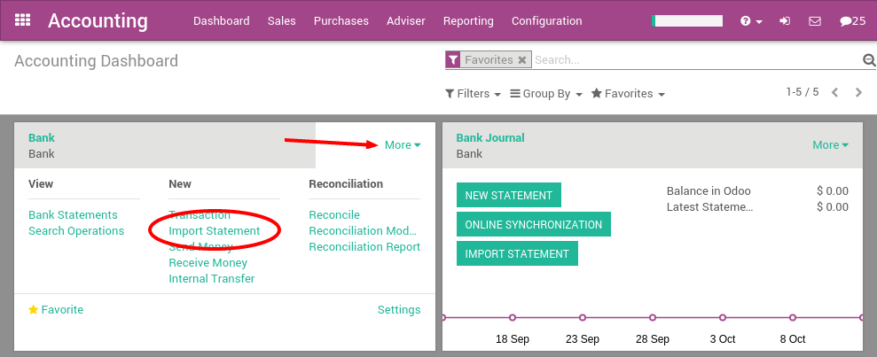
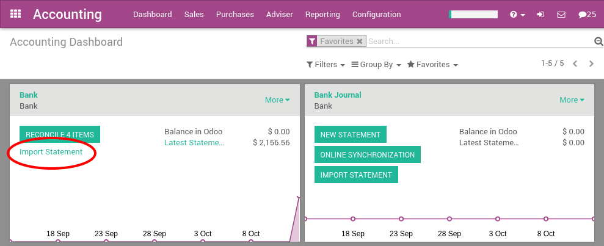

==========================================
Import Coda statement files (Belgium only)
==========================================

CODA is a file format for bank statements in Belgium. Most Belgian
banks, as well as the Isabel software, allows to download a CODA file
with all your bank statements.

With Odoo, you can download an CODA file from your bank or accounting
software and import it directly in Odoo. This will create all bank
statements.

.. tip:: 
    Test now the feature `with this sample CODA file <https://drive.google.com/file/d/0B5BDHVRYo-q5UVVMbGRxUmtpVDg/view?usp=sharing>`__

Configuration
=============

Install the CODA feature
------------------------

If you have installed the Belgian Chart of Account provided with Odoo,
the CODA import feature is already installed by default. In such a case,
you can move directly to the next section `Import your first coda
file <InstallCoda_>`_

If CODA is not activated yet, you need to do it first. In the Accounting
application, go to the menu :menuselection:`Configuration --> Settings`. From the
accounting settings, check the option **Import of Bank Statements in
.CODA Format** and apply.

Import your first CODA file
---------------------------

Once you have installed this feature, you can setup your bank account to
allow importing bank statement files. To do this, go to the accounting
**Dashboard**, and click on the button **More** on the bank account card. Then, click
on **Import Statement** to load your first CODA file.

Load your CODA file in the following screen and click **Import** to
create all your bank statements.

.. image:: media/coda02.png
   :align: center

If the file is successfully loaded, you will get redirected to the bank
reconciliation screen with all the transactions to reconcile.

.. _InstallCoda:

Importing CODA files
====================

After having imported your first file, the Odoo accounting dashboard
will automatically propose you to import more files for your bank. For
the next import, you don't need to go to the **More** button anymore, 
you can directly click on the link **Import Statement**.

Every time you get a statement related to a new customer / supplier,
Odoo will ask you to select the right contact to reconcile the
transaction. Odoo learns from that operation and will automatically
complete the next payments you get or make to these contacts. This will
speed up a lot the reconciliation process.

.. note::
    Odoo is able to automatically detect if some files or transactions 
    have already been imported. So, you should not worry about avoiding 
    to import two times the same file: Odoo will check everything for you 
    before creating new bank statements.

.. seealso::
    * :doc:`ofx`
    * :doc:`qif`
    * :doc:`synchronize`
    * :doc:`manual`
