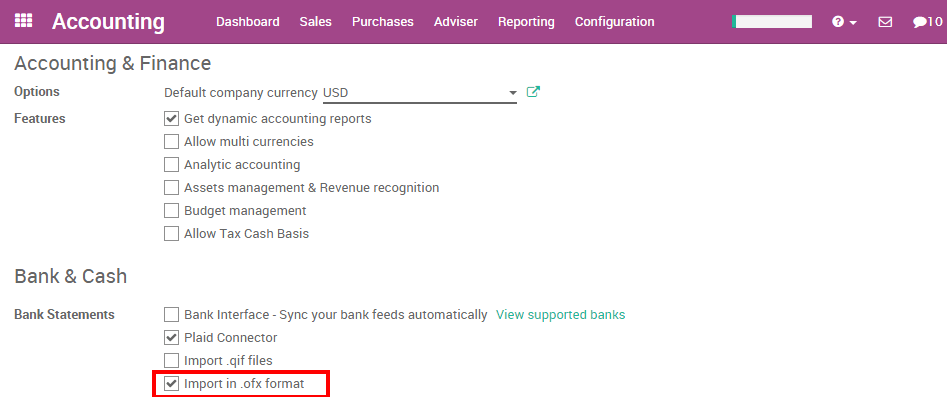
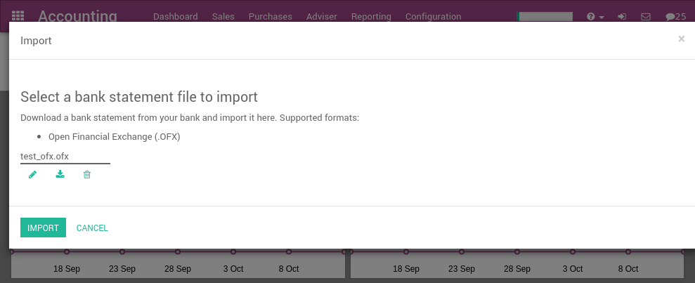

==========================
Import OFX statement files
==========================

Open Financial Exchange (OFX) is a unified specification for the
electronic exchange of financial data between financial institutions,
businesses and consumers via the Internet.

With Odoo, you can download an OFX file from your bank or accounting
software and import it directly in your Odoo instance. This will create
all bank statements.

.. tip::

	Test now the feature `with this sample OFX file <https://drive.google.com/file/d/0B5BDHVRYo-q5Mmg4T3oxTWszeEk/view>`__

Configuration
=============

In order to import OFX statements, you need to activate the feature in
Odoo. In the Accounting application, go to the menu :menuselection:`Configuration -->
Settings`. From the accounting settings, check the bank statements option
**Import in .OFX Format** and apply.

Once you have installed this feature, you can setup your bank account to
allow importing bank statement files. To do this, go to the accounting
Dashboard, and click on the **More** button of the bank account.
Then, click on **Import Statement** to load your first OFX file.

.. image:: media/ofx02.png
   :align: center

Load your OFX file in the following screen and click **Import** to
create all your bank statements.

If the file is successfully loaded, you will get redirected to the bank
reconciliation screen with all the transactions to reconcile.

Importing OFX files
===================

After having imported your first file, the Odoo accounting dashboard
will automatically propose you to import more files for your bank. For
the next import, you don't need to go to the **More** menu anymore,
you can directly click on the link **Import Statement**.

.. image:: media/ofx04.png
   :align: center

Every time you get a statement related to a new customer / supplier,
Odoo will ask you to select the right contact to reconcile the
transaction. Odoo learns from that operation and will automatically
complete the next payments you get or do to these contacts. This will
speed up a lot the reconciliation process.

.. seealso::

	* :doc:`qif`
	* :doc:`coda`
	* :doc:`synchronize`
	* :doc:`manual`
