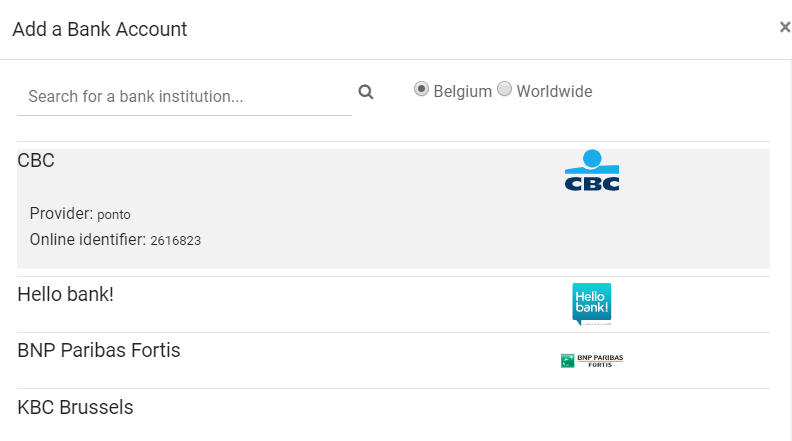
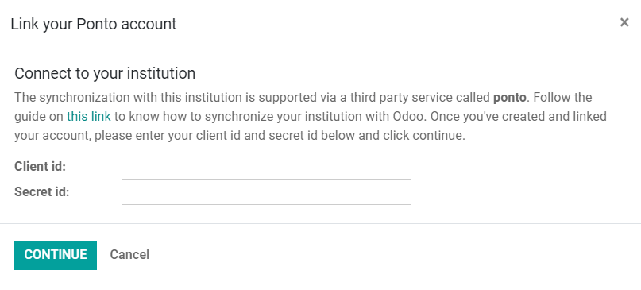
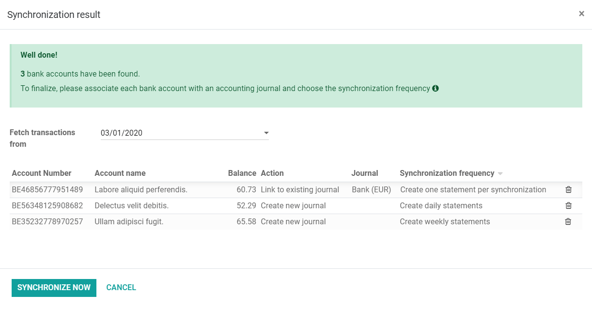

======================================
Ponto as Bank Synchronization provider
======================================

**Ponto** is a service that allows companies and professionals to aggregate their accounts in one
place and directly see all their transactions within one app. It is a third-party solution that is
continuously expanding the number of bank institutions that can be synchronized with Odoo.

.. image:: media/ponto_logo.png
   :align: center
   :alt: Logo of the Ponto brand

**Odoo Accounting** can synchronize directly with your bank to get all bank statements imported
automatically into your database. This allows for easier **bank reconciliation**. When :doc:`adding
a bank account on Odoo <../setup/bank_accounts>`, you can see if your bank requires a
connection through Ponto by searching for your bank institution, and clicking on it.

         your bank with Odoo Accounting

.. note::
   You can find more information about bank synchronization :doc:`on this page
   <bank_synchronization>`.

Configuration
=============

Link your bank accounts with Ponto
----------------------------------

#. Go to `Ponto's website (https://myponto.com) <https://myponto.com>`_.
#. Create an account if you don’t have one yet.
#. Once you are logged in, create an *organization*.

   .. image:: media/ponto_organization.png
      :alt: Fill out the form to add an organization in Ponto

#. | Go to :menuselection:`Accounts --> Live`, and click on *Add account*.
   | You might have to add your **Billing Information** first.
#. Select your bank institution and follow the steps on-screen to link your bank account with your
   Ponto account.
#. Make sure to add  all the bank accounts you want to synchronize with your Odoo database before
   moving on to the next steps.

.. _ponto-link-odoo:

Link your Ponto account with your Odoo database
-----------------------------------------------

Odoo requires you to insert your Ponto's **Client ID** and **Secret ID** to synchronize both
platforms.

#. To generate these IDs, go to :menuselection:`Ponto Dashboard --> Integration --> Live`, click on
   *Add Integration*, fill out the form, and select which accounts you want to synchronize.
#. Copy the Client ID and Secret ID generated and paste them in Odoo.
#. Configure the synchronization options:

   - **Action**: define if Odoo must create a new *Journal* for this bank account, link to an
     existing Journal, or create no link.
   - **Journal**: select the appropriate *Journal*.
   - **Synchronization Frequency**: define how often Odoo should fetch the bank statements.

.. tip::
   It is good practice to have one Journal per bank account. If you synchronize a single bank
   account, link it to the existing *Bank* journal. If you have multiple accounts, it is recommended
   to pick the *Create new journal* option for all additional accounts.

.. _ponto-update-credentials:

Update your synchronization credentials
---------------------------------------

You might have to update your Ponto credentials or modify the synchronization settings.

To do so, activate the :ref:`developer mode <developer-mode>`, and go to :menuselection:`Accounting
--> Configuration --> Online Synchronization`.

Click on *Update Accounts* to enter your new Client ID and Secret ID, or click on *Edit* to modify
the synchronization settings.

Deprecated API tokens
=====================

Ponto's previous synchronization system using API tokens is now deprecated.

This section is only relevant for users who had previously linked Ponto with Odoo using a single API
token instead of the current synchronization system with a *Client ID* and a *Secret ID*.

#. **Update** your database.

   - | *SaaS* and *Odoo.sh* users:
     | you can skip this step, as your database is automatically updated.
   - | *Community* and *Enterprise* users:
     | download the latest Odoo source code for your version (you can download it from `this link
       <https://odoo.com/download>`_ or from GitHub), install it, and restart your server.

#. | Do a **hard refresh** of your Odoo page by pressing *CTRL + F5*.
   | A hard refresh clears the cache and the javascript code for the current page.
#. To **generate your access key**, follow :ref:`the steps above <ponto-link-odoo>`.
#. To **update your credentials**, follow :ref:`the steps above <ponto-update-credentials>`.

.. seealso::

   * :doc:`bank_synchronization`
   * :doc:`../setup/bank_accounts`
   * :doc:`bank_statements`
