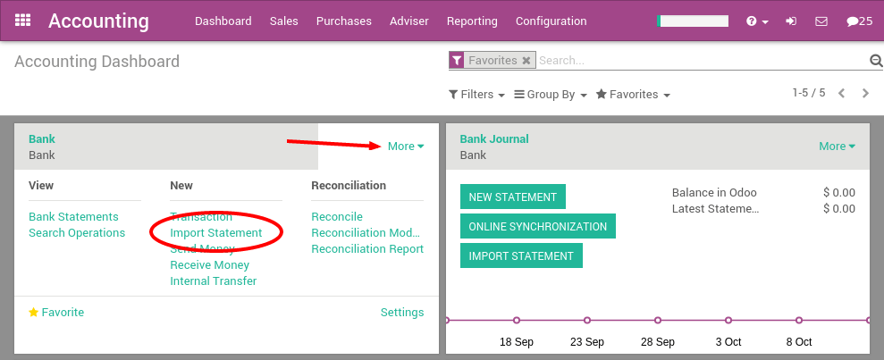
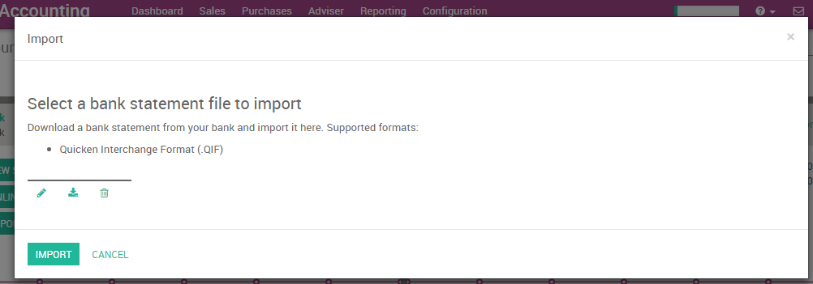
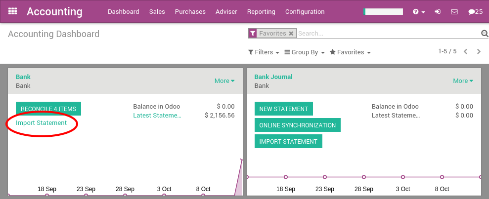

==========================
Import QIF statement files
==========================

Quicken Interchange Format (QIF) is an open specification for reading
and writing financial data to media (i.e. files). Although still widely
used, QIF is an older format than Open Financial Exchange (OFX) and you
should use the OFX version if you can export to both file formats.

With Odoo, you can download a QIF file from your bank or accounting
software and import it directly in your Odoo instance. This will create
all bank statements.

.. tip::

	Test now the feature `with this sample QIF file <https://drive.google.com/file/d/0B5BDHVRYo-q5X1ZkUWYzWmtCX0E/view>`__

Configuration
=============

In order to import QIF statements, you need to activate the feature in
Odoo. In the Accounting application, go to the menu :menuselection:`Configuration -->
Settings`. From the accounting settings, check the bank statements option
**Import in .QIF Format** and apply.

.. image:: media/qif01.png
   :align: center

Once you have installed this feature, you can setup your bank account to
allow importing bank statement files. To do this, go to the accounting
Dashboard, and click on the **More** button of the bank account.
Then, click on **Import Statement** to load your first QIF file.

Load your QIF file in the following screen and click **Import** to
create all your bank statements.

If the file is successfully loaded, you will get redirected to the bank
reconciliation screen with all the transactions to reconcile.

Importing QIF files
===================

After having imported your first file, the Odoo accounting dashboard
will automatically propose you to import more files for your bank. For
the next import, you don't need to go to the **More** menu anymore,
you can directly click on the link **Import Statement**.

Every time you get a statement related to a new customer / supplier,
Odoo will ask you to select the right contact to reconcile the
transaction. Odoo learns from that operation and will automatically
complete the next payments you get or do to these contacts. This will
speed up a lot the reconciliation process.

.. seealso::

	* :doc:`ofx`
	* :doc:`coda`
	* :doc:`synchronize`
	* :doc:`manual`
