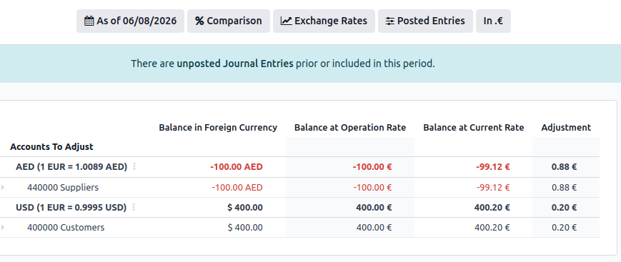
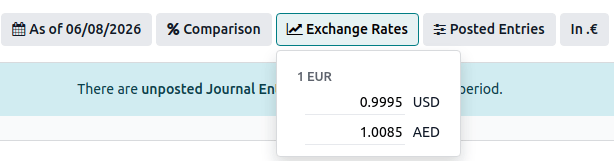
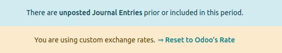
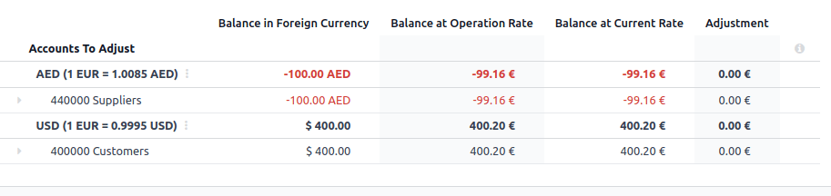

===========================================
Manage a bank account in a foreign currency
===========================================

In Odoo, every transaction is recorded in the default currency of the company, and reports are all
based on that default currency. With a bank account in a foreign currency, for every
transaction, Odoo stores two values:

-  The debit/credit in the currency of the company.
-  The debit/credit in the currency of the bank account.

Currency rates are updated automatically using a banking institution's web services. By default,
Odoo uses the European Central Bank's web services but other options are available.

Configuration
=============

Configure currencies
--------------------

To work with multiple currencies, go to :menuselection:`Accounting --> Configuration --> currencies`
then, :doc:`activate and configure new currencies <../get_started/multi_currency>`.
Set up manual or automatic :ref:`currency rate <multi-currency/config-rates>` and, define the
exchange difference entries accounts and journals to record gains or losses incurred.

.. seealso::
   :doc:`Multi-currency system <../get_started/multi_currency>`

Create a new bank account
-------------------------

To create a new bank account, first create a bank journal via
:menuselection:`Accounting --> Configuration --> Journals`, then add a
:ref:`bank account <accounting/journals/bank-cash-cc>` in the journal, and configure it.

.. seealso::
   - :doc:`Journals <../get_started/journals>`
   - :ref:`manage bank and cash accounts <accounting/bank/manage>`

Unrealized Currencies Report
============================

This report gives an overview of all unrealized amounts in a foreign currency on the balance sheet,
and allows the adjustment of an entry or manually set an exchange rate. To access this report, go to
:menuselection:`Review --> Unrealized Currencies` and have access to all open entries in the
balance sheet.

To use a different currency rate than the one set in
:menuselection:`Accounting --> Configuration --> Settings`, click the :guilabel:`Exchange Rates`
button and change the rate of the foreign currencies in the report.

When manually changing exchange rates, a yellow banner appears allowing a reset back to Odoo's rate.
To do so, simply click :guilabel:`Reset to Odoo's Rate`.

In order to update the balance sheet with the amount of the :guilabel:`Adjustment` column,
click on the :guilabel:`Adjustment Entry` button in the top-left-corner. In the pop-up window,
select a :guilabel:`Journal`, an :guilabel:`Expense Account` and an :guilabel:`Income Account` to
calculate and process the unrealized gains and losses.

You can set the date of the report in the :guilabel:`Date` field. Odoo automatically reverses the
booking entry to the date set in :guilabel:`Reversal Date`.

Once posted, the :guilabel:`Adjustment` column should indicate `0.00`, meaning all unrealized
gains and losses have been adjusted.

