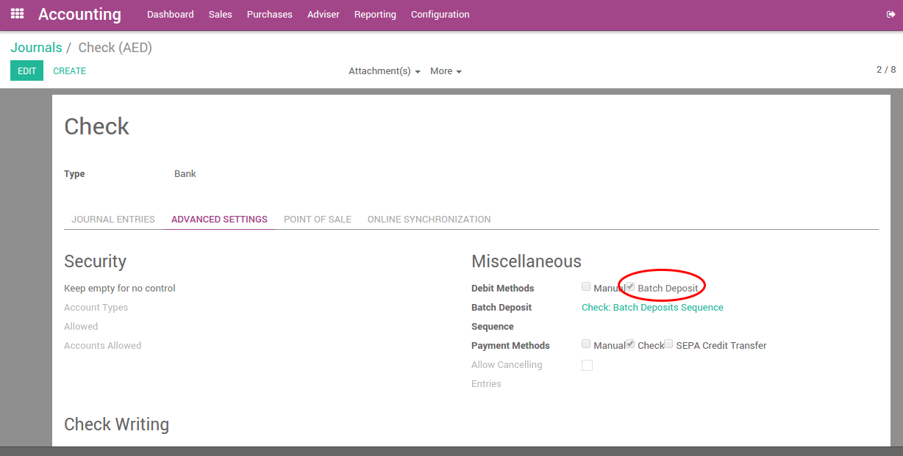

=======================================
How to manage batch deposits of checks?
=======================================

When your company's collections group receives checks from customers
they will often place this money into their bank account in batches. As
this money has been received in a physical form, someone in your company
must manually bring the checks to the bank.

The bank will ask for a deposit ticket (also referred to as deposit
slip) to be filled-in with the details of the checks or cash to be
included in the transactions.

The bank statement will reflect the total amount that was deposited and
the reference to the deposit ticket, not the individual checks.

Odoo assists you to prepare and print your deposit tickets, and later on
reconcile them with your bank statement easily.

Configuration
=============

Install the batch deposit feature
---------------------------------

In order to use the batch deposit feature, you need the module **Batch
Deposit** to be installed.

.. note::

    Usually, this module is automatically
    installed if checks are widely used in your country.

To verify that the **Batch Deposit** feature is installed, go to the
:menuselection:`Configuration --> Settings` menu of the accounting application.
Check the feature: **Allow batch deposit**.

.. image:: media/batch01.png
   :align: center

Activate the feature on your bank accounts
------------------------------------------

Once you have installed this feature, Odoo automatically activate bank
deposits on your main bank accounts.

To control which bank account can do batch deposit and which can not, go
to the journal that you defined to pay your checks, usually called
'Checks' or 'Bank' (see :doc:`../../receivables/customer_payments/check`,
in the Accounting apps, :menuselection:`Configuration --> Accounting --> Journals`.

In **Advanced Settings** tab, in section **Miscellaneous**, set Debit Method to
**Batch Deposit**.

If you check **Batch Deposit** in your debit method field, it means that
payments created using this Journal (called Payment method when you want
to make or receive a payment) will be applicable for the creation of
Batch Deposits afterwards.

From checks received to the bank
================================

Receive customer checks
-----------------------

Once your checks are received, record them on the bank account on
which you plan to deposit them. Once you select the bank account (or
check journal if you configured Odoo that way), Odoo proposes you to use
a batch deposit. Select this option if you plan to deposit the check to
your bank.

.. image:: media/batch03.png
   :align: center

In the memo field, you can set the reference of the check.

.. note::

    payments can be registered from the menu :menuselection:`Sales --> Payments`,
    or directly on the related invoice, using the **Register Payment** button.

Prepare a batch deposit
-----------------------

From the Accounting application, go to the menu :menuselection:`Sales --> Batch Deposit`,
and create a new **Batch Deposit**.

Select the bank, then select the payments (checks) you want to add in
this deposit. By default, Odoo proposes you all the checks that have not
been deposited yet. That way you can verify that you do not forget or
lost a check.

.. image:: media/batch05.png
   :align: center

You can then print the batch deposit, which will be very useful
to prepare the deposit slip that the bank usually requires to complete.

Reconciling the Deposit with the Bank Statement
-----------------------------------------------

When you process the bank statement reconciliation you will see the
deposit ticket number referenced in the statement. When the reconciliation
process is run, the user will be able to select the batch deposit that
matches with the bank statement line.

.. image:: media/batch06.png
   :align: center

If you select a batch deposit, Odoo will automatically fill all the
checks contained in this deposit for the matching. (2 checks were in
the batch deposit in the example below)

.. image:: media/batch07.png
   :align: center

Troubleshooting
===============

I don't see the batch deposit link on bank statements?
------------------------------------------------------

If you don't have a batch deposit link in your bank statement, there
could be two reasons:

- After having installed the batch deposit features you need to reload
  the page so that the browser is aware of this new feature. Just
  click the reload button of your browser.

- You do not have a batch deposit created for this bank account.

What happens if a check was refused?
------------------------------------

If you have a smaller amount in your bank statement than the actual
amount in your batch deposit, it probably means that one of your check
has been refused.

In this case click on the line related to this check to remove it from
the bank statement matching.
