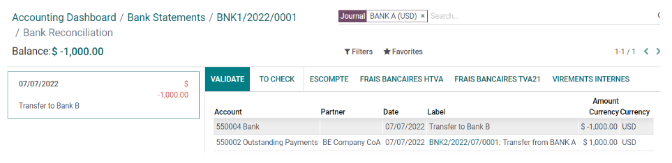

=================
Internal transfer
=================

In Odoo, internal money transfers can be made in a few clicks. You need at least either two bank
accounts, two cash journals, or one bank account and one cash journal.

Configuration
=============

An internal transfer account is automatically created on your database based on your company's
localization and depending on your country’s legislation. If needed, the default :guilabel:`Internal
transfer account` can be modified by going to :menuselection:`Accounting app --> Configuration -->
Settings` and then under the :guilabel:`Default Accounts` section.

.. note::
   At least two bank accounts are needed to make internal transfers. Refer to
   :doc:`Bank and cash accounts section <../setup/bank_accounts>` to see how to add an additional
   bank account to your database.

Register an internal transfer from one bank to another
======================================================

Let's say you have two bank accounts registered on your database and you want to transfer 1,000 USD
from Bank A to Bank B.

Log an internal transfer
------------------------

From the Accounting Dashboard, click on the drop-down selection button (:guilabel:`⋮`) on one of
your banks. In the :guilabel:`New` column click on :guilabel:`Internal Transfer` and enter the
information related to the transfer.

.. image:: interbank/internal_transfer.png
   :align: center
   :alt: Fill in the information related to your internal transfer

.. note::
   Fill in the :guilabel:`Memo` field for automatic reconciliation.

:guilabel:`Save` and :guilabel:`Confirm` to register your internal transfer. The money is now booked
in the transfer account and another payment is **automatically** created in the destination journal
(Bank B).

Bank journal (Bank A)
~~~~~~~~~~~~~~~~~~~~~

.. list-table::
   :header-rows: 1
   :stub-columns: 1

   * - **Account**
     - **Debit**
     - **Credit**
   * - Outstanding Payments account
     -
     - $1,000
   * - **Internal transfer account**
     - **$1,000**
     -

Automated booking - Bank journal (BANK B)
~~~~~~~~~~~~~~~~~~~~~~~~~~~~~~~~~~~~~~~~~

.. list-table::
   :header-rows: 1
   :stub-columns: 1

   * - **Account**
     - **Debit**
     - **Credit**
   * - Outstanding Receipts account
     - $1,000
     -
   * - **Internal transfer account**
     -
     - **$1,000**

.. note::
   There are one outstanding payment and one outstanding receipt pending in your two bank account
   journals, because the bank statement confirming the sending and receiving of the money has not
   been booked yet.

.. image:: interbank/outstanding-payments-receipts.png
   :align: center
   :alt: Outstanding Payments/Receipts pending bank statement booking

.. _interbank/import-and-reconcile:

Manage and reconcile bank statements
------------------------------------

The next step is to book the bank statements to finalize the transaction by creating,
:doc:`importing <../feeds/bank_statements>`, or :doc:`synchronizing <../feeds/bank_synchronization>`
your :guilabel:`Transactions lines`. Fill in the :guilabel:`Ending balance` and click on the
:guilabel:`Reconcile` button.

.. image:: interbank/transactions-line.png
   :align: center
   :alt: Transaction lines to be filled in prior to reconciliation

.. seealso::
   - :doc:`../reconciliation/use_cases`

In the next window, choose counterparts for the payment - in this example, the outstanding payment
account - then click :guilabel:`Validate`.

Bank journal entry
~~~~~~~~~~~~~~~~~~

.. list-table::
   :header-rows: 1
   :stub-columns: 1

   * - **Account**
     - **Debit**
     - **Credit**
   * - Outstanding Payment
     - $1,000
     -
   * - Bank Account (BANK A)
     -
     - **$1,000**

The same steps must be repeated once you receive the bank statement related to Bank B. Book and
reconcile your bank statement lines.

Bank journal entry
~~~~~~~~~~~~~~~~~~

.. list-table::
   :header-rows: 1
   :stub-columns: 1

   * - **Account**
     - **Debit**
     - **Credit**
   * - Outstanding Receipt
     -
     - $1,000
   * - Bank Account (BANK B)
     - **$1,000**
     -
