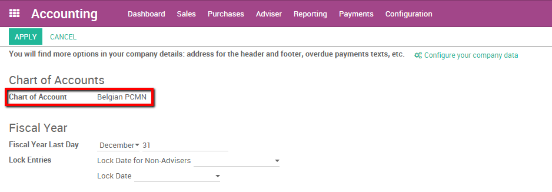
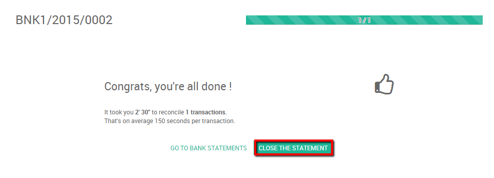

========================================================
How to do a bank wire transfer from one bank to another?
========================================================

A company might have several bank accounts or cash registers. Within
odoo it is possible to handle internal transfers of money with only a
couple of clicks.

We will take the following example to illustrate. My company has two
bank accounts and I want to transfer 50.000 euros from one of our bank
accounts to the another one.

Configuration
=============

Check your Chart of Accounts and default transfer account
---------------------------------------------------------

To handle internal transfers you need a transfer account in your charts
of account. Odoo will generate an account automatically based on the
country of your chart of account. To configure your chart of accounts and
check the default transfer account go into the accounting module settings,
select :menuselection:`Configuration --> Settings`.

Your chart of accounts will be pre-installed depending on the country
specified during your registration, it cannot be changed.

The default transfer account will automatically be generated as well
depending on your country's legislation. If necessary it can be modified
from the same page.

.. image:: media/interbank05.png
   :align: center

Create a second bank account / Journal
--------------------------------------

Before we can register an internal transfer we need to add a new bank to
our accounting dashboard. To do so enter the accounting module, click on
:menuselection:`Configuration --> Bank Accounts`. Create a new bank account. You should
fill in the **Account Number**. You can also create and edit your bank to
specify your bank's details.

By saving the changes you now have 2 bank accounts.

.. image:: media/interbank06.png
   :align: center

Register an internal transfer from one bank to another.
=======================================================

We will now transfer 50.000 euros from our **Bank** to our **Bank BE57 0633
9533 1498** account.

Log an internal transfer
------------------------

The first step is to register the internal payment. To do so go into
your accounting dashboard, click on the **more** button of one of your banks
and select :menuselection:`New --> Internal transfer`. 

Create a new payment. The payment type will automatically be set to
internal transfer. Select the **Bank** you want to transfer to, specify the
**Amount** and add a **Memo** if you wish.

.. note::
    The memo is important if you wish to automatically reconcile (`see <Reconcile_>`_).

.. image:: media/interbank02.png
   :align: center

Save and confirm the changes to register the payment.

In terms of accounting the money is now booked in the transfer account.
We'll need to import bank statements to book the money in the final
accounts.

.. _Reconcile:

Import bank statements and reconcile
------------------------------------

Note that the bank balance computed by Odoo is different that the last
statement of your bank.

.. image:: media/interbank11.png
   :align: center

That is because we did not import the bank statement confirming the
receiving and sending of the money. It's thus necessary to import your
bank statement and reconcile the payment with the correct bank statement
line. Once you receive your bank statements click the **new statement**
button of the corresponding bank to import them.

Fill in your **Transactions line**. Once done, Odoo will display a **Computed
Balance**. that computed balance is the theorical end balance of your
bank account. If it's corresponding to the bank statement, it means that no errors were
made. Fill in the **Ending balance** and click on the **Reconcile** button.

.. image:: media/interbank10.png
   :align: center

The following window will open:

.. image:: media/interbank09.png
   :align: center

You need to choose counterparts for the payment. Select the correct
bank statement line corresponding to the payment and click on the 
**reconcile** button. Close the statement to finish the transaction

The same steps will need to be repeated once you receive your second
bank statement. Note that if you specify the same amount and the
same memo in both bank statements and payment transactions then the
reconciliation will happen automatically.

.. image:: media/interbank12.png
   :align: center
