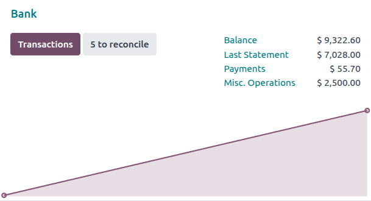
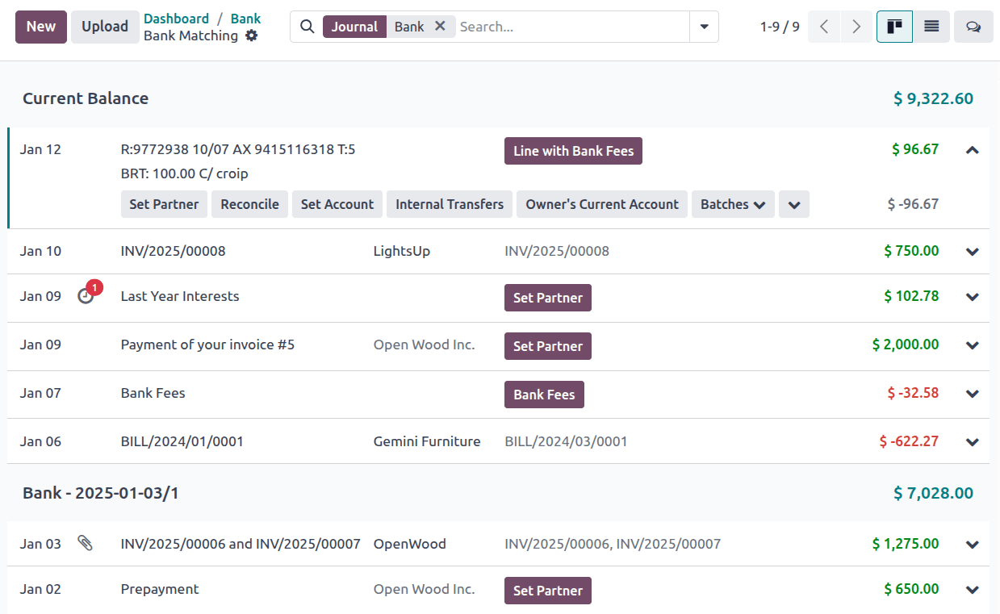

===================
Bank reconciliation
===================

**Bank reconciliation** is the process of matching your :doc:`bank transactions <transactions>` with
your business records, such as :doc:`customer invoices <../customer_invoices>`, :doc:`vendor bills
<../vendor_bills>`, and :doc:`payments <../payments>`. Not only is this compulsory for most
businesses, but it also offers several benefits, such as reduced risk of errors in financial
reports, detection of fraudulent activities, and improved cash flow management.

Thanks to the bank :doc:`reconciliation models <reconciliation_models>`, Odoo pre-selects the
matching entries automatically.

.. seealso::
   - `Odoo Tutorials: Bank reconciliation
     <https://www.odoo.com/slides/slide/bank-reconciliation-2724>`_
   - :doc:`bank_synchronization`
   - :doc:`transactions`

Bank reconciliation view
========================

To access a bank journal's **reconciliation view**, go to your :guilabel:`Accounting Dashboard` and
either:

- click the journal name (e.g., :guilabel:`Bank`) to display all transactions, including those
  previously reconciled or
- click the :guilabel:`Reconcile items` button to display all transactions Odoo pre-selected for
  reconciliation. You can remove the :guilabel:`Not Matched` filter from the search bar to include
  previously reconciled transactions.

The bank reconciliation view is structured into three distinct sections: transactions, counterpart
entries, and resulting entry.

Transactions
   The transactions section on the left shows all bank transactions, with the newest displayed
   first. Click a transaction to select it.

Counterpart entries
   The counterpart entries section on the bottom right displays the options to match the selected
   bank transaction. Multiple tabs are available, including
   :ref:`reconciliation/existing-entries`, :ref:`reconciliation/batch-payments`,
   :ref:`reconciliation/manual-operations`, and :guilabel:`Discuss`, which contains the chatter for
   the selected bank transaction.

Resulting entry
   The resulting entry section on the top right displays the selected bank transaction matched with
   the counterpart entries and includes any remaining debits or credits. In this section, you can
   validate the reconciliation or mark it as :guilabel:`To Check`. Any :ref:`reconciliation model
   buttons <reconciliation/button>` are also available in the resulting entry section.

Reconcile transactions
======================

Transactions can be matched automatically with the use of :doc:`reconciliation models
<reconciliation_models>`, or they can be matched with :ref:`existing entries
<reconciliation/existing-entries>`, :ref:`batch payments <reconciliation/batch-payments>`,
:ref:`manual operations <reconciliation/manual-operations>`, and :ref:`reconciliation model buttons
<reconciliation/button>`.

#. Select a transaction among unmatched bank transactions.
#. Define the counterpart. There are several options for defining a counterpart, including
   :ref:`matching existing entries <reconciliation/existing-entries>`, :ref:`manual operations
   <reconciliation/manual-operations>`, :ref:`batch payments <reconciliation/batch-payments>`, and
   :ref:`reconciliation model buttons <reconciliation/button>`.
#. If the resulting entry is not fully balanced, balance it by adding another existing counterpart
   entry or writing it off with a :ref:`manual operation <reconciliation/manual-operations>`.
#. Click the :guilabel:`Validate` button to confirm the reconciliation and move to the next
   transaction.

.. tip::
   If you are not sure how to reconcile a particular transaction and would like to deal with it
   later, use the :guilabel:`To Check` button instead. All transactions marked as :guilabel:`To
   Check` can be displayed using the :guilabel:`To Check` filter.

.. note::
   Bank transactions are posted on the **journal's suspense account** until reconciliation. At this
   point, reconciliation modifies the transaction journal entry by replacing the bank suspense
   account with the corresponding receivable, payable, or outstanding account.

.. _reconciliation/existing-entries:

Match existing entries
----------------------

This tab contains matching entries Odoo automatically pre-selects according to the reconciliation
models. The entry order is based on :doc:`reconciliation models <reconciliation_models>`, with
suggested entries appearing first.

.. tip::
   The search bar within the :guilabel:`Match Existing Entries` tab allows you to search for
   specific journal items.

.. _reconciliation/batch-payments:

Batch payments
--------------

`Batch payments <payments/batch-payments>`_ allow you to group different payments to ease
reconciliation. Use the :guilabel:`Batch Payments` tab to find batch payments for customers and
vendors. Similarly to the :guilabel:`Match Existing Entries` tab, the :guilabel:`Batch Payments` tab
has a search bar that allows you to search for specific batch payments.

.. _reconciliation/manual-operations:

Manual operations
-----------------

If there is not an existing entry to match the selected transaction, you may instead wish to
reconcile the transaction manually by choosing the correct account and amount. Then, complete any
of the relevant optional fields.

.. tip::
   You can use the :guilabel:`fully paid` option to reconcile a payment, even in cases where only a
   partial payment is received. A new line appears in the resulting entry section to reflect the
   open balance registered on the Account Receivable by default. You can choose another
   account by clicking on the new line in the resulting entry section and selecting the
   :guilabel:`Account` to record the open balance.

.. note::
   Lines are silently reconciled unless a write-off entry is required, which launches a
   reconciliation wizard.

   .. image:: reconciliation/fully-paid.png
      :alt: Click on fully paid to manually set an invoice as entirely paid.

.. _reconciliation/button:

Reconciliation model buttons
----------------------------

Use a :doc:`reconciliation model <reconciliation_models>` button for manual operations that are
frequently used. These custom buttons allow you to quickly reconcile bank transactions manually and
can also be used in combination with existing entries.
