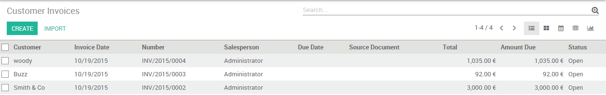

===================
Bank reconciliation
===================

Overview
========

Matching your bank statements with your accounting records can be a tedious task. You need to find the corresponding invoices, compare the amounts and partners' details with those in the bank statement. These steps can take a lot of time. Luckily, with Odoo you can very easily match your invoices or any other payment document with your bank statements.

Two options of the reconciliation process exist in Odoo.

1. We can directly specify the payment on the invoice
2. We can reconcile open invoices with bank statements

Configuration
=============

No special configuration is necessary to record invoices. All we need
to do is to install the accounting app.

.. image:: reconciliation/use01.png

Use cases
=========

Case 1: Payments registration
-----------------------------

We received the proof of payment of our invoice in the amount of 2100 euros issued to
Smith & Co.

We start at our issued Invoice of 2100 euros for Smith & Co. Because the
sold product is a service we demand an immediate payment. Our accountant
only handles bank statements at the end of week, so we have to mark
this invoice as paid immediately in order to indicate that we can start rendering services to our
customer.

Our customer send us a payment confirmation. We can thus register a
payment and mark the invoice as paid.

.. image:: reconciliation/use02.png

By clicking on **register payment,** we are telling Odoo that our
customer has paid the Invoice. We thus have to specify the amount and the
payment method.

.. image:: reconciliation/use03.png

Now we can always find the payment details in the Invoice by clicking on the
:menuselection:`Info --> Open Payment`.

.. image:: reconciliation/use04.png

The invoice has been paid and **the reconciliation has been done
automatically.**

Case 2: Bank statements reconciliations
---------------------------------------

We start at our issued Invoice of 3000 euros for Smith & Co. Let's also
assume that other Invoices are open for different customers.

We receive our bank statement and find that not only the invoice issued to Smith & Co has
been paid, but the one to Buzz of 92 euros as well.

**Import** or **Create** the bank statements. Please refer to the
documents from the Bank Feeds section.

.. image:: reconciliation/use06.png

On the dashboard, click on **Reconcile # Items**

.. image:: reconciliation/use07.png

If everything was right (correct partner name, right amount) odoo will
do the reconciliations **automatically**.

.. image:: reconciliation/use08.png

If some issues are found, you will need to take **manual actions**.

For example, if the partner is missing from your bank statement, just
fill it in :

.. image:: reconciliation/use09.png

If the payment is done with a down payment, just check if it is all
right and validate all related payments :

.. image:: reconciliation/use10.png

.. seealso::
   :doc:`bank_synchronization`
