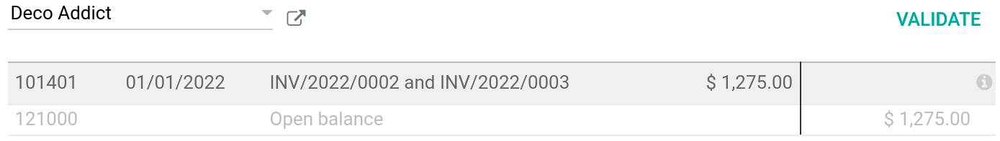

=========================
Reconcile bank statements
=========================

Introduction
============

Bank reconciliation is the process of linking *-or matching-* a registered payment with its
corresponding bank statement. In Odoo, when a registered payment is reconciled with a bill or
invoice, the status of the document changes to :guilabel:`In Payment` rather than :guilabel:`Paid`.
It changes to :guilabel:`Paid` only once the registered payment has been reconciled with a bank
statement. Odoo uses a transitory account called :guilabel:`suspense account` for unreconciled
payments, and automatically changes the account once matched with a bank statement.

.. note::
   Versions below Odoo 14 do not feature a **suspense account** and therefore directly mark a bill
   or an invoice as :guilabel:`Paid` when registering a payment.

Entries can be reconciled either manually or automatically, depending on your needs. If you wish to
automate your reconciliation process, you can refer to
:doc:`the documentation on reconciliation models <reconciliation_models>`.

.. seealso::
   - :doc:`../feeds/bank_synchronization`
   - `Odoo Tutorials: Customer and Vendor Payments
     <https://www.odoo.com/slides/slide/customer-and-vendor-payments-1690?fullscreen=1>`_.

.. note::
   If you wish, you can :ref:`bypass the "In Payment" status <bypass-in-payment>`.

Payment registration
====================

If you have received a payment confirmation from your customer, or if you have made a payment to one
of your vendors, click on :guilabel:`Register Payment` from within the related invoice or bill. Once
you click, a pop-up window appears prompting you to input the payment method and other
payment-related information. When done, click :guilabel:`Create Payment`. The payment status of the
document then changes to :guilabel:`In Payment`.

Bank statement matching
=======================

When the payment is registered, you must now match it with its corresponding bank statement. Head to
:menuselection:`Accounting Dashboard --> Bank journal`, and create a new bank statement. If you have
synchronized your Odoo instance with your bank account, select the imported bank statement that
matches your invoice or bill.

Once the bank statement is filled-out, click on :guilabel:`Post` and then :guilabel:`Reconcile`. On
the reconciliation page, you have to match the payment with the corresponding bank statement. Odoo
automatically suggests matches based on the :guilabel:`Label, Partner`, and :guilabel:`Amount`
fields entered upon the creation or import of the bank statement.

.. example::
   If the bank statement contains *Sarah* in the :guilabel:`Partner` field and the invoice contains
   the same name in the :guilabel:`Customer` field, Odoo will automatically suggest a reconciliation
   between the two entries.

If no matches are suggested or if the match does not correspond with its counterpart entry, you can
always change the partner, or select another payment from the list by clicking on the white line
*(see screenshot below)*.

Finally, click on :guilabel:`Validate` to reconcile both entries. The payment status ribbon now
displays :guilabel:`Paid`.

.. _bypass-in-payment:

"In Payment" status bypass
--------------------------

It is possible to bypass the :guilabel:`In Payment` status of an invoice or bill if needed. Go to
:menuselection:`Accounting Dashboard --> Configuration --> Accounting: Journals`, click on the
:guilabel:`Cash` journal, and enter the :guilabel:`Payments Configuration` tab. Click on
:guilabel:`Edit` and under the :guilabel:`Outgoing Payments` section, change the
:guilabel:`Outstanding Payments Account` field to the *Cash* account. Make sure to :guilabel:`Save`.

When registering a payment, selecting the *Cash* journal when the pop-up window appears will now
effectively bypass the :guilabel:`In Payment` state and set the document status to :guilabel:`Paid`.