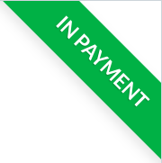
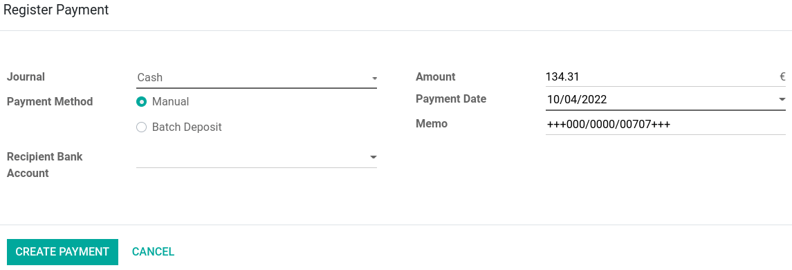
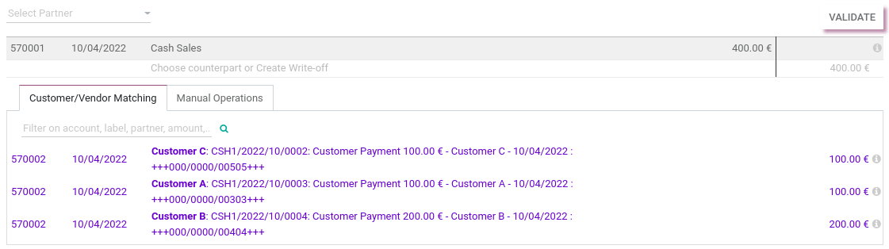

===================
Cash reconciliation
===================

By default in Odoo, payments registered in the **cash journal** are automatically reconciled with an
**outstanding account** and their related invoices or bills marked as *In Payment* until they are
reconciled with a bank statement. It is possible to :ref:`bypass <cash-reconciliation-bypass>` the
*In Payment* status for cash transactions, therefore removing the need to reconcile with a bank
statement.

Cash logs
=========

At the start of each day, create a **cash log**. To do so, go to your :guilabel:`Accounting
Dashboard` and click :guilabel:`New Transaction` in the :guilabel:`Cash` journal.

.. image:: reconciliation_cash/new-transaction.png
   :align: center
   :alt: Create a new cash log.

Enter the :guilabel:`Starting Balance` of your cash float and save, but do *not* post the entry yet.
Create your invoice by going to :menuselection:`Accounting dashboard --> Customers --> Invoices` and
confirm it. Click :guilabel:`Register Payment` and select the cash :guilabel:`Journal`. Repeat the
process for each invoice.

Go back to your :guilabel:`Accounting Dashboard`, and click again on :guilabel:`New transactions`.
Click on the :guilabel:`Add a line` button in the :guilabel:`Transactions` tab, and enter the total
of cash earned during the day. Add a label name according to your needs. Input the amount displayed
under :guilabel:`Computed Balance` in the :guilabel:`Ending Balance` field, and make sure it matches
your end cash float.

Once certain the **computed balance** is correct, click :guilabel:`Save`, :guilabel:`Post`, and
then :guilabel:`Reconcile`. This will take you to the **bank reconciliation** page.

Cash payments reconciliation
============================

On the **bank reconciliation** page, search through the list for the **cash log** transaction you
created earlier. To be able to match all cash payments, make sure no **partner** is selected in the
:guilabel:`Select Partner` field. If a **partner** is selected, click in the field and delete the
partner. Then, pair (or match) each cash payment with your cash log by clicking on the payment in
the :guilabel:`Customer/Vendor Matching`, and :guilabel:`validate`.

.. note::
   If your ending cash balance is **over** or **under** the computed balance, add another
   :guilabel:`Transaction` line corresponding to the **over** or **under** amount in order to match
   it later during reconciliation.

Cash reconciliation bypass
==========================

.. _cash-reconciliation-bypass:

.. important::
   Bypassing the cash journal is recommended **only for organizations** that do not need a
   cash report or do not wish to reconcile cash.

To bypass the *In Payment* status, go to :menuselection:`Accounting app --> Configuration -->
Accounting: Journals` and select the :guilabel:`Cash` journal. Click on the :guilabel:`Payments
Configuration` tab and set a `Cash` account in both the :guilabel:`Outstanding Receipts Account` and
:guilabel:`Outstanding Payments Account` fields, then save. Payments registered in the **cash**
journal now bypass the *In Payment* status.

.. image:: reconciliation_cash/cash-payments-config.png
   :align: center
   :alt: Configuration tab of the cash journal.

.. tip::
   In case you use cash to pay expenses, advance employees, are required to keep records of cash
   flows, or use anything resembling a cash box, you can benefit from creating a second **cash
   journal** that *does* use the **outstanding accounts**. This way, you can both generate *and*
   reconcile bank statements when closing your POS session or your books at the end of the day.
