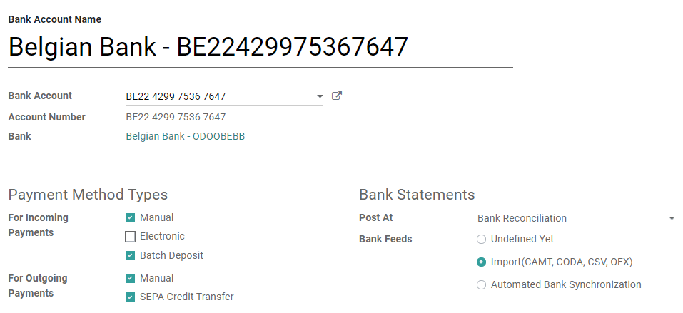

=============
Bank Accounts
=============

You can manage as many **Bank Accounts** as needed on your database. Configuring them well allows
you to make sure that all your banking data is up to date and ready for the reconciliation with your
*Journal Entries*.

In Odoo Accounting, each Bank Account is configured to have a dedicated *Journal* which is
configured to post all entries in a dedicated *Account*.

.. note:: Whenever you add a Bank Account, a dedicated journal and a dedicated account are
   automatically created and configured.

Every **Bank Journal** is displayed by default on the **Accounting Overview** in the form of a
convenient card. It includes action buttons that are displayed when appropriate.

.. _bank_accounts_add:

Add a new Bank Account
======================

You can either connect your bank account to your Odoo database, or configure your bank account
manually and :doc:`upload the bank statements manually <../feeds/bank_statements>`.

Bank Synchronization
--------------------

Connect your bank account to your database and have your bank statements synced automatically.

To synchronize a new bank account, go to :menuselection:`Accounting --> Configuration`, click on
*Add a Bank Account*, then find your bank in the list, click on *Connect*, and follow the
instructions on-screen.

.. note::
   :doc:`Click here <../../bank/feeds/bank_synchronization>` for more information about this bank
   synchronization.

Manual configuration
--------------------

If your Bank Institution can’t be synchronized automatically, or if you prefer not to sync it with
your database, you may also configure your bank account manually.

To add a new bank account manually, go to :menuselection:`Accounting --> Configuration`, click on
*Add a Bank Account*, then on *Create it*, and fill out the form.

- **Name**: the bank account's name, as displayed on Odoo.
- **Account Number**: your bank account number (IBAN in Europe).
- **Bank**: click on *Create and Edit* to configure the bank's details. Add the bank institution's
  name and its Identifier Code (BIC or SWIFT).
- **Code**: this code is your Journal's *Short Code*, as displayed on Odoo. By default, Odoo creates
  a new Journal with this Short Code.
- **Journal**: This field is displayed if you have an existing Bank Journal that is not linked yet
  to a bank account. If so, then select the *Journal* you want to use to record the financial
  transactions linked to this bank account or create a new one by clicking on *Create and Edit*.

.. note::
   Odoo detects the bank account type (e.g., IBAN) and enables some features accordingly.

.. _bank_accounts_configuration:

Advanced configuration
======================

To edit an existing bank account, go to the Accounting dashboard.
Click on the three dots of the account's journal, then on *Configuration*.

There, you can edit the bank account's number, bank feeds, Incoming and Outgoing Payments, and other information related
to this account's Journal.

.. seealso::
   * :doc:`../../bank/feeds/bank_synchronization`
   * :doc:`../feeds/bank_statements`
   * `Odoo Tutorials: Accounting Basics <https://www.odoo.com/r/lsZ>`_