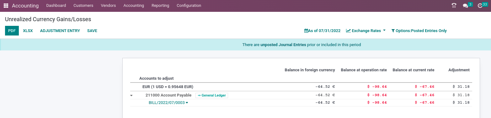
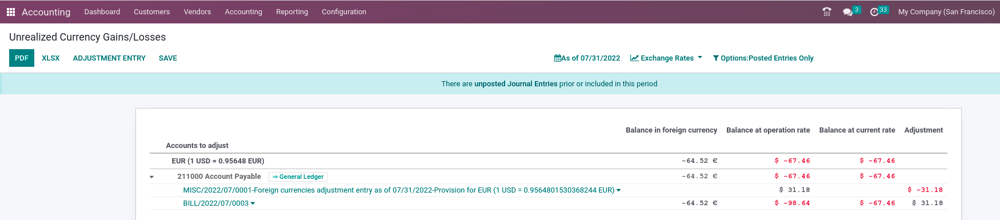

===================================
Manage a bank in a foreign currency
===================================

In Odoo, every transaction is recorded in the default currency of the company. Reports are all based
on the currency of the company. For transactions occurring in another currency, Odoo stores both the
value in the currency of the company and the value in the currency of the transaction.

When you have a bank account in a foreign currencies, for every transaction, Odoo stores two values:

-  The debit/credit in the currency of the company;
-  The debit/credit in the currency of the bank account.

Currency rates are updated automatically using the European Central bank web-services or other
institutions, according to your configuration.

Configuration
=============

Activate the multi-currency feature
-----------------------------------

In order to allow your company to work with multiple currencies, you need to activate the
**multi-currency** mode. In the accounting application, go into :menuselection:`Accounting -->
Configuration --> Settings --> Currencies` and make sure the :guilabel:`Allow Multi-currencies` box
is ticked. Provide a **Currency Exchange Gain / Loss** account and :guilabel:`Save`.

Configure currencies
--------------------

Once Odoo is configured to support multiple currencies, activate the currencies you plan to work
with. To do that, go into :menuselection:`Accounting --> Configuration --> Currencies` or in
:guilabel:`Activate Other Currencies` that appears under :guilabel:`Multi-Currencies` once the box
has been checked. All currencies are created by default, but only a few are active from the start.

Once the currencies are activated, you can choose to **automate** the currency rate update, or leave
it on **manual**. To configure the rate update, under the same :guilabel:`Currencies` menu, check
:guilabel:`Automatic Currency Rates` and set :guilabel:`Interval` to your desired frequency. You
also have the option to choose the :guilabel:`Service` you wish to obtain currency rates from.

Click on the :guilabel:`Update Now` button to update the currency rates manually.

Create a new bank account
-------------------------

In the accounting application, go to :menuselection:`Accounting --> Configuration --> Journals` and
create a new one. Fill in the different fields, and :guilabel:`Save`.

Upon creation of the bank account, Odoo automatically creates an **account**, which is linked to the
created journal and which can be found under :menuselection:`Accounting --> Configuration --> Chart
of Accounts`.

Vendor bill in a foreign currency
=================================

To pay a bill in a foreign currency, simply select the currency type in the :guilabel:`Currency`
field and register the payment. Odoo will automatically post the foreign **exchange gain or loss**
at the reconciliation of bank statement line and the payment.

.. note::
   Note that you can pay a foreign bill with another currency. In that case, Odoo will automatically
   convert between the two currencies.

Unrealized Currency Gains/Losses
================================

This report gives an overview of all unrealized amounts in foreign currency on your balance sheet,
and allows you to adjust an entry or manually set an exchange rate. To access this report, go to
:menuselection:`Reporting --> Unrealized Currency Gains/Losses`. From here, you have access to all
open entries in your **balance sheet**.

- :guilabel:`Balance in foreign currency`: amount in currency of the invoice;
- :guilabel:`Balance at Operation Rate`: amount of the invoice at the invoice date (in main
  currency);
- :guilabel:`Balance at Current rate`: balance at the date of the report;
- :guilabel:`Adjustment`: adjustment required to update your accounting.

If you wish to use a different currency rate than the one set in :menuselection:`Accounting -->
Configuration --> Settings --> Currencies`, click the :guilabel:`Exchange Rates` button and change
the rate of the foreign currencies in the report.

.. image:: foreign_currency/foreign-exchange-rates.png
   :align: center
   :alt: Menu to manually change exchange rates.

When manually changing **exchange rates**, a yellow banner appears allowing you to reset back to
Odoo's rate. To do so, simply click on :guilabel:`Reset to Odoo's Rate`.

.. image:: foreign_currency/foreign-reset-rates.png
   :align: center
   :alt: Banner to reset back to Odoo's rates.

In order to update your **balance sheet** with the amount of the :guilabel:`adjustment` column,
click on the :guilabel:`Adjustment Entry` button. In the pop-up window, select a
:guilabel:`Journal`, :guilabel:`Expense Account` and :guilabel:`Income Account` to calculate and
process the unrealized gains and losses.

You can set the date of the report in the :guilabel:`Date` field. Odoo will automatically reverse
the booking entry to the date set in :guilabel:`Reversal Date`.

Once posted, the :guilabel:`adjustment` column says 0.00€.

