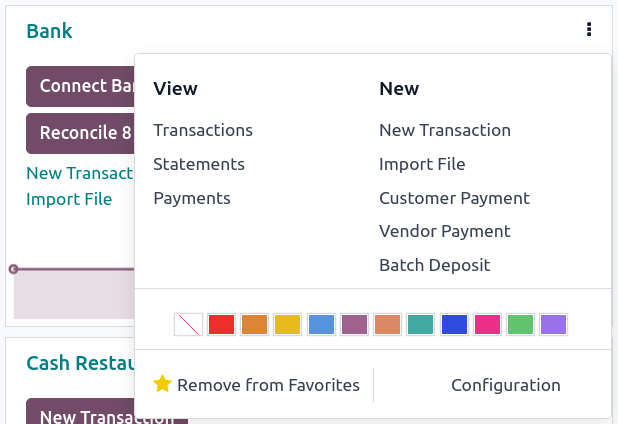
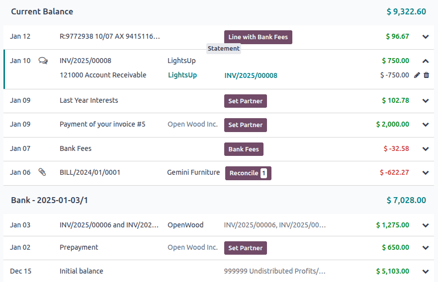

============
Transactions
============

Importing transactions from your bank statements allows keeping track of bank account transactions
and reconciling them with the ones recorded in your accounting.

:doc:`Bank synchronization <bank_synchronization>` automates the process. However, if you do not
want to use it or if your bank is not yet supported, other options exist:

- :ref:`Import bank transactions <transactions/import>` delivered by your bank;
- :ref:`Register bank transactions <transactions/register>` manually.

.. note::
   :ref:`Grouping transactions by statement <transactions/statements>` is optional.

.. _transactions/import:

Import transactions
===================

Odoo supports multiple file formats to import transactions:

- SEPA recommended Cash Management format (CAMT.053);
- Comma-separated values (.CSV);
- Open Financial Exchange (.OFX);
- Quicken Interchange Format (.QIF);
- Belgium: Coded Statement of Account (.CODA).

To import a file, go to the :guilabel:`Accounting Dashboard`, and in the :guilabel:`Bank` journal,
click on :guilabel:`Import Transactions`.

Next, select the file and upload it.

After setting the necessary formatting options and mapping the file columns with their related Odoo
fields, you can run a :guilabel:`Test` and :guilabel:`Import` your bank transactions.

.. seealso::
   :doc:`/applications/general/export_import_data`

.. _transactions/register:

Register bank transactions manually
===================================

You can also record your bank transactions manually. To do so, go to :guilabel:`Accounting
Dashboard`, click on the :guilabel:`Bank` journal, and then on :guilabel:`New`. Make sure to fill
out the :guilabel:`Partner` and :guilabel:`Label` fields to ease the reconciliation process.

.. _transactions/statements:

Statements
==========

A **bank statement** is a document provided by a bank or financial institution that lists the
transactions that have occurred in a particular bank account over a specified period of time.

In Odoo Accounting, it is optional to group transactions by their related statement, but depending
on your business flow, you may want to record them for control purposes.

.. important::
   If you want to compare the ending balances of your bank statements with the ending balances of
   your financial records, *don't forget to create an opening transaction* to record the bank
   account balance as of the date you begin synchronizing or importing transactions. This is
   necessary to ensure the accuracy of your accounting.

To access a list of statements, go to your :guilabel:`Accounting Dashboard`, click on the vertical
ellipsis (:guilabel:`⋮`) button next to the bank or cash journal you want to check, then on
:guilabel:`Statements`

Statement creation from the kanban view
---------------------------------------

Open the bank reconciliation view by clicking on the name of the bank journal, and identify the
transaction corresponding to the last transaction of your bank statement. Click on the
:guilabel:`STATEMENT` button when hovering on the upper separator line.

Fill out the statement's details and save. The newly created statement includes the previous
transactions following the last statement.

Statement creation from the list view
-------------------------------------

Open the list of transactions by clicking on the name of the bank journal and switching to the list
view. Select all the transactions corresponding to the bank statement, and, in the
:guilabel:`Statement` column, select an existing statement or create a new one by typing its
reference, clicking on :guilabel:`Create and edit...`, filling out the statement's details, and
saving.
