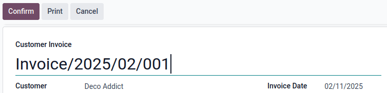
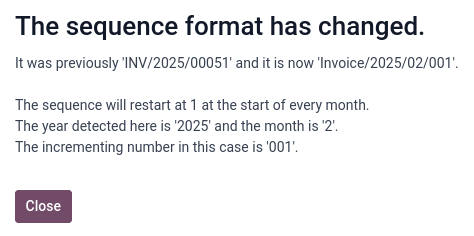
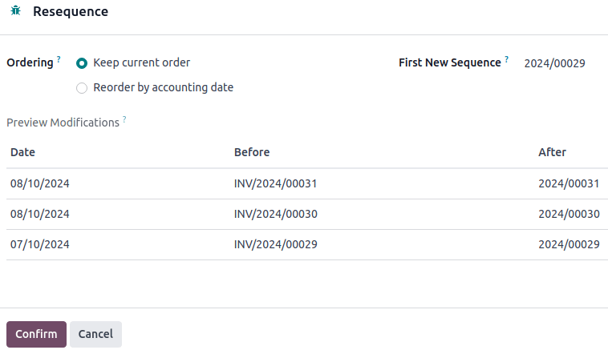

:show-content:

=================
Customer invoices
=================

A customer invoice is a document issued by a company for products and/or services sold to a
customer. It records receivables as they are sent to customers. Customer invoices can include
amounts due for the goods and/or services provided, applicable sales taxes, shipping and handling
fees, and other charges. Odoo supports multiple invoicing and payment workflows.

.. seealso::
   :doc:`/applications/finance/accounting/customer_invoices/overview`

From draft invoice to profit and loss report, the process involves several steps once the goods (or
services) have been ordered/shipped (or rendered) to a customer, depending on the invoicing policy:

- :ref:`accounting/invoice/creation`
- :ref:`accounting/invoice/confirmation`
- :ref:`accounting/invoice/sending`
- :ref:`accounting/invoice/paymentandreconciliation`
- :ref:`accounting/invoice/followup`
- :ref:`accounting/invoice/reporting`

.. _accounting/invoice/creation:

Invoice creation
================

Draft invoices can be created directly from documents like sales orders or purchase orders or
manually from the :guilabel:`Customer Invoices` journal in the :guilabel:`Accounting Dashboard`.

An invoice must include the required information to enable the customer to pay promptly for their
goods and services. Make sure the following fields are appropriately completed:

- :guilabel:`Customer`: When a customer is selected, Odoo automatically pulls information from the
  customer record like the invoice address,
  :doc:`preferred payment terms <customer_invoices/payment_terms>`,
  :doc:`fiscal positions <taxes/fiscal_positions>`, receivable account, and more onto the invoice.
  To change these values for this specific invoice, edit them directly on the invoice. To change
  them for future invoices, change the values on the contact record.
- :guilabel:`Invoice Date`: If not set manually, this field is automatically set as the current date
  upon confirmation.
- :guilabel:`Due Date` or :doc:`payment terms <customer_invoices/payment_terms>`: To specify when
  the customer has to pay the invoice.
- :guilabel:`Journal`: Automatically set and can be changed if needed.
- :doc:`Currency <get_started/multi_currency>`. If the invoice's currency differs from the
  company's currency, the currency exchange rate is automatically displayed.

In the :guilabel:`Invoice Lines` tab:

- :guilabel:`Product`: Click :guilabel:`Add a line`, then search for and select the product.
- :guilabel:`Quantity`
- :guilabel:`Price`
- :doc:`Taxes <taxes>` (if applicable)

To access the product catalog and view all items in an organized display, click :doc:`Catalog
</applications/inventory_and_mrp/inventory/warehouses_storage/inventory_management/product_catalog>`.
When the products and quantities are selected, click :guilabel:`Back to Invoice` to return to the
invoice; the selected catalog items will appear in the invoice lines.

.. tip::
   To display the total amount of the invoice in words, go to :menuselection:`Accounting -->
   Configuration --> Settings` and activate the :guilabel:`Total amount of invoice in letters`
   option.

The :guilabel:`Journal Items` tab displays the accounting entries created. Additional invoice
information such as the :guilabel:`Customer Reference`, :guilabel:`Payment Reference`, :doc:`Fiscal
Positions <taxes/fiscal_positions>`, :doc:`Incoterms <customer_invoices/incoterms>`, and more can be
added or modified in the :guilabel:`Other Info` tab.

.. note::
   Odoo initially creates invoices in :guilabel:`Draft` status. Draft invoices have no accounting
   impact until they are :ref:`confirmed <accounting/invoice/confirmation>`.

.. seealso::
   :doc:`/applications/sales/sales/invoicing/proforma`

.. _accounting/invoice/confirmation:

Invoice confirmation
====================

Click :guilabel:`Confirm` when the invoice is completed. The invoice's status changes to
:guilabel:`Posted`, and a journal entry is generated based on the invoice configuration. On
confirmation, Odoo assigns each invoice a unique number from a defined :ref:`sequence
<accounting/invoice/sequence>`.

.. note::
   - Once confirmed, an invoice can no longer be updated. Click :guilabel:`Reset to draft` if
     changes are needed.
   - If required, invoices and other journal entries can be locked once posted using the
     :ref:`Secure posted entries with hash <data-inalterability/restricted>` feature.

.. _accounting/invoice/sending:

Invoice sending
===============

To set a preferred :guilabel:`Invoice sending` method for a customer, go to
:menuselection:`Accounting --> Customers --> Customers` and select the customer. In the
:guilabel:`Accounting` tab of the contact form, select the preferred :guilabel:`Invoice sending`
method in the :guilabel:`Customer Invoices` section.

.. note::
   Sending letters in Odoo requires :doc:`In-App Purchase (IAP) <../../essentials/in_app_purchase>`
   credit or tokens.

To send the invoice to the customer, navigate back to the invoice record and follow these steps:

#. Click :guilabel:`Print & Send`.
#. If the :ref:`default invoice layout <studio/pdf-reports/default-layout>` has not been customized
   yet, a :guilabel:`Configure your document layout` pop-up window appears. Configure the layout and
   click :guilabel:`Continue`.

   .. note::
      - The document layout can be changed at any time in the general settings.
      - To add a QR code for banking app payments to the invoice, enable the :guilabel:`QR Code`
        option in the :guilabel:`Configure Your Document Layout` window. To modify this option, go
        to :menuselection:`Accounting --> Configuration --> Settings`, scroll down to the
        :guilabel:`Customer Payments` section, and enable/disable the :guilabel:`QR Codes` option.

#. In the :guilabel:`Print & Send` window:

   - If a preferred :guilabel:`Invoice sending` method was set in the contact form, it is selected
     by default. Select another one if needed.
   - If no preferred :guilabel:`Invoice sending` method was set in the contact form, select the
     method to use for sending the invoice to the customer.

#. Click :guilabel:`Print & Send` if the :guilabel:`by Email` option is selected, or click
   :guilabel:`Print`.

.. _accounting/invoice/sending-multiple-invoices:

Sending multiple invoices
-------------------------

To send and print multiple invoices, go to :menuselection:`Accounting --> Customers --> Invoices`,
select them in the :guilabel:`Invoices` list view and click :guilabel:`Print & Send`. The
:guilabel:`Print & Send` window displays the selected invoice sending methods based on the preferred
method set.

A banner is added to the selected invoices to indicate they are part of an ongoing send and print
batch. This helps prevent the process from being triggered manually again, as it may take some time
to complete for exceptionally large batches.

To check all invoices that have not yet been sent, go to :menuselection:`Accounting --> Customers
--> Invoices`. In the :guilabel:`Invoices` list view, click into the search bar and filter on
:guilabel:`Not Sent`.

.. _accounting/invoice/paymentandreconciliation:

Payment and reconciliation
==========================

In Odoo, an invoice is considered :guilabel:`Paid` when the associated accounting entry has been
reconciled with a corresponding bank transaction.

.. seealso::
   - :doc:`payments`
   - :doc:`bank/reconciliation`

.. _accounting/invoice/followup:

Payment follow-up
=================

Odoo's :doc:`follow-up actions <payments/follow_up>` help companies follow up on customer invoices.
Different actions can be set up to remind customers to pay their outstanding invoices, depending on
how much the customer is overdue. These actions are bundled into follow-up levels that trigger when
an invoice is overdue by a certain number of days. If there are multiple overdue invoices for the
same customer, the actions are performed on the most overdue invoice.

.. _accounting/invoice/sequence:

Invoice sequence
================

When confirming an invoice, Odoo generates a unique invoice reference number. By default, Odoo uses
the following sequence format `INV/year/incrementing-number` (e.g., `INV/2025/00001`), which
restarts from `00001` each year.

However, it is possible to :ref:`change the sequence format <accounting/invoice/resequencing>` and
its periodicity, and to :ref:`mass-resequence invoices <accounting/invoice/mass-resequencing>`.

.. note::
   Changes made to reference numbers are logged in the chatter.

.. _accounting/invoice/resequencing:

Changing the default sequence
-----------------------------

To customize the default sequence, open the last confirmed invoice, click :guilabel:`Reset to
Draft`, and edit the invoice's reference number.

Odoo then explains how the detected format will be applied to all future invoices. For example, if
the current invoice's month is added, the sequence's periodicity will change to every month instead
of every year.

.. tip::
   The sequence format can be edited directly when creating the first invoice of a given sequence
   period.

.. _accounting/invoice/mass-resequencing:

Mass-resequencing invoices
--------------------------

It can be helpful to resequence multiple invoice numbers. For example, when importing invoices from
another invoicing or accounting system and the reference originates from the previous software,
continuity for the current year must be maintained without restarting from the beginning.

.. note::
   This feature is only available to users with administrator or advisor access.

Follow these steps to resequence invoice numbers:

#. Activate the :ref:`developer mode <developer-mode>`.
#. From the :guilabel:`Accounting Dashboard`, open the :guilabel:`Customer Invoices` journal.
#. Select the invoices that need a new sequence.
#. Click the :icon:`fa-cog` :guilabel:`Actions` menu and select :guilabel:`Resequence`.
#. In the :guilabel:`Ordering` field, choose to

   - :guilabel:`Keep current order`: The order of the numbers remains the same.
   - :guilabel:`Reorder by accounting date`: The number is reordered by accounting date.

#. Set the :guilabel:`First New Sequence`.
#. :guilabel:`Preview Modifications` and click :guilabel:`Confirm`.

The first invoice using the new sequence appears in red in the :guilabel:`Customer Invoices` list.

.. _accounting/invoice/reporting:

Reporting
=========

.. _accounting/invoice/partner-reports:

Partner reports
---------------

.. _accounting/invoices/partner-ledger:

Partner Ledger
~~~~~~~~~~~~~~

The :guilabel:`Partner Ledger` report shows the balance of customers and suppliers. To access it,
go to :menuselection:`Accounting --> Reporting --> Partner Ledger`.

.. _accounting/invoices/aging-report:

Aged Receivable
~~~~~~~~~~~~~~~

To review outstanding customer invoices and their related due dates, use the :ref:`Aged Receivable
<accounting/reporting/aged-receivable>` report. To access it, go to :menuselection:`Accounting -->
Reporting --> Aged Receivable`.

.. _accounting/invoices/aged-payable:

Aged Payable
~~~~~~~~~~~~

To review outstanding vendor bills and their related due dates, use the :ref:`Aged Payable
<accounting/reporting/aged-payable>` report. To access it, go to :menuselection:`Accounting -->
Reporting --> Aged Payable`.

.. _accounting/invoices/profit-and-loss:

Profit and Loss
---------------

The :ref:`Profit and Loss <accounting/reporting/profit-and-loss>` statement shows details of income
and expenses.

.. _accounting/invoices/balance-sheet:

Balance sheet
-------------

The :ref:`Balance Sheet <accounting/reporting/balance-sheet>` summarizes the company's assets,
liabilities, and equity at a specific time.

.. toctree::
   :titlesonly:

   customer_invoices/overview
   customer_invoices/customer_addresses
   customer_invoices/payment_terms
   customer_invoices/terms_conditions
   customer_invoices/cash_discounts
   customer_invoices/credit_notes
   customer_invoices/cash_rounding
   customer_invoices/deferred_revenues
   customer_invoices/electronic_invoicing
   customer_invoices/snailmail
   customer_invoices/epc_qr_code
   customer_invoices/incoterms
