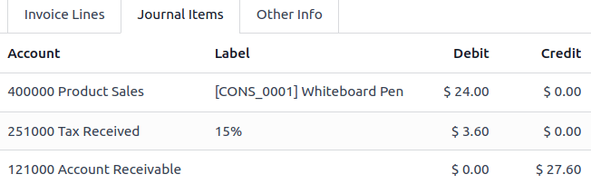
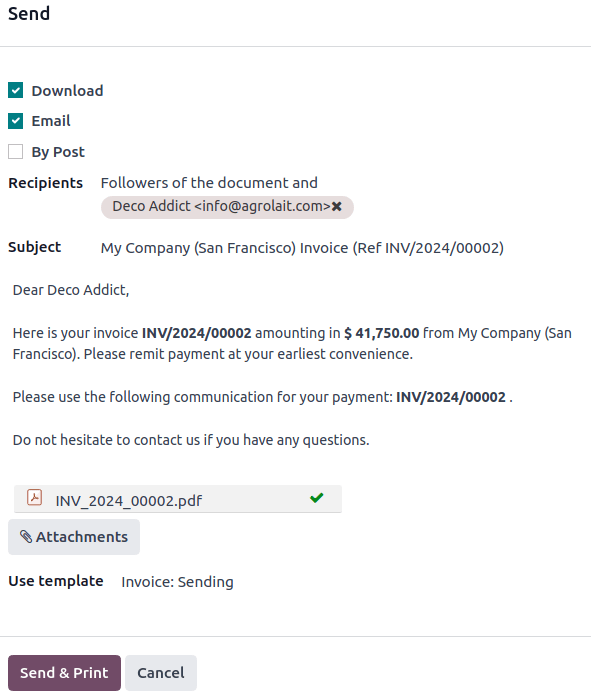

:show-content:

=================
Customer invoices
=================

A customer invoice is a document issued by a company for products and/or services sold to a
customer. It records receivables as they are sent to customers. Customer invoices can include
amounts due for the goods and/or services provided, applicable sales taxes, shipping and handling
fees, and other charges.
Odoo supports multiple invoicing and payment workflows.

.. seealso::
   - :doc:`/applications/finance/accounting/customer_invoices/overview`

From draft invoice to profit and loss report, the process involves several steps once the goods are
shipped to a customer:

- :ref:`accounting/invoice/creation`
- :ref:`accounting/invoice/confirmation`
- :ref:`accounting/invoice/sending`
- :ref:`accounting/invoice/paymentandreconciliation`
- :ref:`accounting/invoice/followup`
- :ref:`accounting/invoice/reporting`

.. note::
   Odoo :guilabel:`Invoicing` is a standalone app designed to create invoices, send them to
   customers, and manage payments. On the other hand, the :guilabel:`Accounting` app is a
   comprehensive accounting solution that allows the same actions to be performed.

.. _accounting/invoice/creation:

Invoice creation
================

Draft invoices can be manually created from documents like sales orders or purchase orders or
directly from the :guilabel:`Customer Invoices` journal in the :guilabel:`Accounting Dashboard`.

An invoice must include the required information to enable the customer to pay promptly for the
goods and services ordered and delivered. Make sure the following fields are appropriately
completed:

- :guilabel:`Customer`: Odoo automatically fills in some information based on the customer’s
  registered information and previous invoices.
- :guilabel:`Invoice Date`: is automatically filled in when the invoice is confirmed.
- :guilabel:`Payment Reference`: is the reference to be set as the payment reference to facilitate
  reconciliation. It's automatically filled in when the invoice is confirmed.
- :guilabel:`Due Date` or :guilabel:`Payment terms`: to specify when the customer has to pay the
  invoice.
- :guilabel:`Journal`: is automatically set and can be changed if needed.
- :doc:`Currency <get_started/multi_currency>`
- :guilabel:`Product`
- :guilabel:`Quantity`
- :guilabel:`Price`
- :guilabel:`Taxes` (if applicable).

To display the total amount of the invoice in words, go to :menuselection:`Accounting -->
Configuration --> Settings` and activate the :guilabel:`Total amount of invoice in letters` option.

The :guilabel:`Journal Items` tab displays the accounting entries created.
To add specific invoice/accounting information, fill in the :guilabel:`Other Info` tab.

The system initially creates invoices in :guilabel:`Draft` status. While they remain unvalidated,
draft invoices have no accounting impact within the system. When previewing a draft invoice,
:guilabel:`Proforma` is added before the invoice reference, as proforma invoices are issued to
request payment from the buyer before the goods or services are provided.

.. _accounting/invoice/confirmation:

Invoice confirmation
====================

Click :guilabel:`Confirm` when the document is completed. The document's status changes to
:guilabel:`Posted`, and a journal entry is generated based on the invoice configuration. The
:guilabel:`Journal Items` tab is then filled.

On confirmation, Odoo assigns each document a unique number from a defined sequence consisting of a
prefix and a number. The prefix combines the journal code and the entry date. It is used to classify
entries by period. The number is unique for each period and is used to identify the entry. The
default sequence on customer invoices is INV/YYYY/number. In some specific cases,
:ref:`resequencing <accounting/invoice/resequencing>` might be necessary.

When previewing a confirmed invoice, :guilabel:`Proforma` is added before the invoice reference, as
proforma invoices are issued to request payment from the buyer before the goods or services are
provided.

.. note::
   Once confirmed, an invoice can no longer be updated. Click :guilabel:`Reset to draft` if
   changes are required.

.. _accounting/invoice/sending:

Invoice sending
===============

To send the invoice to the customer, click :guilabel:`Send & Print`. A :guilabel:`Configure your
document layout` pop-up window will appear if a :ref:`default invoice layout
<studio/pdf-reports/default-layout>` hasn't been customized.
To send it to the customer's email address and download a PDF of the document, click
:guilabel:`Send & Print` (enable the :guilabel:`By Post` option if needed).

To send and print multiple invoices, go to the list view and select them. In the :icon:`fa-cog`
:guilabel:`Actions` menu, select the :guilabel:`Send & Print` option. A banner will appear on the
selected invoices to indicate they are part of an ongoing send and print batch. This helps prevent
the process from being triggered manually again, as it may take some time to complete.

.. _accounting/invoice/paymentandreconciliation:

Payment and reconciliation
==========================

In Odoo, an invoice is considered :guilabel:`Paid` when the associated accounting entry has been
reconciled with the payment entries.

.. seealso::
   - :doc:`payments`
   - :doc:`bank/reconciliation`

.. _accounting/invoice/followup:

Payment follow-up
=================

Odoo helps define a follow-up strategy. Different actions can be set up to remind customers to pay
their outstanding invoices, depending on how much the customer is overdue. The system
bundles these actions into follow-up levels that trigger when an invoice is overdue by a certain
number of days. If there are other overdue invoices for the same customer, the actions are performed
on the most overdue invoice.

.. _accounting/invoice/followup-reports:

Follow-up Reports
-----------------

To set the different follow-up levels, go to
:menuselection:`Accounting --> Configuration --> Follow-up Levels`. All actions triggered after a
specified number of days can be viewed. To manage the various options, such as the number of days,
the type of reminder sent, or whether the action is automated, click on the specific line that needs
to be updated.

Then, follow these steps to take the appropriate action:

- To access the list of customers requiring action along with the :guilabel:`Total Due` and
  :guilabel:`Total Overdue` amounts, go to
  :menuselection:`Accounting --> Customers --> Follow-up Reports`.
- To get a full overview of the customer's open invoices, click on its line.
- To open a payment reminder to be sent to the customer, click the :guilabel:`Follow up` button.
- To exclude any invoices from the follow-up, enable the option :guilabel:`Exclude from Follow-ups`
  for the selected ones.

.. _accounting/invoices/aging-report:

Aged Receivable
---------------

To review outstanding customer invoices and their related due dates, use the
:ref:`Aged Receivable <accounting/reporting/aged-receivable>` report. To access it, go to
:menuselection:`Accounting --> Reporting --> Aged Receivable`.

.. _accounting/invoice/reporting:

Reporting
=========

Profit and Loss
---------------

The :ref:`Profit and Loss <accounting/reporting/profit-and-loss>` statement shows details of income
and expenses.

Balance sheet
-------------

The :ref:`Balance Sheet <accounting/reporting/balance-sheet>` summarizes the company's liabilities,
assets, and equity at a specific time.

.. _accounting/invoice/resequencing:

Resequencing
============

:guilabel:`Resequence` is a technical feature used to change the sequence of documents. It can be
helpful to resequence invoice numbers when importing invoices from another invoicing or accounting
system, mainly if the reference originates from the previous software and continuity for the current
year must be maintained without restarting from the beginning.

The sequence can be modified once an invoice is in the system.

.. note::

   - This feature is only available to users with administrator or advisor access.
   - All sequence changes are logged in the chatter to keep the information.

Here are the different steps to resequence invoice numbers:

#. Activate the :ref:`developer mode <developer-mode>`.
#. From the :guilabel:`Accounting Dashboard`, open the :guilabel:`Customer Invoices` journal.
#. Select the documents that need a new sequence.
#. In the :icon:`fa-cog` :guilabel:`Actions` menu, click :guilabel:`Resequence`.
#. In the :guilabel:`Ordering` field, choose to

   - :guilabel:`Keep current order`: the order of the numbers remains the same
   - :guilabel:`Reorder by accounting date`: the number is reordered by accounting date.
#. Set the :guilabel:`First New Sequence`.
#. :guilabel:`Preview Modifications` and click :guilabel:`Confirm`.

.. image:: customer_invoices/invoice-sequencing.png
   :alt: Resequence options window

In some cases, resequencing is not possible:

- When entries are previous to a lock date.
- When changing the date of a previously posted invoice from another period, the sequence is not
  aligned with the existing sequence used for the new date set.
- When the sequence leads to a duplicate.

.. toctree::
   :titlesonly:

   customer_invoices/overview
   customer_invoices/customer_addresses
   customer_invoices/payment_terms
   customer_invoices/terms_conditions
   customer_invoices/cash_discounts
   customer_invoices/credit_notes
   customer_invoices/cash_rounding
   customer_invoices/deferred_revenues
   customer_invoices/electronic_invoicing
   customer_invoices/snailmail
   customer_invoices/epc_qr_code
   customer_invoices/incoterms
