================================================================
Electronic invoicing (:abbr:`EDI (electronic data interchange)`)
================================================================

EDI, or electronic data interchange, is the inter-company communication of business documents, such
as purchase orders and invoices, in a standard format. Sending documents according to an EDI
standard ensures that the machine receiving the message can interpret the information correctly.
Various EDI file formats exist and are available depending on your company's country.

EDI feature enables automating the administration between companies and might also be required by
some governments for fiscal control or to facilitate the administration.

Electronic invoicing of your documents such as customer invoices, credit notes or vendor bills is
one of the application of EDI.

Odoo supports e-invoicing in many countries. Refer to the country's page for more details:

- :doc:`Austria <electronic_invoicing/austria>`
- :doc:`Belgium <electronic_invoicing/belgium>`
- :doc:`Croatia <electronic_invoicing/croatia>`
- :doc:`Denmark <electronic_invoicing/denmark>`
- :doc:`Estonia <electronic_invoicing/estonia>`
- :doc:`Finland <electronic_invoicing/finland>`
- :doc:`France <electronic_invoicing/france>`
- :doc:`Germany <electronic_invoicing/germany>`
- :doc:`Hungary <electronic_invoicing/hungary>`
- :doc:`Ireland <electronic_invoicing/ireland>`
- :doc:`Italy <electronic_invoicing/italy>`
- :doc:`Latvia <electronic_invoicing/latvia>`
- :doc:`Lithuania <electronic_invoicing/lithuania>`
- :doc:`Luxembourg <electronic_invoicing/luxembourg>`
- :doc:`Netherlands <electronic_invoicing/netherlands>`
- :doc:`Norway <electronic_invoicing/norway>`
- :doc:`Poland <electronic_invoicing/poland>`
- :doc:`Portugal <electronic_invoicing/portugal>`
- :doc:`Romania <electronic_invoicing/romania>`
- :doc:`Slovenia <electronic_invoicing/slovenia>`
- :doc:`Spain <electronic_invoicing/spain>`
- :doc:`Spain - Basque Country <electronic_invoicing/basque_country>`

.. seealso::
   :doc:`Fiscal localizations documentation <../../fiscal_localizations>`

.. _e-invoicing/configuration:

Configuration
=============

By default, the format available in the :ref:`send window <e-invoicing/generation>` depends on your
customer's country.

You can define a specific e-invoicing format for each customer. To do so, go to
:menuselection:`Accounting --> Customers --> Customers`, open the customer form, go to the
:guilabel:`Accounting` tab and select the appropriate format.

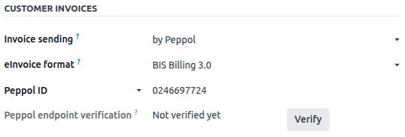

National electronic invoicing
-----------------------------

Depending on your company's country (e.g., :doc:`Italy <../../fiscal_localizations/italy>`,
:doc:`Spain <../../fiscal_localizations/spain>`, :doc:`Mexico
<../../fiscal_localizations/mexico>`, etc.), you may be required to issue e-invoicing documents in
a specific format for all your invoices. In this case, you can define a default e-invoicing format
for your sales journal.

To do so, go to :menuselection:`Accounting --> Configuration --> Journals`, open your sales journal,
go to the :guilabel:`Advanced Settings` tab, and enable the formats you need for this journal.

.. _e-invoicing/generation:

E-invoices generation
=====================

From a confirmed invoice, click :guilabel:`Send & Print` to open the send window. Check the
e-invoicing option to generate and attach the e-invoice file.

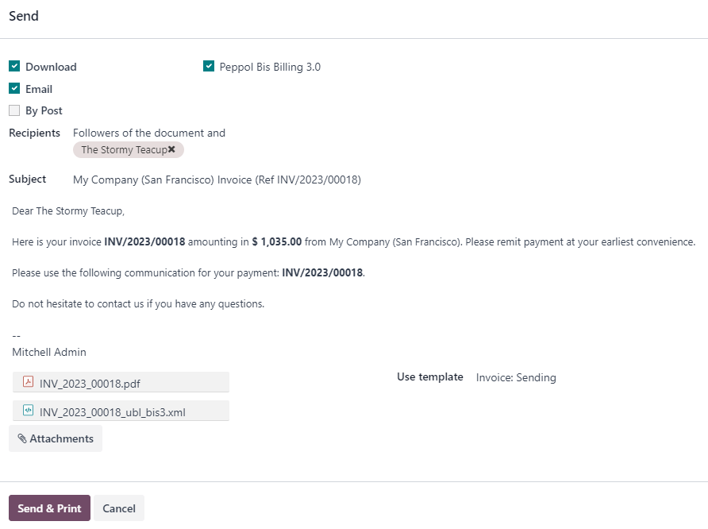

Peppol
======

The `Peppol <https://peppol.org/about/>`_ network ensures the exchange of documents and information
between enterprises and governmental authorities. It is primarily used for electronic invoicing, and
its access points (connectors to the Peppol network) allow enterprises to exchange electronic
documents.

Odoo is an **access point** and an :abbr:`SMP (Service Metadata Publisher)`, enabling electronic
invoicing transactions without the need to send invoices and bills by email or post.

If not done yet, :ref:`install <general/install>` the :guilabel:`Peppol` module (`account_peppol`).

.. important::
   - Peppol registration is **free** and available in Odoo Community
   - You can send **Customer Invoices** and **Credit Notes** and receive **Vendor Bills** and
     **Refunds** via Peppol.
   - You can send and receive in one of the following supported document formats:
     **BIS Billing 3.0, XRechnung CIUS, NLCIUS**.
   - | The following **countries** are eligible for **Peppol registration in Odoo**:
     | Andorra, Albania, Austria, Bosnia and Herzegovina, Belgium, Bulgaria, Switzerland, Cyprus,
       Czech Republic, Germany, Denmark, Estonia, Spain, Finland, France, United Kingdom, Greece,
       Croatia, Hungary, Ireland, Iceland, Italy, Liechtenstein, Lithuania, Luxembourg, Latvia,
       Monaco, Montenegro, North Macedonia, Malta, Netherlands, Norway, Poland, Portugal, Romania,
       Serbia, Sweden, Slovenia, Slovakia, San Marino, Turkey, Holy See (Vatican City State)

Registration
------------

Go to :menuselection:`Accounting --> Configuration --> Settings`. If you do not have the
Peppol module installed, first tick the :guilabel:`Enable PEPPOL` checkbox and then **manually
save**. Click :guilabel:`Start sending via Peppol` to open the registration form.

.. note::
   This registration form also pops up if you choose to :guilabel:`Send & Print` an
   invoice via Peppol without completing the registration process.

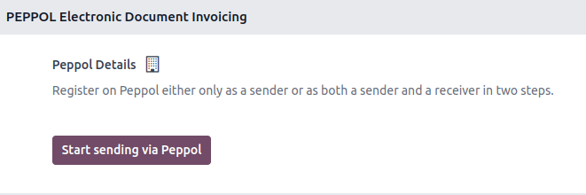

You can register either as a sender or a receiver. A sender can only send invoices and credit notes
on Odoo via Peppol, without ever registering as a Peppol participant on Odoo SMP. If you have an
existing Peppol registration elsewhere that you want to keep, but want to send invoices from your
Odoo database and receive other documents in another software, register as a **sender**.

.. tip::
   - You can always register as a sender first and register to receive documents later.
   - When registering, you can specify if you would also like to receive documents.

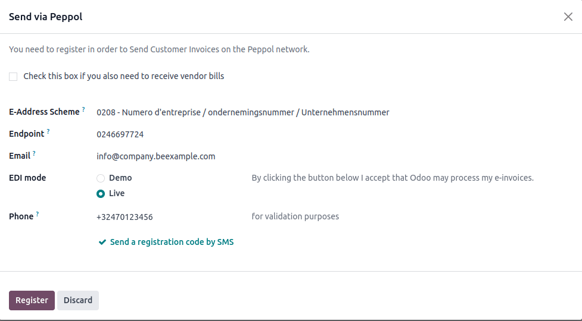

Fill in the following information:

- Check the receiver box if you want to register on Odoo SMP. If you are migrating from another
  service provider, insert the :guilabel:`Migration key` from the previous provider (the field
  becomes visible after you tick the checkbox).
- :guilabel:`E-Address Scheme`: the Peppol Electronic Address Scheme usually depends on your
  company's country. Odoo often prefills this with the most commonly used EAS code in your country.
  For example, the preferred EAS code for most companies in Belgium is `0208`.
- :guilabel:`Endpoint`: this is usually a Company Registry number or a VAT number.
- :guilabel:`Phone`: phone number including the country code (e.g., `+32` in Belgium).
- :guilabel:`Email`: this is the email Odoo can use to contact you regarding your Peppol
  registration.

If you want to explore or demo Peppol, you can choose to register in :guilabel:`Demo` mode.
Otherwise, select :guilabel:`Live`.

.. tip::
   - Selecting :guilabel:`Demo` simulates everything in Odoo. There is no sending, receiving, or
     partner verification.
   - For **advanced users only**, it is possible to run tests on Peppol's test network. The server
     allows to register on Peppol and send/receive test invoices to/from other participants.
     To do so, enable the :ref:`developer-mode`, open the **Settings** app, go to
     :menuselection:`Technical --> System Parameters`, and search for `account_peppol.edi.mode`.
     Click the parameter and change the :guilabel:`Value` to `test`. Go back to the Peppol setup
     menu in the **Settings** app. The option :guilabel:`Test` is now available.

   .. image:: electronic_invoicing/peppol-system-parameter.png
      :alt: Peppol test mode parameter

.. seealso::
   - `Peppol EAS - European Commision <https://ec.europa.eu/digital-building-blocks/wikis/display/DIGITAL/Code+lists/>`_
   - `Peppol Endpoint - OpenPeppol eDEC Code Lists <https://docs.peppol.eu/edelivery/codelists/>`_
     (open the "Participant Identifier Schemes" as HTML page)

When set up, request a verification code to be sent to you by clicking :guilabel:`Send a
registration code by SMS`. A text message containing a code is sent to the phone number provided to
finalize the verification process.

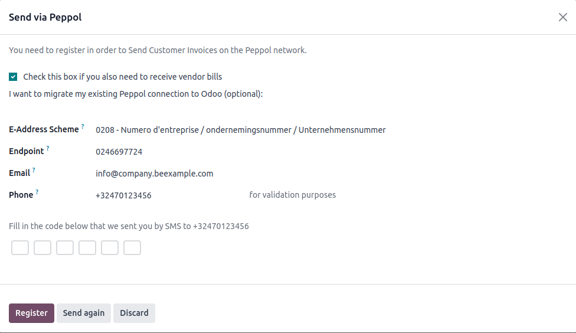

Once you enter the code and click :guilabel:`Register`, your Peppol participant status is updated.
If you chose to only send documents, then the status changes to :guilabel:`Can send but
not receive`.
If you opted to receive documents as well, the status changes to :guilabel:`Can send, pending
registration to receive`. In that case, it should be automatically activated within a day.

Then, set the default journal for receiving vendor bills in the :guilabel:`Incoming Invoices
Journal`.

.. tip::
   To manually trigger the cron that checks the registration status, enable the
   :ref:`developer-mode`, then go to :menuselection:`Settings --> Technical --> Scheduled Actions`,
   and search for the :guilabel:`PEPPOL: update participant status` action.

Your receiver application status should be updated soon after you are registered on the Peppol
network.

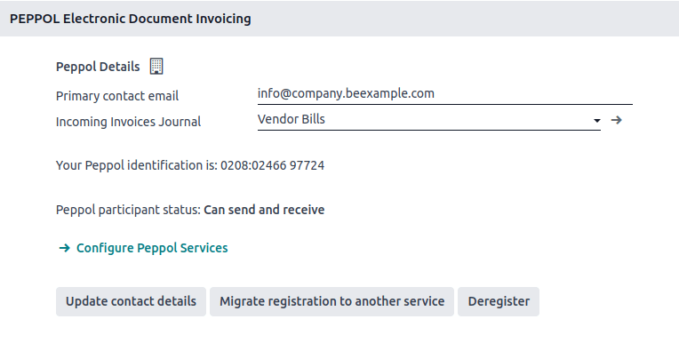

All invoices and vendor bills can now be sent directly using the Peppol network.

.. important::
   To update the email that Odoo can use to contact you, modify the email and click
   :guilabel:`Update contact details`.

Configure Peppol services
-------------------------

Once you are registered on Odoo SMP, the :guilabel:`Configure Peppol Services` button
becomes visible to allow you to enable or disable document formats that other participants
can send you via Peppol. By default, all document formats supported by Odoo are enabled (depending
on the installed modules).

Contact verification
--------------------

Before sending an invoice to a contact using the Peppol network, it is necessary to verify that they
are also registered as a Peppol participant.

To do so, go to :menuselection:`Accounting --> Customers --> Customers` and open the customer's
form. Then go to :menuselection:`Accounting tab --> Electronic Invoicing`, select the correct
format, and make sure their :guilabel:`Peppol EAS code` and the :guilabel:`Endpoint` are filled in.
Then, click :guilabel:`Verify`. If the contact exists on the network, their Peppol endpoint validity
is set to Valid.

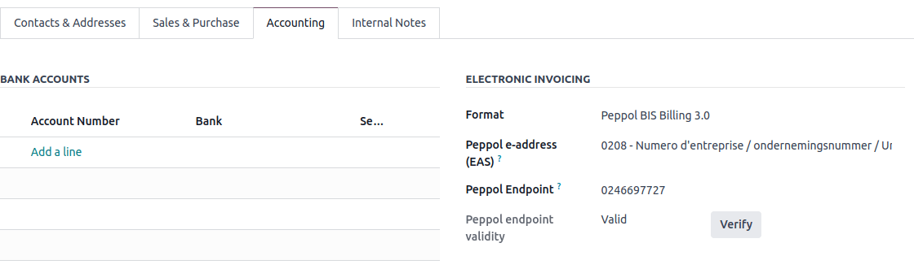

.. important::
   While Odoo prefills both the EAS code and the Endpoint number based on the information available
   for a contact, it is better to confirm these details directly with the contact.

It is possible to verify the Peppol participant status of several customers at once.
To do so, go to :menuselection:`Accounting --> Customers --> Customers` and switch to the list view.
Select the customers you want to verify and then click :menuselection:`Actions --> Verify Peppol`.

If the participant is registered on the Peppol network but cannot receive the format you selected
for them, the :guilabel:`Peppol endpoint validity` label changes to :guilabel:`Cannot
receive this format`.

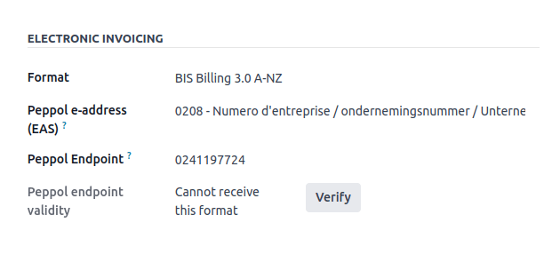

Send invoices
-------------

Once ready to send an invoice via the Peppol network, simply click :guilabel:`Send & Print` on the
invoice form. To queue multiple invoices, select them in the list view and click
:menuselection:`Actions --> Send & Print`; they will be sent in a batch later on. Both
:guilabel:`BIS Billing 3.0` and :guilabel:`Send via PEPPOL` checkboxes need to be ticked.

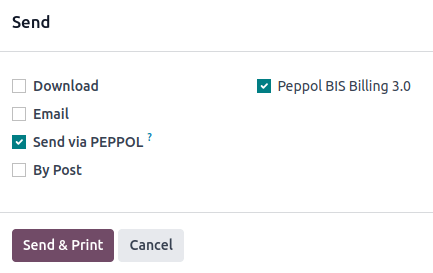

Posted invoices that can be sent via Peppol are marked as :guilabel:`Peppol Ready`.
To display them, use the :guilabel:`Peppol Ready` filter or access the Accounting dashboard and
click :guilabel:`Peppol ready invoices` on the corresponding sales journal.

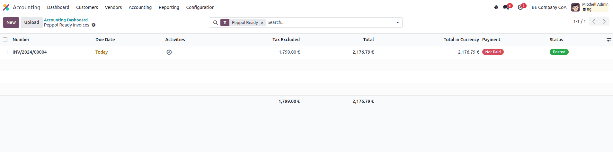

Once the invoices are sent via Peppol, the status is changed to :guilabel:`Processing`. The
status is changed to `Done` after they have been successfully delivered to the contact's Access
Point.

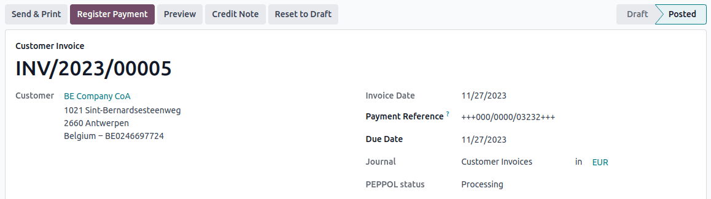

.. tip::
   By default, the Peppol status column is hidden on the Invoices list view. You can choose to have
   it displayed by selecting it from the optional columns, accessible from the top right corner of
   the Invoices list view.

A cron runs regularly to check the status of these invoices. It is possible to check the status
before the cron runs by clicking :guilabel:`Fetch Peppol invoice status` in the corresponding
sales journal on the Accounting dashboard.

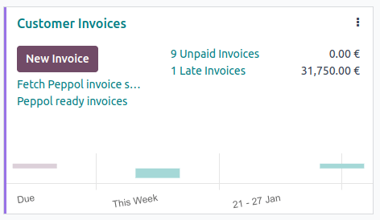

Receive vendor bills
--------------------

Once a day, a cron checks whether any new documents have been sent to you via the Peppol network.
These documents are imported, and the corresponding vendor bills are created automatically as
drafts.

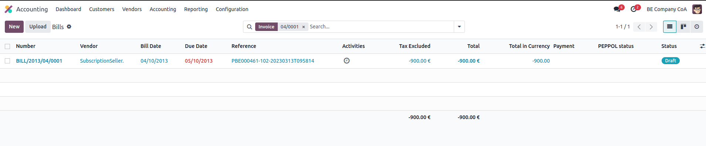

If you want to retrieve incoming Peppol documents before the cron runs, you can do so from the
Accounting dashboard on the main Peppol purchase journal that you set up in the settings. Just click
:guilabel:`Fetch from Peppol`.

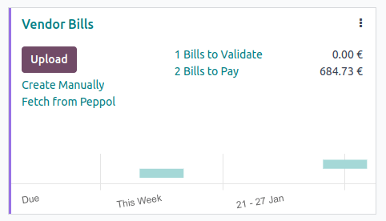
