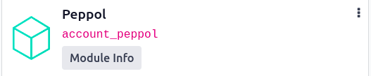
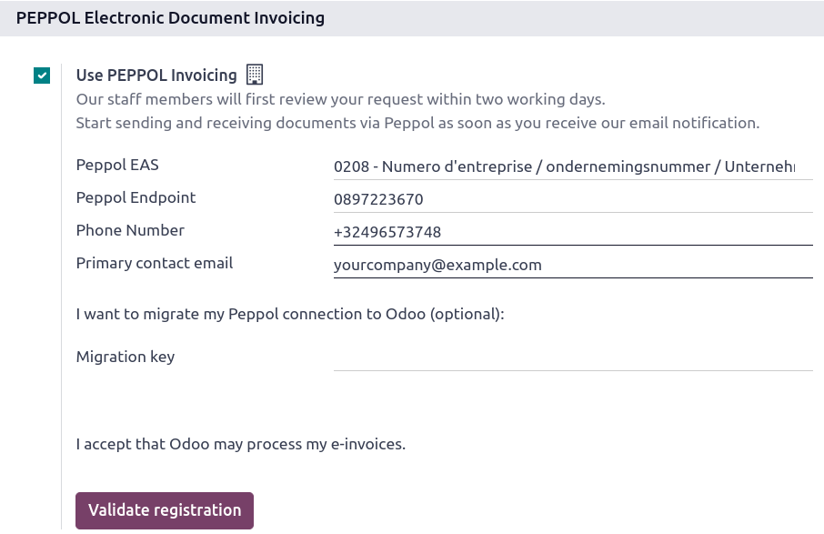
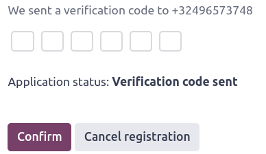

================================================================
Electronic invoicing (:abbr:`EDI (electronic data interchange)`)
================================================================

EDI, or electronic data interchange, is the inter-company communication of business documents, such
as purchase orders and invoices, in a standard format. Sending documents according to an EDI
standard ensures that the machine receiving the message can interpret the information correctly.
Various EDI file formats exist and are available depending on your company's country.

EDI feature enables automating the administration between companies and might also be required by
some governments for fiscal control or to facilitate the administration.

Electronic invoicing of your documents such as customer invoices, credit notes or vendor bills is
one of the application of EDI.

Odoo supports, among others, the following formats.

.. list-table::
   :header-rows: 1

   * - Format Name
     - Applicability
   * - Factur-X (CII)
     - All customers
   * - Peppol BIS Billing 3.0
     - All customers
   * - XRechnung (UBL)
     - All customers
   * - Fattura PA (IT)
     - Italian companies
   * - CFDI (4.0)
     - Mexican companies
   * - Peru UBL 2.1
     - Peruvian companies
   * - SII IVA Llevanza de libros registro (ES)
     - Spanish companies
   * - UBL 2.1 (Columbia)
     - Colombian companies
   * - Egyptian Tax Authority
     - Egyptian companies
   * - E-Invoice (IN)
     - Indian companies
   * - NLCIUS (Netherlands)
     - Dutch companies
   * - EHF 3.0
     - Norwegian companies
   * - SG BIS Billing 3.0
     - Singaporean companies
   * - A-NZ BIS Billing 3.0
     - All customers

.. note::
   - The **Factur-X (CII)** format enables validation checks on the invoice and generates PDF/A-3
     compliant files.
   - Every PDF generated by Odoo includes an integrated **Factur-X** XML file.

.. seealso::
   :doc:`../../fiscal_localizations`

.. _e-invoicing/configuration:

Configuration
=============

By default, the format available in the :ref:`send window <e-invoicing/generation>` depends on your
customer's country.

You can define a specific e-invoicing format for each customer. To do so, go to
:menuselection:`Accounting --> Customers --> Customers`, open the customer form, go to the
:guilabel:`Accounting` tab and select the appropriate format.

.. image:: electronic_invoicing/customer-form.png
   :alt: Select an EDI format for a specific customer

National electronic invoicing
-----------------------------

Depending on your company's country (e.g., :doc:`Italy <../../fiscal_localizations/italy>`,
:doc:`Spain <../../fiscal_localizations/spain>`, :doc:`Mexico
<../../fiscal_localizations/mexico>`, etc.), you may be required to issue e-invoicing documents in
a specific format for all your invoices. In this case, you can define a default e-invoicing format
for your sales journal.

To do so, go to :menuselection:`Accounting --> Configuration --> Journals`, open your sales journal,
go to the :guilabel:`Advanced Settings` tab, and enable the formats you need for this journal.

.. _e-invoicing/generation:

E-invoices generation
=====================

From a confirmed invoice, click :guilabel:`Send & Print` to open the send window. Check the
e-invoicing option to generate and attach the e-invoice file.

.. image:: electronic_invoicing/send-window.png
   :alt: The Peppol option is checked and an e-invoicing XML file is attached to the email.

Peppol
======

The `Peppol <https://peppol.org/about/>`_ network ensures the exchange of documents and information
between enterprises and governmental authorities. It is primarily used for electronic invoicing, and
its access points (connectors to the Peppol network) allow enterprises to exchange electronic
documents.
Odoo is now an **access point** enabling electronic invoicing transactions without the need to send
invoices and bills by email or post.

Configuration
-------------

First, :ref:`install <general/install>` the :guilabel:`Peppol` module (`account_peppol`).

Then, go to :menuselection:`Accounting --> Configuration --> Settings`, tick the
:guilabel:`Use PEPPOL Invoicing`, and fill in the following information:

- `PEPPOL EAS <https://ec.europa.eu/digital-building-blocks/wikis/display/DIGITAL/Code+lists/>`_
- :guilabel:`Peppol Endpoint`
- :guilabel:`Phone Number`, including the country code (e.g., `+32` in Belgium)
- :guilabel:`Primary contact email`

If you are migrating from another access point, insert the :guilabel:`Migration key` from
the previous provider.

Finally, click on :guilabel:`Validate registration`.

A text message containing a code is sent to the phone number provided to finalize the registration
process.

All invoices and vendor bills are now sent directly using the Peppol network.
