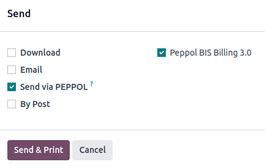
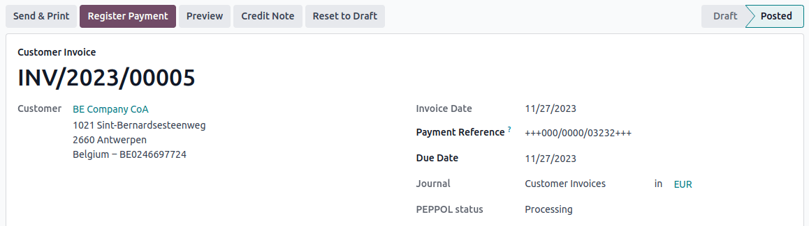
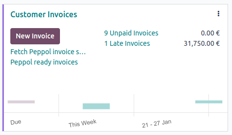
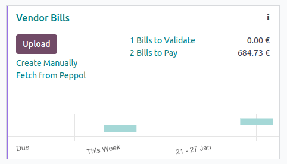

================================================================
Electronic invoicing (:abbr:`EDI (electronic data interchange)`)
================================================================

EDI, or electronic data interchange, is the inter-company communication of business documents, such
as purchase orders and invoices, in a standard format. Sending documents according to an EDI
standard ensures that the machine receiving the message can interpret the information correctly.
Various EDI file formats are available depending on your company's country.

EDI feature enables automation of the administration between companies and might also be required by
some governments for fiscal control or to facilitate administration.

Electronic invoicing of documents such as customer invoices, credit notes, or vendor bills is one
application of EDI.

Odoo supports, among others, the following formats.

.. list-table::
   :header-rows: 1

   * - Format Name
     - Applicability
   * - Factur-X (CII)
     - All customers
   * - Peppol BIS Billing 3.0
     - All customers
   * - XRechnung (UBL)
     - All customers
   * - Fattura PA (IT)
     - Italian companies
   * - CFDI (4.0)
     - Mexican companies
   * - Peru UBL 2.1
     - Peruvian companies
   * - SII IVA Llevanza de libros registro (ES)
     - Spanish companies
   * - UBL 2.1 (Columbia)
     - Colombian companies
   * - Egyptian Tax Authority
     - Egyptian companies
   * - E-Invoice (IN)
     - Indian companies
   * - NLCIUS (Netherlands)
     - Dutch companies
   * - EHF 3.0
     - Norwegian companies
   * - SG BIS Billing 3.0
     - Singaporean companies
   * - A-NZ BIS Billing 3.0
     - All customers

.. note::
   - The **Factur-X (CII)** format enables validation checks on the invoice and generates PDF/A-3
     compliant files.
   - Every PDF generated by Odoo includes an integrated **Factur-X** XML file.

.. seealso::
   :doc:`../../fiscal_localizations`

.. _accounting/e-invoicing/configuration:

Configuration
=============

By default, the available format in the :ref:`send window <accounting/e-invoicing/generation>`
depends on the customer's country.

To define a specific e-invoicing format for each customer,  go to :menuselection:`Accounting -->
Customers --> Customers`, open the customer form, go to the :guilabel:`Accounting` tab, and select
the appropriate format.

.. image:: electronic_invoicing/customer-form.png
   :alt: Select an EDI format for a specific customer

.. _accounting/e-invoicing/national-electronic-invoicing:

National electronic invoicing
-----------------------------

Depending on your company's country (e.g., :doc:`Italy <../../fiscal_localizations/italy>`,
:doc:`Spain <../../fiscal_localizations/spain>`, :doc:`Mexico <../../fiscal_localizations/mexico>`,
etc.), it may be required to issue e-invoicing documents in a specific format for all invoices. In
this case, define a default e-invoicing format for the sales journal.

To do so, go to :menuselection:`Accounting --> Configuration --> Journals`, open the sales journal,
go to the :guilabel:`Advanced Settings` tab, and enable the formats needed for this journal.

.. _accounting/e-invoicing/generation:

E-invoice generation
====================

From a confirmed invoice, click :guilabel:`Send & Print`. In the :guilabel:`Send` window, enable the
:guilabel:`BIS Billing 3.0` option to generate and attach the e-invoicing XML file.

.. _accounting/e-invoicing/peppol:

Peppol
======

The `Peppol <https://peppol.org/about/>`_ network ensures the exchange of documents and information
between enterprises and governmental authorities. It is primarily used for electronic invoicing, and
its access points (connectors to the Peppol network) allow enterprises to exchange electronic
documents.

Odoo is an **access point** and an :abbr:`SMP (Service Metadata Publisher)` that enables electronic
invoicing transactions without sending invoices and bills by email or post.

.. note::
   Make sure to :ref:`install <general/install>` the :guilabel:`Peppol` module (`account_peppol`).

.. important::
   - Peppol registration is **free** and available in Odoo Community
   - **Customer Invoices** and **Credit Notes** can be sent, and **Vendor Bills** and **Refunds**
     can be received via Peppol.
   - Supported document formats for sending include **BIS Billing 3.0, XRechnung CIUS, and
     NLCIUS**.
   - | The following **countries** are eligible for **Peppol registration in Odoo**:
     | Andorra, Albania, Austria, Bosnia and Herzegovina, Belgium, Bulgaria, Switzerland, Cyprus,
       Czech Republic, Germany, Denmark, Estonia, Spain, Finland, France, United Kingdom, Greece,
       Croatia, Hungary, Ireland, Iceland, Italy, Liechtenstein, Lithuania, Luxembourg, Latvia,
       Monaco, Montenegro, North Macedonia, Malta, Netherlands, Norway, Poland, Portugal, Romania,
       Serbia, Sweden, Slovenia, Slovakia, San Marino, Turkey, Holy See (Vatican City State)

.. _accounting/e-invoicing/peppol-registration:

Registration
------------

By default, Peppol is set to :guilabel:`Demo` mode in Odoo. :ref:`Demo
<accounting/e-invoicing/peppol-registration-demo>` mode simulates Peppol transactions without
affecting real data, while :ref:`Live <accounting/e-invoicing/peppol-registration-live>` mode is
used in production environments.

.. _accounting/e-invoicing/peppol-registration-demo:

Demo mode
~~~~~~~~~

Registering in :guilabel:`Demo` mode allows for a complete simulation of Peppol in Odoo, including
invoice sending and receiving. However, no communication with the Peppol network occurs, so actions
like partner verification are not performed.

To configure demo mode, follow these steps:

#. Go to :menuselection:`Accounting --> Configuration --> Settings`.
#. Scroll to the :guilabel:`PEPPOL Electronic Document Invoicing` section.
#. Enter a :guilabel:`Mobile Number` and a :guilabel:`Primary contact email`.
#. Click :guilabel:`Validate registration (Demo)`.

The :guilabel:`Application status` is then :guilabel:`Active (Demo)`.

.. tip::
   For **advanced users only**, running tests on Peppol's test network is possible. The server
   allows users to register on Peppol and to send/receive test invoices with other participants.
   To do so, enable :ref:`developer mode <developer-mode>`, open the Settings app, go to
   :menuselection:`Technical --> System Parameters`, and search for
   :guilabel:`account_peppol.edi.mode`. Open the parameter and change the :guilabel:`Value` to
   `test`. Next, go back to the Peppol setup menu in the Settings app; the :guilabel:`Test` option
   is then available.

.. _accounting/e-invoicing/peppol-registration-live:

Live mode
~~~~~~~~~

To switch from :guilabel:`Demo` mode to :guilabel:`Live` mode, enable :ref:`developer mode
<developer-mode>`, open the Settings app, go to :menuselection:`Technical --> System Parameters`,
and search for :guilabel:`account_peppol.edi.mode`. Open the parameter and change the
:guilabel:`Value` to `live`. Then, go to :menuselection:`Accounting --> Configuration --> Settings`,
scroll to the :guilabel:`Peppol Electronic Document Invoicing` section, and fill in the following
information:

- :guilabel:`Peppol EAS`: Peppol Electronic Address Scheme, which usually depends on the company's
  country. This field is often prefilled with your country's most commonly used EAS code. For
  example, the preferred EAS code for most companies in Belgium is 0208.
- :guilabel:`Peppol Endpoint`: usually a Company Registry number or a VAT number
- :guilabel:`Mobile Number`, including the country code (e.g., `+32` in Belgium)
- :guilabel:`Primary contact email`
- :guilabel:`Migration key`: Peppol connection to migrate from another access point

Then, click :guilabel:`Validate registration`.

.. seealso::
   - `Peppol EAS - European Commision <https://ec.europa.eu/digital-building-blocks/wikis/display/DIGITAL/Code+lists/>`_
   - `Peppol Endpoint - OpenPeppol eDEC Code Lists <https://docs.peppol.eu/edelivery/codelists/>`_
     (open the "Participant Identifier Schemes" as HTML page)

To request and receive a verification code, follow these steps:

#. Click :guilabel:`Verify phone number` in the :guilabel:`PEPPOL Electronic Document Invoicing`
   section.

   .. image:: electronic_invoicing/peppol-registration-verify.png
      :alt: phone validation request verification

#. A text message containing a code is sent to the mobile number provided to finalize the
   verification process.
#. Enter the code and click :guilabel:`Confirm`.
#. The registration is then pending activation.
#. The default journal used for receiving Vendor Bills can be set.

   .. image:: electronic_invoicing/peppol-registration-pending.png
      :alt: pending application

#. The registration should be automatically activated within a day.

   .. tip::
      To manually trigger the cron that checks the registration status, access :doc:`scheduled
      actions <../../../sales/subscriptions/scheduled_actions>`, search for :guilabel:`PEPPOL:
      update participant status`, and run it manually.

#. The application status should be updated to :guilabel:`Active` soon after registering on Peppol.

   .. image:: electronic_invoicing/peppol-registration-active.png
      :alt: active application

All invoices and vendor bills can now be sent directly using Peppol.

.. _accounting/e-invoicing/contact-verification:

Contact verification
--------------------

Before sending an invoice to a contact using Peppol, make sure the contact is registered as a Peppol
participant. To do so, follow these steps:

#. Go to :menuselection:`Accounting --> Customers --> Customers` and open the customer's form.
#. In the :guilabel:`Accounting tab`, check the following information in the :guilabel:`Electronic
   Invoicing` section:

   - :guilabel:`Format`: :guilabel:`BIS Billing 3.0`, :guilabel:`XRechnung CIUS` or
     :guilabel:`NLCIUS`.
   - :guilabel:`Peppol e-address (EAS)`: code used to identify the Endpoint
   - :guilabel:`Peppol Endpoint`: unique identifier used, also known as Endpoint ID

#. Click :guilabel:`Verify`. If the contact is found on the Peppol network, its :guilabel:`Peppol
   endpoint validity` is marked as :guilabel:`Valid`.

   .. image:: electronic_invoicing/customer-form.png
      :alt: verify contact registration

.. important::
   While Odoo prefills both the EAS code and the Endpoint number based on the information available
   for a contact, it is better to confirm these details directly with the contact.

.. _accounting/e-invoicing/send-invoices:

Send invoices
-------------

To set Peppol as a default format for sending invoices, go to :menuselection:`Accounting -->
Configuration --> Settings`. In the :guilabel:`Customer Invoices` section, enable the
:guilabel:`Peppol format` option and :guilabel:`Save`.

Posted invoices sent via Peppol are marked as :guilabel:`Ready to send` in the invoice's
:guilabel:`Peppol status` field.

.. note::
   All invoices that are ready to be sent via Peppol can be viewed in the following ways:

   - In the :guilabel:`Invoices` list view, use the :icon:`oi-settings-adjust` (:guilabel:`adjust
     settings`) icon to add the :guilabel:`Peppol status` column or apply the :guilabel:`Peppol
     Ready` filter in the search bar.
   - In the Accounting dashboard, click :guilabel:`Peppol ready invoices` on the relevant sales
     journal.

To send the invoice to the customer via Peppol, click :guilabel:`Send & Print` on the confirmed
invoice form. In the :guilabel:`Send` window, enable both :guilabel:`BIS Billing 3.0` and
:guilabel:`Send via PEPPOL` checkboxes.

.. tip::
   :ref:`Multiple invoices <accounting/invoice/sending>` can also be sent in batches via Peppol.

Once the invoices are sent via Peppol, the :guilabel:`Peppol status` is changed to
:guilabel:`Processing`.

The status is updated to :guilabel:`Done` once the invoices have been successfully delivered to the
contact's access point.

.. tip::
   To manually trigger the cron that checks the invoices status, click :guilabel:`Fetch Peppol
   invoice status` in the corresponding sales journal on the Accounting dashboard.

.. _accounting/e-invoicing/receive-vendor-bills:

Receive vendor bills
--------------------

A daily cron checks for new documents received via Peppol. Any received documents are automatically
imported, and corresponding vendor bills are created as drafts, appearing in the vendor bills list
view.

.. tip::
   To manually trigger the cron to retrieve incoming Peppol documents, go to the Accounting
   dashboard and click :guilabel:`Fetch from Peppol` on the main Peppol purchase journal.

.. note::
   When multiple purchase journals are used, incoming Peppol documents appear in the Document app
   for later processing.

