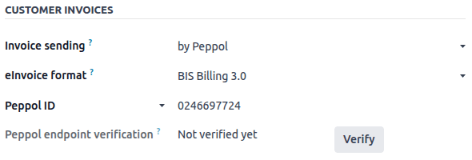

================================================================
Electronic invoicing (:abbr:`EDI (electronic data interchange)`)
================================================================

EDI, or electronic data interchange, is the inter-company communication of business documents, such
as purchase orders and invoices, in a standard format. Sending documents according to an EDI
standard ensures that the system receiving the message can interpret the information correctly.
Various EDI file formats are available depending on your company's country.

The EDI feature allows companies to automate administrative processes. It may also be required by
some governments for fiscal control or to support administrative procedures.

Electronic sending of documents such as customer invoices, credit notes, or vendor bills is one
application of EDI.

Odoo supports e-invoicing in many countries. Refer to the country's page for more details:

- :doc:`Argentina <electronic_invoicing/argentina>`
- :doc:`Austria <electronic_invoicing/austria>`
- :doc:`Belgium <electronic_invoicing/belgium>`
- :doc:`Brazil <electronic_invoicing/brazil>`
- :doc:`Chile <electronic_invoicing/chile>`
- :doc:`Colombia <electronic_invoicing/colombia>`
- :doc:`Croatia <electronic_invoicing/croatia>`
- :doc:`Ecuador <electronic_invoicing/ecuador>`
- :doc:`Estonia <electronic_invoicing/estonia>`
- :doc:`Finland <electronic_invoicing/finland>`
- :doc:`Hungary <electronic_invoicing/hungary>`
- :doc:`Ireland <electronic_invoicing/ireland>`
- :doc:`Italy <electronic_invoicing/italy>`
- :doc:`Latvia <electronic_invoicing/latvia>`
- :doc:`Lithuania <electronic_invoicing/lithuania>`
- :doc:`Luxembourg <electronic_invoicing/luxembourg>`
- :doc:`Mexico <electronic_invoicing/mexico>`
- :doc:`Netherlands <electronic_invoicing/netherlands>`
- :doc:`Norway <electronic_invoicing/norway>`
- :doc:`Peru <electronic_invoicing/peru>`
- :doc:`Romania <electronic_invoicing/romania>`
- :doc:`Spain <electronic_invoicing/spain>`
- :doc:`Spain - Basque Country <electronic_invoicing/basque_country>`
- :doc:`Uruguay <electronic_invoicing/uruguay>`

.. seealso::
   :doc:`Fiscal localizations documentation <../../fiscal_localizations>`

.. _accounting/e-invoicing/configuration:

Configuration
=============

By default, the format available in the :ref:`send window <accounting/e-invoicing/generation>`
depends on the customer's country.

To define a specific e-invoicing format for a customer, go to :menuselection:`Accounting -->
Customers --> Customers`, access the customer form, go to the :guilabel:`Accounting` tab, and select
the appropriate :guilabel:`Format` in the :guilabel:`Customer invoices` section.

.. _accounting/e-invoicing/generation:

E-invoice generation
====================

From a confirmed invoice, click :guilabel:`Send`. In the :guilabel:`Print & Send` window, enable the
relevant e-invoicing format option (e.g., :guilabel:`by Peppol`), then click :guilabel:`Send` to
generate and attach the corresponding e-invoicing XML file.

.. _accounting/e-invoicing/peppol:

Peppol
======

The `Peppol <https://peppol.org/about/>`_ network ensures the exchange of documents and information
between companies and governmental authorities. It is primarily used for electronic invoicing, and
its access points (connectors to the Peppol network) allow companies to send electronic documents
such as customer invoices and credit notes and receive documents like vendor bills and refunds.

In this case, Odoo acts as both an **access point** and an :abbr:`SMP (Service Metadata Publisher)`
and enables electronic invoicing transactions without the need to send invoices or bills by email or
post.

.. note::
   - Peppol registration is **free** and available in Odoo Community.
   - Supported formats for sending documents include **BIS Billing 3.0, XRechnung CIUS, and
     NLCIUS**.
   - | The following **countries** are eligible for **Peppol registration in Odoo**:
     | Andorra, Albania, Austria, Bosnia and Herzegovina, Belgium, Bulgaria, Switzerland, Cyprus,
       Czech Republic, Germany, Denmark, Estonia, Spain, Finland, France, United Kingdom, Greece,
       Croatia, Hungary, Ireland, Iceland, Italy, Liechtenstein, Lithuania, Luxembourg, Latvia,
       Monaco, Montenegro, North Macedonia, Malta, Netherlands, Norway, Poland, Portugal, Romania,
       Serbia, Sweden, Slovenia, Slovakia, San Marino, Turkey, Holy See (Vatican City State).

.. _accounting/e-invoicing/peppol-registration:

Registration
------------

To register on Peppol, go to :menuselection:`Accounting --> Configuration --> Settings` and scroll
to the :guilabel:`PEPPOL Electronic Invoicing` section.

By default, Peppol is set to demo mode in Odoo. :ref:`Demo
<accounting/e-invoicing/peppol-registration-demo>` mode simulates Peppol transactions without
affecting real data, while :ref:`production <accounting/e-invoicing/peppol-registration-production>`
mode is used in production environments.

.. _accounting/e-invoicing/peppol-registration-demo:

Demo mode
~~~~~~~~~

Registering in demo mode allows for a complete simulation of the Peppol workflow in Odoo, including
invoice sending and receiving, and bill receiving. However, no communication with the Peppol network
occurs, so actions like partner verification are not performed.

To activate the demo mode, click :guilabel:`Activate Electronic Invoicing` in the :guilabel:`PEPPOL
Electronic Invoicing` section. The following fields in the :guilabel:`Activate Electronic Invoicing
(via Peppol)` window  are usually prefilled with demo data. Update or complete them as needed:

- Using the :icon:`fa-caret-down` :guilabel:`(down arrow)` icon, select your company's country in
  the dropdown list.
- :guilabel:`Your endpoint`: usually a Company Registry number or a VAT number
- :guilabel:`Email`
- :guilabel:`Phone`, including the country code (e.g., `+32` in Belgium)

Then, click :guilabel:`Activate Peppol (Demo)` to set the demo mode.

.. _accounting/e-invoicing/peppol-registration-test:

Test mode
~~~~~~~~~

For **advanced users only**, running tests on Peppol's test network is possible using the test mode.
The server allows users to register on Peppol and to send/receive test invoices with other
participants. To do so, follow these steps:

#. Deregister from the :ref:`demo mode <accounting/e-invoicing/peppol-registration-demo>`: Go to the
   :guilabel:`PEPPOL Electronic Invoicing` section in the :guilabel:`Settings` and click
   :guilabel:`Remove from Peppol`.
#. Enable :ref:`developer mode <developer-mode>`, open the Settings app, then go to
   :menuselection:`Settings --> Technical --> System Parameters` and search for
   :guilabel:`account_peppol.edi.mode`.
#. Open the parameter and change the :guilabel:`Value` to `test`.
#. Go back to the :guilabel:`PEPPOL Electronic Invoicing` section in the :guilabel:`Settings` and
   click :guilabel:`Activate Electronic Invoicing`.
#. In the :guilabel:`Activate Electronic Invoicing (via Peppol)` window, fill in the :guilabel:`Your
   endpoint`, :guilabel:`Email`, and :guilabel:`Phone` fields, and click :guilabel:`Activate Peppol
   (Test)`.

.. _accounting/e-invoicing/peppol-registration-production:

Production mode
~~~~~~~~~~~~~~~

To switch from the demo mode to the production mode, follow these steps:

#. Deregister from the :ref:`demo mode <accounting/e-invoicing/peppol-registration-demo>`: Go to the
   :guilabel:`PEPPOL Electronic Invoicing` section in the :guilabel:`Settings` and click
   :guilabel:`Remove from Peppol`.
#. Enable :ref:`developer mode <developer-mode>`, open the Settings app, then go to
   :menuselection:`Settings --> Technical --> System Parameters` and search for
   :guilabel:`account_peppol.edi.mode`.
#. Open the parameter and change the :guilabel:`Value` to `prod`.
#. Go back to the :guilabel:`PEPPOL Electronic Invoicing` section in the :guilabel:`Settings` and
   click :guilabel:`Activate Electronic Invoicing`.
#. In the :guilabel:`Activate Electronic Invoicing (via Peppol)` window, fill in the :guilabel:`Your
   endpoint`, :guilabel:`Email`, and :guilabel:`Phone` fields, and click :guilabel:`Activate
   Peppol`.

.. seealso::
   `Peppol endpoint - OpenPeppol eDEC Code Lists <https://docs.peppol.eu/edelivery/codelists/>`_
   (open the "Participant Identifier Schemes" as HTML page)

6. The registration is then pending activation.
#. Select another purchase journal in the :guilabel:`Incoming Invoices Journal` field if necessary,
   or a folder name in the :ref:`Document Workspace
   <accounting/e-invoicing/receive-vendor-bills-multiple-journals>` field if multiple purchase
   journals are used.
#. The registration should be automatically activated within a day.

All invoices and vendor bills can then be sent directly using Peppol.

.. tip::
   To manually trigger the scheduled action used to check the Peppol registration status, enable
   :ref:`developer mode <developer-mode>`, open the Settings app, go to :menuselection:`Settings
   --> Technical --> Scheduled actions`, and search for :guilabel:`Peppol: update participant
   status`. Open the scheduled action, then click :guilabel:`Run Manually`.

.. note::
   If you are using an access point from a previous provider, make sure to deregister from it first,
   then register with your new access point.

.. _accounting/e-invoicing/contact-verification:

Contact verification
--------------------

Before sending an invoice to a contact using Peppol, make sure the contact is registered as a Peppol
participant. To do so, follow these steps:

#. Go to :menuselection:`Accounting --> Customers --> Customers` and access the customer's form.
#. In the :guilabel:`Accounting tab`, check the following information in the :guilabel:`Customer
   invoices` section:

   - :guilabel:`eInvoice format`: Select the relevant format.
   - Using the :icon:`fa-caret-down` :guilabel:`(down arrow)` icon, select :guilabel:`Peppol ID` in
     the dropdown list.
   - :guilabel:`Your endpoint`: Enter the customer's endpoint identifier, usually a Company Registry
     or VAT number.

#. To verify the contact, enable :ref:`developer mode <developer-mode>` and click
   :guilabel:`Verify`. Its :guilabel:`Peppol endpoint validity` is marked as :guilabel:`Valid` if
   the contact is found on the Peppol network.

.. important::
   While Odoo prefills the endpoint number based on the information available for a contact, it is
   recommended to verify these details directly with the contact.

.. _accounting/e-invoicing/send-invoices:

Send invoices
-------------

Posted invoices to be sent via Peppol are marked as :guilabel:`Ready to send` in the invoice's
:guilabel:`Peppol status` field.

.. note::
   All invoices that are ready to be sent via Peppol can be viewed in the following ways:

   - In the :guilabel:`Invoices` list view, use the :icon:`oi-settings-adjust` (:guilabel:`adjust
     settings`) button to add the :guilabel:`Peppol status` column or apply the :guilabel:`Peppol
     Ready` filter in the search bar.
   - In the Accounting dashboard, click :guilabel:`Peppol ready invoices` on the relevant sales
     journal.

To send the invoice to the customer via Peppol, click :guilabel:`Send` on the confirmed invoice
form. In the :guilabel:`Print & Send` window, enable the :guilabel:`by Peppol` option and click
:guilabel:`Send`.

.. tip::
   - :ref:`Multiple invoices <accounting/invoice/sending-multiple-invoices>` can also be sent in
     batches via Peppol.
   - Set the preferred :ref:`Invoice sending <accounting/invoice/sending>` method to
     :guilabel:`by Peppol` in the Customer Invoices section.

The status is updated to :guilabel:`Done` once the invoices have been successfully delivered to the
contact's access point.

.. tip::
   To manually trigger the scheduled action used to check the invoices' status, go to the
   Accounting dashboard and click :guilabel:`Fetch Peppol invoice status` on the corresponding sales
   journal.

   .. image:: electronic_invoicing/peppol-fetch-message-status.png
      :alt: Fetch invoice Peppol status

.. _accounting/e-invoicing/receive-vendor-bills:

Receive vendor bills
--------------------

New documents received via Peppol are checked multiple times a day. When only one purchase journal
is used, received documents are automatically imported, and corresponding vendor bills are created
as drafts, appearing in the vendor bills list view.

.. tip::
   To manually trigger the scheduled action to retrieve incoming Peppol documents, go to the
   Accounting dashboard and click :guilabel:`Fetch from Peppol` on the main Peppol purchase journal.

   .. image:: electronic_invoicing/peppol-fetch-bills.png
      :alt: Fetch bills from Peppol

.. _accounting/e-invoicing/receive-vendor-bills-multiple-journals:

Multiple purchase journals
~~~~~~~~~~~~~~~~~~~~~~~~~~

.. note::
   Make sure to :ref:`install <general/install>` the :guilabel:`Documents - Import from Peppol`
   (`documents_account_peppol`) module.

When using multiple purchase journals, new vendor bills can be received via the :doc:`Documents app
<../../../productivity/documents>`. To do so, go to :menuselection:`Accounting --> Configuration -->
Settings` and scroll to the :guilabel:`PEPPOL Electronic Invoicing` section. Set the
:guilabel:`Document Workspace` where the documents are received and the :guilabel:`Document Tags` to
add.

Then, open the Document app, select the relevant vendor bills from the selected :guilabel:`Document
Workspace`, and click :guilabel:`Create Vendor Bill`. The corresponding vendor bill is then created
as a draft.
