================================================================
Electronic invoicing (:abbr:`EDI (electronic data interchange)`)
================================================================

EDI, or electronic data interchange, is the inter-company communication of business documents, such
as purchase orders and invoices, in a standard format. Sending documents according to an EDI
standard ensures that the system receiving the message can interpret the information correctly.
Various EDI file formats are available depending on your company's country.

The EDI feature allows companies to automate administrative processes. It may also be required by
some governments for fiscal control or to support administrative procedures.

Electronic sending of documents such as customer invoices, credit notes, or vendor bills is one
application of EDI.

Odoo supports e-invoicing in many countries. Refer to the country's page for more details:

- :doc:`Argentina <electronic_invoicing/argentina>`
- :doc:`Austria <electronic_invoicing/austria>`
- :doc:`Belgium <electronic_invoicing/belgium>`
- :doc:`Brazil <electronic_invoicing/brazil>`
- :doc:`Chile <electronic_invoicing/chile>`
- :doc:`Colombia <electronic_invoicing/colombia>`
- :doc:`Croatia <electronic_invoicing/croatia>`
- :doc:`Ecuador <electronic_invoicing/ecuador>`
- :doc:`Estonia <electronic_invoicing/estonia>`
- :doc:`Finland <electronic_invoicing/finland>`
- :doc:`Hungary <electronic_invoicing/hungary>`
- :doc:`Ireland <electronic_invoicing/ireland>`
- :doc:`Italy <electronic_invoicing/italy>`
- :doc:`Latvia <electronic_invoicing/latvia>`
- :doc:`Lithuania <electronic_invoicing/lithuania>`
- :doc:`Luxembourg <electronic_invoicing/luxembourg>`
- :doc:`Mexico <electronic_invoicing/mexico>`
- :doc:`Netherlands <electronic_invoicing/netherlands>`
- :doc:`Norway <electronic_invoicing/norway>`
- :doc:`Peru <electronic_invoicing/peru>`
- :doc:`Romania <electronic_invoicing/romania>`
- :doc:`Spain <electronic_invoicing/spain>`
- :doc:`Spain - Basque Country <electronic_invoicing/basque_country>`
- :doc:`Uruguay <electronic_invoicing/uruguay>`

.. seealso::
   :doc:`Fiscal localizations documentation <../../fiscal_localizations>`

.. _accounting/e-invoicing/configuration:

Configuration
=============

.. _accounting/e-invoicing/national-electronic-invoicing:

National e-invoicing format
---------------------------

Depending on your company's country (e.g., :doc:`Italy <../../fiscal_localizations/italy>`,
:doc:`Spain <../../fiscal_localizations/spain>`, :doc:`Mexico <../../fiscal_localizations/mexico>`,
etc.), it may be required to issue e-invoicing documents in a specific format for all invoices. In
this case, define a default e-invoicing format for the sales journal.

To do so, go to :menuselection:`Accounting --> Configuration --> Journals`, open the sales journal,
go to the :guilabel:`Advanced Settings` tab, and enable the formats needed for this journal.

.. _accounting/e-invoicing/e-invoicing format:

Customer-specific e-invoicing format
------------------------------------

By default, the format available in the :ref:`send window <accounting/e-invoicing/generation>`
depends on the customer's country.

To define a specific e-invoicing format for a customer, go to :menuselection:`Accounting -->
Customers --> Customers`, open the customer form, go to the :guilabel:`Accounting` tab, and select
the appropriate :guilabel:`Format` in the :guilabel:`Electronic invoicing` section.

.. _accounting/e-invoicing/generation:

E-invoice generation
====================

From a confirmed invoice, click :guilabel:`Send & Print`. In the :guilabel:`Send` window, enable the
relevant e-invoicing format option (e.g., :guilabel:`BIS Billing 3.0`), then click
:guilabel:`Send & Print` to generate and attach the corresponding e-invoicing XML file.

.. _accounting/e-invoicing/peppol:

Peppol
======

The `Peppol <https://peppol.org/about/>`_ network ensures the exchange of documents and information
between companies and governmental authorities. It is primarily used for electronic invoicing, and
its access points (connectors to the Peppol network) allow companies to send electronic documents
such as customer invoices and credit notes and receive documents like vendor bills and refunds.

In this case, Odoo acts as both an **access point** and an :abbr:`SMP (Service Metadata Publisher)`
and enables electronic invoicing transactions without the need to send invoices or bills by email or
post.

<<<<<<< b0c827bfb94b9b407e381f246f3a8d9802ae0aa1
If not done yet, :ref:`install <general/install>` the :guilabel:`Peppol` module (`account_peppol`).

.. important::
   - Peppol registration is **free** and available in Odoo Community
   - You can send **Customer Invoices** and **Credit Notes** and receive **Vendor Bills** and
     **Refunds** via Peppol.
   - You can send and receive in one of the following supported document formats:
     **BIS Billing 3.0, XRechnung CIUS, NLCIUS**.
||||||| 74407bbc416cc4e8453f1ea676817c06089bd548
If not done yet, :ref:`install <general/install>` the :guilabel:`Peppol` module (`account_peppol`).

.. important::
   - Peppol registration is **free** and available in Odoo Community
   - You can send **Customer Invoices** and **Credit Notes** and receive **Vendor Bills** and
     **Refunds** via Peppol.
   - You can send in one of the following supported document formats: **BIS Billing 3.0, XRechnung
     CIUS, NLCIUS**.
=======
.. note::
   - Make sure to :ref:`install <general/install>` the :guilabel:`Peppol` module (`account_peppol`).
   - Peppol registration is **free** and available in Odoo Community.
   - Supported formats for sending documents include **BIS Billing 3.0, XRechnung CIUS, and
     NLCIUS**.
>>>>>>> c5da52e87e03cc5fce47a5b2c719e28addfaad3a
   - | The following **countries** are eligible for **Peppol registration in Odoo**:
     | Andorra, Albania, Austria, Bosnia and Herzegovina, Belgium, Bulgaria, Switzerland, Cyprus,
       Czech Republic, Germany, Denmark, Estonia, Spain, Finland, France, United Kingdom, Greece,
       Croatia, Hungary, Ireland, Iceland, Italy, Liechtenstein, Lithuania, Luxembourg, Latvia,
       Monaco, Montenegro, North Macedonia, Malta, Netherlands, Norway, Poland, Portugal, Romania,
       Serbia, Sweden, Slovenia, Slovakia, San Marino, Turkey, Holy See (Vatican City State)

.. _accounting/e-invoicing/peppol-registration:

Registration
------------

<<<<<<< b0c827bfb94b9b407e381f246f3a8d9802ae0aa1
Go to :menuselection:`Accounting --> Configuration --> Settings`. If you do not have the
Peppol module installed, first tick the :guilabel:`Enable PEPPOL` checkbox and then **manually
save**. Click :guilabel:`Start sending via Peppol` to open the registration form.
||||||| 74407bbc416cc4e8453f1ea676817c06089bd548
Go to :menuselection:`Accounting --> Configuration --> Settings`. If you do not have the
Peppol module installed, first tick the :guilabel:`Enable PEPPOL` checkbox and then **manually
save**.
=======
To register to Peppol, go to :menuselection:`Accounting --> Configuration --> Settings` and scroll
to the :guilabel:`PEPPOL Electronic Document Invoicing` section.
>>>>>>> c5da52e87e03cc5fce47a5b2c719e28addfaad3a

<<<<<<< b0c827bfb94b9b407e381f246f3a8d9802ae0aa1
.. note::
   This registration form also pops up if you choose to :guilabel:`Send & Print` an
   invoice via Peppol without completing the registration process.

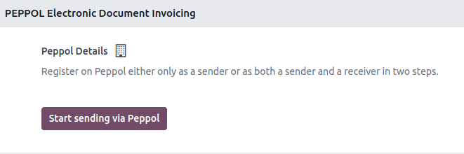

You can register either as a sender or a receiver. A sender can only send invoices and credit notes
on Odoo via Peppol, without ever registering as a Peppol participant on Odoo SMP. If you have an
existing Peppol registration elsewhere that you want to keep, but want to send invoices from your
Odoo database and receive other documents in another software, register as a **sender**.

.. tip::
   - You can always register as a sender first and register to receive documents later.
   - When registering, you can specify if you would also like to receive documents.

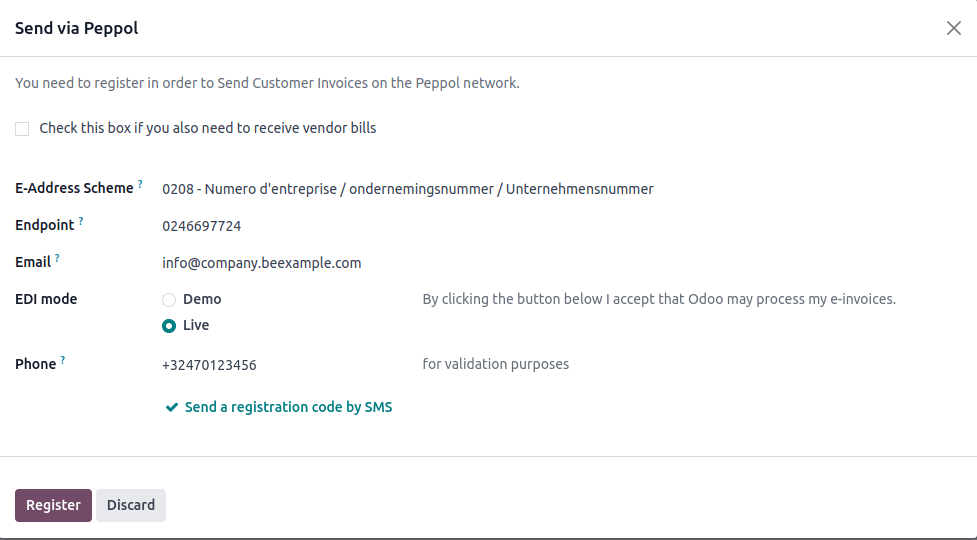
||||||| 74407bbc416cc4e8453f1ea676817c06089bd548
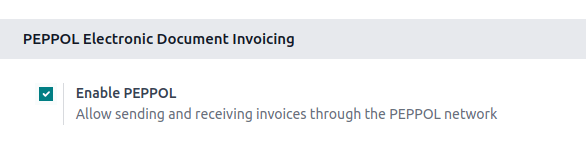
=======
By default, Peppol is set to demo mode in Odoo. :ref:`Demo
<accounting/e-invoicing/peppol-registration-demo>` mode simulates Peppol transactions without
affecting real data, while :ref:`production <accounting/e-invoicing/peppol-registration-production>`
mode is used in production environments.
>>>>>>> c5da52e87e03cc5fce47a5b2c719e28addfaad3a

.. _accounting/e-invoicing/peppol-registration-demo:

<<<<<<< b0c827bfb94b9b407e381f246f3a8d9802ae0aa1
- Check the receiver box if you want to register on Odoo SMP. If you are migrating from another
  service provider, insert the :guilabel:`Migration key` from the previous provider (the field
  becomes visible after you tick the checkbox).
- :guilabel:`E-Address Scheme`: the Peppol Electronic Address Scheme usually depends on your
  company's country. Odoo often prefills this with the most commonly used EAS code in your country.
  For example, the preferred EAS code for most companies in Belgium is `0208`.
- :guilabel:`Endpoint`: this is usually a Company Registry number or a VAT number.
- :guilabel:`Phone`: phone number including the country code (e.g., `+32` in Belgium).
- :guilabel:`Email`: this is the email Odoo can use to contact you regarding your Peppol
  registration.

If you want to explore or demo Peppol, you can choose to register in :guilabel:`Demo` mode.
Otherwise, select :guilabel:`Live`.

.. tip::
   - Selecting :guilabel:`Demo` simulates everything in Odoo. There is no sending, receiving, or
     partner verification.
   - For **advanced users only**, it is possible to run tests on Peppol's test network. The server
     allows to register on Peppol and send/receive test invoices to/from other participants.
     To do so, enable the :ref:`developer-mode`, open the **Settings** app, go to
     :menuselection:`Technical --> System Parameters`, and search for `account_peppol.edi.mode`.
     Click the parameter and change the :guilabel:`Value` to `test`. Go back to the Peppol setup
     menu in the **Settings** app. The option :guilabel:`Test` is now available.

   .. image:: electronic_invoicing/peppol-system-parameter.png
      :alt: Peppol test mode parameter
||||||| 74407bbc416cc4e8453f1ea676817c06089bd548
- :guilabel:`Peppol EAS`. This is the Peppol Electronic Address Scheme and usually depends on your
  company's country. Odoo often prefills this with the most commonly used EAS code in your country.
  For example, the preferred EAS code for most companies in Belgium is 0208.
- :guilabel:`Peppol Endpoint`. This is usually a Company Registry number or a VAT number.
- :guilabel:`Phone Number`, including the country code (e.g., `+32` in Belgium)
- :guilabel:`Primary contact email`
=======
Demo mode
~~~~~~~~~

Registering in demo mode allows for a complete simulation of the Peppol workflow in Odoo, including
invoice sending and receiving and bill receiving. However, no communication with the Peppol network
occurs, so actions like partner verification are not performed.

The following fields in the :guilabel:`PEPPOL Electronic Document Invoicing` section are usually
prefilled with demo data. Update or complete them as needed:

- :guilabel:`Peppol EAS`: Peppol Electronic Address Scheme, which usually depends on the
  company's country. This field is often prefilled with your country's most commonly used EAS code.
  For example, the preferred EAS code for most companies in Belgium is `0208`.
- :guilabel:`Peppol Endpoint`: usually a Company Registry number or a VAT number
- :guilabel:`Mobile Number`, including the country code (e.g., `+32` in Belgium)
- :guilabel:`Primary contact email`
>>>>>>> c5da52e87e03cc5fce47a5b2c719e28addfaad3a

To set the demo mode, click :guilabel:`Validate registration (Demo)`. The :guilabel:`Application
status` is then :guilabel:`Active (Demo)`.

Test mode
~~~~~~~~~

For **advanced users only**, running tests on Peppol's test network is possible using the test mode.
The server allows users to register on Peppol and to send/receive test invoices with other
participants. To do so, follow these steps:

#. Deregister from the demo mode: Go to the :guilabel:`PEPPOL Electronic Document Invoicing`
   section in the :guilabel:`Settings` and click :guilabel:`Deregister from Peppol`.
#. Enable :ref:`developer mode <developer-mode>`, open the Settings app, then go to
   :menuselection:`Settings --> Technical --> System Parameters` and search for
   :guilabel:`account_peppol.edi.mode`.
#. Open the parameter and change the :guilabel:`Value` to `test`.
#. Go back to the :guilabel:`PEPPOL Electronic Document Invoicing` section in the
   :guilabel:`Settings` and click :guilabel:`Validate registration (Test)`.
#. Update the :guilabel:`Mobile Number` and click :guilabel:`Verify mobile number`.
#. A text message containing a code is sent to the mobile number provided to finalize the
   verification process.
#. Enter the code and click :guilabel:`Confirm`.

.. _accounting/e-invoicing/peppol-registration-production:

Production mode
~~~~~~~~~~~~~~~

To switch from the demo mode to the production mode, follow these steps:

#. Deregister from the demo mode: Go to the :guilabel:`PEPPOL Electronic Document Invoicing` section
   in the :guilabel:`Settings` and click :guilabel:`Deregister from Peppol`.
#. Enable :ref:`developer mode <developer-mode>`, open the Settings app, then go to
   :menuselection:`Settings --> Technical --> System Parameters` and search for
   :guilabel:`account_peppol.edi.mode`.
#. Open the parameter and change the :guilabel:`Value` to `prod`.
#. Go back to the :guilabel:`Peppol Electronic Document Invoicing` section in the
   :guilabel:`Settings` and fill in the following information:

   - :guilabel:`Peppol EAS`: Peppol Electronic Address Scheme, which usually depends on the
     company's country. This field is often prefilled with your country's most commonly used EAS
     code. For example, the preferred EAS code for most companies in Belgium is `0208`.
   - :guilabel:`Peppol Endpoint`: usually a Company Registry number or a VAT number
   - :guilabel:`Mobile Number`, including the country code (e.g., `+32` in Belgium)
   - :guilabel:`Primary contact email`
   - :guilabel:`Migration key`: If you are migrating from another access point, copy the key from
     the previous provider.

#. Click :guilabel:`Validate registration`.

.. seealso::
   - `Peppol EAS - European Commision <https://ec.europa.eu/digital-building-blocks/wikis/display/DIGITAL/Code+lists/>`_
   - `Peppol endpoint - OpenPeppol eDEC Code Lists <https://docs.peppol.eu/edelivery/codelists/>`_
     (open the "Participant Identifier Schemes" as HTML page)

<<<<<<< b0c827bfb94b9b407e381f246f3a8d9802ae0aa1
When set up, request a verification code to be sent to you by clicking :guilabel:`Send a
registration code by SMS`. A text message containing a code is sent to the phone number provided to
finalize the verification process.
||||||| 74407bbc416cc4e8453f1ea676817c06089bd548
If you are migrating from another access point, insert the :guilabel:`Migration key` from the
previous provider.
=======
To request and receive a verification code, follow these steps:
>>>>>>> c5da52e87e03cc5fce47a5b2c719e28addfaad3a

<<<<<<< b0c827bfb94b9b407e381f246f3a8d9802ae0aa1
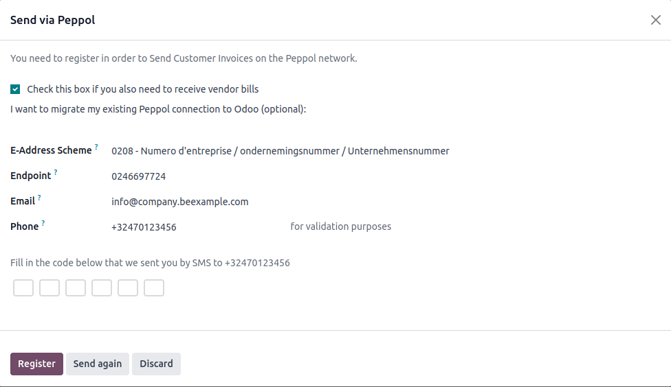

Once you enter the code and click :guilabel:`Register`, your Peppol participant status is updated.
If you chose to only send documents, then the status changes to :guilabel:`Can send but
not receive`.
If you opted to receive documents as well, the status changes to :guilabel:`Can send, pending
registration to receive`. In that case, it should be automatically activated within a day.

Then, set the default journal for receiving vendor bills in the :guilabel:`Incoming Invoices
Journal`.
||||||| 74407bbc416cc4e8453f1ea676817c06089bd548
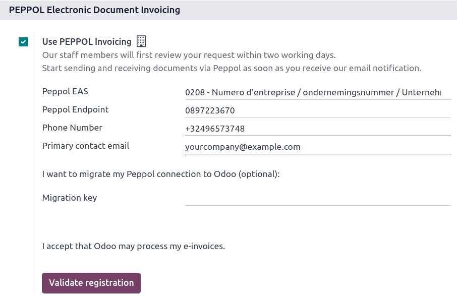

Finally, click :guilabel:`Validate registration`. If you want to explore or demo Peppol, you can
choose to register in :guilabel:`Demo` mode. Otherwise, select :guilabel:`Live`.

   .. image:: electronic_invoicing/peppol-demo-mode.png
      :alt: Peppol demo mode selection

.. note::
   When testing Peppol, the system parameter `account_peppol.edi.mode` can be changed to `test`.
   Then, a radio button appears with the option to register on the test server.

   .. image:: electronic_invoicing/peppol-system-parameter.png
      :alt: Peppol test mode parameter

   .. image:: electronic_invoicing/peppol-test-mode-settings.png
      :alt: Peppol test mode selection

Now, you can request a verification code to be sent to you by clicking :guilabel:`Verify phone
number`.

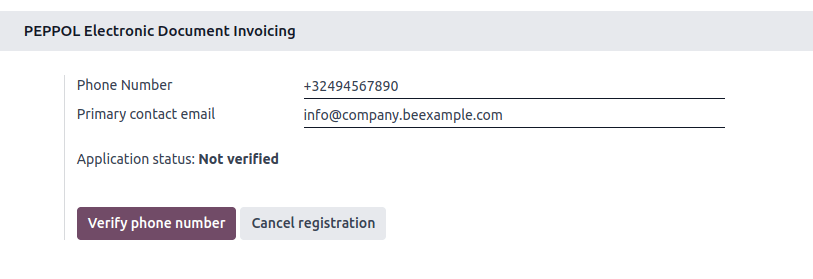

A text message containing a code is sent to the phone number provided to finalize the verification
process.

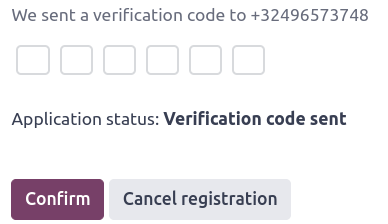

Once you enter the code and click :guilabel:`Confirm`, you can see that your registration is pending
activation. From this point onwards, the default journal for receiving Vendor Bills can be set.

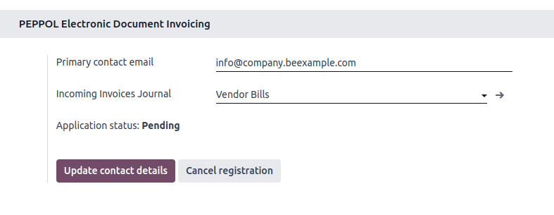

It should be automatically activated within a day.
=======
#. Click :guilabel:`Verify phone number` in the :guilabel:`PEPPOL Electronic Document Invoicing`
   section.

   .. image:: electronic_invoicing/peppol-registration-verify.png
      :alt: phone validation request verification

#. A text message containing a code is sent to the mobile number provided to finalize the
   verification process.
#. Enter the code and click :guilabel:`Confirm`.
#. The registration is then pending activation.
#. Select another purchase journal in the :guilabel:`Incoming Invoices Journal` field if necessary.

   .. image:: electronic_invoicing/peppol-registration-pending.png
      :alt: Pending application

#. The registration should be automatically activated, and the :guilabel:`Application status`
   should be updated within a day.

   .. image:: electronic_invoicing/peppol-registration-active.png
      :alt: active application

All invoices and vendor bills can then be sent directly using Peppol.
>>>>>>> c5da52e87e03cc5fce47a5b2c719e28addfaad3a

.. tip::
<<<<<<< b0c827bfb94b9b407e381f246f3a8d9802ae0aa1
   To manually trigger the cron that checks the registration status, enable the
   :ref:`developer-mode`, then go to :menuselection:`Settings --> Technical --> Scheduled Actions`,
   and search for the :guilabel:`PEPPOL: update participant status` action.
||||||| 74407bbc416cc4e8453f1ea676817c06089bd548
   It is also possible to manually trigger the cron that checks the registration status by going to
   :menuselection:`Settings --> Technical --> Scheduled Actions --> PEPPOL\: update participant
   status`.
=======
   To manually trigger the scheduled action used to check the Peppol registration status, enable
   :ref:`developer mode <developer-mode>`, open the Settings app, go to :menuselection:`Settings
   --> Technical --> Scheduled actions`, and search for :guilabel:`Peppol: update participant
   status`. Open the scheduled action, then click :guilabel:`Run Manually`.
>>>>>>> c5da52e87e03cc5fce47a5b2c719e28addfaad3a

<<<<<<< b0c827bfb94b9b407e381f246f3a8d9802ae0aa1
Your receiver application status should be updated soon after you are registered on the Peppol
network.

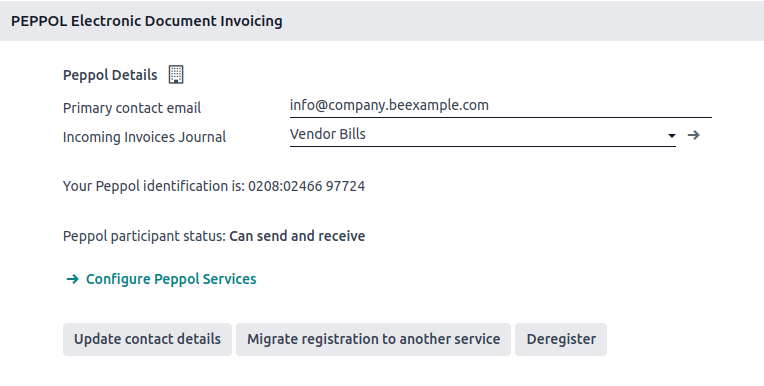

All invoices and vendor bills can now be sent directly using the Peppol network.
||||||| 74407bbc416cc4e8453f1ea676817c06089bd548
Your application status should be updated soon after you are registered on the Peppol network.

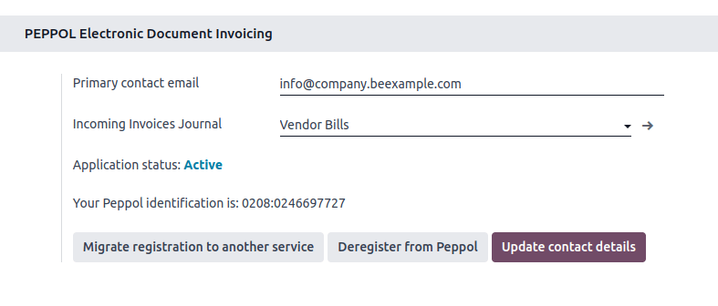

All invoices and vendor bills can now be sent directly using the Peppol network.
=======
.. _accounting/e-invoicing/contact-verification:
>>>>>>> c5da52e87e03cc5fce47a5b2c719e28addfaad3a

.. important::
   To update the email that Odoo can use to contact you, modify the email and click
   :guilabel:`Update contact details`.

Configure Peppol services
-------------------------

Once you are registered on Odoo SMP, the :guilabel:`Configure Peppol Services` button
becomes visible to allow you to enable or disable document formats that other participants
can send you via Peppol. By default, all document formats supported by Odoo are enabled (depending
on the installed modules).

Contact verification
--------------------

Before sending an invoice to a contact using Peppol, make sure the contact is registered as a Peppol
participant. To do so, follow these steps:

#. Go to :menuselection:`Accounting --> Customers --> Customers` and open the customer's form.
#. In the :guilabel:`Accounting tab`, check the following information in the :guilabel:`Electronic
   Invoicing` section:

   - :guilabel:`Format`: :guilabel:`BIS Billing 3.0`, :guilabel:`XRechnung CIUS`, or
     :guilabel:`NLCIUS`.
   - :guilabel:`Peppol e-address (EAS)`: Select the relevant EAS code in the dropdown list.
   - :guilabel:`Peppol Endpoint`: Enter the customer's endpoint identifier.

#. Click :guilabel:`Verify`. If the contact is found on the Peppol network, its :guilabel:`Peppol
   endpoint validity` is marked as :guilabel:`Valid`.

   .. image:: electronic_invoicing/customer-form.png
      :alt: verify contact registration

.. important::
   While Odoo prefills both the EAS code and the endpoint number based on the information available
   for a contact, it is recommended to verify these details directly with the contact.

.. _accounting/e-invoicing/send-invoices:

If the participant is registered on the Peppol network but cannot receive the format you selected
for them, the :guilabel:`Peppol endpoint validity` label changes to :guilabel:`Cannot
receive this format`.

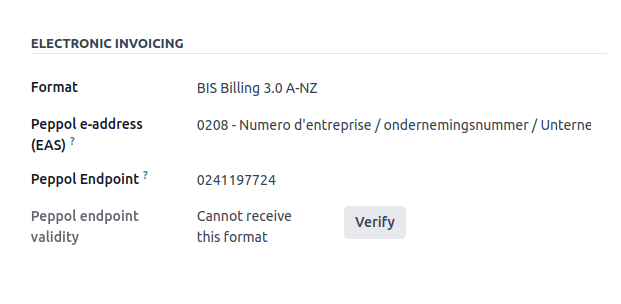

Send invoices
-------------

To set Peppol as a default format for sending invoices, go to :menuselection:`Accounting -->
Configuration --> Settings`. In the :guilabel:`Customer Invoices` section, enable the
:guilabel:`Peppol format` option and :guilabel:`Save`.

Posted invoices sent via Peppol are marked as :guilabel:`Ready to send` in the invoice's
:guilabel:`Peppol status` field.

.. note::
   All invoices that are ready to be sent via Peppol can be viewed in the following ways:

   - In the :guilabel:`Invoices` list view, use the :icon:`oi-settings-adjust` (:guilabel:`adjust
     settings`) button to add the :guilabel:`Peppol status` column or apply the :guilabel:`Peppol
     Ready` filter in the search bar.
   - In the Accounting dashboard, click :guilabel:`Peppol ready invoices` on the relevant sales
     journal.

To send the invoice to the customer via Peppol, click :guilabel:`Send & Print` on the confirmed
invoice form. In the :guilabel:`Send` window, enable both the country-specific format
(e.g., :guilabel:`BIS Billing 3.0`) and :guilabel:`Send via PEPPOL` options, then click
:guilabel:`Send & Print`.

.. tip::
   :ref:`Multiple invoices <accounting/invoice/sending>` can also be sent in batches via Peppol.

Once the invoices are sent via Peppol, their :guilabel:`Peppol status` is changed to
:guilabel:`Processing`.

.. image:: electronic_invoicing/peppol-message-processing.png
   :alt: Peppol message status

The status is updated to :guilabel:`Done` once the invoices have been successfully delivered to the
contact's access point.

.. tip::
   To manually trigger the scheduled action used to check the invoices' status, go to the
   Accounting dashboard and click :guilabel:`Fetch Peppol invoice status` on the corresponding sales
   journal.

   .. image:: electronic_invoicing/peppol-fetch-message-status.png
      :alt: Fetch invoice Peppol status

.. _accounting/e-invoicing/receive-vendor-bills:

Receive vendor bills
--------------------

New documents received via Peppol are checked daily. Any received documents are automatically
imported, and corresponding vendor bills are created as drafts, appearing in the vendor bills list
view.

.. tip::
   To manually trigger the scheduled action to retrieve incoming Peppol documents, go to the
   Accounting dashboard and click :guilabel:`Fetch from Peppol` on the main Peppol purchase journal.

   .. image:: electronic_invoicing/peppol-fetch-bills.png
      :alt: Fetch bills from Peppol
